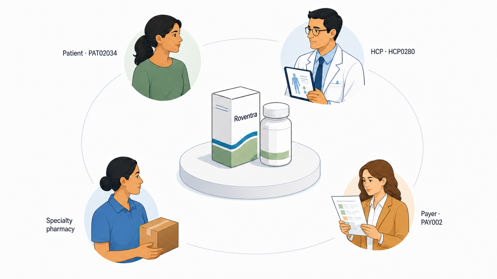

# Chapter 1: A Medicine, a Market, and the Decisions Between Them

FDA approval confirms the final Roventra label. The launch team has already built forecasts, payer plans, field options, supply plans, and approved materials around the expected label. Its first task is to identify what the final label changed and revise the plan before launch activity begins.

Roventra is a fictional once-daily oral treatment for Type 2 diabetes, managed mainly by endocrinologists in this teaching market. Nexoral is an established oral competitor, and Vexpro is an established weekly injectable. Diagnosis gaps, payer restrictions, pharmacy delays, treatment choices, and limited field capacity all affect whether an eligible patient starts treatment.

This book follows the launch from approval through its first year. The work moves from patient and market evidence to HCP and account action, then to measurement and resource allocation. By the end, you will be able to distinguish 5 kinds of analytical work, frame a decision at the level where action occurs, and complete a short decision record that connects evidence, constraints, action, and evaluation.

## 1.1 The Roventra World

| Entity | Role in the case |
| --- | --- |
| `PAT02034` | A woman aged 65 or older with Type 2 diabetes who receives care in New Jersey |
| `HCP0280` | Her endocrinologist and the HCP linked to her diagnosis and treatment records |
| `ACC089` | The New Jersey clinic where HCP0280 practices |
| `PAY002` | Her commercial payer |
| Roventra | The launch medicine |
| Nexoral and Vexpro | Competing treatments |

HCP stands for healthcare professional, typically a physician or nurse practitioner. A payer is a health plan or pharmacy-benefit organization that sets coverage rules; a specialty pharmacy handles medicines requiring added authorization, benefit checks, or patient support.

*Figure 1.1. Four external parties shape the path from Roventra prescription to treatment. ACC089 is the clinical setting where PAT02034 and HCP0280 meet. Fictional market.*

The figure shows the external market around the medicine. ACC089 supplies the clinical setting and office workflow. The manufacturer can provide approved information, reimbursement support, distribution planning, and patient services. Clinical treatment, coverage, dispensing, and patient participation remain with the external parties.

## 1.2 From a Finding to a Decision

At the first annual targeting refresh, ACC089 contains substantial patient opportunity. HCP0280 has 11 attributed patients in the targeting evidence table. Of those patients, 2 are receiving a competing treatment and 8 have remained untreated long enough to qualify for review. The account therefore has 10 patients in the review-opportunity group. HCP0280 also has current permission for field contact.

The 4-week targeting policy evaluates that opportunity against treated-patient evidence, contact permission, account status, and territory capacity. It asks:

> Should ACC089 receive additional field priority during this cycle?

The policy requires enough treated patients to interpret the account's current Roventra adoption. ACC089 has only 3 treated patients at the targeting cutoff. The policy requires at least 8 before low adoption can support a priority action. ACC089 therefore receives `Monitor`, with the reason code `MONITOR_SMALL_TREATED_DENOMINATOR`..

The decision record separates the finding from the action:

- **Finding:** ACC089 has 10 patients in the review-opportunity group.
- **Constraint:** Only 3 patients are treated, below the evidence floor of 8.
- **Decision:** Keep ACC089 in monitoring for this 4-week cycle.
- **Next evidence:** Refresh the treated count and review account-level access signals.
- **Success check:** Reapply the same policy at the next approved cutoff.

## 1.3 The Decision Record

Before starting an analysis, write down the decision. Table 1.1 is the reusable decision record.

*Table 1.1. A compact decision record connects the business question to an executable and reviewable action.*

| Field | Question | ACC089 example |
| --- | --- | --- |
| Decision | What choice must be made? | Should ACC089 receive additional field priority? |
| Action level | Where can the action be taken? | Account and HCP |
| Time horizon | When does the choice apply? | The next 4-week cycle |
| Available actions | What can the team choose? | Prioritize, access review, maintain, monitor, or hold contact |
| Evidence | What facts inform the choice? | Patient opportunity, treated count, adoption, access, permission, and recent contact |
| Constraints | What limits the action? | Evidence, contact permission, territory capacity, and account ownership |
| Responsible function | Which function acts or reviews? | Field leadership for the call plan; commercial analytics for the evidence refresh |
| Success measure | What result will be reviewed? | Approved calls, account status, and subsequent new starts |
| Review date | When will the decision be refreshed? | The next targeting cutoff |

## 1.4 Five Kinds of Analytical Work

The ACC089 decision called on more than one of 5 distinct analytical work types. A project can contain several types, but each type answers a different question and produces a different output.

*Table 1.2. The 5 analytical work types used throughout the book.*

| Work type | Main question | Example output | Quality standard |
| --- | --- | --- | --- |
| Reporting | What happened? | Weekly prescription tracker | Accurate, timely, and consistently defined |
| Analysis | What may explain the result? | Access and engagement comparison | Tests plausible explanations and states the evidence boundary |
| Data science | What can be estimated or predicted across records? | Patient-finding or HCP segmentation model | Validated, calibrated, stable, and fit for the intended use |
| Decision science | What action should be taken under the current constraints? | Reason-coded account policy and call plan | Executable, explainable, capacity-aware, and reviewable |
| Measurement | What changed because of the action? | Incremental-impact estimate | Uses a credible comparison and a prespecified outcome |

The table shows what each type asks and produces. The five types also form a chain: the output of one is typically the input to the next.

## 1.5 Three Questions for the Book

**Where is the actionable opportunity?** The analysis must define the population, observation window, eligibility rule, and data boundary. For Roventra, this includes patients who are diagnosed, eligible, untreated or competitor-treated, observable in the available records, and reachable under the relevant access conditions.

**What action should be taken under the current constraints?** The answer may concern an HCP, account, payer, channel, territory, or budget. Patient opportunity enters the decision alongside permission, access, recent contact, evidence strength, capacity, and clinical decisions.

**What changed because of the action?** Execution counts show whether the plan was delivered. Measurement estimates whether the action changed treatment starts, access, engagement, or another prespecified outcome compared with what would otherwise have happened.

The three questions form a planning loop. Each cycle starts from an opportunity estimate, routes through a constrained choice, and ends with a measured result that sharpens the next estimate.

## 1.6 Business Close

The Roventra launch begins with a completed plan and a final approved label. From that point forward, the commercial problem is a sequence of bounded choices. The team must identify the relevant population, assemble evidence at the level where action occurs, apply the constraints, release an explainable action, and preserve the record needed for later evaluation.

ACC089's review opportunity is real, and field contact is permitted. The treated evidence is too thin for an adoption-driven priority action at the targeting cutoff. `Monitor` is the defensible choice for this cycle, and the reason code states what must change before the account can be reconsidered.

## 1.7 Summary

The final Roventra label starts the launch decision cycle. The evidence becomes useful when it is tied to a specific choice, action level, time horizon, constraint set, and review plan.

- Reporting describes results.
- Analysis examines possible explanations.
- Data science estimates or predicts across records.
- Decision science chooses an action under explicit constraints.
- Measurement evaluates what changed because of that action.
- The 3 recurring questions concern actionable opportunity, constrained action, and causal effect.
- The decision record preserves the choice, evidence, constraints, responsible function, success measure, and review date.

## 1.8 Exercises

1. **Turn a finding into an action.** An account has high estimated patient opportunity, current field-contact permission, and low Roventra adoption. Most of its patients face a step-therapy restriction, and the territory has capacity for 2 additional calls. Choose among `Prioritize`, `Access review`, `Maintain`, `Monitor`, and `Hold contact`. State the responsible function, reason, and success measure.

2. **Separate the work types.** A launch team wants a weekly prescription tracker, an explanation for a regional decline, a patient-finding model, a 4-week account plan, and an estimate of incremental prescriptions from that plan. Assign a primary work type to each output. Then describe the distinct role each output plays in the decision cycle.

## 1.9 Exercise Solutions

**1.** Choose `Access review`. The step-therapy restriction is the controlling barrier, so market access should examine the affected payer rules and exposed patient population. Coverage review remains controlling despite available field capacity. The success measure should be a prespecified access result, such as a policy change, reduction in unresolved restricted attempts, or improvement in treatment starts after the policy changes.

**2.** Tracker: reporting. Regional decline review: analysis. Patient-finding model: data science. Account plan: decision science. Incremental-prescription estimate: measurement. The tracker and decline review supply evidence for the model and account plan. The incremental estimate then checks whether the plan's constrained action changed treatment starts.
