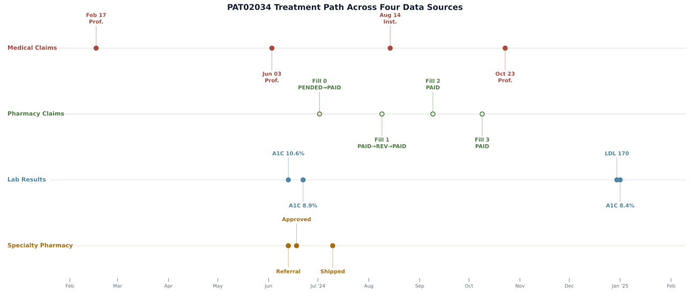
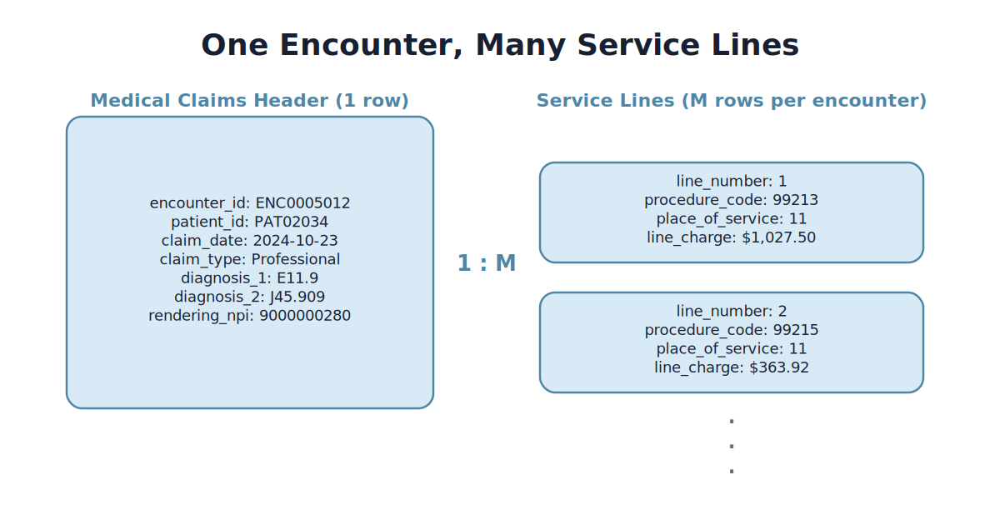
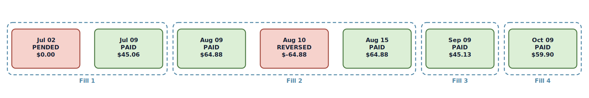
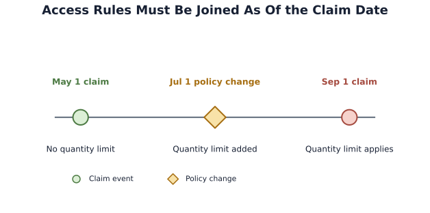
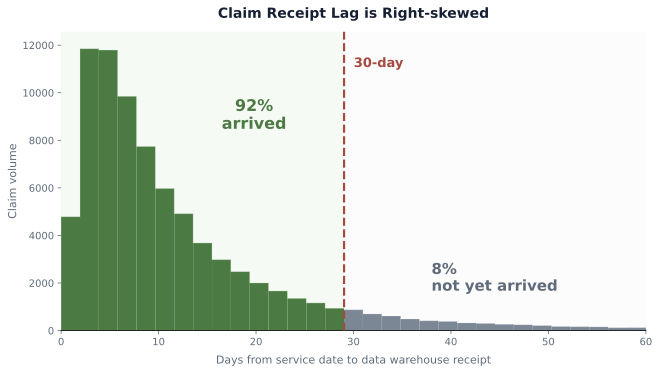
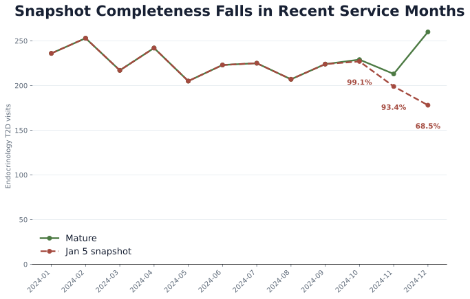

# Chapter 3: A Synthetic Lab for Real Pharma Questions

Roventra is finishing its first full year on the market. The commercial analytics team has just received its first full annual data delivery, spanning vendor longitudinal data, internal company feeds, and public reference files.

PAT02034's path runs across 4 of these sources: medical claims, pharmacy claims, lab results, and formulary records. Two structural issues must be resolved before any population analysis can run: claim receipt lag makes recent months look artificially low, and NDC mapping gaps leave a fraction of fills without a drug name.

By the end of this chapter you will be able to:

- Identify the common data sources used in pharmaceutical commercial analysis
- Navigate medical claim headers, service lines, pharmacy claims, lab results, and the reference tables that connect them
- Generate the synthetic data package from Python
- Follow one patient's treatment from diagnosis through specialty pharmacy fulfillment to completed pharmacy fills, and derive completed fills by grouping transactions
- Retrieve the formulary rule that applied on a historical claim date
- Recognize two pre-analysis data issues and apply the correct handling for each


> **Note:** Roventra is a fictional Type 2 diabetes (T2D) therapy modeled as a specialty-managed agent: prescribed mainly by endocrinologists and routed through specialty pharmacy under prior authorization and step therapy, which is why PAT02034's trace runs through an endocrinology practice rather than primary care.

## 3.1 The Pharmaceutical Data Sources

Pharmaceutical commercial data scientists work daily with three categories of data: longitudinal datasets from vendors, internal company records, and public reference data.

**Longitudinal vendor data** tracks patient-level events across time. Commercial longitudinal data suppliers (IQVIA, Komodo, Symphony, Optum, etc.) aggregate data from payers, lab, and pharmacy benefit managers into deidentified patient-level datasets. This category includes medical claims (encounters, diagnoses, procedures), pharmacy claims (prescriptions filled and rejected), and lab data (test results from laboratory partnerships LabCorp and Quest Diagnostics).

**Internal company records** are generated by the company's own operations. The customer relationship management (CRM) system logs field-rep interactions with physicians and accounts.

**Public reference data** includes CMS Open Payments (physician payment disclosures) and CMS Medicare Part D prescriber summaries. These are aggregate files with no patient-level records, useful for benchmarking and external validation.

Patient records from different vendors are linked via privacy-preserving tokenization. Each data supplier runs certified software that converts identifying fields (name, birth date, sex, zip code, address) into an irreversible token. Token exchange vendors such as Datavant and HealthVerity operate ecosystems that allow cross-source matching without exposing those identifiers. Tokenization is probabilistic: false merges (two patients assigned the same token) and false splits (one patient assigned multiple tokens) affect prevalence estimates and treatment sequences.

## 3.2 Synthetic Data: Design and Generation

Real patient-level pharma data is licensed, confidential, and restricted to controlled analytical environments. Dates, locations, rare conditions, and provider relationships can re-identify individuals even after names are removed.

The synthetic datasets here replace that licensed data with a transparent, rule-based simulation. Claim rates, treatment probabilities, event timing, access friction, and lab result distributions are codified and inspectable. The generated data reproduce the structures and data-quality issues that appear in real pharma data.

> **Note:** In production, vendor data usually lives in a cloud warehouse or database such as Snowflake, GCP BigQuery, or AWS Redshift, and analysts query it with SQL. For this book, we flatten the package into CSV files so the examples run locally on a laptop without warehouse credentials, network access, or privacy-controlled infrastructure. The data are synthetic and created for teaching, not for operational use.

The full file inventory and field reference are in [Appendix 3A](ch03_appendix.md). Executable scripts are in `ch03_data/scripts/`. Run the code in order, or open [`ch03_walkthrough.ipynb`](ch03_walkthrough.ipynb) to execute it as a notebook.

Set up the environment once from the project root:

```bash
uv sync
```

Then generate the datasets:

```bash
uv run python ch03_data/scripts/generate_all_synthetic_data.py
```

With the default seed (`20260609`) you will see:

```text
Generating data for 20,000 patients, 250 accounts, 666 providers...
  Medical encounters: 49,882 mature / 44,567 early snapshot
  Service lines: 62,285
  Pharmacy claims: 46,055
  Lab results: 55,815
  Patients with Roventra treatment timeline: 6,401
  Formulary change events: 13
  Specialty pharmacy hub referrals: 6,096
  CRM interactions: 3,359
  Territory alignment records: 8
  Digital events: 1,095
  Open Payments records: 783
  CMS Part D records: 1,057
Done. Data written to .../ch03_data/output_data/generated_data
```

The output saves in the following folders:

- `output_data/generated_data/`: synthetic records from the generator
- `output_data/public_reference/`: downloaded public reference extracts
- `output_data/analysis_results/`: outputs from analysis and data-quality scripts


## 3.3 One Patient through Multiple Data Sources

PAT02034 is a female patient in the 65+ age band, in New Jersey.

```python
import pandas as pd

patients = pd.read_csv("ch03_data/output_data/generated_data/reference/patients.csv")
print(patients.loc[patients.patient_id.eq("PAT02034")].to_string(index=False))
```

```text
patient_id state    region age_band sex  true_launch_condition
  PAT02034    NJ Northeast      65+   F                   True
```

Her prescribing physician is NPI `9000000280`, an Endocrinologist. The prescriber NPI comes from the claims (`rendering_npi`); joining it to `providers.csv` returns specialty and credential.

```python
providers = pd.read_csv("ch03_data/output_data/generated_data/reference/providers.csv")
mc        = pd.read_csv("ch03_data/output_data/generated_data/claims_medical/medical_claims_mature.csv")

hcp_npi = mc.loc[mc.patient_id.eq("PAT02034"), "rendering_npi"].mode()[0]
print(providers.loc[providers.npi.eq(hcp_npi)].to_string(index=False))
```

```text
       npi   specialty_1 specialty_2 provider_state provider_type credential primary_facility_npi
9000000280 Endocrinology                         NJ    Individual         MD                     
```

`patient_enrollments.csv` holds payer and eligibility windows, one row per patient-payer-period.

```python
enroll = pd.read_csv(
    "ch03_data/output_data/generated_data/reference/patient_enrollments.csv",
    parse_dates=["eligibility_start_date", "eligibility_end_date"],
)
print(enroll[enroll.patient_id.eq("PAT02034")].to_string(index=False))
```

```text
patient_id eligibility_start_date eligibility_end_date payer_id   payer_type  has_medical_coverage  has_pharmacy_coverage product_type
  PAT02034             2023-10-18           2025-04-08   PAY002 Commercial                  True                   True          PPO
```

PAT02034 has one continuous enrollment period. In the full population, patients who changed plans have multiple enrollment rows.

Table 3.1 lists the question each source answers.

*Table 3.1. The four data sources in PAT02034's trace and the question each answers.*

| Source | Question |
| --- | --- |
| Medical claims | What encounters appear in the billing record, and what diagnoses were coded? |
| Pharmacy claims | How many Roventra fills did she actually complete? |
| Lab results | What do her A1C measurements show before and after treatment starts? |
| Formulary | What payer rules applied at the time of her first fill? |



*Figure 3.1. Each lane is one data source. Medical claim encounters (red), pharmacy fills (green), lab tests (blue), and specialty pharmacy events (gold) share a common time axis, making the treatment sequence visible in a single view. The June and July cluster shows diagnosis, referral, approval, and first fill arriving within weeks of each other.*

### 3.3.1 Medical claims

The medical claims header table (`medical_claims_mature.csv`) carries one row per encounter: the patient, the rendering provider's NPI, the claim date, and the claim type. The primary reason for the visit is `diagnosis_1`. Additional diagnoses document complications, chronic comorbidities, or secondary conditions. `admitting_diagnosis` is an inpatient-only field that records the reason for admission; it can differ from the discharge diagnosis coded in `diagnosis_1` through `diagnosis_10`.

```python
mc = pd.read_csv(
    "ch03_data/output_data/generated_data/claims_medical/medical_claims_mature.csv"
)
print(mc.columns.tolist())
```

```text
['encounter_id', 'patient_id', 'claim_type', 'claim_date', 'admitting_diagnosis',
 'diagnosis_1', 'diagnosis_2', 'diagnosis_3', 'diagnosis_4', 'diagnosis_5',
 'diagnosis_6', 'diagnosis_7', 'diagnosis_8', 'diagnosis_9', 'diagnosis_10',
 'icd_procedure_1', 'icd_procedure_2', 'icd_procedure_3',
 'patient_gender', 'patient_state', 'coverage_type',
 'rendering_npi', 'attending_npi', 'referring_npi', 'facility_npi', 'payer_id']
```

Filter ICD-10 Type 2 diabetes codes with `.str.startswith("E11")`. The E11 prefix covers E11.9 (uncomplicated), E11.65 (with hyperglycemia), E11.40 (with neuropathy), and dozens of complication subcodes; matching on the prefix captures the entire family. Use `.astype(str)` before the string check because columns with no values for a given encounter are read as float64 (not object), and the `.str` accessor requires a string column. The `& col.notna()` clause is a defensive guard: after `.astype(str)` a missing value becomes the literal string `nan`, which already fails the `E11` test.

**Listing 3.1**: Find T2D encounters across all diagnosis positions.

```python
dx_cols = ["admitting_diagnosis"] + [f"diagnosis_{i}" for i in range(1, 11)]
t2d_mask = mc[dx_cols].apply(
    lambda col: col.astype(str).str.startswith("E11") & col.notna()
).any(axis=1)

show = ["encounter_id", "claim_date", "claim_type", "rendering_npi",
        "admitting_diagnosis", "diagnosis_1", "diagnosis_2", "diagnosis_3"]
pat_mc = mc.loc[mc.patient_id.eq("PAT02034") & t2d_mask, show].sort_values("claim_date")
print(pat_mc.fillna("").to_string(index=False))
```

```text
encounter_id claim_date    claim_type  rendering_npi admitting_diagnosis diagnosis_1 diagnosis_2 diagnosis_3
  ENC0005011 2024-02-17  Professional     9000000280                           E11.9                        
  ENC0005013 2024-06-03  Professional     9000000280                           E11.9     J45.909            
  ENC0005010 2024-08-14 Institutional     9000000280                           E11.9       N18.9            
  ENC0005012 2024-10-23  Professional     9000000280                           E11.9     J45.909            
```

All four encounters code T2D (E11.9) as `diagnosis_1`. Three are outpatient Professional claims; one is Institutional (inpatient). The Institutional encounter (ENC0005010) has `admitting_diagnosis` empty, which is the typical case even for inpatient billing. In the full population, `admitting_diagnosis` is populated in roughly 1% of all encounters, and in about one-third of those cases it holds a code not present in `diagnosis_1` through `diagnosis_10`. Comorbidities (CKD N18.9, asthma J45.909) appear only in secondary positions.

The medical claims header table captures patient, provider, dates, and diagnoses. The service lines table captures procedure codes, place of service, and charge amounts, one procedure per row for each encounter. Population counts and diagnosis analyses use the header; procedure-level filtering joins service lines to the header on `encounter_id`.



*Figure 3.2. ENC0005012 has two service lines: an office visit (99213) and an extended visit (99215) billed on the same day. The header holds the patient, provider, date, and all ten diagnosis columns; the service lines hold procedure codes, place of service, and line-level charges.*

```python
sl = pd.read_csv("ch03_data/output_data/generated_data/claims_medical/service_lines.csv")
pat_sl = sl.loc[sl.patient_id.eq("PAT02034"),
                ["encounter_id", "line_number", "service_from",
                 "procedure_code", "place_of_service", "line_charge"]]
print(pat_sl.sort_values(["encounter_id", "line_number"]).to_string(index=False))
```

```text
encounter_id  line_number service_from procedure_code  place_of_service  line_charge
  ENC0005010            1   2024-08-14          99214                22       491.56
  ENC0005011            1   2024-02-17          96413                11       192.11
  ENC0005012            1   2024-10-23          99213                11      1027.50
  ENC0005012            2   2024-10-23          99215                11       363.92
  ENC0005013            1   2024-06-03          99215                11       521.17
```

### 3.3.2 Pharmacy claims

Each row in `pharmacy_claims.csv` is one transaction. A prescription can generate multiple rows: the initial submission, rejections and resubmissions, reversals, and refills. Drug name comes from joining the claim to the NDC reference table.

`ndc_prescribed` is the drug code as written by the prescriber. `ndc` is the code of what was actually dispensed. For most fills these match. They can differ when a pharmacy dispenses a different pack size or substitutes a generic for a brand when the prescription allows it.

```python
rx  = pd.read_csv(
    "ch03_data/output_data/generated_data/claims_pharmacy/pharmacy_claims.csv",
    dtype={"ndc": str, "ndc_prescribed": str, "reject_code": str},
)
ref = pd.read_csv(
    "ch03_data/output_data/generated_data/reference/ndc_codes.csv",
    dtype={"ndc": str},
)
ndc_map = ref.set_index("ndc")["drug_name"]
rx["drug_name"] = rx["ndc_prescribed"].map(ndc_map)

pat = rx.loc[rx.patient_id.eq("PAT02034") & rx.drug_name.eq("Roventra")].copy()
cols = ["claim_id", "date_of_service", "transaction_type", "ndc_prescribed",
        "fill_number", "reject_code", "patient_pay"]
print(pat.sort_values("date_of_service")[cols].fillna("").to_string(index=False))
```

```text
   claim_id date_of_service transaction_type ndc_prescribed  fill_number reject_code  patient_pay
RXCL0004665      2024-07-02           PENDED  90000-1001-11            0          70         0.00
RXCL0004666      2024-07-09             PAID  90000-1001-11            0                    45.06
RXCL0004667      2024-08-09             PAID  90000-1001-11            1                    64.88
RXCL0004668      2024-08-10         REVERSED  90000-1001-11            1                   -64.88
RXCL0004669      2024-08-15             PAID  90000-1001-11            1                    64.88
RXCL0004670      2024-09-09             PAID  90000-1001-11            2                    45.13
RXCL0004671      2024-10-09             PAID  90000-1001-11            3                    59.90
```

7 rows appear after filtering on patient_id and drug name, but the correct number of completed fills is 4.

`transaction_type` takes three values. PAID means the claim cleared. PENDED means the payer's system held the claim for review; the reject code identifies why. REVERSED means a previously paid claim was voided. The July 2 PENDED transaction carries reject code 70 (NCPDP standard: "Product/Service Not Covered"), triggering a manual review that resolves to PAID 7 days later. The August PAID, REVERSED, PAID pattern means the original claim was voided and resubmitted on August 15.

Group by `(prescriber_npi, ndc_prescribed, fill_number)`, the combination that uniquely identifies a fill attempt within a patient's treatment with a given provider and drug. Fill 0 (PENDED then PAID) and fill 1 (PAID, REVERSED, then PAID again) each collapse into one group. Figure 3.3 shows the full transaction chain.

The completed-fill test uses two conditions, and both matter at population scale. The `final_type` check drops a fill whose last transaction is a reversal. The `net_patient_pay` guard drops a fill that nets to zero or a refund once offsetting reversals are summed.

**Listing 3.2**: Derive completed fills from pharmacy transactions.

```python
chains = (
    pat.sort_values(["date_of_service", "claim_id"])
    .groupby(["prescriber_npi", "ndc_prescribed", "fill_number"], sort=False)
    .agg(
        first_date=("date_of_service", "first"),
        final_type=("transaction_type", "last"),
        net_patient_pay=("patient_pay", "sum"),
    )
    .reset_index()
)
chains["completed_fill"] = (
    chains["final_type"].eq("PAID") & chains["net_patient_pay"].ge(0)
)
print(chains[["fill_number", "first_date", "final_type",
              "net_patient_pay", "completed_fill"]].to_string(index=False))
print(f"\ncompleted fills: {int(chains.completed_fill.sum())}")
```

```text
 fill_number first_date final_type  net_patient_pay  completed_fill
           0 2024-07-02       PAID            45.06            True
           1 2024-08-09       PAID            64.88            True
           2 2024-09-09       PAID            45.13            True
           3 2024-10-09       PAID            59.90            True

completed fills: 4
```



*Figure 3.3. Group by `(prescriber_npi, ndc_prescribed, fill_number)` so operational transactions become analytical fill attempts.*

### 3.3.3 Lab results

Lab results are typically sourced from laboratory partnerships (Quest, LabCorp) and are delivered as LOINC-coded records with numeric results and reference ranges.

```python
lab = pd.read_csv(
    "ch03_data/output_data/generated_data/claims_lab/lab_results.csv",
    parse_dates=["service_date"],
)
cols = ["lab_id", "service_date", "loinc_code", "test_name",
        "result", "result_unit", "ref_low", "ref_high", "abnormal_flag"]
pat_lab = lab.loc[lab.patient_id.eq("PAT02034"), cols].sort_values("service_date")
print(pat_lab.fillna("").to_string(index=False))
```

```text
    lab_id service_date loinc_code       test_name  result result_unit  ref_low  ref_high abnormal_flag
LAB0005734   2024-06-13     4548-4  Hemoglobin A1c    10.6     percent      4.0       5.6             H
LAB0005735   2024-06-22     4548-4  Hemoglobin A1c     8.9     percent      4.0       5.6             H
LAB0005736   2024-12-30     2089-1 LDL Cholesterol   170.0       mg/dL      0.0     100.0             H
LAB0005737   2025-01-01     4548-4  Hemoglobin A1c     8.4     percent      4.0       5.6             H
```

LOINC 4548-4 is the standard identifier for Hemoglobin A1c; 2089-1 is LDL cholesterol. PAT02034's A1C reads 10.6% on June 13, nearly three weeks before her first Roventra fill attempt on July 2. An A1C above 6.5% meets the ADA diagnostic threshold for diabetes. By January 2025, after four completed fills, her A1C has fallen to 8.4%.

> **Note:** For analytical use, filter on `test_name` and apply a numeric threshold to `result` for clinical classification. The `abnormal_flag` is a coarse binary screen from the instrument's reference range, which may differ from the clinical threshold you need.

> **Note:** Keep patients who have no lab result in the analysis cohort. A missing result reflects gaps in testing or data capture, and these patients may still have the condition.


### 3.3.4 Formulary and access

The package includes two formulary files: `formulary_status.csv` for current rules and `formulary_history.csv` for change events. A historical claim was adjudicated under the rule active on its service date.

```python
patients = pd.read_csv("ch03_data/output_data/generated_data/reference/patients.csv")
fs = pd.read_csv("ch03_data/output_data/generated_data/formulary/formulary_status.csv")
fh = pd.read_csv("ch03_data/output_data/generated_data/formulary/formulary_history.csv",
                 parse_dates=["effective_date"])

payer = patients.loc[patients.patient_id.eq("PAT02034"), "payer_id"].iloc[0]
status = fs.loc[fs.plan_id.eq(payer) & fs.product_name.eq("Roventra"),
                ["plan_id", "tier", "prior_authorization", "step_therapy",
                 "quantity_limit", "specialty_pharmacy"]]
print(status.to_string(index=False))
```

```text
plan_id      tier prior_authorization step_therapy quantity_limit specialty_pharmacy
 PAY002 Specialty                 Yes          Yes            Yes                Yes
```

PAT02034's July fill was subject to prior authorization, step therapy, a quantity limit, and specialty-pharmacy routing. All four restrictions align with the PENDED claim on July 2 and the specialty pharmacy fulfillment path.

`formulary_status.csv` answers what the rules are today. PAY005 illustrates why historical claims require a different approach.

```python
pay005_hist = fh.loc[
    fh.plan_id.eq("PAY005") & fh.product_name.eq("Roventra")
].sort_values("effective_date")
print(pay005_hist[["effective_date", "prior_tier", "new_tier",
                   "prior_step_therapy", "new_step_therapy",
                   "prior_quantity_limit", "new_quantity_limit",
                   "change_type"]].to_string(index=False))
```

```text
effective_date prior_tier new_tier prior_step_therapy new_step_therapy prior_quantity_limit new_quantity_limit change_type
    2024-01-01  Specialty Specialty                 No               No                   No                No Restriction change
    2024-07-01  Specialty Specialty                 No               No                   No               Yes Restriction change
```

On July 1, 2024, PAY005 kept Roventra at the Specialty tier and added a quantity limit; the step therapy state was unchanged. Reconstructing the access state for claim dates requires an as-of join.

**Listing 3.3**: Assign the payer rule active on each claim date.

```python
first = pay005_hist.iloc[0]
states = pd.DataFrame(
    [{"effective_date": pd.Timestamp("2024-01-01"),
      "tier": first["prior_tier"],
      "prior_authorization": first["prior_prior_authorization"],
      "step_therapy": first["prior_step_therapy"],
      "quantity_limit": first["prior_quantity_limit"]}]
    + [
        {"effective_date": r["effective_date"],
         "tier": r["new_tier"],
         "prior_authorization": r["new_prior_authorization"],
         "step_therapy": r["new_step_therapy"],
         "quantity_limit": r["new_quantity_limit"]}
        for _, r in pay005_hist.iterrows()
    ]
).sort_values("effective_date")

claims = pd.DataFrame({
    "claim_date": pd.to_datetime(["2024-05-01", "2024-09-01"])
})

assigned = pd.merge_asof(
    claims.sort_values("claim_date"),
    states,
    left_on="claim_date",
    right_on="effective_date",
    direction="backward",
)

print(assigned.to_string(index=False))
```

```text
claim_date effective_date      tier prior_authorization step_therapy quantity_limit
2024-05-01     2024-01-01 Specialty                 Yes           No             No
2024-09-01     2024-07-01 Specialty                 Yes           No            Yes
```

A PAY005 claim from May did not face a quantity limit. A September claim did. Reading only the current status file assigns the current quantity limit to every historical PAY005 claim, overstating the restriction burden in the first half of the year. Join each event to the formulary record whose `effective_date` is at or before the event date.



*Figure 3.4. Historical access assignment depends on the claim event date, while the July 1 policy change marks the boundary between the two quantity-limit states.*

## 3.4 Pre-Analysis Data Checks

Two issues appear routinely in vendor-delivered pharmaceutical claims data: claim receipt lag (recent months are structurally incomplete) and reference mapping gaps (drug codes not in the reference table). The generator produces controlled examples of both at realistic rates.

> **Note:** The data vendor mostly deduplicates claims before delivery and provides only completed, adjudicated encounters. If you work with raw payer clearinghouse feeds rather than a curated longitudinal dataset, duplicate detection and status filtering will be necessary.

### 3.4.1 Claim maturity: the false December decline

On a January 5, 2025 data pull, the Roventra analytics team queries December endocrinology T2D visit volume:

```text
service_month  patient_count
    2024-09            224
    2024-10            227
    2024-11            199
    2024-12            178
```

December is 11% below November. Medical claims take days to weeks to flow from the point of care into the warehouse; December looks low because most of its claims have not arrived yet.

The two-snapshot design makes this verifiable without waiting six weeks. The generator writes `medical_claims.csv` (early snapshot, five days after month close) and `medical_claims_mature.csv` (fully matured). Running the same query on both files reproduces the diagnostic you would run in production.

**Listing 3.4**: Compare the early snapshot with the mature claim file.

```python
import pandas as pd

providers = pd.read_csv(
    "ch03_data/output_data/generated_data/reference/providers.csv"
)
endo_npis = providers.loc[providers.specialty_1.eq("Endocrinology"), "npi"]

dx_cols = ["admitting_diagnosis"] + [f"diagnosis_{i}" for i in range(1, 11)]

def t2d_endo_by_month(df: pd.DataFrame) -> pd.Series:
    t2d_mask = df[dx_cols].apply(
        lambda col: col.astype(str).str.startswith("E11") & col.notna()
    ).any(axis=1)
    return (
        df.loc[t2d_mask & df["rendering_npi"].isin(endo_npis)]
        .assign(month=df["claim_date"].str[:7])
        ["month"].value_counts().sort_index()
    )

early  = pd.read_csv("ch03_data/output_data/generated_data/claims_medical/medical_claims.csv")
mature = pd.read_csv("ch03_data/output_data/generated_data/claims_medical/medical_claims_mature.csv")

view = pd.DataFrame({
    "snapshot_jan05": t2d_endo_by_month(early),
    "mature":         t2d_endo_by_month(mature),
}).dropna()
view["completeness_pct"] = (100 * view["snapshot_jan05"] / view["mature"]).round(1)
view["cleared_90pct"] = view["completeness_pct"].ge(90)
view_2024 = view.loc["2024-01":"2024-12"]
print(view_2024.to_string())
```

```text
         snapshot_jan05  mature  completeness_pct  cleared_90pct
month
2024-01             236     236             100.0           True
2024-02             253     253             100.0           True
2024-03             217     217             100.0           True
2024-04             242     242             100.0           True
2024-05             205     205             100.0           True
2024-06             223     223             100.0           True
2024-07             225     225             100.0           True
2024-08             207     207             100.0           True
2024-09             224     224             100.0           True
2024-10             227     229              99.1           True
2024-11             199     213              93.4           True
2024-12             178     260              68.5          False
```

December's actual count is 260, 46% above the January 5 snapshot. November was also incomplete at 93.4%. The shortfall is incomplete data: most December claims had not arrived by the January 5 pull.

Medical claim delay has a long-tailed, right-skewed distribution. Most claims arrive quickly, but a meaningful minority arrive weeks later. Set the maturity cutoff from that distribution and label the months that have not cleared it. A 90% completeness cutoff keeps January through November 2024 and excludes December from the trend. January 2025 is omitted because the snapshot date is January 5, leaving the service month barely materialized.



*Figure 3.5. The distribution is log-normal with a long tail extending to 60+ days. At a 30-day maturity window, roughly 92% of claims have arrived (green zone). The remaining 8% sit in the gray zone, received eventually but not yet in the warehouse. The gap reflects structural lag in claim receipt.*

Figure 3.6 shows the monthly comparison.



*Figure 3.6. The October, November, and December labels show snapshot completeness; December's 68.5% value falls below the 90% cutoff, so the trend should stop at November for this snapshot.*

The `data_quality.py` script runs a systematic completeness audit across all months:

```bash
uv run python ch03_data/scripts/data_quality.py
```

It writes the snapshot comparison, mapping audit, coverage audit, temporal-integrity audit, and summary files to `output_data/analysis_results/data_quality/`.

### 3.4.2 NDC mapping gaps

Pharmacy claims carry drug codes but not drug names. Drug name comes from joining the NDC to a reference table. The failure mode is a code the reference does not recognize: a new pack size, a repackager formulation, or a variant that postdates the last reference refresh.

The generator plants this failure by writing pack-size variant codes (`90000-XXXX-12`) into roughly 5% of pharmacy claim rows, intentionally absent from `ndc_codes.csv`.

**Listing 3.5**: Audit prescribed and dispensed NDC mappings.

```python
rx  = pd.read_csv(
    "ch03_data/output_data/generated_data/claims_pharmacy/pharmacy_claims.csv",
    dtype={"ndc": str, "ndc_prescribed": str},
)
ref = pd.read_csv(
    "ch03_data/output_data/generated_data/reference/ndc_codes.csv",
    dtype={"ndc": str},
)
ndc_map = ref.set_index("ndc")["drug_name"]

paid = rx.loc[rx.transaction_type.eq("PAID")].copy()
paid["drug_name_prescribed"] = paid["ndc_prescribed"].map(ndc_map)
paid["drug_name_dispensed"]  = paid["ndc"].map(ndc_map)

print("=== Join on ndc_prescribed (prescribed drug) ===")
print(paid.groupby("drug_name_prescribed").size().sort_values(ascending=False).to_string())

gaps = paid.loc[paid["drug_name_dispensed"].isna() & paid["drug_name_prescribed"].notna()]
print(f"\nDispensed NDC absent from reference: {len(gaps):,} of {len(paid):,} "
      f"paid fills ({100*len(gaps)/len(paid):.1f}%)")
print(gaps[["claim_id", "ndc_prescribed", "ndc",
            "drug_name_prescribed"]].head(4).to_string(index=False))
```

```text
=== Join on ndc_prescribed (prescribed drug) ===
drug_name_prescribed
Roventra          16637
Supportive Med     7632
Nexoral            7574
Vexpro             7398

Dispensed NDC absent from reference: 1,692 of 39,241 paid fills (4.3%)
   claim_id ndc_prescribed           ndc drug_name_prescribed
RXCL0000015  90000-1003-11 90000-1003-12               Vexpro
RXCL0000132  90000-1001-11 90000-1001-12             Roventra
RXCL0000163  90000-1003-11 90000-1003-12               Vexpro
RXCL0000226  90000-1002-11 90000-1002-12              Nexoral
```

The prescribed-NDC join accounts for all paid fills by drug name. 4.3% of fills (1,692 of 39,241) were dispensed under a pack-size variant the reference does not recognize. The rows with the `-12` suffix are pack sizes the pharmacy stocked as substitutes for the prescribed `-11` pack. Flag the unmatched dispensed codes, investigate whether they represent a reference gap or a data error, and prioritize a reference table update.

Table 3.2 summarizes both pre-analysis checks.

*Table 3.2. Pre-analysis data checks: designed rate, measured result, and handling.*

| Issue | Designed rate | Measured result | Correct handling |
| --- | --- | --- | --- |
| Claim receipt lag | Early snapshot 5 days post-close | Dec endocrinology T2D snapshot 68.5% complete vs mature | Set a maturity threshold; exclude months below it from trend analysis |
| Dispensed NDC absent from reference | ~5% of rows | 4.3% of paid fills | Flag absent codes; use `ndc_prescribed` for interim attribution; refresh reference |


## 3.5 Summary

PAT02034's trace across 4 sources reduced 7 pharmacy transactions to 4 completed fills, recovered her effective formulary rule from a change event, and exposed 2 structural data issues that affect every population analysis.

The **join architecture** has three clusters. The patient cluster links everything to `patients.csv` on `patient_id`. The provider cluster requires two NPI joins: one to `providers.csv` for clinical attributes, one to `hcp_targets.csv` for commercial attributes. The drug reference cluster links `ndc_prescribed` to `ndc_codes.csv` for product attribution. The formulary uses an as-of join, retrieving the record whose `effective_date` is at or before the service date.

The **source-level lessons**:

- **Medical claims**: the wide diagnosis format (`diagnosis_1` through `diagnosis_10`) requires an `.any(axis=1)` filter across all ten columns. Include `admitting_diagnosis` in the column list because it is an inpatient-only field populated in roughly 1% of all encounters, and in about one-third of those cases it holds a code not present in `diagnosis_1` through `diagnosis_10`. Comorbidities are coded in secondary positions and are invisible to a single-column check. Use `.astype(str).str.startswith()` to handle columns that pandas reads as float64 when all values are null. Population counts use the header table; procedure-level analyses join to `service_lines.csv` on `encounter_id`.
- **Pharmacy claims**: derive drug name by joining `ndc_prescribed` to the drug reference. Group by `(prescriber_npi, ndc_prescribed, fill_number)` to identify completed fills; check that the final transaction type is PAID and net patient pay is nonnegative. Seven transactions collapse to four completed fills once grouped correctly.
- **Lab results**: filter on `test_name` and apply a numeric threshold to `result` for clinical classification. Keep patients who have no lab result in the analysis cohort; a missing result reflects gaps in testing or data capture.
- **Formulary**: `formulary_status.csv` reflects current rules. Historical claims were adjudicated under the rule active on their date. Join each event to the formulary record whose `effective_date` is at or before the event date.

The reusable rules are:

- **Maturity rule:** choose a completeness threshold from the claim-delay distribution, label months below it, and exclude those months from trend interpretation. A 90% cutoff excludes December 2024 from the January 5 snapshot, and January 2025 is left out because the month has not materialized.
- **Mapping rule:** use `ndc_prescribed` for stable interim product attribution, audit unmatched `ndc` values separately, and refresh the reference table before finalizing dispense-level analysis.
- **Historical access rule:** assign formulary rules with an as-of join. The valid rule is the most recent record whose `effective_date` is at or before the event date.


## 3.6 Exercises

Each exercise is solvable with the generated data and fewer than twenty lines of pandas code.

1. **Comorbidity requires all positions.** §3.3.1 showed that T2D (E11.9) is always coded as `diagnosis_1` for PAT02034's encounters, while comorbidities like CKD (N18.x) appear only in secondary positions. Using `medical_claims_mature.csv`, filter to all T2D encounters (checking `admitting_diagnosis` and `diagnosis_1` through `diagnosis_10`) and count how many also code CKD somewhere across all eleven columns. Then repeat the count using only `diagnosis_1` for CKD. What fraction of CKD comorbidities are invisible to the single-column check? Which diagnosis positions carry the CKD code, and what does that tell you about when CKD is coded as primary versus secondary?

2. **Did the access change move rejection rates?** The formulary history shows that PAY005 added a Roventra quantity limit on July 1, 2024, while keeping the Specialty tier and prior authorization requirement. Using `pharmacy_claims.csv`, compare Roventra PENDED rates for PAY005 patients in H1 (January through June, before the change) versus H2 (July through December, after). Is the difference visible? What else would you need before attributing the change to the access restriction rather than to other factors?

3. **Map the maturity curve.** The §3.4.1 example used December 2024. Using both `medical_claims.csv` (early snapshot) and `medical_claims_mature.csv` (mature), compute the endocrinology T2D completeness percentage for every service month in 2024. Which three months are most incomplete in the early snapshot? At what completeness threshold would you set the maturity cutoff if your publication lag is two weeks? What months would be excluded at that threshold, and how would that affect a full-year trend analysis?

Two companion notebooks ship with the chapter: [`ch03_walkthrough.ipynb`](ch03_walkthrough.ipynb) executes every section in sequence, and [`ch03_exercise_solutions.ipynb`](ch03_exercise_solutions.ipynb) works all three exercises with full discussion. Attempt the exercises before consulting the solutions.

The market sizing analysis uses the synthetic patients, claims, and lab results to build the opportunity funnel. PAT02034 returns in the targeting analysis; other traced patients enter as therapy-switch and undiagnosed-candidate patterns call for specific records.

---

*Field reference tables for all source types are in [Appendix 3A](ch03_appendix.md).*
