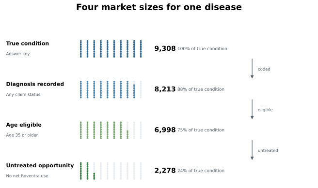
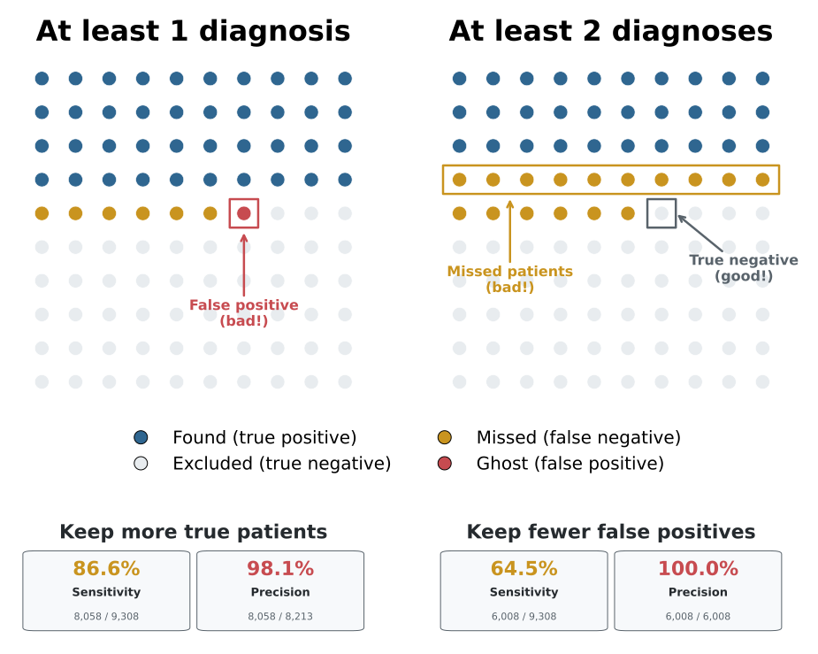
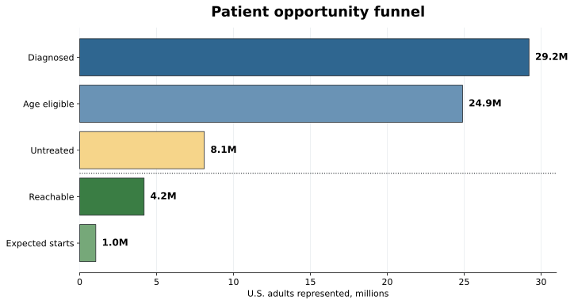
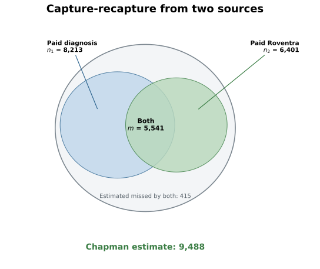

# Chapter 4: Market Sizing and Patient Populations

The same Roventra disease produces two useful numbers: a diagnosed population of 29 million and an untreated opportunity of 8 million. Those numbers measure different populations and answer different questions about label, access, and competitive position.

The analysis starts from the synthetic package built in the data generation chapter. It narrows the population step by step through diagnosis, age eligibility, treatment status, and access, estimates the patients claims data never sees, and ranks undiagnosed patients with a patient-finding model.

Run the code blocks in order from the repository root, or open [`chapter4_walkthrough.ipynb`](chapter4_walkthrough.ipynb) to execute them as a notebook.

> **Note:** The launch product is **Roventra**, a fictional once-daily oral medicine. Its competitors are Nexoral and Vexpro. The launch condition is modeled on Type 2 diabetes (ICD-10 codes E11.9, E11.65, E11.40). The age threshold, access probabilities, and conversion rate are scenario settings for this book's learning simulations. They are not a real product label or disease market. The `true_launch_condition` column in `patients.csv` is a synthetic reference field that records each patient's actual condition. It comes from the simulation and does not exist in real claims data. We use it only to validate the analysis results.

## 4.1 One Disease, One Medicine, Four Market Sizes

True disease, a coded diagnosis, label eligibility, and treatment status each produce a different patient count for the same disease.

Label expansion can change who qualifies. Expanding an existing drug's label is often more practical than developing a new molecule, because the product already has safety, manufacturing, and commercial history. FDA can approve a new age band or a broader indication and turn a previously off-label population into an eligible one.

**Listing 4.1: Build the patient analysis table**

```python
import pandas as pd

DATA = "ch03_data/output_data/generated_data"
LAUNCH_CODES = ["E11.9", "E11.65", "E11.40"]   # the launch condition in ICD-10
PRODUCT = "Roventra"

patients = pd.read_csv(f"{DATA}/reference/patients.csv")
enroll = pd.read_csv(f"{DATA}/reference/patient_enrollments.csv")
patients = patients.merge(
    enroll[["patient_id", "payer_id"]].drop_duplicates("patient_id"),
    on="patient_id", how="left",
)

DX_COLS = [f"diagnosis_{i}" for i in range(1, 11)]
mc = pd.read_csv(f"{DATA}/claims_medical/medical_claims_mature.csv")
dx_mask = mc[DX_COLS].isin(LAUNCH_CODES).any(axis=1)
coded = mc[dx_mask]
paid_dx_count = coded.groupby("patient_id").size()

rx = pd.read_csv(f"{DATA}/claims_pharmacy/pharmacy_claims.csv",
                 dtype={"ndc": str, "ndc_prescribed": str})
ndc = pd.read_csv(f"{DATA}/reference/ndc_codes.csv", dtype={"ndc": str})
rx["drug_name"] = rx.ndc_prescribed.map(ndc.set_index("ndc").drug_name)
roventra = rx[rx.drug_name.eq(PRODUCT)].copy()
roventra["net"] = roventra.transaction_type.map({"PAID": 1, "REVERSED": -1}).fillna(0)
net_fills = roventra.groupby("patient_id").net.sum()

p = patients.copy()
p["true_condition"] = p["true_launch_condition"].fillna(False).astype(bool)
p["coded"] = p.patient_id.isin(coded.patient_id)
p["diagnosed"] = p.patient_id.map(paid_dx_count).fillna(0).ge(1)
p["diagnosed_2plus"] = p.patient_id.map(paid_dx_count).fillna(0).ge(2)
p["age_eligible"] = p.age_band.isin(["35-49", "50-64", "65+"])
p["treated"] = p.patient_id.map(net_fills).fillna(0).gt(0)
p["untreated"] = ~p.treated
```

The drug name is derived by joining the NDC reference table. The four market sizes read off that table:

```python
sizes = pd.DataFrame([
    ("True condition (answer key)", p.true_condition.sum()),
    ("Launch diagnosis coded",      p.coded.sum()),
    ("Age-eligible diagnosed",      (p.diagnosed & p.age_eligible).sum()),
    ("Untreated opportunity",       (p.diagnosed & p.age_eligible & p.untreated).sum()),
], columns=["market_size", "patients"])
print(sizes.to_string(index=False))
```

```text
                market_size  patients
True condition (answer key)      9308
     Launch diagnosis coded      8213
     Age-eligible diagnosed      6998
      Untreated opportunity      2278
```

The four rows use the same disease but different filters. The first row uses a synthetic field that records the true condition; it does not exist in real claims data. Section 4.5 estimates how many patients this field represents even when the diagnosis code never appears. The remaining rows apply the diagnosis, age, and treatment rules in order.

The untreated opportunity is the eligible population minus the treated population:

```python
eligible = p.diagnosed & p.age_eligible
print(f"age-eligible diagnosed: {eligible.sum()}")
print(f"treated within cohort:  {(eligible & p.treated).sum()}")
print(f"untreated opportunity:  {(eligible & p.untreated).sum()}")
```

```text
age-eligible diagnosed: 6998
treated within cohort:  4720
untreated opportunity:  2278
```



*Figure 4.1. Each row starts from the same 9,308 true-condition patients. Colored dots show the share retained as the market question becomes more specific. Synthetic data.*

## 4.2 What Claims Can See and Miss

A disease can exist without appearing as a diagnosis in claims when it has not been found, documented, or coded yet. A diagnosis can also appear for the wrong patient or the wrong condition. The synthetic generator introduces both kinds of realistic errors. The 8,213 coded patients calculated in Section 4.1 include false positives, and the true condition count is lower.

```python
gates = pd.DataFrame([
    ("True condition (answer key)",               p.true_condition.sum()),
    ("... coded with a launch diagnosis",         (p.true_condition & p.coded).sum()),
    ("False positives (other condition, flagged)",(~p.true_condition & p.coded).sum()),
], columns=["gate", "patients"])
print(gates.to_string(index=False))

true_n = int(p.true_condition.sum())
print(f"\ncoded share: {100*(p.true_condition & p.coded).sum()/true_n:.1f}%")
```

```text
                                      gate  patients
               True condition (answer key)      9308
         ... coded with a launch diagnosis      8058
False positives (other condition, flagged)       155

coded share: 86.6%
```

86.6% of true patients receive a launch code at least once. A separate 155 patients with another condition pick up a launch code and become false positives. One specific patient illustrates the gap:

```python
invisible = p[p.true_condition & ~p.diagnosed & ~p.treated].sort_values("patient_id")
pid = invisible.iloc[0].patient_id
print("first invisible true patient:", pid)
print()
print("Patient table")
print(p.loc[p.patient_id.eq(pid)].to_string(index=False))
print()
print("Medical claims table")
print(mc.loc[mc.patient_id.eq(pid), ["claim_date"] + DX_COLS[:3]].to_string(index=False))
print()
print("Rx table")
rx_view = rx.loc[rx.patient_id.eq(pid), ["date_of_service", "drug_name", "transaction_type", "reject_code"]].copy()
rx_view["reject_code"] = rx_view["reject_code"].apply(
    lambda x: "" if pd.isna(x) else f"{int(x)}" if float(x).is_integer() else f"{x}"
)
print(rx_view.to_string(index=False))
```

```text
first invisible true patient: PAT00046

Patient table
patient_id state   region age_band sex true_launch_condition
  PAT00046    NY Northeast    18-34   F                 True

Medical claims table
claim_date diagnosis_1 diagnosis_2 diagnosis_3
2024-06-28       F41.9     J45.909       E78.5

Rx table
date_of_service drug_name transaction_type  reject_code
     2024-06-09    Vexpro           PENDED           70
     2024-06-13    Vexpro             PAID             
     2024-07-06    Vexpro             PAID             
```

PAT00046 truly has the launch condition, but the medical claim codes only anxiety, asthma, and dyslipidemia. The pharmacy record shows 2 paid Vexpro fills. PAT00046 is treated on a competitor and invisible to a diagnosis-based filter. Section 4.5 estimates how many patients like PAT00046 exist; Section 4.6 ranks them with a machine learning model.

## 4.3 One Diagnosis or Two?

A decision rule turns claims records into a patient condition flag. The choice is whether to require one diagnosis or at least two.

**Listing 4.2: Score two claims rules against the true condition**

```python
def diagnostics(flag, truth):
    tp = int((flag & truth).sum())
    fp = int((flag & ~truth).sum())
    fn = int((~flag & truth).sum())
    return dict(TP=tp, FP=fp, FN=fn,
               sensitivity_pct=round(100 * tp / (tp + fn), 1),
               precision_pct=round(100 * tp / (tp + fp), 1),
               )

diag = pd.DataFrame([
    {"rule": "1+ paid diagnosis",  **diagnostics(p.diagnosed,       p.true_condition)},
    {"rule": "2+ paid diagnoses",  **diagnostics(p.diagnosed_2plus, p.true_condition)},
])
print(diag.to_string(index=False))
print(f"\nstrict rule correctly rejected {int((p.diagnosed & ~p.true_condition).sum())} false positive patients.")
print(f"at the cost of missed {int((p.diagnosed & p.true_condition).sum() - (p.diagnosed_2plus & p.true_condition).sum())} true patients.")
```

```text
             rule   TP   FP   FN  sensitivity_pct  precision_pct
1+ paid diagnosis 8058  155 1250             86.6           98.1
2+ paid diagnoses 6008    0 3300             64.5          100.0

strict rule correctly rejected 155 false positive patients.
at the cost of missed 2050 true patients.
```

The one-diagnosis rule finds 86.6% of true patients (sensitivity) and keeps 98.1% of flagged patients correct (precision, or positive predictive value). Requiring at least two diagnoses removes all 155 false positives but drops 2,050 true patients. One diagnosis gives more coverage; two diagnoses give a smaller, cleaner list at the cost of missed patients.



*Figure 4.2. Requiring at least two diagnoses removes the 155 false positives but misses 2,050 true patients. Synthetic data.*

The stricter rule reaches 100% precision here because every false positive patient carries only 1 launch diagnosis, and the two-diagnosis threshold removes them all. That is a property of this synthetic file. In real claims data, some false positives carry 2 or more diagnoses, so the strict rule reduces but does not eliminate false positives while still losing true patients.

## 4.4 National Prevalence Anchor and Opportunity Funnel

The claims data contains 8,213 diagnosed patients, 41.1% of the 20,000-patient panel. For national scale, the external prevalence source is 11.3% diagnosed diabetes prevalence from [NCHS Data Brief 516](https://www.cdc.gov/nchs/products/databriefs/db516.htm), applied to 258,554,106 U.S. adults age 20 and older from the 2024 Census [adult population](https://www.census.gov/data/tables/time-series/demo/popest/2020s-national-detail.html). The panel over-represents the true population because claims skew toward patients already receiving medical care.

```python
US_ADULTS = 258_554_106     # 2024 Census resident population age 20+
PREVALENCE = 0.113          # NCHS Data Brief 516: diagnosed diabetes, adults 20+

panel_share = p.diagnosed.mean()
print(f"panel diagnosis share:      {panel_share:.1%}  ({p.diagnosed.sum()} of {len(p)})")
print(f"diagnosed diabetes rate:    {PREVALENCE:.1%}")
print(f"US adults age 20+:          {US_ADULTS:,.0f}")
print(f"external prevalence anchor:  {US_ADULTS:,.0f} * {PREVALENCE:.1%} = {PREVALENCE * US_ADULTS:,.0f}")
```

```text
panel diagnosis share:      41.1%  (8213 of 20000)
diagnosed diabetes rate:    11.3%
US adults age 20+:          258,554,106
external prevalence anchor:  258,554,106 * 11.3% = 29,216,614
```

The access rules in `market_access_rules.csv` are inspected as of December 31, 2024.

**Listing 4.3: Inspect the active access rules**

```python
access = pd.read_csv(f"{DATA}/market_access/market_access_rules.csv",
                     parse_dates=["effective_start", "effective_end"])
ANALYSIS_DATE = pd.Timestamp("2024-12-31")
rules = access[access.product_name.eq(PRODUCT)
               & access.effective_start.le(ANALYSIS_DATE)
               & access.effective_end.ge(ANALYSIS_DATE)]
preview = (access[access.effective_start.le(ANALYSIS_DATE)
                  & access.effective_end.ge(ANALYSIS_DATE)]
           [["payer_id", "region", "product_name", "coverage_status"]]
           .drop_duplicates()
           .sort_values(["coverage_status", "product_name", "payer_id", "region"])
           .drop_duplicates("coverage_status")
           [["payer_id", "region", "product_name", "coverage_status"]])
print(preview.to_string(index=False))
```

```text
payer_id  region product_name        coverage_status
  PAY002 Midwest       Vexpro                Covered
  PAY003 Midwest      Nexoral        Covered with PA
  PAY002 Midwest      Nexoral Covered with Step Edit
  PAY001 Midwest      Nexoral            Non-covered
```

`Covered` means the payer covers Roventra without extra approval. Claims can still reject for administrative reasons and some patients will not fill even with coverage, so the probability is 90%.

`Covered with Step Edit` means the plan requires an extra formulary step before approving the requested drug. The probability is 75%.

`Covered with PA` means the plan requires prior authorization. The added friction puts the probability at 65%.

`Non-covered` means the plan does not cover Roventra as a standard benefit. A few patients still obtain it through exceptions, appeals, cash pay, or coupons, so the probability is 10%.

```python
ACCESS_PROBABILITY = {
    "Covered": 0.90,
    "Covered with Step Edit": 0.75,
    "Covered with PA": 0.65,
    "Non-covered": 0.10,
}
```

Each patient's probability is attached from the access rule. Patients not matched to a rule receive an access probability of 0.

**Listing 4.4: Assemble the nationally anchored opportunity funnel**

```python
p = p.merge(rules[["payer_id", "region", "coverage_status"]],
            on=["payer_id", "region"], how="left")
p["access_probability"] = p.coverage_status.map(ACCESS_PROBABILITY).fillna(0.0)

elig = p.diagnosed & p.age_eligible
untr = elig & p.untreated
diagnosed_pop  = PREVALENCE * US_ADULTS
age_eligible_rate = elig.sum() / p.diagnosed.sum()
untreated_rate = untr.sum() / elig.sum()
reachable_rate = p.loc[untr, "access_probability"].mean()
age_pop        = diagnosed_pop * age_eligible_rate
untreated_pop  = age_pop * untreated_rate
reachable      = untreated_pop * reachable_rate
expected_starts = reachable * 0.25

funnel = pd.DataFrame([
    ("Diagnosed population",        diagnosed_pop),
    ("Age eligible",               age_pop),
    ("Untreated opportunity",      untreated_pop),
    ("Reachable (access-adjusted)", reachable),
    ("Expected starts (25% assumed)", expected_starts),
], columns=["stage", "population"])
funnel["population"] = funnel["population"].map(lambda v: f"{v:,.0f}")
print(funnel.to_string(index=False))
```

```text
                      stage   population 
         Diagnosed population  29,216,614 
                 Age eligible  24,894,419 
        Untreated opportunity  8,103,671 
  Reachable (access-adjusted)  4,188,972 
Expected starts (25% assumed)  1,047,243 
```



*Figure 4.2. The first three stages are calculated counts from the panel and national anchors. The last two are based on access and conversion assumptions. Synthetic analysis with public anchors.*

The age rule keeps 6,998 of 8,213 (85.2%) diagnosed panel patients, scaling to 24.9 million nationally. The untreated share, measured from the panel, is 2,278 of 6,998 (32.6%), producing 8.1 million. Access multiplies each untreated patient by a coverage probability rather than removing patients; the base of 8.1 million stays in the funnel and the access-adjusted reachable total is 4.2 million. The final 25% conversion is a scenario assumption, giving 1.0 million expected starts.

## 4.5 The Unobserved Population

No claim records PAT00046's launch diagnosis code. Capture-recapture, also called mark-recapture, estimates how many patients like her exist by comparing the overlap between two imperfect sources.

The method originated in ecology: a researcher captures animals, marks them, and releases them, then later captures a second group and counts how many were marked before. Many re-captures imply a small population; few imply a large one. In claims data, patient identifiers replace paint or tags. Patients appearing in both sources are the recaptured animals.

Let $n_1$ be the number of patients in the medical record diagnosis source, $n_2$ the number in the Roventra fill source, and $m$ the number in both. The Chapman estimator is
$$
\hat{N} = \frac{(n_1+1)(n_2+1)}{m+1} - 1
$$
It adds one to each count before dividing, which reduces the small-sample bias in the raw Lincoln-Petersen estimator $\hat{N} = \frac{n_1 n_2}{m}$. 

For confidence intervals, the Chapman form provides the following variance estimate:

$$\sigma^2 = \frac{1}{m + 0.5} + \frac{1}{n_2 - m + 0.5} + \frac{1}{n_1 - m + 0.5} + \frac{m + 0.5}{(n_1 - m + 0.5)(n_2 - m + 0.5)}$$

The confidence interval uses a log scale: $\text{CI} = \left[ (n_2 + n_1 - m - 0.5) + \frac{(n_2 - m + 0.5)(n_1 - m + 0.5)}{m + 0.5} e^{\pm z\sigma} \right]$

**Listing 4.5: Two-source capture-recapture for the launch condition**

```python
import math

def chapman(source_a, source_b):
    n1, n2 = len(source_a), len(source_b)
    m = len(source_a & source_b)
    n_hat = (n1 + 1) * (n2 + 1) / (m + 1) - 1
    z = 1.96
    sigma = ((1 / (m + 0.5))
             + (1 / (n2 - m + 0.5))
             + (1 / (n1 - m + 0.5))
             + ((m + 0.5) / ((n1 - m + 0.5) * (n2 - m + 0.5)))) ** 0.5
    base = n2 + n1 - m - 0.5
    scale = ((n2 - m + 0.5) * (n1 - m + 0.5)) / (m + 0.5)
    ci_low = base + scale * math.exp(-z * sigma)
    ci_high = base + scale * math.exp(z * sigma)
    return n1, n2, m, n_hat, ci_low, ci_high

paid_dx = set(coded.patient_id)
paid_rx = rx[rx.transaction_type.eq("PAID")]
source_b = set(paid_rx[paid_rx.drug_name.eq(PRODUCT)].patient_id)
n1, n2, m, n_hat, ci_low, ci_high = chapman(paid_dx, source_b)
print(f"n1={n1} n2={n2} m={m}")
print(f"Chapman={n_hat:,.0f}  CI=[{int(ci_low):,}, {int(ci_high):,}]")
```

```text
n1=8213 n2=6401 m=5541
Chapman=9,488  CI=[9,438, 9,543]
```



*Figure 4.4. The overlap between two sources estimates how many patients both miss. Synthetic data.*

The estimate is 9,488, compared with the true 9,308 in this synthetic file: 1.9% high, or 180 patients above the true launch condition population. The method assumes that each individual has a similar probability of being observed. In real data, sicker patients are more likely to appear in both medical and pharmacy records, which biases the estimate downward.


## 4.6 Patient Finding: From Count to List

Capture-recapture places about 415 launch-condition patients outside both clean sources. A patient-finding model turns that count into a ranked list.

A gradient boosting model is trained on patients whose diagnosis is already known, then scored on patients whose diagnosis is not coded. The outcome is the confirmed condition. Features include medical activity, competitor and support drug fills, lab results such as A1C values, and demographics. A patient on a competitor drug with a high A1C and no coded diagnosis is the type of record the model ranks highly.

**Listing 4.6: Rank undiagnosed patients by probability of the true condition**

```python
from sklearn.ensemble import GradientBoostingClassifier
from sklearn.model_selection import train_test_split
from sklearn.metrics import roc_auc_score

lab = pd.read_csv(f"{DATA}/claims_lab/lab_results.csv")
a1c = lab[lab.test_name.eq("Hemoglobin A1c")]
diabetes_rx_patients = rx[
    rx.diagnosis_code.str.startswith("E11", na=False)
    & rx.transaction_type.eq("PAID")
].patient_id

f = p[["patient_id", "age_band", "region", "sex", "diagnosed", "true_condition"]].copy()
f["n_class_fills"] = f.patient_id.map(
    paid_rx[paid_rx.drug_name.isin([PRODUCT, "Nexoral", "Vexpro"])].groupby("patient_id").size()
).fillna(0)
f["max_a1c"] = f.patient_id.map(a1c.groupby("patient_id")["result"].max()).fillna(0)
f["has_elevated_a1c"] = (f.max_a1c >= 6.5).astype(int)
f["diabetes_rx_proxy"] = f.patient_id.isin(diabetes_rx_patients).astype(int)

X = pd.get_dummies(f.drop(columns=["patient_id", "diagnosed", "true_condition"]),
                   columns=["age_band", "region", "sex"])
Xtr, Xte, ytr, yte = train_test_split(X, f.diagnosed.astype(int),
                                      test_size=0.3, random_state=20260613, stratify=f.diagnosed)
clf = GradientBoostingClassifier(random_state=20260613).fit(Xtr, ytr)
f["score"] = clf.predict_proba(X)[:, 1]
print("held-out AUC (predicting the confirmed condition):",
      round(roc_auc_score(yte, clf.predict_proba(Xte)[:, 1]), 3))
```

```text
held-out AUC (predicting the confirmed condition): 0.93
```

On the test split, the model separates diagnosed from undiagnosed patients at 0.93 AUC. Medical evidence, utilization, competitor fills, and labs carry a real signal. AUC is area under the ROC curve; 0.93 is strong, and random guessing is 0.50. The model is then applied to undiagnosed patients and the top of the ranked list is checked against the true conditions:

```python
undx = f[f.diagnosed.eq(0)].sort_values("score", ascending=False)
base = undx.true_condition.mean()
print(f"undiagnosed patients: {len(undx):,}")
print(f"truly positive among them: {int(undx.true_condition.sum()):,} ({100*base:.1f}%)")
for frac in (0.10, 0.20):
    top = undx.head(int(len(undx) * frac))
    print(f"top {int(frac*100):>2}%: {int(top.true_condition.sum()):,} true "
          f"({100*top.true_condition.mean():.1f}%), lift {top.true_condition.mean()/base:.1f}x")
print("PAT00046 percentile among undiagnosed:",
      round(100 * (undx.score < undx.set_index('patient_id').loc['PAT00046', 'score']).mean(), 1))
```

```text
undiagnosed patients: 11,787
truly positive among them: 1,250 (10.6%)
top 10%: 1,177 true (99.9%), lift 9.4x
top 20%: 1,209 true (51.3%), lift 4.8x
PAT00046 percentile among undiagnosed: 94.4
```

Among 11,787 undiagnosed patients, 10.6% truly have the condition. The model's top decile is 99.9% true, a 9.4-fold lift, and PAT00046 lands at the 94.4th percentile. The ranked list lets the team start with the highest-scored decile instead of reviewing all 11,787 undiagnosed patients to find 1,250 true cases. This approach is common in rare-disease and under-diagnosis programs.

> **Note:** The synthetic generator plants these signals. Launch-condition patients are more likely to have elevated A1C results, launch-diagnosis coding, and Roventra or competitor fills, while age, region, and sex are only background features. That is why the model can rank the undiagnosed patients well in this teaching file.

## 4.7 From a Scored List to a Commercial Action

The patient IDs are tokenized; the brand does not receive direct patient identities. The ranked list supports two commercial uses: an HCP target list for field action, and a clean-room audience seed for privacy-preserving matching.

The HCP target list names physicians, accounts, territories, and the number of high-scoring undiagnosed patients linked to each physician. A field rep uses it to rank accounts and prepare a call plan with the local account team.

**Listing 4.7: Produce the HCP targeting output**

```python
hcp_targets = pd.read_csv(f"{DATA}/reference/hcp_targets.csv")
provider_events = pd.concat([
    mc[["patient_id", "rendering_npi"]].rename(columns={"rendering_npi": "npi"}),
    rx[["patient_id", "prescriber_npi"]].rename(columns={"prescriber_npi": "npi"}),
], ignore_index=True).dropna()
top_decile = undx.head(int(len(undx) * 0.10))[["patient_id", "score"]]
hcp_output = (provider_events.merge(top_decile, on="patient_id")
              .merge(hcp_targets, on="npi", how="inner")
              .groupby(["npi", "account_id", "territory", "state", "specialty_1"])
              .agg(high_score_patients=("patient_id", "nunique"),
                   mean_score=("score", "mean"))
              .reset_index()
              .sort_values(["high_score_patients", "mean_score", "npi"],
                           ascending=[False, False, True])
              .head(10))
hcp_output["mean_score"] = hcp_output.mean_score.map(lambda v: f"{v:.3f}")
print(hcp_output[["npi", "specialty_1", "territory", "state",
                  "high_score_patients", "mean_score", "account_id"]].to_string(index=False))
```

```text
       npi   specialty_1 territory state  high_score_patients mean_score account_id
9000000249      Oncology       T04    FL                    9      0.879     ACC147
9000000617  Primary Care       T02    PA                    8      0.867     ACC169
9000000026 Endocrinology       T03    WA                    8      0.855     ACC226
9000000506      Oncology       T05    IL                    8      0.852     ACC172
9000000640  Primary Care       T06    FL                    6      0.879     ACC005
9000000160    Cardiology       T08    TX                    6      0.876     ACC207
9000000616      Oncology       T07    CA                    6      0.867     ACC046
9000000665      Oncology       T06    NJ                    6      0.850     ACC085
9000000469 Endocrinology       T02    IL                    6      0.846     ACC121
9000000520  Primary Care       T07    FL                    5      0.889     ACC110
```

> **Note:** Due to the synthetic limitation, the provider specialties were assigned independently of the patient condition. The HCP list is built by rolling the scored patients up to the linked providers and accounts, so specialties like oncology and cardiology can appear even though the launch condition is diabetes.

The secondary path is direct-to-consumer (DTC) advertising through privacy-preserving audience matching. Token exchange vendors such as Datavant and HealthVerity bridge tokenized patient records to digital advertising IDs through HIPAA-compliant clean rooms. The high-scoring patients become a seed audience, and the brand pays to reach people statistically similar to that audience on approved channels without identifying individuals. This track runs in parallel to HCP promotion and is most effective for conditions where patients seek diagnosis once they recognize symptoms.

> **Note:** In practice, full DTC prescription-drug advertising is allowed in the U.S. and New Zealand, while most other countries ban it or allow only limited forms.

**Listing 4.8: Produce the audience matching seed**

```python
audience_seed = undx.head(10)[[
    "patient_id", "score", "age_band", "region", "sex",
    "n_class_fills", "max_a1c", "diabetes_rx_proxy",
]].copy()
audience_seed["score"] = audience_seed.score.map(lambda v: f"{v:.3f}")
audience_seed["max_a1c"] = audience_seed.max_a1c.map(lambda v: f"{v:.1f}")
print(audience_seed.to_string(index=False))
```

```text
patient_id score age_band    region sex  n_class_fills max_a1c  diabetes_rx_proxy
  PAT19069 0.980    50-64 Northeast   F              3    11.6                  1
  PAT06732 0.960      65+ Northeast   M              1    11.2                  1
  PAT13709 0.944    50-64     South   F              5    11.4                  1
  PAT11493 0.937    35-49     South   F              2    10.5                  1
  PAT14943 0.926    18-34   Midwest   M              1    11.2                  1
  PAT12161 0.924    35-49   Midwest   F              5    10.5                  1
  PAT05955 0.924    50-64     South   F              0    10.4                  1
  PAT19399 0.922    18-34     South   F              2     8.0                  1
  PAT04869 0.921    18-34     South   F              3    10.1                  1
  PAT06198 0.919    35-49     South   F              1    11.4                  1
```

## 4.8 Market-Sizing Bridge

The table below collects the numbers built in earlier sections and shows where each one comes from.

*Table 4.3. The final market-sizing bridge.*

| Stage | Estimate | Main input | Lever |
| --- | ---: | --- | --- |
| Diagnosed population | 29,216,614 | External prevalence and Census | Diagnosis programs |
| Age eligible | 24,894,419 | Age rule | Label and indication |
| Untreated opportunity | 8,103,671 | Net Roventra treatment state | Competitive share |
| Reachable opportunity | 4,188,972 | Assumed access probabilities | Payer access |
| Expected starts | 1,047,243 | Assumed 25% conversion scenario | Conversion and field |

The 29 million figure is the anchored diagnosed population. The 8.1 million is the diagnosed, age-eligible, untreated population. The 4.2 million applies the access rules to that untreated group, and the 1.0 million applies the conversion assumption on top of that. PAT00046 sits outside the coded and treated rows: missed by the diagnosis-based filter, counted by capture-recapture in the unseen group, and ranked by the patient-finding model.

## 4.9 Summary

The analysis anchored the Roventra market to an external prevalence source and moved through diagnosis, age eligibility, untreated opportunity, access, and expected starts. Capture-recapture estimated the patients both sources miss. Patient finding turned that count into a ranked list, and the final step converted the list into two commercial outputs: audience matching and HCP targeting.

## 4.10 Exercises

Each exercise is solvable with the package you generated and a dozen lines of pandas or scikit-learn.

1. **Pick an index date.** The funnel built above counts everyone diagnosed during 2024, a prevalent cohort. A new-start analysis counts only patients whose first paid launch diagnosis falls in a chosen window. Restrict the diagnosed cohort to patients whose first paid launch diagnosis is in the second half of 2024, recompute the untreated count, and state which commercial question the prevalent cohort answers and which the incident cohort answers. (Hint: index-date choice is the foundation of the line-of-therapy logic covered in the treatment journey chapter, and the two cohorts need different external anchors.)
2. **Change the access date.** Build an access rule that changes midyear for one payer, then compare the reachable estimate immediately before and after the effective date using the as-of-date join from Listing 4.3. State whether the estimand, the estimator, or both changed. (Hint: the honest answer connects to the competitive access chapter.)
3. **Break patient finding on purpose.** Retrain the Listing 4.6 model but add a feature that leaks the launch diagnosis (for example, the launch code count). Show what happens to the held-out AUC and to the top-decile precision among undiagnosed patients, and explain why a model that looks better in validation would find nobody new in production. (Hint: leakage rehearses the bias thinking covered in the causal inference chapter.)

Two companion notebooks ship with this section: [`chapter4_walkthrough.ipynb`](chapter4_walkthrough.ipynb) replays the analysis as one executable story, and [`exercise_solutions.ipynb`](exercise_solutions.ipynb) works the three exercises with discussion.

The treatment journey chapter follows the untreated patients: what they start, switch, stop, and restart.
