# Chapter 5: Patient Journey Analysis: Lines of Therapy, Time to Treatment, and Persistence

The market-sizing analysis estimated 8.1 million diagnosed, age-eligible, untreated patients and 1.0 million expected Roventra starts under the access and conversion assumptions. The launch team now needs to convert that opportunity into an operating plan: when treatment starts occur, which products patients start, how often treatment changes, where access delays appear, and how long patients remain on therapy.

Those answers affect the demand ramp, supply requirements, patient-support staffing, treatment-mix reporting, and the evidence sent to brand, market access, and field teams. A wrong journey rule can change those decisions. A naive line-of-therapy analysis reports 3,193 Roventra line-1 entries. A 180-day washout identifies 395 of them as continuing users, leaving 2,798 newly observed Roventra starts. The naive result overstates new starts by 14.1%.

The work covers building a diagnosis-indexed cohort, distinguishing treatment fills from access signals, constructing and testing line-of-therapy rules, estimating time to treatment with censoring and competing events, measuring persistence and adherence, and tracing access outcomes through the hub. Each commercial result connects to its cohort, observation window, calculation rule, and data boundary.

Before running any chapter listing, execute `uv run python ch05_journey/scripts/run_analysis.py` from the repository root. The script writes the journey evidence package to `ch05_journey/assets/generated_outputs`: cohort attrition, treatment episodes, line-of-therapy records, washout comparisons, initiation and persistence curves, adherence records, hub outcomes, and the rule-sensitivity grid. Every analysis below reads from those files. Run `uv run python ch05_journey/scripts/build_figures.py` to rebuild the figures, or open [`chapter5_walkthrough.ipynb`](chapter5_walkthrough.ipynb) to execute the chapter as one sequence.

## 5.1 Define the Journey

The cohort follows the new-user design from pharmacoepidemiology ([Ray, 2003](https://doi.org/10.1093/aje/kwg231)). The first qualifying diagnosis during the patient's observable coverage becomes the index event. The design requires 180 covered days before that date to look back through the enrollment window for earlier qualifying diagnoses. Patient journey and line-of-therapy analyses also require at least 90 observable days after index. Time-to-treatment analysis does not carry that requirement.

> **Note 1:** 180 days look back is a common default in claims-based new-user studies, especially for chronic therapies. People also use 90 days when the refill cycle is short, or 365 days when they want a stricter washout and have enough history. 180 days is a middle ground because it is long enough to catch prior basket fills and still leaves enough patients in the cohort.

> **Note 2:** 90 observable days works here because you need enough post-index time to see initiation and early treatment patterns, while still keeping a usable cohort size. Some studies use 30, 60, 90, or 180 days depending on the therapy.

**Listing 5.1: Build the diagnosis-indexed journey cohort**

```python
import sys
from pathlib import Path

sys.path.insert(0, "ch05_journey/scripts")
from episode_construction import (
    build_newly_observed_cohort,
    load_chapter3_data,
    prepare_pharmacy_events,
)

tables = load_chapter3_data(Path("ch03_data/output_data/generated_data"))
cohort, attrition = build_newly_observed_cohort(
    tables,
    minimum_lookback_days=180,
    minimum_followup_days=90,
)
print(attrition.to_string(index=False))
```

```text
                        stage  patients                                                       rule
Patients in source population     20000                     One row in the patient reference table
Observed qualifying diagnosis      8213 At least one encounter with ICD prefix E11.9|E11.65|E11.40
          Sufficient lookback      6562                     At least 180 covered days before index
              Analysis cohort      5637      Lookback plus at least 90 observable days after index
```

Figure 5.1 shows 3 patients in the synthetic dataset. Each has a qualifying diagnosis, but only one has both 180 days of history before index and 90 days of observable time after it. Blue marks qualifying lookback before index, and green marks qualifying follow-up after index. Red marks lookback that is too short, and gold marks follow-up that is too short.

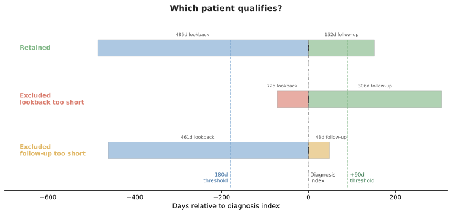

*Figure 5.1. Cohort entry depends on observable time around the diagnosis index.*


## 5.2 Lines of Therapy: Sequence Rules and Patterns

Line-of-therapy analysis reports newly observed starts, first-line treatment mix, regimen changes, and movement to later therapy. These results feed uptake reporting, competitive analysis, demand planning, and investigations of switching or discontinuation. Their meaning depends on the rules used to convert pharmacy fills into treatment lines.

Roventra line 1 begins with the first qualifying treatment fill after diagnosis. Building the sequence requires explicit rules for prior-treatment washout, the starting-regimen window, refill gaps, additions, switches, restarts, discontinuation, and censoring. This section applies those rules to synthetic claims data and shows how the washout rule changes the reported Roventra new-start count.

### 5.2.1 The washout rule

The 180-day washout determines which fills count as a true new start: if the patient had a treatment-basket fill in the 180 days before their post-diagnosis fill, they are a continuing user rather than a new start.

The washout window is anchored to the **first treatment fill**, not the diagnosis date. The section 5.1 lookback (also 180 days) counts back from the diagnosis date to confirm the patient is newly diagnosed within observable history. The washout counts back from the first fill to confirm the patient is newly started on therapy. A patient who began Roventra months before diagnosis will pass the diagnosis lookback but fail the washout: their pre-diagnosis fills land inside the 180-day window before their "first" post-diagnosis refill, revealing the continuation.

Roventra shows 3,193 line-1 entries without the washout rule, 2,798 with it. The 395 patients in between had a basket fill in the 180 days before their post-diagnosis "first" fill; they are therapy continuing users who got relabeled as a new start.

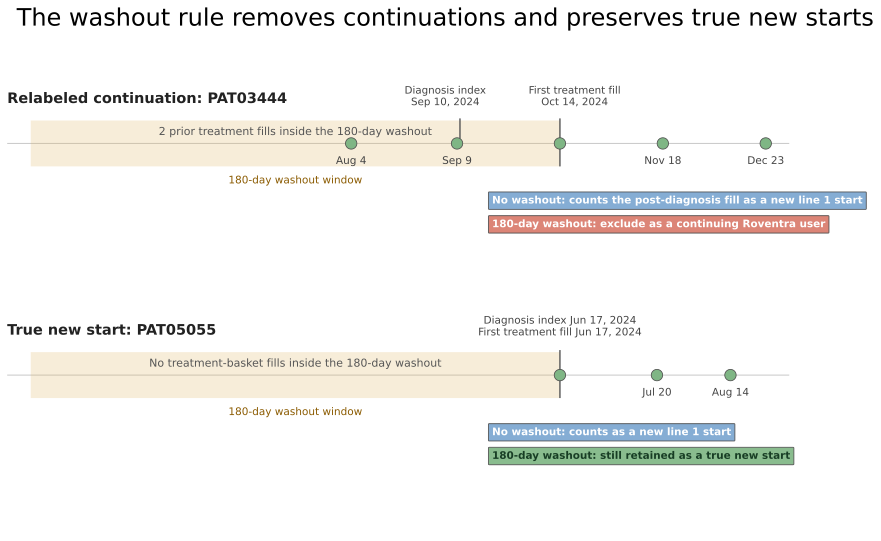

*Figure 5.2. The washout rule. The top panel shows a post-diagnosis fill that looks like a new start only because earlier treatment fills are hidden by a no-washout view. The bottom panel shows a patient with no earlier treatment fills, keep in the cohort.*

### 5.2.2 The rule set

Figure 5.3 illustrates a set of treatment sequence rules.

- New line start (panel 1): line `1` starts at the first treatment-basket fill after diagnosis, after the patient passes the 180-day washout. A 28-day supply covers days 0 through 27.
- Same-line refill (panel 2): a refill before the allowable 60-day gap closes keeps the patient on the `same line`.
- Starting combination (panel 3): product B inside the 30-day regimen window joins the starting regimen, so line `1` becomes `A + B`.
- Addition (panel 4): product B after the 30-day window but while product A still has active supply advances to line `2`, `A + B`.
- Switch (panel 5): product B after product A supply has ended advances to line `2`, `B`.
- Restart (panel 6): the same product after the 60-day gap closes opens a `new line` on the same product.
- Censoring (panel 7): observation ending before the gap can be resolved leaves the line censored.
- Discontinuation (panel 8): the 60-day gap closes while the patient is still observable and no qualifying refill, switch, addition, or restart appears.

Each rule is coded in `ch05_journey/scripts/lot.py`.

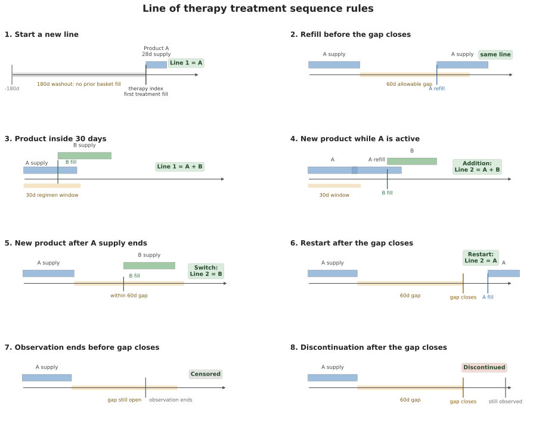

*Figure 5.3. Line-of-therapy rules depend on the timing of fills, active supply, the regimen window, the allowable gap, and the observation boundary. Conceptual schematic.*

### 5.2.3 Switch example

`PAT00839` is a new-to-therapy patient whose 2nd line is entered by a switch and ends in a discontinuation. The line logic begins at the first treatment fill after the diagnosis date.

**Listing 5.2: Trace a switch from transactions to lines of therapy**

```python
import pandas as pd
from episode_construction import DX_COLS, LAUNCH_CONDITION_CODES

out = "ch05_journey/assets/generated_outputs"
patient_id = "PAT00839"
medical = tables["medical_claims"]
pharmacy = tables["pharmacy_claims"]
basket = tables["products"]["product_name"].tolist()
diagnosis_index = (
    medical.loc[
        medical.patient_id.eq(patient_id)
        & medical[DX_COLS].isin(set(LAUNCH_CONDITION_CODES)).any(axis=1),
        "claim_date",
    ]
    .min()
)

mine = pharmacy[
    pharmacy.patient_id.eq(patient_id) & pharmacy.product_name.isin(basket)
].sort_values("date_of_service")
therapy_index = mine.loc[mine.transaction_type.eq("PAID"), "date_of_service"].min()
print(
    f"{patient_id}, diagnosis index {diagnosis_index:%Y-%m-%d}, "
    f"therapy index {therapy_index:%Y-%m-%d}:"
)
print(mine[["date_of_service", "product_name", "days_supply", "transaction_type"]]
      .to_string(index=False))

lines = pd.read_csv(f"{out}/lines.csv")
cols = ["line_number", "regimen", "line_start", "line_end",
        "fill_count", "entry_reason", "end_reason", "line_days"]
print("\nlines of therapy:")
print(lines.loc[lines.patient_id.eq(patient_id), cols].to_string(index=False))
```

```text
PAT00839, diagnosis index 2024-01-26, therapy index 2024-06-20:
date_of_service product_name  days_supply transaction_type
     2024-06-20      Nexoral           30             PAID
     2024-07-22       Vexpro           30           PENDED
     2024-07-24       Vexpro           30             PAID
     2024-08-21       Vexpro           30             PAID

lines of therapy:
 line_number regimen line_start   line_end  fill_count    entry_reason   end_reason  line_days
           1 Nexoral 2024-06-20 2024-07-19           1 Initial therapy       Switch         30
           2  Vexpro 2024-07-24 2024-09-19           2          Switch Discontinued         58
```

For PAT00839, diagnosis is on 2024-01-26 and treatment begins on 2024-06-20, 146 days later.

Nexoral is the 1st line since he passes the washout. The Nexoral supply runs through 2024-07-19. The Vexpro fill arrives 2024-07-24, within the 60-day allowable gap and after the Nexoral supply has ended, so it is a line 2 switch to Vexpro regimen. Two Vexpro fills carry supply to 2024-09-19. His observation window runs to 2024-12-31, more than 60 days past his last supplied day, so the discontinuation rule applies here: line 2 ended on therapy day 58.

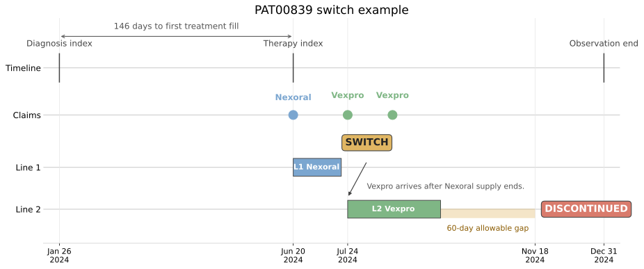

*Figure 5.4. PAT00839 shows the switch rule. The diagnosis index anchors the cohort, the first Nexoral fill sets the therapy index, the Vexpro fill creates the switch, and the observation window extends past the 60-day gap so discontinuation is observed. Synthetic data.*

### 5.2.4 Addition example

PAT03874 demonstrates the 2nd-line addition rule.

**Listing 5.3: Trace an addition from transactions to lines of therapy**

```python
import pandas as pd
from episode_construction import DX_COLS, LAUNCH_CONDITION_CODES

out = "ch05_journey/assets/generated_outputs"
patient_id = "PAT03874"
medical = tables["medical_claims"]
pharmacy = tables["pharmacy_claims"]
basket = tables["products"]["product_name"].tolist()
diagnosis_index = (
    medical.loc[
        medical.patient_id.eq(patient_id)
        & medical[DX_COLS].isin(set(LAUNCH_CONDITION_CODES)).any(axis=1),
        "claim_date",
    ]
    .min()
)
mine = pharmacy[
    pharmacy.patient_id.eq(patient_id) & pharmacy.product_name.isin(basket)
].sort_values("date_of_service")
therapy_index = mine.loc[mine.transaction_type.eq("PAID"), "date_of_service"].min()
print(
    f"{patient_id}, diagnosis index {diagnosis_index:%Y-%m-%d}, "
    f"therapy index {therapy_index:%Y-%m-%d}:"
)
print(mine[["date_of_service", "product_name", "days_supply", "transaction_type"]]
      .to_string(index=False))

lines = pd.read_csv(f"{out}/lines.csv")
cols = ["line_number", "regimen", "line_start", "line_end",
        "fill_count", "entry_reason", "end_reason", "line_days"]
print("\nlines of therapy:")
print(lines.loc[lines.patient_id.eq(patient_id), cols].to_string(index=False))
```

```text
PAT03874, diagnosis index 2024-05-09, therapy index 2024-07-06:
date_of_service product_name  days_supply transaction_type
     2024-06-28       Vexpro           60           PENDED
     2024-07-06       Vexpro           60             PAID
     2024-08-29      Nexoral           60             PAID
     2024-11-03      Nexoral           60             PAID

lines of therapy:
 line_number          regimen line_start   line_end  fill_count    entry_reason end_reason  line_days
           1           Vexpro 2024-07-06 2024-09-03           1 Initial therapy   Addition         60
           2 Nexoral + Vexpro 2024-08-29 2025-01-01           2        Addition   Censored        126
```

PAT03874 starts a 60-day Vexpro fill. On 2024-08-29, while that supply is still active but after the 30-day regimen window has closed, Nexoral arrives. A new product on a live backbone is an addition: the line advances to **line 2** and the regimen becomes the combination `Nexoral + Vexpro`. Had the Nexoral fill landed within the first 30 days, it would have joined **line 1** as a combination instead. Whether an addition should advance the line depends on the therapeutic area; oncology protocols typically treat it as a line advance, while some chronic-disease protocols do not. His line 2 is censored because supply runs past the observation boundary.

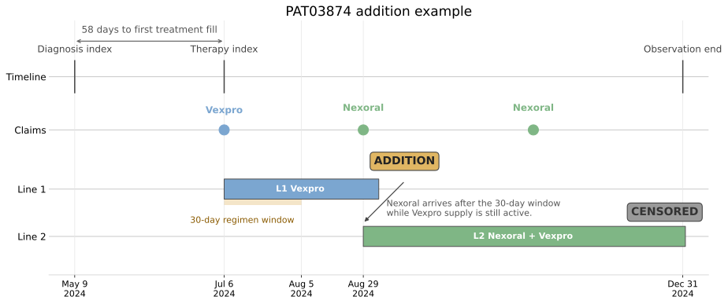

*Figure 5.5. PAT03874 shows the addition rule. The first Vexpro fill sets the therapy index, the 30-day regimen window closes on 2024-08-05, Nexoral arrives later while Vexpro still has active supply, and the line advances to `Nexoral + Vexpro`. Observation ends before the regimen can be classified as discontinued, so line 2 is censored. Synthetic data.*

### 5.2.5 Cohort treatment pattern

Run the treatment sequence rules over the 3,415 new-to-therapy patients:

**Listing 5.4: Summarize line-of-therapy patterns and the washout effect**

```python
import pandas as pd

out = "ch05_journey/assets/generated_outputs"
lines = pd.read_csv(f"{out}/lines.csv")

print("patients by deepest line reached:",
      lines.groupby("patient_id").line_number.max().value_counts().sort_index().to_dict())
print("how lines are entered:", lines.entry_reason.value_counts().to_dict())
print("how lines end:        ", lines.end_reason.value_counts().to_dict())

print("\nline-1 regimens:")
print(pd.read_csv(f"{out}/lot_line1_summary.csv").to_string(index=False))

print("\nRoventra line entries, with and without the washout rule:")
base = pd.read_csv(f"{out}/lot_entry_shares.csv").assign(rule="180-day washout")
naive = pd.read_csv(f"{out}/lot_entry_shares_naive.csv").assign(rule="no washout")
print(pd.concat([naive, base])[["rule", "position", "line_entries", "share"]]
      .to_string(index=False))
```

```text
patients by deepest line reached: {1: 3387, 2: 28}
how lines are entered: {'Initial therapy': 3415, 'Switch': 24, 'Addition': 4}
how lines end:         {'Censored': 1938, 'Discontinued': 1477, 'Switch': 24, 'Addition': 4}

line-1 regimens:
         regimen  patients  median_line_days  discontinued_share
        Roventra      2798              59.0               0.434
          Vexpro       309              67.0               0.443
         Nexoral       303              66.0               0.356
Nexoral + Vexpro         5              58.0               0.600

Roventra line entries, with and without the washout rule:
           rule position  line_entries  share
     no washout   Line 1          3193    1.0
180-day washout   Line 1          2798    1.0
```

The synthetic data runs from 2024-01-01 to 2025-01-31. With this bounded observation, line-of-therapy depth is shallow: 3,387 of 3,415 treated patients (99.2%) never leave line 1, and 28 reach a second line. Lines advance by switch (24) and addition (4), and 0.1% of first-line regimens are combinations. Restarts are absent because this generator builds tight refill chains. In real data, vacations, hospitalizations, mail-order fills, and incomplete capture make restart logic much more important. Roventra is the most common observed first-line regimen.

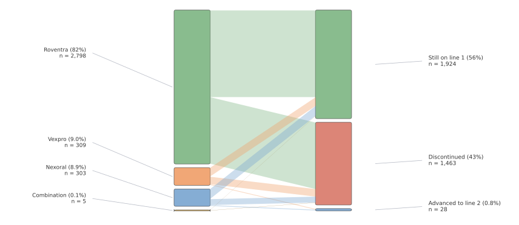

*Figure 5.6. The Sankey keeps first-line regimens on the left; still on line 1, discontinued, or advanced to line 2 on the right. Synthetic data.*

### 5.2.6 Treatment Sequence in Commercial Reporting

The 180-day washout identifies 3,415 new-to-therapy patients. Roventra appears in the first-line regimen for 2,798 of them. Without the washout, the analysis reports 3,193 Roventra line-1 entries because it counts 395 continuing users as new starts. The uncorrected count is 14.1% higher than the corrected result.

That difference affects 3 commercial outputs. The uptake report needs the corrected 2,798 newly observed Roventra starts. The treatment-mix report needs first-line regimens built under the same washout and regimen-window rules. The demand forecast needs new starts separated from continuing refills because the 2 groups create different expectations for launch growth.

Only 28 of 3,415 treated patients reach line 2 during the available observation period: 24 through switches and 4 through additions. These counts are sufficient for checking patient traces and validating the sequence rules. They are too small for payer-, account-, or product-level conclusions about later-line behavior.

First-line product shares can be summarized by payer once minimum cell-size rules are met. Those descriptive differences raise a formulary-position question, addressed in the competitive access analysis. A payer-effect claim would require adjustment for patient mix, channel capture, and benefit design.

The commercial deliverable should include the following fields:

- 3,415 newly observed treated patients
- 2,798 Roventra first-line starts
- first-line regimen counts and shares
- 24 switches and 4 additions
- diagnosis and treatment index definitions
- 180-day washout
- 30-day starting-regimen window
- 60-day allowable gap
- observation window and data cutoff
- sensitivity results for rules that materially change the output

The corrected new-start count can enter uptake and demand planning. The later-line results remain method-validation findings until more follow-up produces adequate counts.

When results are reported by payer, region, or account band, the deliverable should enforce minimum cell sizes and attach the observation window and rule version. Patient-level histories stay within the validation record. Stakeholder outputs use results at the approved level of aggregation.

## 5.3 Time to Treatment: When Patients Start Therapy

The Kaplan-Meier median time to treatment for this cohort is 168 days, with cumulative initiation reaching 30.5% at day 90 and 52.9% at day 180. The launch team also needs to know where the delay builds up: How long do patients wait at each step? Which HCPs start therapy faster? Does prior authorization add 10 days or 60? Which payer plans create the longest access delay?

The full path can include symptoms, diagnosis, biomarker testing, a treatment decision, a prescription, prior authorization, and the first treatment fill. A single diagnosis-to-treatment number captures the total delay, but it hides where that delay comes from. Stage-level timings point to the step that a testing program, field reimbursement manager, nurse navigator, HCP education effort, or patient-support program can address.

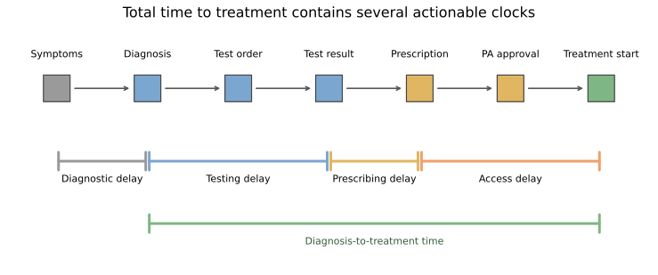

*Figure 5.7. The total time to treatment contains several operational clocks. This chapter measures diagnosis to treatment start. The other clocks require their own dated events.*

> **Note:** The synthetic datasets here contain diagnosis dates and first treatment dates. To split delay across testing, physician decision, or payer review, biomarker order dates, result dates, prescription dates, and prior-authorization dates are also required. Those fields are not included in this section.

*Table 5.1. Choose the clock that matches the decision.*

| Clock | Business question | Required dated events | Possible action |
| --- | --- | --- | --- |
| Symptoms to diagnosis | Is diagnosis coming too late? | Symptom onset and confirmed diagnosis | Referral and disease awareness |
| Diagnosis to biomarker result | Is testing adding delay? | Diagnosis, test order, and result | Testing access and specimen workflow |
| Result to prescription | Is the treatment decision slowing down? | Result and prescription | HCP education and care-pathway review |
| Prescription to PA approval | How much delay does payer review add? | Prescription, PA submission, and approval | Reimbursement support and documentation |
| PA approval to treatment start | Do approved patients actually reach therapy? | Approval and pharmacy fill or shipment | Patient support and fulfillment follow-up |
| Diagnosis to treatment start | How quickly do diagnosed patients become treated patients? | Diagnosis and pharmacy fill | Forecasting, capacity planning, and delay screening |

### 5.3.1 Why naive average fails

All 5 patients in Table 5.2 were diagnosed on January 1. The data close on day 90. Patients A, B, and C start treatment. Patients D and E remain observable through the cutoff without a recorded treatment start. The cutoff may arise from administrative study completion, end of data availability, or loss of captured coverage.

*Table 5.2. Each patient is a record with a observed duration and a treatment or censored outcome.*

| Patient | Last observed day | Outcome | Time to treatment |
| --- | ---: | --- | --- |
| A | 19 | Treated | 19 days |
| B | 31 | Treated | 31 days |
| C | 59 | Treated | 59 days |
| D | 90 | Censored | > 90 days |
| E | 90 | Censored | > 90 days |

The treated-only mean is (19+31+59)/3 = **36.3** days, and the treated-only median is **31** days. Both calculations drop D and E, even though each one remained untreated for 90 days, longer than any treated patient in the example. If both had started exactly on day 90, just before the observation window closed, each would add 90 days to the average and the mean would become (19+31+59+90+90)/5 = **57.8** days. The median would then move to **59** days.

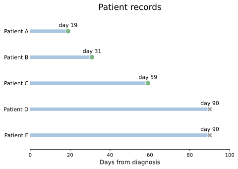

*Figure 5.8. Patients D and E contribute untreated follow-up through day 90. Their censoring marks end observation, with no recorded treatment event. Conceptual example.*

### 5.3.2 Kaplan-Meier Fundamentals

All 5 patients begin untreated. Patients A, B, and C start treatment on days 19, 31, and 59. Patients D and E stay in the untreated risk set until day 90, when follow-up ends and they are censored.

*Table 5.3. The Kaplan-Meier calculation changes the risk set as patients leave through treatment or censoring.*

| Day | At risk just before day | Treatment events | Censored | Conditional fraction still untreated | Probability still untreated, $\hat S(t)$ | Cumulative initiation, $1-\hat S(t)$ |
| ---: | ---: | ---: | ---: | ---: | ---: | ---: |
| 0 | 5 | 0 | 0 | 1 | 1 | 0 |
| 19 | 5 | 1 | 0 | $1-1/5=4/5$ | $1\times4/5=4/5$ | $1-4/5=1/5$ |
| 31 | 4 | 1 | 0 | $1-1/4=3/4$ | $4/5\times3/4=3/5$ | $1-3/5=2/5$ |
| 59 | 3 | 1 | 0 | $1-1/3=2/3$ | $3/5\times2/3=2/5$ | $1-2/5=3/5$ |
| 90 | 2 | 0 | 2 | 1 | $2/5$ | $3/5$ |

**Note:** In this table, **at risk** means a patient is still being observed, has not started treatment yet, and could still start on that day. The term can feel unintuitive because it comes from survival analysis, where a patient is "at risk" of death or relapse. Here, the event is treatment start. So the at-risk group is just the patients who are still untreated and observable right before that day.

Patients D and E keep the risk sets larger at days 19, 31, and 59 because they have already been observed to remain untreated up to those points. Each risk set counts only patients who are still observable and eligible to start. At day 90, D and E are censored. Since no treatment occurs, the curve stays at $2/5$.

The repeated multiplication in Table 5.3 is the Kaplan-Meier estimator ([Kaplan and Meier, 1958](https://doi.org/10.1080/01621459.1958.10501452)):

$$
\hat S(t)=\prod_{t_i\leq t}\left(1-\frac{d_i}{n_i}\right)
$$

At treatment time $t_i$, $n_i$ is the risk set and $d_i$ is the number of treatment starts. Here, the *survival function* $\hat S(t)$ is the probability of remaining untreated. The initiation curve is its complement:

$$
\hat F_{\text{initiation}}(t)=1-\hat S(t)
$$

The Kaplan-Meier median is the first observed day when $\hat S(t)\leq0.50$. The curve stays at $3/5$ after day 31 and drops to $2/5$ on day 59. The median is the observed crossing time: day 59.

**Listing 5.5: Reproduce the 5-patient calculation**

```python
import pandas as pd
from survival import km_curve, km_median

toy = pd.DataFrame({"day": [19, 31, 59, 90, 90],
                    "treated": [True, True, True, False, False]})
observed = toy.loc[toy.treated, "day"]
curve = km_curve(toy.day, toy.treated)
print(f"treated-only mean: {observed.mean():.1f} days")
print(f"treated-only median: {observed.median():.0f} days")
print(f"Kaplan-Meier median: {km_median(curve):.0f} days")
print(curve[["day", "at_risk", "events", "censored", "survival", "cumulative_initiation"]]
      .round(3).to_string(index=False))
```

```text
treated-only mean: 36.3 days
treated-only median: 31 days
Kaplan-Meier median: 59 days
 day  at_risk  events  censored  survival  cumulative_initiation
   0        5       0         0       1.0                    0.0
  19        5       1         0       0.8                    0.2
  31        4       1         0       0.6                    0.4
  59        3       1         0       0.4                    0.6
  90        2       0         2       0.4                    0.6
```

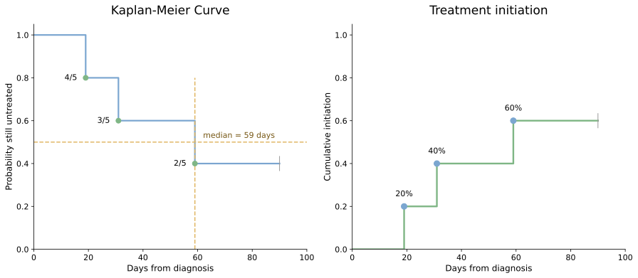

*Figure 5.9. The 2 panels show the same 5 patient histories from 2 angles. When treatment starts, the Kaplan-Meier curve falls while the cumulative initiation curve rises. Censoring on day 90 leaves both curves flat and ends follow-up.*

### 5.3.3 Kaplan-Meier Estimation in the Cohort

The cohort-building step identified 6,562 patients with at least 180 days of observable history before their diagnosis index. For time to treatment, 169 of those patients cannot enter the analysis because their diagnosis dates occur after the December 31, 2024 study cutoff, leaving no post-diagnosis time within the study. Removing them creates the 6,393-patient treatment-initiation cohort.

This cohort does not require 90 days of follow-up after diagnosis. That requirement built the 5,637-patient journey and line-of-therapy cohort in section 5.1. Applying it here would remove recently diagnosed patients. Kaplan-Meier retains them and uses the follow-up available for each patient.

By the end of each patient's available record, 4,110 of the 6,393 patients had an observed treatment start and 2,283 of 6,393 (35.7%) did not. That 35.7% is not an estimate of the share who will remain untreated permanently; it reflects incomplete follow-up. Kaplan-Meier uses the available follow-up for all 6,393 patients, just as it did for Patients D and E in the 5-patient example.

**Listing 5.6: Compare the end-of-study count with the time-to-event result**

```python
import pandas as pd

out = "ch05_journey/assets/generated_outputs"
journeys = pd.read_csv(f"{out}/initiation_journeys.csv")
treated = journeys[journeys.initiated_treatment]
curve = pd.read_csv(f"{out}/initiation_curve.csv")
median_day = curve.loc[curve.cumulative_initiation.ge(0.5), "day"].iloc[0]
print(f"end-of-study count: {len(treated):,} of {len(journeys):,} started; "
      f"{1 - journeys.initiated_treatment.mean():.1%} without observed start")
print(f"treated-only median: {treated.days_to_treatment.median():.0f} days")
print(f"Kaplan-Meier median: {median_day:.0f} days")
for day in (90, 180, 270):
    row = curve.loc[curve.day.le(day)].iloc[-1]
    print(f"day {day}: {row.cumulative_initiation:.1%} "
          f"(95% CI {row.cumulative_initiation_lower_95:.1%} to "
          f"{row.cumulative_initiation_upper_95:.1%}); {int(row.at_risk):,} at risk")
```

```text
end-of-study count: 4,110 of 6,393 started; 35.7% without observed start
treated-only median: 104 days
Kaplan-Meier median: 168 days
day 90: 30.5% (95% CI 29.4% to 31.7%); 3,957 at risk
day 180: 52.9% (95% CI 51.6% to 54.3%); 2,142 at risk
day 270: 74.3% (95% CI 72.9% to 75.6%); 722 at risk
```

The treated-only median is a conditional result for the 4,110 observed starters. The Kaplan-Meier median uses untreated follow-up from all 6,393 patients and estimates when cumulative initiation reaches 50%.

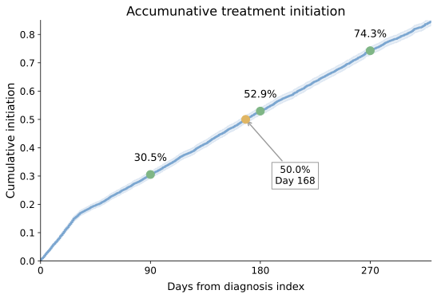

*Figure 5.10. Initiation continues to accrue as the untreated risk set becomes smaller. The shaded band is the 95% confidence interval. Synthetic data.*

### 5.3.4 Competing Risk: The Aalen-Johansen Method

Change Patient B's outcome in the 5-patient example. Patient B dies on day 31 before starting treatment. Death is a **competing event** because it prevents treatment from occurring later.

> **Note:** The synthetic cohort used here does not include death records. In a real study, death dates may come from linked EHR data, mortality registries, obituary-based mortality sources, or other linked records.

If Patient B's death is treated as ordinary censoring, Kaplan-Meier removes Patient B from the risk set on day 31 without recording a treatment event. Patient C then starts treatment on day 59, when 3 patients remain at risk.

*Table 5.4. Kaplan-Meier treats Patient B's death as censoring and continues to estimate treatment initiation among the remaining risk set.*

| Day | At risk just before day | Treatment events | Censored | Conditional fraction still untreated | Probability still untreated, $\hat S(t)$ | Cumulative initiation, $1-\hat S(t)$ |
| ---: | ---: | ---: | ---: | ---: | ---: | ---: |
| 0 | 5 | 0 | 0 | 1 | 1 | 0 |
| 19 | 5 | 1 | 0 | $1-1/5=4/5$ | $1\times4/5=4/5$ | $1-4/5=1/5=20\%$ |
| 31 | 4 | 0 | 1 | 1 | $4/5$ | $1/5=20\%$ |
| 59 | 3 | 1 | 0 | $1-1/3=2/3$ | $4/5\times2/3=8/15$ | $1-8/15=7/15=46.7\%$ |
| 90 | 2 | 0 | 2 | 1 | $8/15$ | $7/15=46.7\%$ |

Replacing Patient B's treatment with death removes the treatment event on day 31. Kaplan-Meier records only that Patient B left the risk set. Its estimated cumulative treatment initiation reaches $7/15$, or 46.7%, by day 90.

The 46.7% estimate answers a hypothetical question: what would treatment initiation look like if deaths were removed and those patients had the same subsequent initiation pattern as comparable survivors? It overestimates the real-world probability of treatment here because a patient who dies before treatment can never start later.

Aalen-Johansen records treatment and death as separate outcomes ([Aalen and Johansen, 1978](https://doi.org/10.1080/01621459.1978.10480118)). For each outcome, it estimates a **cumulative incidence function (CIF)**: the probability that the outcome has occurred by day $t$, accounting for the competing event.

*Table 5.5. Aalen-Johansen assigns probability to treatment, death, or remaining untreated and alive.*

| Day | Event | At risk | Treatment increment | Death increment | Treated probability | Death probability | Untreated and alive |
| ---: | --- | ---: | ---: | ---: | ---: | ---: | ---: |
| 0 | Start | 5 | $0$ | $0$ | 0% | 0% | 100% |
| 19 | A treated | 5 | $1\times1/5=1/5$ | $0$ | 20% | 0% | 80% |
| 31 | B died | 4 | $0$ | $4/5\times1/4=1/5$ | 20% | 20% | 60% |
| 59 | C treated | 3 | $3/5\times1/3=1/5$ | $0$ | 40% | 20% | 40% |
| 90 | D and E censored | 2 | $0$ | $0$ | 40% | 20% | 40% |

At every row, the 3 state probabilities sum to 100%. By day 90, the estimated probability of treatment is 40%, the probability of death before treatment is 20%, and the probability of remaining untreated and alive is 40%. The treatment cumulative incidence does not reach 50%, so no median treatment-initiation time exists in this example.

**Listing 5.7: Calculate the competing-risk probabilities**

```python
import pandas as pd
from survival import aalen_johansen_curve

days = pd.Series([19, 31, 59, 90, 90])
outcomes = pd.Series(["Treated", "Died", "Treated", "Censored", "Censored"])
aj = aalen_johansen_curve(days, outcomes)
cols = ["day", "at_risk", "event_free", "cumulative_interest",
        "cumulative_competing"]
print(aj[cols].round(3).to_string(index=False))
```

```text
 day  at_risk  event_free  cumulative_interest  cumulative_competing
   0        5         1.0                  0.0                   0.0
  19        5         0.8                  0.2                   0.0
  31        4         0.6                  0.2                   0.2
  59        3         0.4                  0.4                   0.2
  90        2         0.4                  0.4                   0.2
```

The numeric pattern in the output generalizes to:

$$
\hat F_{\text{treatment}}(t)
=\sum_{t_i\leq t}\hat S_{\text{all events}}(t_i^-)
\frac{d_{i,\text{treatment}}}{n_i}
$$

$\hat S_{\text{all events}}(t_i^-)$ is the probability still untreated and free of a competing event immediately before day $t_i$. The fraction $d_{i,\text{treatment}}/n_i$ assigns part of that available probability to treatment. A parallel calculation assigns probability to death.

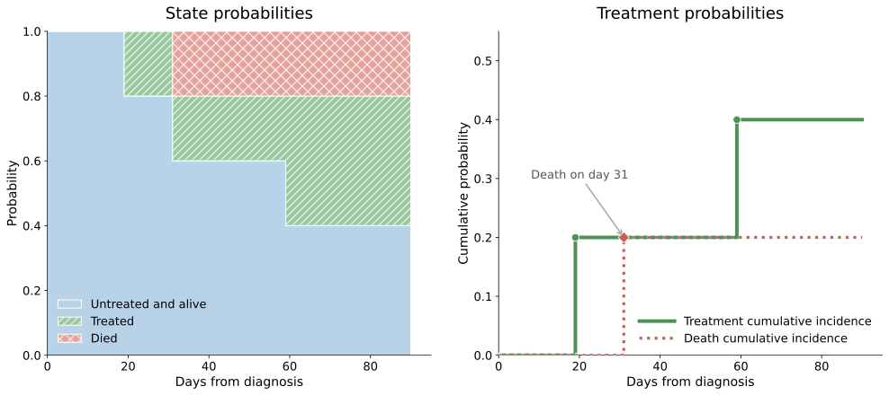

*Figure 5.11. The state-probability panel shows how all 3 patient states continue to sum to 100% while the cumulative incidence curves separate treatment from death.*

The event definition must follow the business question. Administrative data cutoff is censoring because treatment could occur later. Death before treatment is a competing event because it makes later treatment impossible. Insurance disenrollment requires a protocol decision: censoring for treatment anywhere in the health system, or end of eligibility when the estimand is treatment within the captured plan.

### 5.3.5 Initiation Curves in Commercial Planning

Across 6,393 patients, the Kaplan-Meier median time to treatment is 168 days. Cumulative initiation reaches 30.5% by day 90, 52.9% by day 180, and 74.3% by day 270.

These estimates describe when treatment starts accumulate after diagnosis. A forecast team applies them to a separate diagnosis forecast. If the forecast expects $N$ comparable diagnoses, the estimated starts by day $t$ are:

$$
\text{Expected starts by day }t
=N\times\hat F_{\text{initiation}}(t)
$$

The diagnosis forecast supplies $N$. The treatment-initiation analysis supplies $\hat F_{\text{initiation}}(t)$. The 2 inputs come from different evidence and should remain separate.

| Commercial question | What the current analysis shows | Required next step |
| --- | --- | --- |
| How long do patients wait after diagnosis? | Median time to treatment is 168 days. Initiation reaches 30.5% by day 90, 52.9% by day 180, and 74.3% by day 270. | Use the curve with the diagnosis forecast to phase expected starts, supply, and support capacity. |
| During which period do starts accumulate? | Initiation increases by 22.4 percentage points between days 90 and 180. | Check whether staffing and fulfillment capacity match this period. |
| Where does the delay occur? | Does not separate testing, treatment-decision, and payer-review time. | Add the stage dates in Table 5.1 and estimate each interval separately. |
| Do HCP initiation patterns differ? | Does not estimate HCP differences. | Build HCP-level or stratified curves, enforce minimum sample sizes, and adjust for patient and payer mix. |
| Does prior authorization delay treatment? | Does not estimate prior-authorization delay. | Link prescription, PA submission, approval, and treatment-start dates. |
| Do payer plans differ? | Does not estimate plan effects. | Compare plan-level curves with uncertainty and adjust for case mix, benefit design, and data capture. |

The first deliverable is a treatment-initiation planning table with the day-90, day-180, day-270, and median estimates. Each estimate should include its confidence interval, number at risk, diagnosis-index definition, data cutoff, censoring rule, and competing-event rule.

The second deliverable is a data-gap table for the unanswered questions. Testing delay requires test-order and result dates. Treatment-decision delay requires a prescription date. Access delay requires prior-authorization submission and approval dates. These fields determine whether the next analysis can address testing support, HCP education, reimbursement support, and patient services.

## 5.4 Staying on Therapy: Persistence and Adherence

At day 90, 60.6% of patients remain on the initial regimen. The next questions are: when did refill gaps begin, did patients continue treatment after switching products, and do payer-level differences identify access problem?

These questions affect refill support, patient-service capacity, HCP follow-up, and market-access investigation. They require 2 related measures. **Persistence** measures the time until a patient leaves the initial regimen. **Adherence**, also called **compliance**, measures the share of observed days with medicine available. A patient can remain on the same regimen for 95 days and still have uncovered days within that period.

`PAT00036` shows the distinction. The patient started Roventra on 2024-09-28 and completed 4 fills before the 2024-12-31 cutoff. The patient remains persistent through 95 observed days, while 7 uncovered days reduce Proportion of days covered (PDC) to 92.6%. Medication possession ratio (MPR) reaches 117.9% because it counts all 112 dispensed days, including supply extending beyond the study cutoff. Figure 5.12 maps that one history to 4 outputs. Definitions are explained later in this chapter, they follow the ISPOR terminology for medication use ([Cramer et al., 2008](https://doi.org/10.1111/j.1524-4733.2007.00213.x)).

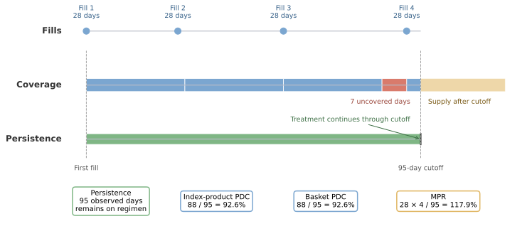

*Figure 5.12. Persistence follows elapsed time on the initial regimen, PDC counts covered days within the window, and MPR counts all dispensed supply. Synthetic data.*

### 5.4.1 Persistence: time until departure from the initial regimen

Persistence starts on the first treatment fill that opens line 1. A switch, addition, restart after the allowable gap, or confirmed discontinuation is an event marking the end of the initial regimen. If observation ends while the allowable gap is still unresolved, the line is censored on the last day for which persistence can be established.

The Kaplan-Meier estimator from section 5.3 applies with a new event definition. Here, $S(t)$ is the estimated probability of remaining on the initial regimen through day $t$.

**Listing 5.8: Report initial-regimen persistence with its risk set**

```python
import pandas as pd

out = "ch05_journey/assets/generated_outputs"
persistence = pd.read_csv(f"{out}/line1_persistence.csv")
for day in (60, 90, 113, 180):
    row = persistence.loc[persistence.day.le(day)].iloc[-1]
    print(f"day {day}: {row.survival:.1%} persistent "
          f"(95% CI {row.lower_95:.1%} to {row.upper_95:.1%}); "
          f"{int(row.at_risk):,} at risk")
```

```text
day 60: 73.0% persistent (95% CI 71.4% to 74.6%); 1,776 at risk
day 90: 60.6% persistent (95% CI 58.6% to 62.5%); 1,128 at risk
day 113: 49.9% persistent (95% CI 47.7% to 52.0%); 701 at risk
day 180: 19.2% persistent (95% CI 16.2% to 22.4%); 50 at risk
```

The median time to departure is 113 days, the first day when estimated persistence reaches 50%. The 180-day estimate comes from a thin tail: only 50 of the original 3,415 patients remain on the therapy.

Departure from line 1 has several meanings: a switch or addition shows continued treatment in a changed regimen, while confirmed discontinuation shows a gap beyond the 60-day rule. A single persistence curve combines these events. A multistate analysis for time on any therapy to preserve separate treatment states.

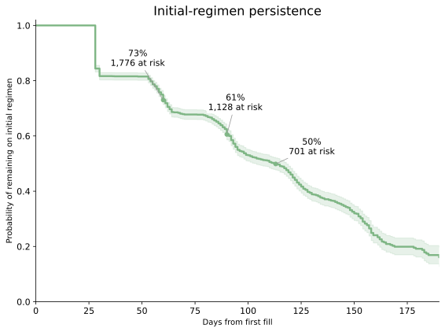

*Figure 5.13. Estimated initial-regimen persistence falls from 73.0% at day 60 to 49.9% at day 113. Synthetic data.*

### 5.4.2 Adherence: coverage during the observed window

Proportion of days covered, or PDC, measures adherence during a defined observation window:

$$
\text{PDC} =
\frac{\text{covered days}}{\text{observable days}}
$$

The numerator counts each calendar day once when qualifying supply is available. The observable days start on the first treatment fill and continue for up to 365 days, stopping earlier at the patient's follow-up end. At least 90 observable days are required to prevent a single fill from dominating the result.

For `PAT00036`, the window runs 95 days from 2024-09-28 through 2024-12-31. Four 28-day fills provide 112 dispensed days. The 2nd fill arrives 2 days early, so its supply starts after the prior fill is exhausted. The last fill contributes only 4 covered days before the study cutoff. The resulting supply covers 88 unique days:

$$
\text{PDC} = \frac{88}{95}=0.926
$$

Medication possession ratio, or MPR, uses the raw dispensed supply:

$$
\text{MPR} = \frac{112}{95}=1.179
$$

MPR exceeds 1 because supply extends beyond the window. PDC caps the numerator at the number of eligible calendar days and stays between 0 and 1. Both measures describe claims-based possession: filling a prescription provides evidence of available supply and cannot confirm ingestion or correct use.

**Listing 5.9: Summarize the PDC distribution and compare product scopes**

```python
import pandas as pd

out = "ch05_journey/assets/generated_outputs"
index_pdc = pd.read_csv(f"{out}/adherence_index_product.csv")
basket_pdc = pd.read_csv(f"{out}/adherence_market_basket.csv")
bands = pd.cut(index_pdc.pdc, [-0.001, 0.2, 0.5, 0.8, 1.001],
               labels=["0-<0.20", "0.20-<0.50", "0.50-<0.80", "0.80-1.00"],
               right=False)
print(bands.value_counts(sort=False).rename("patients").to_string())
print(f"\nmean index-product PDC: {index_pdc.pdc.mean():.3f}")
print(f"median index-product PDC: {index_pdc.pdc.median():.3f}")
print(f"PDC at or above 0.80: {index_pdc.adherent_pdc.mean():.1%}")
changed = basket_pdc.pdc.gt(index_pdc.pdc).sum()
print(f"higher basket PDC than index-product PDC: {changed:,} patients")
```

```text
pdc
0-<0.20        584
0.20-<0.50    1097
0.50-<0.80     581
0.80-1.00      418

mean index-product PDC: 0.445
median index-product PDC: 0.395
PDC at or above 0.80: 15.6%
higher basket PDC than index-product PDC: 36 patients
```

The PDC cohort contains 2,680 treated patients with at least 90 observable days after initiation. Median index-product PDC is 0.395, and 15.6% meet the prespecified 0.80 threshold. The 0.80 threshold is a reporting convention; a clinically meaningful level depends on the disease, product, dosing schedule, and outcome.

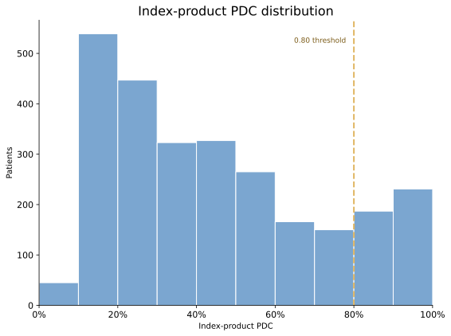

*Figure 5.14. Most measured patients fall below the 0.80 index-product PDC threshold. The full distribution shows how far patients are from the threshold and avoids reducing the analysis to one pass rate. Synthetic data.*

### 5.4.3 Product Scope in Adherence Measurement

The product basket determines which covered days enter the PDC numerator. **Index-product PDC** counts supply for the product that started line 1. **Market-basket PDC** counts supply for any qualifying treatment for the condition. A patient who receives Roventra for 60 days and then Nexoral for 60 days in a 120-day window has an index-product PDC of $60/120=0.50$ and a market-basket PDC of $120/120=1.00$. Index-product PDC measures continuity on Roventra; market-basket PDC measures continuity on condition treatment.

Only 36 patients have higher market-basket PDC than index-product PDC. The line-of-therapy analysis found only 28 patients who reached line 2, so the near-equality follows directly from the shallow treatment sequences in this synthetic data. A larger difference in real data would point to switching or add-on treatment.

Table 5.6 summarizes the measurement choices. The event or numerator defines what counts. The risk set or observable days define who or which days contribute.

*Table 5.6. Persistence and adherence use different units and answer different medication-use questions.*

| Measure | Business question | What counts | Comparison base | Patient-level output | Population output |
| --- | --- | --- | --- | --- | --- |
| Initial-regimen persistence | How long does the starting regimen continue? | Departure by switch, addition, restart, or confirmed discontinuation | Patients still known to remain on line 1 at each day | Time to departure or censored duration | Persistence curve and median time to departure |
| Index-product PDC | On what share of observed days was the starting product available? | Unique days covered by the starting product | Up to 365 observable days after the first fill | Percentage from 0% to 100% | Distribution and share at or above a stated threshold |
| Market-basket PDC | On what share of observed days was any condition treatment available? | Unique days covered by any product in the basket | Up to 365 observable days after the first fill | Percentage from 0% to 100% | Distribution across treatment changes |
| MPR | How much supply was dispensed relative to elapsed time? | Sum of dispensed days supply | Observable days in the measurement window | Ratio that can exceed 1.0 | Distribution or threshold summary |

### 5.4.4 Payer Adherence Rates with Confidence Intervals

The unadjusted payer summaries range from 13.2% to 18.4% at PDC of 0.80 or higher. Listing 5.10 calculates 95% confidence intervals for each rate.

**Listing 5.10: Add uncertainty to the payer adherence comparison**

```python
import pandas as pd
from statistics import NormalDist

out = "ch05_journey/assets/generated_outputs"
payer = pd.read_csv(f"{out}/adherence_by_payer.csv").query("payer_id != 'All'")
z = NormalDist().inv_cdf(0.975)
n, rate = payer.treated_patients, payer.adherent_pdc_rate
denominator = 1 + z**2 / n
center = (rate + z**2 / (2 * n)) / denominator
half_width = z * (rate * (1 - rate) / n + z**2 / (4 * n**2))**0.5 / denominator
payer = payer.assign(lower_95=center - half_width, upper_95=center + half_width)
print(payer[["payer_id", "treated_patients", "adherent_pdc_rate",
             "lower_95", "upper_95"]].round(4).to_string(index=False))
```

```text
payer_id  treated_patients  adherent_pdc_rate  lower_95  upper_95
  PAY001               313             0.1661    0.1290    0.2113
  PAY002               332             0.1837    0.1457    0.2289
  PAY003               334             0.1677    0.1315    0.2115
  PAY004               349             0.1318    0.1003    0.1713
  PAY005               350             0.1400    0.1075    0.1803
  PAY006               336             0.1637    0.1280    0.2070
  PAY007               331             0.1450    0.1111    0.1870
  PAY008               335             0.1522    0.1177    0.1946
```

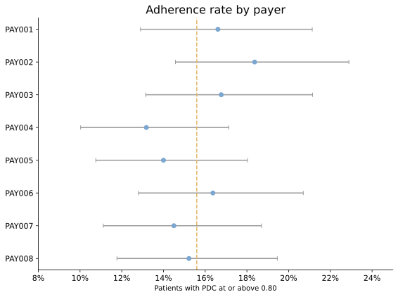

*Figure 5.15. The payer confidence intervals overlap substantially, including the intervals for PAY002 (top ranking payer) and PAY004 (bottom ranking payer). The observed ranking provides weak evidence for a payer-specific difference. Synthetic data.*

The generator contains no payer-specific adherence mechanism, and the intervals overlap substantially. The analysis confirms there is no clear evidence of a payer difference.

In real data, a payer difference would start an investigation for the cause. Formulary restrictions, refill-channel capture, days-supply conventions, benefit design, and follow-up length can all affect the observed rate.

### 5.4.5 Persistence and Adherence in Commercial Strategy

At day 90, 60.6% of patients remain on the initial regimen, leaving about 4 in 10 who have switched, added treatment, restarted, or met the discontinuation rule. Among 2,680 patients with at least 90 observable days, 15.6% have index-product PDC at or above 0.80. Product switching changes PDC for only 36 patients in this synthetic data. Raw payer rates vary by 5.2 percentage points, and overlapping confidence intervals provide weak evidence for a payer-specific effect.

The day-90 persistence result sets the scale and timing of early departure. The PDC distribution locates refill coverage as a separate problem within the time patients remain under observation. The basket comparison identifies whether switching explains low product-specific coverage. The payer comparison determines whether market access needs a focused evidence review before recommending intervention.

*Table 5.7. Each finding should lead to a commercial action.*

| Finding in this package | Interpretation | Next analysis or action | Stakeholder use | Boundary |
| --- | --- | --- | --- | --- |
| 60.6% persistent at day 90 | About 4 in 10 have departed the initial regimen by day 90 under the 60-day gap rule | Split departures into discontinuation, switch, and addition; review sensitivity to the gap rule | Brand analytics can define the size and timing of early departure | Claims do not reveal the clinical reason |
| 15.6% at PDC of 0.80 or higher | Most measured patients have substantial uncovered time for the index product | Locate refill gaps by week from initiation and compare against expected dosing | Patient services can examine refill support around the earliest recurring gaps | PDC measures available supply, not ingestion |
| 36 patients improve under basket PDC | Switching has little effect on the aggregate adherence result here | Reconcile those patients with line-2 records | Analytics can verify that the adherence and line algorithms agree | The synthetic journey has very few later lines |
| Payer rates span 13.2% to 18.4% with overlapping intervals | Observed payer variation is inconclusive | Check formulary status, days supply, capture, case mix, and adjusted estimates | Market access receives a focused evidence request | Raw payer rates do not establish a payer effect |
| 50 patients remain at risk at day 180 | The late persistence estimate rests on limited follow-up | Extend the data cutoff or choose a more mature index cohort | Data operations can define the next reliable refresh date | A narrow confidence interval cannot repair immature follow-up |

The stakeholder deliverable should contain the persistence curve with numbers at risk, the PDC distribution, the product-scope comparison, a payer table with uncertainty, and the exact measurement specification. The specification records the index event, product basket, 365-day maximum window, 90-day minimum observable window, refill carryover rule, 0.80 threshold, allowable gap, censoring rule, and data cutoff.

## 5.5 The Hub Pathway: Where Access Friction Lives

For a specialty product, the journey between the prescription decision and the first pharmacy fill runs through a hub: referral, benefits investigation, prior authorization, and shipment. Pharmacy claims capture the fill only after these steps complete. The specialty-pharmacy file shows the intermediate path:

```python
import pandas as pd

out = "ch05_journey/assets/generated_outputs"
print(pd.read_csv(f"{out}/sp_funnel.csv").to_string(index=False))
print()
outcomes = pd.read_csv(f"{out}/sp_abandonment_outcomes.csv")
pivot = outcomes.pivot_table(index="discontinue_reason", columns="outcome",
                             values="patients", fill_value=0).astype(int)
print(pivot.to_string())
```

```text
                 stage  patients  share_of_referrals  median_days_from_referral
     Referral received      2597               1.000                        0.0
Authorization approved      1958               0.754                        5.0
               Shipped      1836               0.707                       10.0
             Abandoned       722               0.278                        4.0

outcome                  Later Roventra fill  No further basket fill
discontinue_reason
Cost                                   236                            7
Coverage                               198                            3
Documentation                          218                            5
Lost follow-up                          26                            0
Patient decision                        29                            0
```

The funnel includes only referrals between diagnosis index and follow-up end. Among the 2,597 post-index referrals, 70.7% reach shipment with a median of 10 days from referral, and 27.8% (722) abandon. Of the 722 abandoned referrals, 707 later show a Roventra fill and 15 show no further treatment-basket fill before follow-up ends.

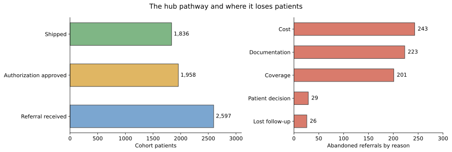

*Figure 5.16. The hub converts 7 in 10 post-index referrals. Counts, conversion, and time belong together because a pathway can lose patients through delay as well as explicit abandonment. Synthetic data.*

The reasons route the work: cost abandonment points to affordability programs, coverage to market access, and documentation to office support. Most abandoned referrals in this synthetic file later show Roventra treatment, so the deliverable should report both the hub outcome and the later claim outcome.

The broader journey table contains 52 patients with a pended pharmacy transaction and no observed treatment fill. Market access should reconcile those records against later claims, hub status, and channel coverage before classifying them as unresolved barriers. A missing fill may reflect an unresolved access problem, treatment outside the captured channel, or the end of observable follow-up.

## 5.6 Modern Extensions to Rule-Based Patient Journeys

The synthetic data only contains 24 switches and 4 additions. A larger claims or EHR study may support questions about recurring gaps, latent treatment states, common pathway shapes, or future event risk. Table 5.8 maps each question to a modern method that extends the rule-based foundation.

*Table 5.8. Choose an extension for a specific journey question.*

| Method | Question it can answer | Required evidence and validation | Where to start |
| --- | --- | --- | --- |
| Multi-state and competing-risk models | What is the probability of moving among initiation, switch, discontinuation, death, and other states over time? | Dated transitions, competing events, censoring rules, and enough events per transition | [Putter et al., 2007](https://doi.org/10.1002/sim.2712) |
| Recurrent-event models | Which factors are associated with repeated refill gaps, hospitalizations, or restarts? | Repeated event dates, risk intervals, time-varying covariates, and within-patient dependence | [Andersen and Gill, 1982](https://doi.org/10.1214/aos/1176345976) |
| State-sequence analysis | Which complete journey patterns recur across patients? | A common time scale, explicit state alphabet, distance rule, and cluster stability checks | [TraMineR](https://doi.org/10.18637/jss.v040.i04) |
| Process mining | Where do hub pathways contain delay, rework, loops, or deviations from the expected route? | Complete event logs with case IDs, activity names, timestamps, and source-system coverage | [Process mining in healthcare review](https://pmc.ncbi.nlm.nih.gov/articles/PMC12355893/) |
| Hidden Markov and semi-Markov models | Which latent treatment state best explains noisy or intermittently observed records, and how long does that state persist? | Repeated observations, plausible state definitions, dwell-time assumptions, and out-of-sample state validation | [Jackson, 2011](https://doi.org/10.18637/jss.v038.i08) |
| Probabilistic phenotype inference | What is the probability that a patient belongs to the target clinical cohort? | Diagnosis, procedure, medication, laboratory, and note-derived features with validation labels | [PheNorm](https://doi.org/10.1093/jamia/ocx111) |
| Standardized pathway analytics | Can the same cohort and pathway definition be reproduced across databases? | Versioned concepts, cohort logic, database mappings, and cross-database diagnostics | [OHDSI Cohort Pathways](https://ohdsi.github.io/TheBookOfOhdsi/OhdsiAnalyticsTools.html) |
| Longitudinal representation learning | Can a long patient record support prediction, matching, or segmentation? | Large longitudinal histories, a defined prediction target, temporal validation, and subgroup review | [Med-BERT](https://www.nature.com/articles/s41746-021-00455-y) |
| Transformer trajectory models | Which distant diagnoses, visits, and medications help predict a later event? | Large coded sequences, stable vocabularies, time-aware splits, calibration, and interpretation checks | [BEHRT](https://www.nature.com/articles/s41598-020-62922-y) |
| Time-to-event foundation models | Can one pretrained representation support several future event-time tasks? | Large event histories, task-specific censoring definitions, external validation, and calibration by horizon | [MOTOR](https://openreview.net/forum?id=NialiwI2V6) |

## 5.7 Summary

Starting from 3,193 apparent Roventra line-1 entries, a 180-day treatment washout identified 395 continuing users, leaving 2,798 newly observed Roventra starts. That 14.1% correction changes launch uptake reporting.

The analysis produced 6 reusable lessons:

- Define the cohort, index date, lookback, follow-up, treatment basket, and data cutoff before constructing a journey.
- Count completed treatment fills as exposure evidence. Preserve pended and reversed transactions as access evidence.
- Version the washout, starting-regimen window, allowable gap, addition, switch, restart, discontinuation, and censoring rules.
- Estimate treatment initiation with methods that retain censored patients and treat death as a competing event when death data are available.
- Use persistence for elapsed time on treatment and PDC for covered days within a fixed window. State the product scope and observable-day base with every result.


## 5.8 Exercises

1. **Audit a false new start.** Construct line 1 with a 0-day washout and a 180-day washout. Select 1 patient counted only by the 0-day rule, then print the therapy index and all completed treatment-basket fills in the prior 180 days. Explain why the earlier fill changes the commercial classification. See section 5.2.
2. **Choose the adherence product scope.** Join index-product and market-basket PDC, identify the patients whose values differ, and inspect the treatment products for the patient with the largest increase. State which PDC belongs in a brand continuity report and which belongs in a condition-treatment continuity report. See section 5.4.
3. **Stress-test the data cutoff.** Rebuild the cohort and line-1 results with the study end moved from 2024-12-31 to the raw data edge on 2025-01-31. Compare cohort size, discontinued share, and censored share, then explain why the less mature cutoff changes the result. See sections 5.1 and 5.4.

Worked solutions are in [`exercise_solutions.ipynb`](exercise_solutions.ipynb). Each solution ends with the judgment the analyst should document for real data.

The HCP and account targeting analysis carries the patient and treatment evidence into field planning. It asks where the observed opportunity sits, which customers are actionable, and what the field team should do next.
