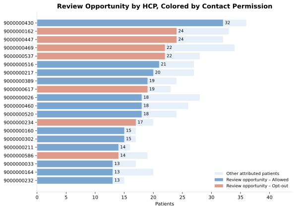
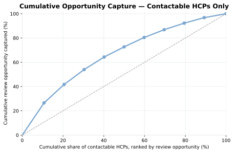
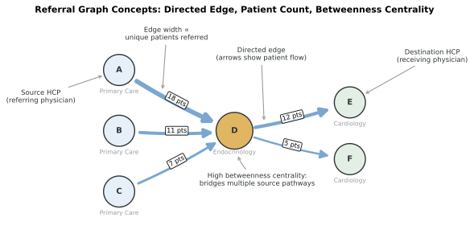
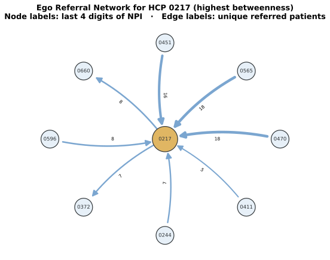
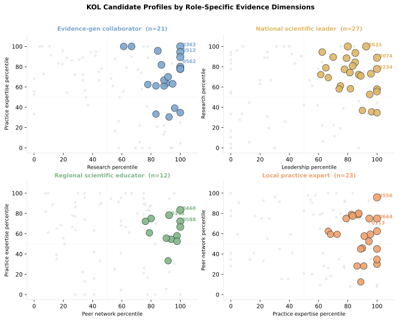
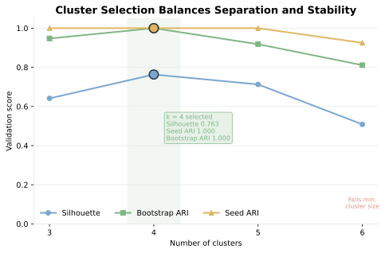
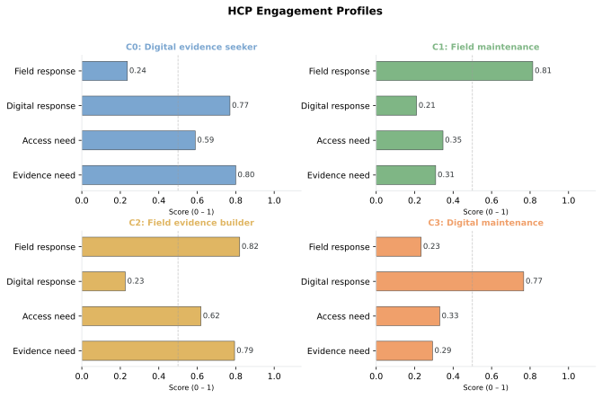

# Chapter 6: HCP Targeting

The field team starts with 281 roster HCPs and patient journey evidence from the Type 2 diabetes cohort. The goal is a 4-week HCP plan that accounts for eligibility, current contact permission, local practice context, engagement pattern, and territory capacity.

The analysis works through 6 planning questions:

1. Which HCPs can the field team actually work in this cycle? We start with the roster, then apply specialty, geography, active affiliation, and permission rules to define the usable target list.
2. When a patient appears in the journey data, which HCP should that patient count toward? We need one declared attribution rule so the same patient does not drift across multiple HCPs.
3. Which referral patterns matter for HCP planning? This shows whether an HCP sits inside a referral path that affects diagnosis, treatment flow, or follow-up.
4. Which HCPs show enough scientific activity to justify medical-affairs review? We look for scientific signals such as publications, congress activity, and peer connections, not commercial value.
5. Do the eligible HCPs fall into a small number of usable engagement patterns? If they do, those patterns can shape message choice, channel choice, and contact timing.
6. After those rules are applied, which HCPs make the 4-week call plan?

The analysis produces 4 outputs: an HCP evidence table with attributed patients, site affiliation, permission status, and review opportunity; a referral summary of local specialty pathways; a medical-affairs review table with scientific signals behind each proposed KOL role; and a validated k-means segmentation table assigning each eligible HCP to an engagement segment. Those outputs feed the 4-week HCP call plan reconciled to HCP rules and territory capacity.

> **Note:** All products, patients, HCPs, accounts, payments, scientific activities, referrals, and events in this chapter are fictional and synthetic.

## 6.1 Generate Supplemental Datasets

This analysis uses the same identifiers and source tables from the patient-journey cohort. A chapter-specific generator writes supplemental output data under `ch06_hcp/data/generated/`.

Run the following command from the repository root:

```bash
uv run python ch06_hcp/scripts/generate_ch06_data.py
```

```text
Chapter 6 supplemental data
  hcp_account_affiliations: 281 rows
  contact_permissions: 281 rows
  attribution_events: 16,242 rows
  current_treatment_state: 6,393 rows
  referral_episodes: 1,663 rows
  scientific_profiles: 281 rows
  scientific_evidence: 2,026 rows
  scientific_collaborations: 724 rows
  medical_reviews: 430 rows
  engagement_signals: 281 rows
  transparency_review: 237 rows
  territory_capacity: 8 rows
Wrote Chapter 6-only data to ch06_hcp/data/generated
```

The generator creates effective-dated affiliations, field-promotion permission, longitudinal HCP events, current treatment state, T2D referral episodes, scientific evidence, medical review, engagement evidence, payment transparency, and territory capacity.

`run_analysis()` in `run_analysis.py` orchestrates the full Chapter 6 evidence pipeline—calling `build_target_universe()`, `compare_attribution_rules()`, `build_hcp_features()`, `build_referral_graph()`, `build_kol_profiles()`, `evaluate_cluster_counts()`, `fit_hcp_segments()`, and `build_call_plan()` from the chapter scripts—and returns the complete `results` dictionary that every subsequent listing reads. Listing 6.1 calls it here.

**Listing 6.1**: Load the complete evidence package

```python
from pathlib import Path
import sys

import pandas as pd

ROOT = Path.cwd().resolve()
SCRIPT_DIR = ROOT / "ch06_hcp" / "scripts"
sys.path.insert(0, str(SCRIPT_DIR))

from run_analysis import run_analysis

results = run_analysis(ROOT)
headline = pd.Series({
    "Journey patients": results["attribution_comparison"].patient_id.nunique(),
    "Eligible-roster patients": results["patient_hcp"].patient_id.nunique(),
    "Eligible HCPs": results["hcp_features"].npi.nunique(),
})
print(headline.to_string())
```

```text
Journey patients            6393
Eligible-roster patients    1556
Eligible HCPs                158
```

The target universe requires relevant specialty, assigned geography, and an active site affiliation as of December 31, 2024. 1,556 of 6,393 (24%) journey patients have their attributed HCP in that universe.

## 6.2 Assign Patients to HCPs

The target list needs one attributed HCP per patient. A patient can see the diagnosing HCP, a frequently visited HCP, and a later specialist during the observation window. We compare 3 rules:

| Rule | Definition | Business meaning |
| --- | --- | --- |
| Index HCP | Rendering HCP on the diagnosis index date | HCP who saw the qualifying diagnosis event |
| Plurality HCP | Most frequent relevant HCP within 180 days of index | Longitudinal manager around diagnosis |
| Latest HCP | Latest relevant HCP through the cutoff | Most recent observed treating relationship |

The index HCP is the primary rule because the field question starts with the diagnosis event that put the patient into the T2D patient-journey cohort. The plurality rule shifts attribution toward the HCP who handled the most qualifying visits around diagnosis. The latest rule shifts attribution toward the most recent observed relationship before the cutoff.

A sensitivity study runs patient attribution under all three rules to measure how much HCP volume and eligibility move. Switching from index to plurality moves 1,986 patients to a different HCP and changes which 133 HCPs cross the 5-patient floor. Switching from index to latest moves 2,264 patients and changes which 146 HCPs cross that floor. The index rule aligns with the opening business question and is retained.

`compare_attribution_rules()` in `targeting.py` runs all three attribution rules over the journey and attribution-events tables and produces `results["attribution_summary"]`; Listing 6.2 reads it here.

**Listing 6.2**: Measure attribution agreement

```python
agreement = results["attribution_summary"].copy()
agreement["agreement_rate"] = agreement["agreement_rate"].map(
    lambda value: f"{value:.1%}"
)
print(agreement.to_string(index=False))
```

```text
        comparison  patients_with_both  same_hcp agreement_rate
Index vs plurality                6393      4399          68.8%
   Index vs latest                6393      4088          63.9%
       All 3 rules                6393      4005          62.6%
```

The index rule agrees with plurality for 68.9% of patients and with latest for 64.6%. The disagreement is large enough to change HCP counts, threshold status, and downstream planning. A field plan must specify the attribution rule.

PAT02034 remains with HCP0280 under all 3 rules.

```python
trace = results["attribution_comparison"].query(
    "patient_id == 'PAT02034'"
)
print(trace.to_string(index=False))
```

```text
patient_id  index_npi plurality_npi latest_npi  all_rules_agree
  PAT02034 9000000280    9000000280 9000000280             True
```


## 6.3 Build the HCP Evidence Table

The 158 eligible HCPs vary widely. Some hold many patients but few are currently in a position where a field conversation might change anything. Others have limited volume but nearly all of it is actionable. Some have opted out of field promotion entirely.

### 6.3.1 Opportunity, Adoption, and Permission

The HCP evidence table has one row per HCP and three signals: how much of the HCP's attributed patient book is actionable, how much of that book is already on Roventra, and whether field promotion is currently permitted.

(1) Signal One: what makes a patient "actionable." Two patient groups are most relevant to a field conversation:

- Competitor-treated patients: currently on a product other than Roventra. These patients represent a treatment review opportunity.
- Mature untreated patients: have been in the cohort for at least 60 days but have not yet started any treatment. The 60-day threshold filters out patients who are too recently diagnosed for their clinical picture to be clear.

These two groups combine into a single per-HCP count called review opportunity

(2) Signal Two: current Roventra share. Review opportunity tells you where the potential lies; Roventra share tells you the starting point. An HCP with low share and high review opportunity looks different from one with high share and little room left to grow.

(3) Signal Three: whether the field can contact the HCP at all. An HCP who opts out of field promotion may still be reachable through other channels.

`build_hcp_features()` in `targeting.py` joins patient attribution, treatment state, and permission data to produce `results["hcp_features"]`; Listing 6.3 reads it here.

**Listing 6.3**: Inspect the highest-volume HCP evidence

```python
columns = [
    "npi", "account_id", "cohort_patients", "treated_patients",
    "roventra_starts", "competitor_treated", "untreated_mature",
    "review_opportunity", "contact_permission_status",
]
top_hcps = results["hcp_features"].sort_values(
    ["cohort_patients", "npi"], ascending=[False, True]
)
print(top_hcps[columns].head(6).to_string(index=False))
```

```text
       npi account_id  cohort_patients  treated_patients  roventra_starts  competitor_treated  untreated_mature  review_opportunity contact_permission_status
9000000430     ACC189               36                 9                2                   7                25                  32                   Allowed
9000000469     ACC121               34                10                9                   1                21                  22                   Opt-out
9000000162     ACC062               33                13                8                   5                19                  24                   Opt-out
9000000447     ACC216               32                12                5                   7                17                  24                   Opt-out
9000000026     ACC226               28                11                8                   3                15                  18                   Allowed
9000000537     ACC079               28                 6                2                   4                18                  22                   Opt-out
```

The top HCP by volume (36 attributed patients) has 32 in review opportunity and is Allowed for field promotion. The next two HCPs have nearly as much volume but are Opt-out, putting their review opportunity outside the field channel for this cycle. Field time follows review opportunity, permission, and account fit together.



*Figure 6.1. Review opportunity ranked highest to lowest, colored by contact permission. An HCP near the top with a red bar holds substantial opportunity but cannot be worked through the field channel in this cycle. Synthetic data.*

Out of the 158 eligible HCPs, the concentration analysis focuses on 112 HCPs with `Allowed` field-promotion status.

### 6.3.2 Opportunity Concentration

Figure 6.1 shows individual opportunity and permission at the HCP level. The cumulative capture curve in Figure 6.2 shows how much of the total contactable opportunity is covered if the field can only reach a subset of the 112 contactable HCPs this cycle.

The chart ranks the 112 contactable HCPs from highest to lowest review opportunity and adds them one decile at a time. After each decile it shows what percentage of the combined review opportunity across all 112 HCPs is now covered.

The dashed diagonal reference line is the baseline for equal distribution: calling the top 10% of HCPs would capture exactly 10% of opportunity, calling 30% would give 30%, and so on. The actual curve rises steeply above the diagonal because opportunity is concentrated: the top 30% of contactable HCPs (about 34 physicians) cover 54% of the total contactable review opportunity.

`build_decile_summary()` in `targeting.py` ranks the contactable HCPs and computes cumulative opportunity capture, producing `results["decile_summary"]`; Listing 6.4 reads it here.

**Listing 6.4**: Measure opportunity concentration among contactable HCPs

```python
deciles = results["decile_summary"].copy()
deciles["cumulative_hcp_share"] = deciles["cumulative_hcp_share"].map(
    lambda value: f"{value:.0%}"
)
deciles["cumulative_opportunity_share"] = (
    deciles["cumulative_opportunity_share"].map(lambda value: f"{value:.1%}")
)
print(deciles[[
    "opportunity_decile", "hcps", "review_opportunity",
    "cumulative_hcp_share", "cumulative_opportunity_share",
]].head(5).to_string(index=False))
```

```text
 opportunity_decile  hcps  review_opportunity cumulative_hcp_share cumulative_opportunity_share
                  1    12                 216                  11%                        26.6%
                  2    11                 123                  21%                        41.7%
                  3    11                 100                  30%                        54.0%
                  4    11                  84                  40%                        64.3%
                  5    11                  68                  50%                        72.7%
```



*Figure 6.2. The curve starts at (0%, 0%) and rises steeply. The top 30% of contactable HCPs by review opportunity account for 54% of total contactable opportunity. The dashed diagonal shows what equal distribution would look like. Synthetic data.*

## 6.4 Map Referral Pathways

The HCP evidence table shows how much opportunity each physician holds but not how patients arrive there or who influences the diagnosis and treatment decision upstream. Referral graph analysis traces repeated patient flows through the market.

### 6.4.1 Build the Referral Graph

Medical claims records identify a source HCP (the referring physician) and a destination HCP (the receiving physician) for each patient transition. Those pairs, along with specialty, account, and visit dates, are the raw material for the graph.

The analysis treats each distinct source–destination pair as a directed edge. The edge weight is the number of unique T2D patients who traveled that path. Edges with fewer than 3 unique patients are dropped because a single- or two-patient transfer is too idiosyncratic to represent a stable referral relationship.



*Figure 6.3. Conceptual illustration of the referral graph structure used in this chapter. Nodes A–C are Primary Care physicians (blue), node D is the Endocrinologist hub (gold), and nodes E–F are Cardiologists (green). Arrow width reflects patient count on each edge. Node D has the highest betweenness centrality because it bridges multiple upstream sources to downstream specialists.*

One useful graph metric is betweenness centrality: the HCP with the highest betweenness is the one whose removal would most disrupt patient flow across the network, because they sit on many paths that connect otherwise separate parts of the graph. In this market, that physician is HCP 0217. Listing 6.5 shows all edges connected to that HCP.

`build_referral_graph()` in `referral_network.py` constructs the directed graph and produces `results["referral_edges"]`; `referral_centrality()` in the same module computes betweenness scores and produces `results["referral_metrics"]`. Listing 6.5 reads both.

**Listing 6.5**: Inspect edges for the highest-betweenness HCP

```python
center = results["referral_metrics"].iloc[0]["npi"]  # highest betweenness
ego_edges = results["referral_edges"].loc[
    results["referral_edges"]["source_npi"].eq(center)
    | results["referral_edges"]["destination_npi"].eq(center)
].nlargest(10, "unique_patients")
print(ego_edges[[
    "source_npi", "destination_npi", "unique_patients", "median_transition_days",
]].to_string(index=False))
```

```text
source_npi destination_npi  unique_patients  median_transition_days
9000000470      9000000217               18                    29.0
9000000565      9000000217               18                    32.5
9000000451      9000000217               16                    30.0
9000000217      9000000660                8                    39.0
9000000596      9000000217                8                    21.5
9000000217      9000000372                7                    27.0
9000000244      9000000217                7                    51.0
9000000411      9000000217                5                    19.0
```

Six primary-care physicians send patients to HCP 0217, and HCP 0217 refers out to two specialists (HCPs 0660 and 0372). This pattern of aggregating from many upstream sources and distributing to downstream specialists is what betweenness centrality captures. Figure 6.4 shows the same structure as a directed network, with node labels as the last four NPI digits and edge labels as unique patient counts.



*Figure 6.4. The ego network shows the highest-betweenness HCP and the ten strongest referral edges connected to that physician. Patient count labels each edge. Synthetic data.*

### 6.4.2 Referral Flows

Listing 6.6 aggregates the validated referral episodes by specialty pair to show where T2D patient volume actually flows in this market.

`prepare_referral_episodes()` in `referral_network.py` validates and filters the raw referral records into `results["referral_episodes"]`; Listing 6.6 aggregates that table by specialty pair.

**Listing 6.6**: Aggregate referral flow by specialty pair

```python
episodes = results["referral_episodes"]
flow = (
    episodes.groupby(["source_specialty", "destination_specialty"])["patient_id"]
    .nunique()
    .sort_values(ascending=False)
    .reset_index()
)
flow.columns = ["source_specialty", "destination_specialty", "unique_patients"]
print(flow.to_string(index=False))
```

```text
source_specialty destination_specialty  unique_patients
    Primary Care         Endocrinology             1348
   Endocrinology            Cardiology              311
```

The dominant flow is Primary Care to Endocrinology, carrying 1,348 unique patients. A secondary stream continues from Endocrinology to Cardiology, carrying 311 patients with comorbid cardiovascular disease. Both pathways are large enough to be structurally meaningful for pathway education and continuity review.

## 6.5 Build KOL Scientific Profiles

Which physicians shape how T2D is understood and treated, through research, congress leadership, peer teaching, or clinical practice? Medical affairs identifies these Key Opinion Leaders (KOLs) from scientific evidence, not commercial signals.

The scientific profile draws entirely from public and professional signals, then proposes a scientific role for each candidate. Each domain is normalized within specialty and career stage so that a junior researcher publishing prolifically is evaluated against peers at a similar career point, not against a senior endocrinologist with thirty years of tenure:

1. **Research contribution**: publication roles, disease relevance, identity-match confidence, and recency. A lead or corresponding author role on a highly relevant, recent paper scores higher than a middle-author credit on a weakly related paper from a decade ago.
2. **Scientific leadership**: conference speaking, guideline authorship, and editorial positions. This domain captures influence over how the field is organized.
3. **Practice expertise**: patient volume and specialization signals indicating deep clinical experience in disease management.
4. **Peer connection**: scientific collaboration network position. An HCP who co-publishes with many other researchers connects scientific communities; an isolated researcher may have high personal output but limited reach.

Different roles require different combinations of these domains. An evidence-generation collaborator needs strong research output and clinical grounding. A national scientific leader needs leadership signals and research credibility. A regional educator needs peer connection and practice depth. The role-fit formula makes each combination explicit:

| Proposed role | Role-fit formula |
| --- | --- |
| Evidence-generation collaborator | 65% research + 35% practice expertise |
| National scientific leader | 55% leadership + 45% research |
| Regional scientific educator | 55% peer connection + 45% practice expertise |
| Local practice expert | 70% practice expertise + 30% peer connection |

Each HCP is evaluated against every role formula. The highest-scoring role with a fit score of 65 or above becomes the proposed role and triggers a candidate flag. The score is role-specific: it answers "how well does this HCP fit the evidence-generation collaborator role?" not "how influential is this HCP overall?" There is no universal influence rank.

`build_kol_profiles()` in `kol.py` scores each HCP on the four scientific domains, applies the role-fit formulas, and produces `results["kol_profiles"]`; Listings 6.8 and 6.9 read it here.

**Listing 6.8**: Inspect scientific role candidates

```python
kol = results["kol_profiles"].loc[
    results["kol_profiles"]["kol_candidate"]
]
columns = [
    "npi", "specialty_1", "research_percentile",
    "leadership_percentile", "practice_expertise_percentile",
    "peer_connection_percentile", "proposed_role",
    "role_fit_score", "evidence_confidence",
]
print(kol[columns].head(8).to_string(index=False))
```

```text
       npi   specialty_1  research_percentile  leadership_percentile  practice_expertise_percentile  peer_connection_percentile                    proposed_role  role_fit_score evidence_confidence
9000000105    Cardiology                100.0              80.000000                      25.000000                   55.000000       National scientific leader            89.0                High
9000000206 Endocrinology                100.0               8.333333                      34.782609                   15.384615 Evidence-generation collaborator            77.2                High
9000000211 Endocrinology                100.0              36.363636                      80.000000                   70.833333 Evidence-generation collaborator            93.0                High
9000000237  Primary Care                100.0              75.000000                      77.777778                   91.666667 Evidence-generation collaborator            92.2                High
9000000363 Endocrinology                100.0             100.000000                     100.000000                   66.666667 Evidence-generation collaborator           100.0                High
9000000441  Primary Care                100.0              84.615385                      77.777778                   26.190476 Evidence-generation collaborator            92.2                High
9000000512    Cardiology                100.0              31.250000                      94.444444                   92.500000 Evidence-generation collaborator            98.1                High
9000000562    Cardiology                100.0              40.000000                      89.473684                   75.000000 Evidence-generation collaborator            96.3                High
```

These candidates reach similar role-fit scores through very different domain profiles. HCP0206 has a 100th-percentile research score but only an 8th-percentile leadership score: a prolific researcher with limited conference presence. HCP0363 scores at the 100th percentile in every domain. Figure 6.5 places each candidate on the two dimensions most relevant to their proposed role.



*Figure 6.5. Each panel focuses on one proposed role and plots the two dimensions that dominate its fit formula. Gray dots are candidates assigned to other roles. The same candidate can look strong or weak depending on which role lens is applied. Synthetic data.*

**Listing 6.9**: Count candidates by proposed role

```python
role_counts = (
    results["kol_profiles"]
    .loc[results["kol_profiles"]["kol_candidate"], "proposed_role"]
    .value_counts()
)
print(role_counts.to_string())
```

```text
proposed_role
National scientific leader          27
Local practice expert               23
Evidence-generation collaborator    21
Regional scientific educator        12
```

## 6.6 Segment HCP Engagement Patterns

The HCP opportunity-and-permission table ranks eligible physicians by patient opportunity, current Roventra adoption, and field permission. The referral map shows where patients move. The engagement profile gives the field team the next operating choice: channel sequence, clinical-data emphasis, peer-practice context, and access-resource support.

Segmentation groups HCPs who share similar engagement patterns into a small set of profiles. The field team uses the profile to choose the engagement sequence.

Unsupervised K-means algorithm groups HCPs using four observed engagement behavioral signals, each scaled (median and interquartile-range normalized) to prevent any single feature from dominating:

1. Evidence-need score: how often this HCP's engagement history involves requests for clinical data, study summaries, or medical education materials
2. Access-resource score: how often access barriers (prior authorization issues, formulary queries, patient assistance) appear in this HCP's patient interactions
3. Digital-response rate: how reliably this HCP opens and acts on digital communications relative to peers in the same specialty
4. Field-response rate: how reliably this HCP engages during in-person or phone field visits

Outcome metrics like patient opportunity and current Roventra adoption are not included in the clustering model. They are only included in the segment profile for interpretation after the clusters are formed. Otherwise, the plan would send more calls to high-opportunity segments by construction, not by evidence of engagement response.

The K-means algorithm minimizes within-cluster squared distance across these four features:

\[
\sum_{i=1}^{n}
\left\lVert x_i - \mu_{c(i)} \right\rVert^2
\]

Here, \(x_i\) is the 4-feature vector for HCP \(i\), \(c(i)\) is the assigned cluster, and \(\mu_{c(i)}\) is the cluster centroid.

The analysis chooses the number of clusters by comparing \(k=3\) through \(k=6\) and selects based on three criteria: silhouette score (how cleanly each HCP fits its cluster compared to the nearest alternative), seed stability (whether the same cluster structure emerges with a different random seed), and bootstrap assignment stability (whether an HCP's cluster assignment is consistent when the fitting sample is resampled). A cluster must also be operationally large enough to be meaningful: at least 10% of the fitted population or 8 HCPs, whichever is larger. Candidate values within 0.02 of the top composite score are compared on bootstrap stability as a tiebreaker.

`evaluate_cluster_counts()` in `segmentation.py` fits k-means for k=3 through k=6 and scores each solution on silhouette, seed stability, and bootstrap ARI, producing `results["cluster_evaluation"]`; Listing 6.10 reads it here.

**Listing 6.10**: Select the number of clusters

```python
evaluation = results["cluster_evaluation"].copy()
metrics = [
    "silhouette", "seed_stability_ari",
    "bootstrap_stability_ari",
]
evaluation[metrics] = evaluation[metrics].round(3)
print(evaluation[[
    "k", *metrics, "minimum_cluster_size",
    "operational_size_pass", "selected",
]].to_string(index=False))
```

```text
 k  silhouette  seed_stability_ari  bootstrap_stability_ari  minimum_cluster_size  operational_size_pass  selected
 3       0.641               1.000                    0.947                    14                   True     False
 4       0.763               1.000                    1.000                     9                   True      True
 5       0.713               1.000                    0.918                     4                  False     False
 6       0.509               0.925                    0.811                     4                  False     False
```

k=4 wins on the decision rule: the best silhouette score (0.763), perfect seed stability, perfect bootstrap ARI, and all clusters above the minimum size. k=5 and k=6 have small clusters with only 4 HCPs, too small to operationalize as distinct engagement patterns.

Figure 6.6 plots the validation metrics from Listing 6.10. The highlighted k=4 point matches the selected row: silhouette 0.763, seed ARI 1.000, and bootstrap ARI 1.000.



*Figure 6.6. k=4 achieves the best silhouette score, seed ARI, and bootstrap ARI among solutions that pass the minimum cluster-size gate. Synthetic data.*

After the model chooses \(k=4\), it fits K-means once with 4 clusters. The model returns numeric cluster IDs. The naming step gives each ID business meaning by reading the centroid pattern. In the implementation, a score of 0.62 or higher counts as high on the 0 to 1 engagement scale.

| Centroid pattern | Profile name | Engagement pattern |
| --- | --- | --- |
| High evidence need and stronger digital response than field response | Digital evidence seeker | Approved digital evidence, then field review |
| High evidence need and stronger field response than digital response | Field evidence builder | Field evidence discussion |
| Lower evidence need with strong digital response | Digital maintenance | Digital maintenance, then field review |
| Lower evidence need with strong field response | Field maintenance | Maintenance field follow-up |
| Mixed scores without a dominant pattern | Balanced follow-up | Standard evidence review |

`fit_hcp_segments()` in `segmentation.py` fits the selected k=4 model and assigns engagement profile names, producing `results["segment_profiles"]`; Listing 6.11 reads it here.

**Listing 6.11**: Inspect the operational segment profiles

```python
profiles = results["segment_profiles"].copy()
features = [
    "evidence_need_score", "access_resource_score",
    "digital_response_rate", "field_response_rate",
]
profiles[features] = profiles[features].round(2)
print(profiles[[
    "segment_name", "hcp_count", *features,
    "engagement_pattern",
]].to_string(index=False))
```

```text
               segment_name  hcp_count  evidence_need_score  access_resource_score  digital_response_rate  field_response_rate                           engagement_pattern
C0: Digital evidence seeker          9                 0.80                   0.59                   0.77                 0.24 Approved digital evidence, then field review
      C1: Field maintenance         14                 0.31                   0.35                   0.21                 0.81                  Maintenance field follow-up
 C2: Field evidence builder         22                 0.79                   0.62                   0.23                 0.82                    Field evidence discussion
    C3: Digital maintenance         11                 0.29                   0.33                   0.77                 0.23       Digital maintenance, then field review
```

The four profiles are distinct. C0 and C2 both have high evidence need but split on channel: C0 responds to digital materials while C2 requires in-person evidence discussion. C1 and C3 both have lower evidence need but also split on channel: C1 responds primarily to field visits while C3 is predominantly digital. An HCP with high evidence need who primarily uses digital channels (C0) gets a different engagement sequence than a high-evidence-need HCP who requires field interaction (C2), even with identical review opportunity.

Figure 6.7 shows the four engagement profiles as small-multiples bar charts, one panel per segment.



*Figure 6.7. Each panel is one engagement profile. The dashed line marks 0.5 (mid-range). C0 and C2 both show high evidence-need bars but diverge on which response channel is tall; C1 and C3 both show lower evidence-need bars but split the same way on channel. Synthetic data.*

## 6.7 Build the 4-Week Call Plan

The final step converts the HCP evidence table into a territory-reconciled call plan.

The call scenario: the plan covers January 1 through January 28, 2025, with these constraints:

- Maximum 2 calls per HCP in the cycle
- Site capacity from the affiliation table
- Territory capacity from the scenario table (each territory has a ceiling on total calls this cycle)
- Engagement profile applied after eligibility to shape the call pattern

For HCPs selected for priority follow-up, the formula for suggested call count is:

\[
\max\left(1,
\left\lceil
\frac{\text{HCP review opportunity}}{8}
\right\rceil
\right)
\]

The divisor of 8 is a scenario parameter: it represents the approximate number of review-opportunity patients that justify one field call. An HCP with 24 review-opportunity patients suggests 3 calls; an HCP with 4 suggests 1 call (the floor). This allocation is then capped at the HCP's 2-call maximum and the territory's remaining capacity.

`build_call_plan()` in `targeting.py` applies HCP caps, site context, and territory capacity to produce `results["call_plan"]`; Listing 6.12 reads it here.

**Listing 6.12**: Produce the executable field plan

```python
columns = [
    "territory", "account_id", "npi", "hcp_action",
    "segment_name", "recommended_calls", "reason_code",
]
print(results["call_plan"][columns].to_string(index=False))
```

```text
territory account_id        npi hcp_action                segment_name  recommended_calls                   reason_code
      T01     ACC224 9000000217 Prioritize       C1: Field maintenance                  2 PRIORITIZE_REVIEW_OPPORTUNITY
      T01     ACC056 9000000136 Prioritize  C2: Field evidence builder                  2 PRIORITIZE_REVIEW_OPPORTUNITY
      T03     ACC034 9000000273 Prioritize               Not clustered                  2 PRIORITIZE_REVIEW_OPPORTUNITY
      T04     ACC155 9000000389 Prioritize     C3: Digital maintenance                  2 PRIORITIZE_REVIEW_OPPORTUNITY
      T04     ACC219 9000000460   Maintain  C2: Field evidence builder                  1          MAINTAIN_ESTABLISHED
      T05     ACC124 9000000035 Prioritize  C2: Field evidence builder                  2 PRIORITIZE_REVIEW_OPPORTUNITY
      T06     ACC189 9000000430 Prioritize       C1: Field maintenance                  2 PRIORITIZE_REVIEW_OPPORTUNITY
      T06     ACC109 9000000164 Prioritize C0: Digital evidence seeker                  2 PRIORITIZE_REVIEW_OPPORTUNITY
      T06     ACC005 9000000498 Prioritize  C2: Field evidence builder                  2 PRIORITIZE_REVIEW_OPPORTUNITY
      T06     ACC005 9000000051 Prioritize  C2: Field evidence builder                  1 PRIORITIZE_REVIEW_OPPORTUNITY
      T07     ACC190 9000000366 Prioritize               Not clustered                  2 PRIORITIZE_REVIEW_OPPORTUNITY
```

The plan yields 11 HCPs and 20 calls. Notice that ACC005 in T06 has two HCPs in the plan (0498 and 0051). The site has 2 distinct eligible, permitted HCPs with review opportunity, and each HCP keeps a separate row.

**Volume-only ranking compared.** The most common alternative is sorting HCPs by patient count and taking the top 30. That approach produces this result:

```python
print(results["plan_comparison"].to_string(index=False))
```

```text
                    plan  selected_hcps  contact_permitted  held_or_unknown  review_opportunity  recent_contacts
Top 30 by patient volume             30                 30                0                 397               43
 Gated 4-week field plan             11                 11                0                 143                6
```

The top-30 volume list includes HCPs whose volume alone does not describe permission, review opportunity, engagement pattern, or capacity fit. The gated plan contains only currently permitted HCPs, each with an auditable reason code and a documented gate.

**Overrides.** Local field knowledge sometimes justifies departing from the plan output: an HCP who recently moved to a new account, a patient who was misattributed, or a relationship context the data does not capture. The override template records the original action, the override action, the reason, the approver, the approval date, and the expiration date. The original policy result remains in the audit trail. Overrides change the execution, not the evidence.

## 6.8 Summary

Starting from 281 roster HCPs and the T2D patient-journey cohort, the analysis produces a 4-week call plan with 11 HCPs and 20 calls. 

Of the 281 roster HCPs, only 158 are eligible after universe rules (specialty, geography, active affiliation). Of those 158, only 112 have Allowed field-promotion status. Of those 112, some HCPs lack enough patient evidence or review opportunity for this cycle. Of the remainder, some territories are already at capacity. The 11 HCPs and 20 calls are what remain after each constraint.

Each section made a distinct decision:

- Attribution rule (Section 6.2): patient-declared rule so they don't drift between HCPs across runs
- HCP evidence table (Section 6.3): opportunity, adoption share, and permission per eligible HCP
- Referral pathways (Section 6.4): which disease-specific patient flows are large enough to inform pathway planning
- KOL evidence (Section 6.5): scientific evidence for medical-affairs review, separated from commercial targeting
- Engagement profiles (Section 6.6): how to engage eligible HCPs after they pass the gates
- Call plan (Section 6.7): executable HCP rows reconciled to HCP caps, site context, and territory capacity


## 6.9 Exercises

### Exercise 1: Change the Referral Window

Use Section 6.4. Rebuild the referral network with a 45-day maximum transition. Compare the top 20 HCPs with the 60-day result. Explain which HCPs appear or disappear and what that implies about the referral window choice.

Keep the solution under 20 lines of pandas and Python.

### Exercise 2: Refit K-Means

Use Section 6.6. Remove `access_resource_score` or fit \(k=3\). Compare silhouette, bootstrap ARI, minimum size, and centroid profiles with the selected model. Defend whether the alternative remains useful for an engagement decision.

Keep the solution under 20 lines of pandas and Python.

### Exercise 3: Review a KOL Candidate

Use Section 6.5. Select one scientific candidate and inspect the 4 evidence domains, role-fit score, transparency record, and medical-review status. State the scientific role decision, commercial action, and speaker-program boundary separately.

End with one judgment question: which additional real-world source would you require before acting?

The executed [Chapter 6 walkthrough notebook](chapter6_walkthrough.ipynb) reproduces the chapter. Worked answers appear in [the exercise solutions notebook](exercise_solutions.ipynb). The next chapter adds payer and access evidence to the market view.
