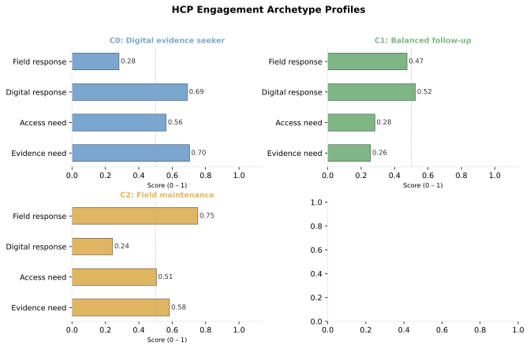
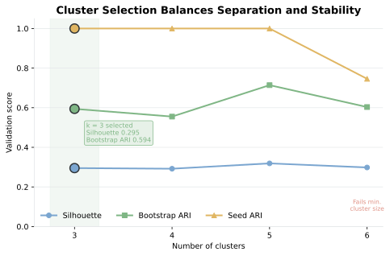
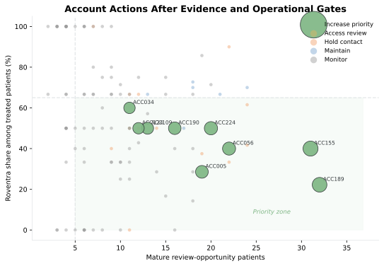
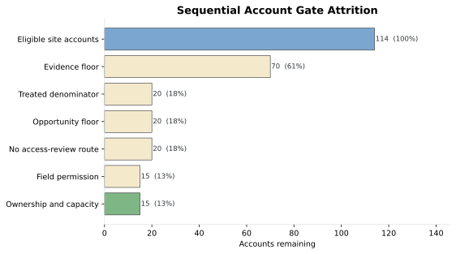
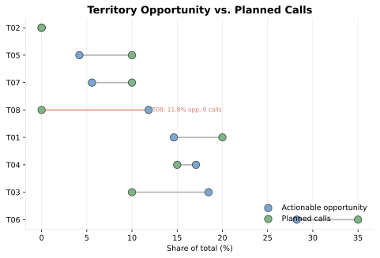

# Chapter 6 Walkthrough: HCP and Account Targeting

This executed notebook builds the Chapter 6 artifacts at the December 31, 2024 cutoff. Run `ch06_hcp/scripts/generate_ch06_data.py` before rebuilding the notebook.


```python
from pathlib import Path
import importlib
import sys

import pandas as pd
from IPython.display import display

ROOT = Path.cwd().resolve()
while not (ROOT / "ch06_hcp").exists():
    if ROOT.parent == ROOT:
        raise FileNotFoundError("Run this notebook inside the repository.")
    ROOT = ROOT.parent

SCRIPT_DIR = ROOT / "ch06_hcp" / "scripts"
sys.path.insert(0, str(SCRIPT_DIR))

analysis_module = importlib.import_module("run_analysis")
targeting = importlib.import_module("targeting")
referral = importlib.import_module("referral_network")
segmentation = importlib.import_module("segmentation")

results = analysis_module.run_analysis(ROOT)

headline = pd.Series({
    "Journey patients": results["attribution_comparison"].patient_id.nunique(),
    "Eligible-roster patients": results["patient_hcp"].patient_id.nunique(),
    "Eligible HCPs": results["hcp_features"].npi.nunique(),
    "Eligible accounts": results["account_targets"].account_id.nunique(),
})
print(headline.to_frame("count"))

```

                              count
    Journey patients           6393
    Eligible-roster patients   1556
    Eligible HCPs               158
    Eligible accounts           114


The eligible roster covers 1,556 patients and 158 HCPs across 114 site accounts. The remaining journey patients stay outside this field-planning artifact.


## 1. Attribution sensitivity


```python
agreement = results["attribution_summary"].copy()
agreement["agreement_rate"] = agreement["agreement_rate"].map(
    lambda value: f"{value:.1%}"
)
print(agreement)
print(
    results["attribution_comparison"].query(
        "patient_id == 'PAT02034'"
    )
)

```

               comparison  patients_with_both  same_hcp agreement_rate
    0  Index vs plurality                6393      4399          68.8%
    1     Index vs latest                6393      4088          63.9%
    2         All 3 rules                6393      4005          62.6%
        patient_id   index_npi plurality_npi  latest_npi  all_rules_agree
    635   PAT02034  9000000280    9000000280  9000000280             True


All 3 attribution rules agree for 63.4% of patients. PAT02034 remains assigned to HCP0280 under every rule.


## 2. HCP evidence and concentration


```python
columns = [
    "npi", "account_id", "cohort_patients", "treated_patients",
    "roventra_starts", "competitor_treated", "untreated_mature",
    "review_opportunity", "contact_permission_status",
]
print(
    results["hcp_features"].sort_values(
        ["cohort_patients", "npi"], ascending=[False, True]
    )[columns].head(10)
)
print(results["decile_summary"].head())

```

                npi account_id  cohort_patients  treated_patients  \
    93   9000000430     ACC189               36                 9   
    105  9000000469     ACC121               34                10   
    35   9000000162     ACC062               33                13   
    99   9000000447     ACC216               32                12   
    5    9000000026     ACC226               28                11   
    121  9000000537     ACC079               28                 6   
    49   9000000217     ACC224               27                 8   
    117  9000000516     ACC167               27                 9   
    102  9000000460     ACC219               26                10   
    86   9000000389     ACC155               24                 8   
    
         roventra_starts  competitor_treated  untreated_mature  \
    93                 2                   7                25   
    105                9                   1                21   
    35                 8                   5                19   
    99                 5                   7                17   
    5                  8                   3                15   
    121                2                   4                18   
    49                 4                   4                16   
    117                6                   3                18   
    102                7                   3                15   
    86                 4                   4                15   
    
         review_opportunity contact_permission_status  
    93                   32                   Allowed  
    105                  22                   Opt-out  
    35                   24                   Opt-out  
    99                   24                   Opt-out  
    5                    18                   Allowed  
    121                  22                   Opt-out  
    49                   20                   Allowed  
    117                  21                   Allowed  
    102                  18                   Allowed  
    86                   19                   Allowed  
       opportunity_decile  hcps  cohort_patients  review_opportunity  \
    0                   1    12              279                 216   
    1                   2    11              157                 123   
    2                   3    11              127                 100   
    3                   4    11              109                  84   
    4                   5    11               83                  68   
    
       cumulative_hcp_share  cumulative_opportunity_share  
    0              0.107143                      0.265683  
    1              0.205357                      0.416974  
    2              0.303571                      0.539975  
    3              0.401786                      0.643296  
    4              0.500000                      0.726937  


The highest-volume rows include opt-outs. The first 30% of HCPs capture 55.2% of review opportunity.


## 3. Referral pathways


```python
print(results["referral_edges"].head(10))
stable = results["referral_metrics"].merge(
    results["referral_stability"][[
        "npi", "bootstrap_top20_frequency", "window_rank_range",
    ]],
    on="npi",
)
print(stable.head(15))

```

       source_npi destination_npi source_specialty destination_specialty  \
    0  9000000578      9000000258     Primary Care         Endocrinology   
    1  9000000417      9000000164     Primary Care         Endocrinology   
    2  9000000460      9000000567     Primary Care         Endocrinology   
    3  9000000033      9000000302     Primary Care         Endocrinology   
    4  9000000265      9000000409     Primary Care         Endocrinology   
    5  9000000520      9000000127     Primary Care         Endocrinology   
    6  9000000020      9000000409     Primary Care         Endocrinology   
    7  9000000128      9000000567     Primary Care         Endocrinology   
    8  9000000470      9000000217     Primary Care         Endocrinology   
    9  9000000565      9000000217     Primary Care         Endocrinology   
    
      source_account_id destination_account_id   region  unique_patients  \
    0            ACC142                 ACC164  Midwest               22   
    1            ACC126                 ACC109     West               20   
    2            ACC219                 ACC030    South               20   
    3            ACC044                 ACC090    South               19   
    4            ACC148                 ACC164  Midwest               19   
    5            ACC110                 ACC073    South               19   
    6            ACC068                 ACC164  Midwest               18   
    7            ACC160                 ACC030    South               18   
    8            ACC068                 ACC224  Midwest               18   
    9            ACC099                 ACC224  Midwest               18   
    
       referral_episodes  median_transition_days first_referral_date  \
    0                 22                    25.0          2024-01-09   
    1                 20                    40.0          2024-01-22   
    2                 20                    24.5          2024-01-29   
    3                 19                    32.0          2024-02-02   
    4                 19                    27.0          2024-02-13   
    5                 19                    29.0          2024-01-16   
    6                 18                    37.0          2024-02-25   
    7                 18                    31.5          2024-02-24   
    8                 18                    29.0          2024-01-21   
    9                 18                    32.5          2024-02-19   
    
      last_referral_date  path_cost  
    0         2024-10-29   0.045455  
    1         2024-11-28   0.050000  
    2         2024-12-18   0.050000  
    3         2024-12-24   0.052632  
    4         2024-12-23   0.052632  
    5         2024-12-26   0.052632  
    6         2024-11-28   0.055556  
    7         2024-12-26   0.055556  
    8         2024-10-26   0.055556  
    9         2024-12-26   0.055556  
               npi      specialty account_id     region  unique_sources  \
    0   9000000217  Endocrinology     ACC224    Midwest               6   
    1   9000000567  Endocrinology     ACC030      South               5   
    2   9000000127  Endocrinology     ACC073      South               7   
    3   9000000170  Endocrinology     ACC132  Northeast               8   
    4   9000000204  Endocrinology     ACC153      South               6   
    5   9000000215  Endocrinology     ACC183      South               7   
    6   9000000207  Endocrinology     ACC094  Northeast               4   
    7   9000000258  Endocrinology     ACC164    Midwest               4   
    8   9000000550  Endocrinology     ACC179       West               5   
    9   9000000636  Endocrinology     ACC059  Northeast               7   
    10  9000000115  Endocrinology     ACC225      South               6   
    11  9000000409  Endocrinology     ACC164    Midwest               4   
    12  9000000218  Endocrinology     ACC204    Midwest               5   
    13  9000000363  Endocrinology     ACC022    Midwest               5   
    14  9000000174  Endocrinology     ACC032    Midwest               5   
    
        unique_destinations  patients_received  patients_referred  \
    0                     2                 72                 15   
    1                     2                 66                 14   
    2                     2                 57                 13   
    3                     2                 56                 13   
    4                     2                 55                  9   
    5                     1                 56                  8   
    6                     2                 46                 16   
    7                     2                 49                 12   
    8                     2                 50                  9   
    9                     1                 47                 11   
    10                    2                 44                 12   
    11                    1                 45                  6   
    12                    2                 38                 12   
    13                    2                 39                 11   
    14                    2                 34                 12   
    
        betweenness_centrality  pathway_patient_volume  pathway_breadth  \
    0                 0.000626                      87                8   
    1                 0.000521                      80                7   
    2                 0.000730                      70                9   
    3                 0.000834                      69               10   
    4                 0.000521                      64                8   
    5                 0.000313                      64                8   
    6                 0.000417                      62                6   
    7                 0.000417                      61                6   
    8                 0.000469                      59                7   
    9                 0.000313                      58                8   
    10                0.000573                      56                8   
    11                0.000209                      51                5   
    12                0.000417                      50                7   
    13                0.000521                      50                7   
    14                0.000469                      46                7   
    
        bootstrap_top20_frequency  window_rank_range  
    0                      1.0000                  1  
    1                      1.0000                  1  
    2                      1.0000                  2  
    3                      0.9875                  3  
    4                      1.0000                  2  
    5                      0.9875                  3  
    6                      1.0000                  1  
    7                      1.0000                  4  
    8                      1.0000                  3  
    9                      0.9875                  3  
    10                     0.9625                  7  
    11                     0.9750                  4  
    12                     0.9500                  3  
    13                     0.8750                  3  
    14                     0.8125                  6  


The referral output is a pathway-context artifact. Stability comes from transition-window comparison and patient-level bootstrap resampling.


## 4. Scientific role evidence


```python
candidates = results["kol_profiles"].loc[
    results["kol_profiles"]["kol_candidate"]
]
print(candidates[[
    "npi", "specialty_1", "research_percentile",
    "leadership_percentile", "practice_expertise_percentile",
    "peer_connection_percentile", "proposed_role",
    "role_fit_score", "evidence_confidence",
]].head(15))
print(results["kol_validation"])
print(results["kol_transparency_review"].head())

```

               npi    specialty_1  research_percentile  leadership_percentile  \
    0   9000000105     Cardiology           100.000000              80.000000   
    1   9000000206  Endocrinology           100.000000               8.333333   
    2   9000000211  Endocrinology           100.000000              36.363636   
    3   9000000237   Primary Care           100.000000              75.000000   
    4   9000000363  Endocrinology           100.000000             100.000000   
    5   9000000441   Primary Care           100.000000              84.615385   
    6   9000000512     Cardiology           100.000000              31.250000   
    7   9000000562     Cardiology           100.000000              40.000000   
    8   9000000633   Primary Care           100.000000              92.592593   
    9   9000000366  Endocrinology            96.153846               4.166667   
    10  9000000277     Cardiology            94.736842              25.000000   
    11  9000000258  Endocrinology            92.307692              41.666667   
    12  9000000446   Primary Care            90.322581              48.148148   
    13  9000000235     Cardiology            89.473684              70.000000   
    14  9000000008     Cardiology            88.888889              25.000000   
    
        practice_expertise_percentile  peer_connection_percentile  \
    0                       25.000000                   55.000000   
    1                       34.782609                   15.384615   
    2                       80.000000                   70.833333   
    3                       77.777778                   91.666667   
    4                      100.000000                   66.666667   
    5                       77.777778                   26.190476   
    6                       94.444444                   92.500000   
    7                       89.473684                   75.000000   
    8                        4.545455                   59.375000   
    9                       39.130435                   15.384615   
    10                      63.157895                   40.909091   
    11                      30.434783                   96.153846   
    12                      63.636364                   28.125000   
    13                      15.789474                   40.909091   
    14                      61.111111                   65.000000   
    
                           proposed_role  role_fit_score evidence_confidence  
    0         National scientific leader            89.0                High  
    1   Evidence-generation collaborator            77.2                High  
    2   Evidence-generation collaborator            93.0                High  
    3   Evidence-generation collaborator            92.2                High  
    4   Evidence-generation collaborator           100.0                High  
    5   Evidence-generation collaborator            92.2                High  
    6   Evidence-generation collaborator            98.1                High  
    7   Evidence-generation collaborator            96.3                High  
    8         National scientific leader            95.9                High  
    9   Evidence-generation collaborator            76.2                High  
    10  Evidence-generation collaborator            83.7                High  
    11  Evidence-generation collaborator            70.7                High  
    12  Evidence-generation collaborator            81.0                High  
    13        National scientific leader            78.8                High  
    14  Evidence-generation collaborator            79.2                High  
               validation_measure      value
    0              KOL candidates  83.000000
    1         Reviewed candidates  79.000000
    2    Proposed role match rate   0.582278
    3  Reviewer confirmation rate   0.639241
    4     Reviewer decision kappa   0.426150
              npi                     proposed_role  \
    0  9000000105        National scientific leader   
    1  9000000206  Evidence-generation collaborator   
    2  9000000211  Evidence-generation collaborator   
    3  9000000237  Evidence-generation collaborator   
    4  9000000363  Evidence-generation collaborator   
    
                       review_status_x  total_payment_amount  payment_records  \
    0  Medical-affairs review required              85575.71                7   
    1  Medical-affairs review required                  0.00                0   
    2  Medical-affairs review required                  0.00                0   
    3  Medical-affairs review required                  0.00                0   
    4  Medical-affairs review required                  0.00                0   
    
                                      payment_categories  latest_payment_year  \
    0  Education/Training | Research Grants | Speakin...               2024.0   
    1                                                NaN                  NaN   
    2                                                NaN                  NaN   
    3                                                NaN                  NaN   
    4                                                NaN                  NaN   
    
                review_status_y                                   transparency_use  
    0  Transparency review only  Disclosure context only; excluded from scienti...  
    1                       NaN  Disclosure context only; excluded from scienti...  
    2                       NaN  Disclosure context only; excluded from scienti...  
    3                       NaN  Disclosure context only; excluded from scienti...  
    4                       NaN  Disclosure context only; excluded from scienti...  


Scientific role fit and payment transparency remain separate. Medical affairs owns the role review.


## 5. K-means engagement archetypes


```python
print(results["cluster_evaluation"])
print(results["segment_profiles"])
print(results["segment_policy_comparison"])

```

       k    inertia  silhouette  minimum_cluster_size  minimum_cluster_share  \
    0  3  55.664499    0.295087                    15               0.267857   
    1  4  43.864938    0.291884                    10               0.178571   
    2  5  34.477920    0.318859                     7               0.125000   
    3  6  29.600367    0.298179                     7               0.125000   
    
       seed_stability_ari  bootstrap_stability_ari  selection_score  \
    0            1.000000                 0.594227         0.793644   
    1            1.000000                 0.555224         0.780690   
    2            1.000000                 0.713949         0.830679   
    3            0.746004                 0.603407         0.718865   
    
       operational_size_pass  selected  
    0                   True      True  
    1                   True     False  
    2                  False     False  
    3                  False     False  
       cluster_id  hcp_count  cohort_patients  opportunity_rate  roventra_share  \
    0           0         20        12.100000          0.750796        0.425179   
    1           1         15        15.666667          0.757289        0.521323   
    2           2         21        12.619048          0.717230        0.577829   
    
       access_signal_rate  recent_contacts  productive_contact_rate  \
    0            0.004545         1.550000                 0.330476   
    1            0.001852         1.200000                 0.518413   
    2            0.002381         1.095238                 0.434807   
    
       evidence_need_score  access_resource_score  digital_response_rate  \
    0             0.703900               0.563500               0.690550   
    1             0.256400               0.282000               0.524600   
    2             0.583905               0.505333               0.243238   
    
       field_response_rate                 segment_name  \
    0             0.281500  C0: Digital evidence seeker   
    1             0.474467       C1: Balanced follow-up   
    2             0.753571        C2: Field maintenance   
    
                                 engagement_pattern  
    0  Approved digital evidence, then field review  
    1                      Standard evidence review  
    2                   Maintenance field follow-up  
                      segment_name  Access-resource need  Balanced follow-up  \
    0  C0: Digital evidence seeker                     5                   5   
    1       C1: Balanced follow-up                     0                  12   
    2        C2: Field maintenance                     1                   8   
    
       Digital evidence seeker  Established adopter  Field evidence builder  
    0                        9                    1                       0  
    1                        0                    3                       0  
    2                        0                    5                       7  


The selected 4-cluster solution has silhouette 0.427, seed ARI 1.000, bootstrap ARI 0.858, and minimum cluster size 10.








## 6. Account policy and call plan


```python
print(results["gate_summary"])
print(
    results["account_targets"].set_index("account_id").loc[
        ["ACC155", "ACC002", "ACC121", "ACC231"],
        ["account_action", "reason_code", "cohort_patients",
         "treated_patients", "review_opportunity", "roventra_share"],
    ]
)
print(results["call_plan"])

```

                        stage  accounts
    0  Eligible site accounts       114
    1          Evidence floor        70
    2     Treated denominator        20
    3       Opportunity floor        20
    4  No access-review route        20
    5        Field permission        15
    6  Ownership and capacity        15
                   account_action                        reason_code  \
    account_id                                                         
    ACC155      Increase priority      PRIORITIZE_REVIEW_OPPORTUNITY   
    ACC002          Access review                ROUTE_ACCESS_REVIEW   
    ACC121           Hold contact                 HOLD_NO_PERMISSION   
    ACC231                Monitor  MONITOR_SMALL_TREATED_DENOMINATOR   
    
                cohort_patients  treated_patients  review_opportunity  \
    account_id                                                          
    ACC155                   38                15                  31   
    ACC002                   14                 6                  11   
    ACC121                   34                10                  22   
    ACC231                   25                 7                  19   
    
                roventra_share  
    account_id                  
    ACC155            0.400000  
    ACC002            0.500000  
    ACC121            0.900000  
    ACC231            0.857143  
       cycle_start   cycle_end territory account_id parent_account_id  \
    0   2025-01-01  2025-01-28       T01     ACC224        SYS-MID-09   
    1   2025-01-01  2025-01-28       T01     ACC056        SYS-NOR-09   
    2   2025-01-01  2025-01-28       T03     ACC034        SYS-SOU-11   
    3   2025-01-01  2025-01-28       T04     ACC155        SYS-WES-12   
    4   2025-01-01  2025-01-28       T04     ACC219        SYS-SOU-04   
    5   2025-01-01  2025-01-28       T05     ACC124        SYS-NOR-05   
    6   2025-01-01  2025-01-28       T06     ACC189        SYS-MID-10   
    7   2025-01-01  2025-01-28       T06     ACC109        SYS-WES-02   
    8   2025-01-01  2025-01-28       T06     ACC005        SYS-SOU-06   
    9   2025-01-01  2025-01-28       T06     ACC005        SYS-SOU-06   
    10  2025-01-01  2025-01-28       T07     ACC190        SYS-WES-11   
    
                 account_name         npi      specialty     account_action  \
    0       Michigan Care 224  9000000217  Endocrinology  Increase priority   
    1   Pennsylvania Care 056  9000000136   Primary Care  Increase priority   
    2        Florida Care 034  9000000273   Primary Care  Increase priority   
    3        Arizona Care 155  9000000389     Cardiology  Increase priority   
    4        Florida Care 219  9000000460   Primary Care           Maintain   
    5       New York Care 124  9000000035   Primary Care  Increase priority   
    6       Michigan Care 189  9000000430     Cardiology  Increase priority   
    7        Arizona Care 109  9000000164  Endocrinology  Increase priority   
    8        Florida Care 005  9000000498     Cardiology  Increase priority   
    9        Florida Care 005  9000000051     Cardiology  Increase priority   
    10    Washington Care 190  9000000366  Endocrinology  Increase priority   
    
        hcp_action                            engagement_pattern  \
    0   Prioritize                   Maintenance field follow-up   
    1   Prioritize                   Maintenance field follow-up   
    2   Prioritize                                  Field review   
    3   Prioritize                      Standard evidence review   
    4     Maintain  Approved digital evidence, then field review   
    5   Prioritize                      Standard evidence review   
    6   Prioritize                      Standard evidence review   
    7   Prioritize                   Maintenance field follow-up   
    8   Prioritize                   Maintenance field follow-up   
    9   Prioritize  Approved digital evidence, then field review   
    10  Prioritize                                  Field review   
    
                       segment_name  recommended_calls  hcp_review_opportunity  \
    0         C2: Field maintenance                  2                      20   
    1         C2: Field maintenance                  2                      11   
    2                 Not clustered                  2                       6   
    3        C1: Balanced follow-up                  2                      19   
    4   C0: Digital evidence seeker                  1                      18   
    5        C1: Balanced follow-up                  2                       6   
    6        C1: Balanced follow-up                  2                      32   
    7         C2: Field maintenance                  2                      13   
    8         C2: Field maintenance                  2                       7   
    9   C0: Digital evidence seeker                  1                       6   
    10                Not clustered                  2                       5   
    
        recent_contacts permission_status                    reason_code  \
    0                 1           Allowed  PRIORITIZE_REVIEW_OPPORTUNITY   
    1                 1           Allowed  PRIORITIZE_REVIEW_OPPORTUNITY   
    2                 0           Allowed  PRIORITIZE_REVIEW_OPPORTUNITY   
    3                 1           Allowed  PRIORITIZE_REVIEW_OPPORTUNITY   
    4                 0           Allowed           MAINTAIN_ESTABLISHED   
    5                 1           Allowed  PRIORITIZE_REVIEW_OPPORTUNITY   
    6                 0           Allowed  PRIORITIZE_REVIEW_OPPORTUNITY   
    7                 0           Allowed  PRIORITIZE_REVIEW_OPPORTUNITY   
    8                 1           Allowed  PRIORITIZE_REVIEW_OPPORTUNITY   
    9                 0           Allowed  PRIORITIZE_REVIEW_OPPORTUNITY   
    10                1           Allowed  PRIORITIZE_REVIEW_OPPORTUNITY   
    
                                                   reason  \
    0   Permitted review opportunity and adoption belo...   
    1   Permitted review opportunity and adoption belo...   
    2   Permitted review opportunity and adoption belo...   
    3   Permitted review opportunity and adoption belo...   
    4   Permitted evidence with adoption at or above t...   
    5   Permitted review opportunity and adoption belo...   
    6   Permitted review opportunity and adoption belo...   
    7   Permitted review opportunity and adoption belo...   
    8   Permitted review opportunity and adoption belo...   
    9   Permitted review opportunity and adoption belo...   
    10  Permitted review opportunity and adoption belo...   
    
        territory_cycle_capacity  
    0                         48  
    1                         48  
    2                         56  
    3                         48  
    4                         48  
    5                         52  
    6                         56  
    7                         56  
    8                         56  
    9                         56  
    10                        48  


The policy produces 9 priority accounts and a 19-call plan across 10 permitted HCPs. The output retains non-executable monitor, access-review, and hold queues.








## 7. Territory and policy review


```python
print(results["plan_comparison"])
print(results["territory_summary"])
print(
    results["policy_sensitivity"].query(
        "minimum_account_patients == 10"
    )
)

```

                           plan  selected_hcps  contact_permitted  \
    0  Top 30 by patient volume             30                 30   
    1   Gated 4-week field plan             11                 11   
    
       held_or_unknown  review_opportunity  recent_contacts  
    0                0                 397               43  
    1                0                 143                6  
      territory  accounts  priority_accounts  review_opportunity  \
    0       T06        17                  3                 184   
    1       T03        10                  1                 120   
    2       T04         9                  1                  88   
    3       T01        16                  2                 178   
    4       T08        18                  0                 196   
    5       T07        12                  1                 133   
    6       T05        16                  1                 148   
    7       T02        16                  0                 137   
    
       actionable_opportunity  planned_hcps  recommended_calls  available_calls  \
    0                      81             4                  7               56   
    1                      53             1                  2               56   
    2                      49             2                  3               48   
    3                      42             2                  4               48   
    4                      34             0                  0               52   
    5                      16             1                  2               48   
    6                      12             1                  2               52   
    7                       0             0                  0               52   
    
       cycle_capacity  unused_capacity  opportunity_share  call_share  \
    0              56               49           0.282230        0.35   
    1              56               54           0.184669        0.10   
    2              48               45           0.170732        0.15   
    3              48               44           0.146341        0.20   
    4              52               52           0.118467        0.00   
    5              48               46           0.055749        0.10   
    6              52               50           0.041812        0.10   
    7              52               52           0.000000        0.00   
    
       allocation_gap  
    0        0.067770  
    1       -0.084669  
    2       -0.020732  
    3        0.053659  
    4       -0.118467  
    5        0.044251  
    6        0.058188  
    7        0.000000  
        minimum_account_patients  minimum_opportunity_patients  \
    9                         10                             4   
    10                        10                             4   
    11                        10                             4   
    12                        10                             8   
    13                        10                             8   
    14                        10                             8   
    15                        10                            12   
    16                        10                            12   
    17                        10                            12   
    
        adoption_threshold  priority_accounts  changed_from_default  
    9                 0.45                  4                     5  
    10                0.60                  8                     1  
    11                0.75                 12                     3  
    12                0.45                  4                     6  
    13                0.60                  8                     2  
    14                0.75                 12                     4  
    15                0.45                  4                    10  
    16                0.60                  8                     6  
    17                0.75                 11                     9  


T03 has actionable opportunity and no executable calls. The gap belongs in field-leadership review and the override record.





## 8. Export the evidence package


```python
output_dir = ROOT / "ch06_hcp" / "assets" / "generated_outputs"
analysis_module.write_outputs(results, output_dir, ROOT)
print(f"Wrote {len(results)} CSV artifacts and manifest.json")

```

    Wrote 32 CSV artifacts and manifest.json


The package carries analysis date, source hashes, rule version, decision boundaries, and output contracts.

