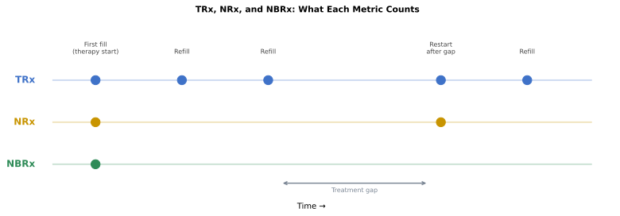
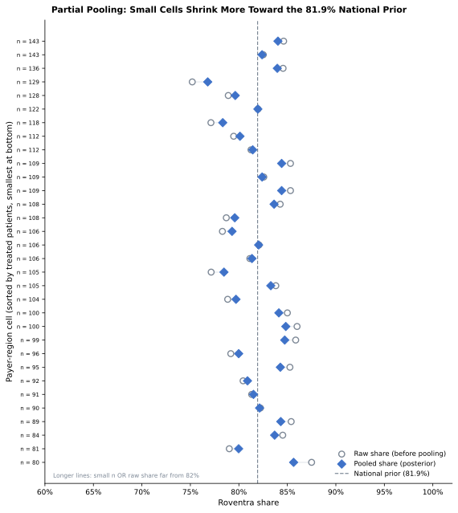
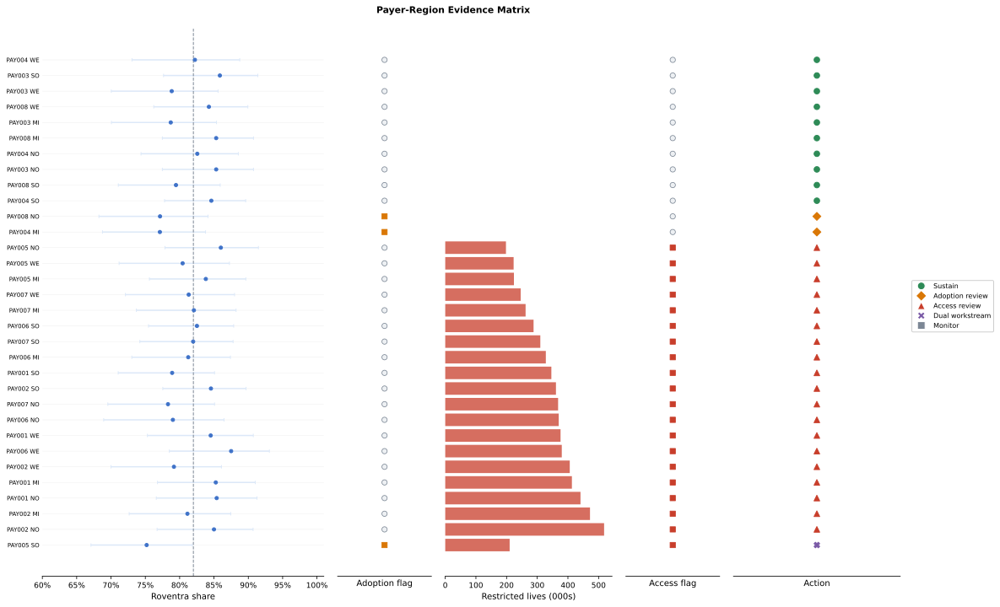
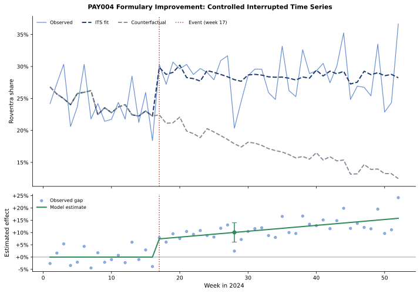
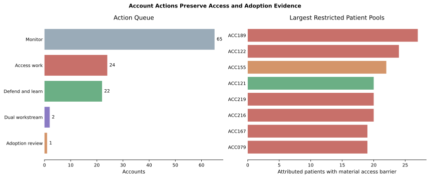
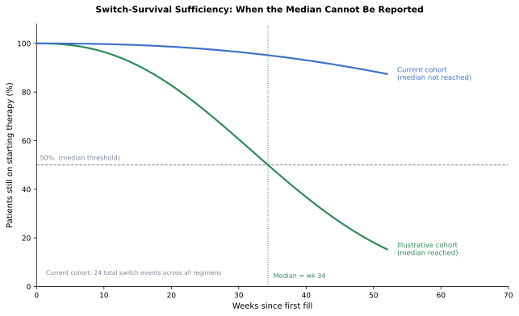

# Chapter 7: Competitive Intelligence and Market Access

Roventra uptake is uneven across the country. In some payer-region cells it converts new patients well; in others it barely moves. The brand team needs to know why. When patients cannot get the drug, market access has to renegotiate coverage and utilization-management terms with the plan. When coverage is workable and prescribers still pick a competitor first, field analytics has to investigate adoption. Both problems look the same from the top: low Roventra share. Observed share alone cannot separate an access barrier from an adoption gap.

The evidence that separates them comes from assembling an effective-dated access landscape, counting new starts with the prescription-volume measures, turning raw pharmacy transactions into clean prescription attempts, estimating corrected competitive share with its uncertainty, measuring a real formulary change against a control, and routing every payer-region and account result to the team.

The analysis reuses the synthetic data source and the derived journey and HCP-account outputs, and adds two new tables: a plan-region enrollment count and a weekly formulary-event panel, including the planted PAY004 effect. Open [`chapter7_walkthrough.ipynb`](chapter7_walkthrough.ipynb), or run through the shared analysis entry point.

## 7.1 Teaching Datasets

Run the blocks in order from the repository root. Generate the supplemental data first:

```bash
uv run python ch07_competitive/generation_modules/generate_ch07_data.py
```

```text
Chapter 7 supplemental data
  plan_region_enrollment: 32 rows
  formulary_event_panel: 208 rows
Wrote Chapter 7-only data to ch07_competitive/data/generated
```

The block below loads every input.

**Listing 7.1**: Load the shared analysis results

```python
from pathlib import Path
import sys

import pandas as pd

ROOT = Path.cwd().resolve()
sys.path.insert(0, str(ROOT))

from ch07_competitive.scripts.run_analysis import run_analysis

results = run_analysis(ROOT)
headline = results["headline"].iloc[0]
print(f"New-to-therapy patients: {int(headline.new_to_therapy_patients):,}")
print(f"Roventra new starts: {int(headline.roventra_new_starts):,}")
print(
    f"Materially restricted lives: {int(headline.restricted_lives):,} "
    f"of {int(headline.total_lives):,} "
    f"({headline.restricted_lives / headline.total_lives:.1%})"
)
print(f"Payer-region access flags: {int(headline.payer_region_access_flags)} of 32")
print(f"Payer-region adoption flags: {int(headline.payer_region_adoption_flags)} of 32")
```

```text
New-to-therapy patients: 3,415
Roventra new starts: 2,798
Materially restricted lives: 6,740,000 of 10,926,000 (61.7%)
Payer-region access flags: 20 of 32
Payer-region adoption flags: 3 of 32
```

The 3,415 new-to-therapy patients and 2,798 Roventra starts come from the patient-journey washout analysis. The access and adoption flags are newly produced here.

> **Note:** All products, patients, payers, accounts, and events here are fictional and synthetic. One formulary event for PAY004 carries a planted effect with a known answer for verifying the measurement code.


## 7.2 Effective-Dated Access

A plan can cover Roventra in January, add step therapy in July, and drop it in October. Three measures capture that moving picture: plan-region record coverage (each plan weighted equally), covered lives (each record weighted by enrolled patients), and the access-quality score (each plan weighted by ease of access). The access-quality weights come from the market-sizing analysis: Covered 0.90, Covered with step edit 0.75, Covered with prior authorization 0.65, Non-covered 0.10.

**Listing 7.2**: Plan coverage, covered lives, and access quality

```python
summary = results["covered_lives_summary"].query("payer_type == 'All'").iloc[0]
print(f"Plan-region records:          {int(summary.plans)}")
print(f"Records covering Roventra:    {int(summary.covered_plans)} ({summary.plan_coverage_rate:.1%})")
print(f"Enrolled lives:               {int(summary.total_lives):,}")
print(f"Lives with workable coverage: {int(summary.covered_lives):,} ({summary.covered_lives_rate:.1%})")
print(f"Lives with no restriction:    {int(summary.unrestricted_lives):,} ({summary.unrestricted_lives_rate:.1%})")
print(f"Access-quality score:         {summary.access_quality_score:.3f}")
```

```text
Plan-region records:          32
Records covering Roventra:    24 (75.0%)
Enrolled lives:               10,926,000
Lives with workable coverage: 8,314,000 (76.1%)
Lives with no restriction:    0 (0.0%)
Access-quality score:         0.533
```

24 of 32 (75%) plan-region records cover Roventra, and they hold 8,314,000 of the 10,926,000 (76.1%) lives. The coverage looks healthy, but every covered cell still carries prior authorization, step therapy, specialty-pharmacy routing, or a quantity limit: zero lives have no restriction at all. The access-quality score of 0.533 captures that mix.

The distribution by access state shows where those lives sit.

**Listing 7.3**: Lives by access state

```python
restriction_lives = results["restriction_lives"].copy()
restriction_lives["lives_share"] = (
    restriction_lives.lives_share.map(lambda v: f"{v:.1%}")
)
print(restriction_lives.to_string(index=False))
```

```text
       access_state  payer_region_cells  enrolled_lives lives_share
Prior authorization                  12         4186000       38.3%
          Step edit                  12         4128000       37.8%
        Non-covered                   8         2612000       23.9%
```

A plan that puts Roventra behind step therapy still wins if it puts every competitor behind non-coverage. The relative-position view compares Roventra's access state in each cell with the strongest competitor in the same cell.

**Listing 7.4**: Relative formulary position against the strongest competitor

```python
relative = results["relative_position"]
print(relative.position.value_counts().to_string())
```

```text
position
Competitor favored    20
Parity                 8
Brand favored          4
```

A competitor holds the better formulary position in 20 of 32 cells: Roventra's access disadvantage, and contracting's negotiation queue.

## 7.3 Prescription Counts: NBRx, NRx, and TRx

Competitive share has to be built on new prescription starts. TRx (total prescriptions) counts every Roventra fill, including refills. NRx (new prescriptions) counts each new prescription written, including both patients who are brand-new to the drug and patients restarting after a gap; one patient can generate multiple NRxs over time. NBRx (new-to-brand prescriptions) is the strictest count: each patient has exactly one NBRx for a given drug, the first prescription they ever fill for it. A patient who stopped Roventra and restarted generates a new NRx but not a new NBRx. NBRx captures only patients genuinely new to Roventra (therapy-naive starters and competitor switchers alike), making it the right base for competitive share. The washout filter in the patient-journey analysis produces the NBRx count by removing any patient with a prior Roventra claim.



*Figure 7.1. TRx grows with every refill. A restart after a treatment gap adds one NRx but no NBRx. NBRx is capped at one per patient per drug. Synthetic data.*

**Listing 7.5**: TRx, NRx, and NBRx by brand

```python
import pandas as pd

attempts = results["prescription_attempts"]
completed = attempts.query("final_outcome == 'Completed'")
therapy_brands = ["Roventra", "Vexpro", "Nexoral"]
therapy = completed.query("product_name in @therapy_brands")
nbrx_reg = results["corrected_line1"].groupby("first_regimen").patient_id.nunique()
sob = results["source_of_business"]
all_nbrx = int(sob.loc[sob.source_of_business == "New to therapy", "patients"].iloc[0])
combo_nbrx = int(nbrx_reg.get("Nexoral + Vexpro", 0))

def fmt_brand(prod):
    sub = completed.query(f"product_name == '{prod}'")
    trx = len(sub)
    nrx = len(sub.query("fill_number == 0"))
    nbrx = int(nbrx_reg.get(prod, 0))
    return [f"{trx:,}", f"{nrx:,}", f"{nbrx:,}", f"{nbrx / all_nbrx:.1%}"]

tbl = pd.DataFrame(
    {
        "All brands":     [f"{len(therapy):,}", f"{len(therapy.query('fill_number == 0')):,}", f"{all_nbrx:,}", "100%"],
        "Roventra":       fmt_brand("Roventra"),
        "Vexpro":         fmt_brand("Vexpro"),
        "Nexoral":        fmt_brand("Nexoral"),
        "Nexoral+Vexpro": ["", "", f"{combo_nbrx:,}", f"{combo_nbrx / all_nbrx:.1%}"],
    },
    index=["TRx", "NRx", "NBRx", "Share"],
)
print(tbl.to_string())
```

```text
       All brands Roventra Vexpro Nexoral Nexoral+Vexpro
TRx        30,552   16,636  6,884   7,032               
NRx        13,867    6,401  3,684   3,782               
NBRx        3,415    2,798    309     303              5
Share        100%    81.9%   9.0%    8.9%           0.1%
```

"All brands" covers the three therapy-class products. TRx and NRx are script counts; NBRx is the washout-corrected new-patient count per drug. Five patients started on Nexoral and Vexpro together. The Share row reads from NBRx: Roventra holds 81.9% of new-to-therapy first regimens.

## 7.4 Access and Adoption

Low Roventra share in a payer-region cell can have two causes. A coverage barrier prevents the drug from reaching the patient: a plan that requires step therapy before Roventra, or refuses to cover it altogether, produces low share even when every prescriber writes it first. Contracting must fix that. Or coverage is workable and prescribers still choose a competitor: field analytics investigates that. Raw share alone cannot separate the two, so the analysis assigns independent access and adoption flags to each cell.

Even when the separation is clear, payer-region cells are small. A cell with 9 treated patients can show 78% share one quarter and 89% the next from chance alone. A raw share of 77.8% (7 Roventra starts out of 9 treated patients) sits below the 82% national benchmark, and a naive rule flags it as an adoption gap. Nine patients carry almost no information: the same true share produces 7 of 9 nearly as often as 8 of 9. A cell with 88 Roventra starts out of 118 treated patients carries real information; the small cell does not.

### 7.4.1 Partial pooling

Before observing a single patient in a cell, we need a starting belief about Roventra's true share there. That starting belief is the **prior**. It comes from the corrected national picture: 81.9% of new-to-therapy patients across all 32 cells started on Roventra. We encode that belief as if we had already observed 40 patients in that cell, 32.8 of whom chose Roventra. The number 40 is the **prior strength**: it sets how much national evidence we carry into each local cell before any local data arrives.

When a cell's data arrives, the prior and the local observations combine. A cell with 7 Roventra starts out of 9 treated patients updates the prior by addition: (32.8 + 7) Roventra starts out of (40 + 9) total. The posterior share is 39.8 / 49 = 81.2%. The 7 local patients barely move the estimate because 40 pseudo-patients of national evidence dominate. A larger cell with 88 starts out of 118 patients gives (32.8 + 88) / (40 + 118) = 76.4%: here 118 real patients outweigh the 40-patient prior, and the estimate lands close to the raw 74.6%.

This is **partial pooling**: each cell borrows strength from the national average, and the amount borrowed shrinks as local evidence grows. The underlying model is the **beta-binomial**: a Beta distribution describes our uncertainty about the true share in a cell, and a Binomial distribution counts how many Roventra starts that true share would produce. The technique appears in pharmaceutical commercial analytics under several names: empirical Bayes shrinkage, hierarchical Bayes, or multilevel regression. The key property matches the problem: small cells shrink toward the national rate while large cells stay near their own data.

> **Note:** The theoretical foundation appears in Efron and Morris (1977), "Stein's Paradox in Statistics," *Scientific American*, 236(5):119–127, and in Gelman et al. (2013), *Bayesian Data Analysis*, 3rd ed., Chapter 5. The `scipy.stats.beta` functions used below implement the same posterior exactly.

The posterior share $\hat{p}$ for a cell with $s$ Roventra starts and $n$ total treated patients is:

$$
\hat{p} = \frac{s + \alpha_0}{n + \alpha_0 + \beta_0},
\qquad
\alpha_0 = 0.819 \times 40 = 32.8,
\qquad
\beta_0 = (1 - 0.819) \times 40 = 7.2
$$

$\alpha_0$ and $\beta_0$ are the prior Roventra and competitor pseudo-counts. When $n$ is small, the prior terms dominate and $\hat{p}$ stays near 81.9%. When $n$ is large, the prior terms shrink in relative weight and $\hat{p}$ approaches $s/n$.



*Figure 7.2. Each point is one payer-region cell. Small cells (light color) are pulled far toward the 81.9% national prior. Large cells (dark color) stay near the diagonal because local evidence outweighs the prior. Synthetic data.*

**Listing 7.6**: Shrink two cells toward the national prior

```python
from scipy.stats import beta

prior_mean = 0.8193           # national corrected Roventra share
prior_strength = 40           # pseudo-patients of prior weight
alpha0 = prior_mean * prior_strength
beta0 = (1 - prior_mean) * prior_strength
benchmark = 0.82

for name, brand_starts, competitor_starts in [
    ("Small cell", 7, 2),
    ("Large cell", 88, 30),
]:
    treated = brand_starts + competitor_starts
    raw = brand_starts / treated
    pooled = (brand_starts + alpha0) / (treated + alpha0 + beta0)
    prob_below = beta.cdf(benchmark, brand_starts + alpha0, competitor_starts + beta0)
    print(
        f"{name}: raw {raw:.1%}, pooled {pooled:.1%}, "
        f"P(true share < 82%) {prob_below:.1%}"
    )
```

```text
Small cell: raw 77.8%, pooled 81.2%, P(true share < 82%) 52.9%
Large cell: raw 74.6%, pooled 76.4%, P(true share < 82%) 95.7%
```

The small cell's 77.8% pools back to 81.2%, and the probability of trailing the benchmark is 52.9% (close to a coin flip). The large cell barely moves from 74.6% to 76.4%, with a 95.7% probability of genuinely trailing the benchmark. The adoption flag uses that posterior probability: a cell is flagged only with at least 30 treated patients and at least 80% posterior probability of trailing the benchmark.

### 7.4.2 Payer-Region Routing Flags

Each cell carries an access flag from its policy state and friction, and an adoption flag from the pooled posterior. The two flags are independent: a cell can earn both at once. The conditions:

- **Access flag** True: cell has a material barrier (non-covered or step-edit) AND at least 25% of enrolled lives sit behind that barrier, OR the unresolved attempt rate exceeds 15%.
- **Adoption flag** True: at least 30 treated patients observed AND posterior probability of trailing the 82% benchmark exceeds 80%.
- **Evidence sparse**: fewer than 30 treated patients; routes to Monitor regardless of the other flags.

Those conditions combine into four routing actions:

| Access flag | Adoption flag | Action |
| --- | --- | --- |
| No | No | Defend and learn |
| No | Yes | Adoption review |
| Yes | No | Access work |
| Yes | Yes | Dual workstream |
| Sparse evidence | Any | Monitor |

Three cells illustrate how the same share produces different actions.

**Listing 7.7**: Three payer-region decisions side by side

```python
decisions = results["payer_region_decisions"]
sel = decisions.set_index(["payer_id", "region"]).loc[
    [("PAY002", "Northeast"), ("PAY004", "Midwest"), ("PAY005", "South")]
]
view = pd.DataFrame(
    {
        "access_state": sel.access_state,
        "treated_patients": sel.treated_patients.astype(int),
        "brand_share": sel.brand_share.map(lambda v: f"{v:.1%}"),
        "share_95ci": sel.apply(
            lambda x: f"{x.share_lower_95:.0%}-{x.share_upper_95:.0%}", axis=1
        ),
        "prob_below_82": sel.probability_below_benchmark.map(lambda v: f"{v:.0%}"),
        "access_flag": sel.access_flag,
        "adoption_flag": sel.adoption_flag,
        "action": sel.action,
    }
)
view.index = [f"{p} {r}" for p, r in view.index]
print(view.T.to_string())
```

```text
                 PAY002 Northeast       PAY004 Midwest     PAY005 South
access_state          Non-covered  Prior authorization      Non-covered
treated_patients              100                  118              129
brand_share                 85.0%                77.1%            75.2%
share_95ci                77%-91%              69%-84%          67%-82%
prob_below_82                 24%                  87%              95%
access_flag                  True                False             True
adoption_flag               False                 True             True
action                Access work      Adoption review  Dual workstream
```

PAY002 Northeast has access_flag True (non-covered, all enrolled lives restricted) and adoption_flag False: its 24% posterior probability does not reach the 80% threshold. Access work. PAY004 Midwest has access_flag False and adoption_flag True: prior-authorization access is workable, but 87% posterior probability with 118 treated patients meets both adoption flag conditions. Adoption review. PAY005 South has both flags True: a non-covered barrier and 95% posterior probability with 129 treated patients. Dual workstream. Three cells with similar shares reach three different actions because access and adoption route independently.



*Figure 7.3. Similar Roventra shares sit beside different access states, and the action column preserves the difference. Wide share intervals mark the small cells the partial-pooling rule holds back. Synthetic data.*

The 32 cells distribute across five actions.

```python
print(decisions.action.value_counts().to_string())
```

```text
action
Access work         19
Defend and learn    10
Adoption review      2
Dual workstream      1
```

Every row carries the analysis date, reason code, decision-rule version, and refresh date.

## 7.5 Formulary Event Attribution

At week 17 of 2024, PAY004 moved Roventra from a restricted tier to preferred formulary coverage. PAY004's prior-authorization status was already flagged for access work in Section 7.4, so a successful formulary improvement would resolve that flag and redirect the contracting effort toward payers still blocking coverage. The central question is attribution: did Roventra's share in PAY004 actually rise because of this formulary change, or would share have moved in the same direction anyway, driven by factors affecting every payer in the market at the same time?

Attribution matters commercially. If the class was already growing during weeks 17 to 52 and PAY004 just rose with it, the contracting team deserves no credit for the gain, and the same budget directed at a different payer might have delivered more. If the class trend was flat or declining and PAY004 still gained, the formulary event was the cause and a repeated playbook at similar payers is warranted. A raw before-and-after average cannot separate these scenarios: it takes the full observed change in PAY004 and calls it the effect, without asking what PAY004 would have looked like had the formulary event never happened.

The controlled interrupted time series (ITS) and the synthetic control both estimate that missing counterfactual. An ITS model fits PAY004's share as a function of time, with explicit terms for the level and slope change at the event week. The three donor payers that did not receive the formulary change track what was happening to the market during the same period; adding their mean as a covariate subtracts that common movement before measuring PAY004's specific response.

### 7.5.1 Controlled interrupted time series

An interrupted time series (ITS) model separates a formulary-event effect from the background market trend. It represents PAY004's weekly share as a pre-event baseline level and slope, an immediate jump at the event, and a continued slope change after it. The key addition is the control term: the mean Roventra share across three donor payers (PAY003, PAY006, PAY008) that did not receive the formulary change. Donor payers are payers in the same market that share the same class trend and seasonality as PAY004, but were not involved in the formulary event. Adding their mean as a covariate absorbs whatever is driving all payers together. The jump and slope-change terms then measure only what changed for PAY004.

$$
\text{share}_t =
\beta_0 +
\beta_1(t - t_0) +
\beta_2\,\mathbf{1}(t \ge t_0) +
\beta_3\max(0,\, t - t_0) +
\beta_4\,\bar{s}_t +
\varepsilon_t
$$

| Symbol | Definition |
| --- | --- |
| $t$ | Week number |
| $t_0$ | Event week (PAY004 formulary improvement, $t_0 = 17$) |
| $\mathbf{1}(t \ge t_0)$ | Indicator: 1 from week $t_0$ onward, 0 before |
| $\bar{s}_t$ | Mean Roventra share of the three donor payers in week $t$ |
| $\varepsilon_t$ | Residual (Newey-West standard errors, 4-week lag) |
| $\beta_0$ | Baseline share at the event week |
| $\beta_1$ | Pre-event weekly slope |
| $\beta_2$ | Immediate level jump at the event |
| $\beta_3$ | Added weekly growth rate after the event |
| $\beta_4$ | Coefficient on the donor market trend |

**Listing 7.8**: Report the controlled event effect

```python
event = results["formulary_event_effect"].iloc[0]
print(f"Immediate level effect: {event.immediate_effect:+.1%}")
print(f"Slope change per week: {event.slope_change_per_week:+.2%}")
print(
    f"Week {int(event.effect_week)} effect: {event.effect_at_week:+.1%} "
    f"(95% CI {event.effect_at_week_lower_95:+.1%} "
    f"to {event.effect_at_week_upper_95:+.1%})"
)
```

```text
Immediate level effect: +7.4%
Slope change per week: +0.24%
Week 28 effect: +10.0% (95% CI +6.1% to +14.0%)
```

The model reads a 7.4-point jump at the event and continued growth reaching a 10.0-point lift by week 28, with a confidence interval that stays clear of zero. The generator planted a 6-point level effect plus post-event growth; the estimate lands within that interval.



*Figure 7.4. The counterfactual (dashed gray) follows the slightly downward class trend the donors carry; PAY004's observed share rises above that baseline after week 17. The lower panel dots show the observed gap each week; the green line is the model's linear estimate, reaching +10.0 points by week 28. Synthetic data.*

### 7.5.2 Synthetic control as a robustness check

A synthetic control provides a nonparametric robustness check on the ITS result. The controlled ITS imposes a linear model structure; the synthetic control makes no functional-form assumption. It finds non-negative weights for the three donor payers (PAY003, PAY006, PAY008) that minimize the pre-event tracking error, then projects the weighted blend forward as a data-driven counterfactual. The post-event gap between PAY004 and its weighted-donor twin is the effect estimate. Two methods with different assumptions reaching the same answer reduces the risk that either result is a modeling artifact.

```python
diagnostic = results["synthetic_control_diagnostics"].iloc[0]
print(f"Pre-period RMSPE: {diagnostic.pre_rmspe:.3f}")
print(f"Post-period mean gap: {diagnostic.post_mean_gap:+.1%}")
print(
    "Donor weights: "
    f"PAY003={diagnostic.weight_PAY003:.3f}, "
    f"PAY006={diagnostic.weight_PAY006:.3f}, "
    f"PAY008={diagnostic.weight_PAY008:.3f}"
)
```

```text
Pre-period RMSPE: 0.038
Post-period mean gap: +7.5%
Donor weights: PAY003=0.547, PAY006=0.000, PAY008=0.453
```

The blend fits the pre-event weeks closely (RMSPE 0.038) and reads a +7.5-point post-event gap, consistent with the controlled time-series estimate. Two methods with different assumptions reach the same answer.

**Conclusion.** The opening question was whether PAY004's Roventra share gain came from the formulary event or from market-wide factors. The evidence is unambiguous. The donor payers show that the background market trend during this period was slightly declining: without the formulary change, PAY004's Roventra share would have drifted lower with the class. The observed gain stands against that declining baseline, not on top of a rising tide. The ITS estimates a +7.4-point immediate lift at week 17 growing to +10.0 points by week 28 (95% CI: +6.1 to +14.0); the synthetic control confirms +7.5 points using a different method and no functional-form assumption. The PAY004 formulary improvement drove a genuine, measurable increase in Roventra share. The PAY004 access flag resolves. A comparable contracting effort at cells with similar prior-authorization barriers is the next action.

## 7.6 Account-Level Decision Routing

The 32 payer-region flags produce a prioritized worklist for two teams. Payer-region cells flagged for access work go to the market access team, which handles formulary contracting: the rebate and coverage-tier negotiations that determine whether a health plan covers Roventra and under what conditions. Cells flagged for adoption review go to field analytics, which identifies the accounts and prescribers within those payers where coverage is workable but uptake lags. Those payer-level assignments tell each team which payers to target; they do not yet tell a field representative which specific clinic or hospital to prioritize.

Account-level routing bridges that gap. The HCP-account attribution from Chapter 6 assigned each patient to a prescriber and an active account affiliation. That mapping carries into this step. A large hospital system may have patients covered by a dozen different plans; the account view keeps restricted-plan patients visible even when most patients at the same account have workable coverage.

An account is flagged for access when at least 60% of its attributed patients sit in non-covered or step-edit cells. Adoption uses the same partial-pooling posterior as the payer-region table. Either flag requires at least 10 attributed patients and 8 treated patients; accounts below that threshold go to monitoring.

**Listing 7.9**: Build the account action queue

```python
accounts = results["account_access_adoption_actions"]
print(accounts.action.value_counts().to_string())
```

```text
action
Monitor             65
Access work         24
Defend and learn    22
Dual workstream      2
Adoption review      1
```

ACC155, ACC005, and ACC121 carry similar share but different evidence.

```python
sel = accounts.set_index("account_id").loc[["ACC155", "ACC005", "ACC121"]]
view = pd.DataFrame(
    {
        "attributed_patients": sel.attributed_patients.astype(int),
        "treated_patients": sel.treated_patients.astype(int),
        "brand_share": sel.brand_share.map(lambda v: f"{v:.1%}"),
        "restricted_rate": sel.restricted_patient_rate.map(lambda v: f"{v:.1%}"),
        "prob_below_82": sel.probability_below_benchmark.map(lambda v: f"{v:.0%}"),
        "action": sel.action,
    }
)
print(view.T.to_string())
```

```text
account_id                    ACC155           ACC005            ACC121
attributed_patients               38               24                34
treated_patients                  24               11                15
brand_share                    66.7%            54.5%             80.0%
restricted_rate                57.9%            75.0%             58.8%
prob_below_82                    88%              87%               51%
action               Adoption review  Dual workstream  Defend and learn
```

ACC155 has an 88% posterior probability of trailing the benchmark and 57.9% restricted patients (below the 60% access threshold): adoption review. ACC005 clears both with 75.0% restricted patients and 87% posterior probability: dual workstream. ACC121 at 58.8% restricted and 51% posterior probability clears neither threshold: defend and learn.



*Figure 7.5. Thin account evidence sends 65 accounts to monitoring. The second panel shows where the largest restricted patient pools sit, which is where access work pays back fastest. Synthetic data.*

A local team can override an action through the established account-override process. The original evidence, policy result, approver, and expiration date stay in the audit record.

## 7.7 Evidence Sufficiency and Change Detection

### 7.7.1 Weekly CUSUM Detection

Quarterly reanalyses cannot catch a formulary move that happens mid-quarter. CUSUM (cumulative sum) provides near-real-time detection of sustained share shifts without waiting for the next scheduled run.

Each week, the algorithm standardizes the observed share against a 12-week baseline: it subtracts the baseline mean, divides by the baseline standard deviation, then removes a slack of 0.5 standard deviations to absorb routine week-to-week noise. The result is added to a running positive total. When the total exceeds 4 standard deviations, the algorithm signals a sustained upward shift and resets. A single good or bad week cannot trigger an alarm; it takes several consecutive above-baseline weeks for the running total to accumulate to the threshold.

```python
alerts = results["changepoint_alerts"].head(3).copy()
alerts["standardized_cusum"] = alerts.standardized_cusum.round(3)
print(alerts.to_string(index=False))
```

```text
 week direction  standardized_cusum
   20  Increase               4.136
   24  Increase               4.127
   32  Increase               4.538
```

Three upward alarms fire between weeks 20 and 32. The PAY004 formulary improvement happened at week 17; the first alarm at week 20 arrives 3 weeks later. That detection lag is the trigger point for the controlled ITS model in Section 7.5.

### 7.7.2 Switch evidence sufficiency

A time-to-switch analysis asks whether patients on Roventra stay on therapy longer than patients on a competitor. The standard summary is the median time to switch: the point at which half the patients in a regimen have switched away. Reporting that number requires a survival curve to cross 50%. When the observed curve stays above 50% through the end of follow-up, the median is not reached, and the right answer is to say so rather than estimate a number the data cannot support.

The current cohort is early. Roventra has 2,798 starters and 0 observed switches; each single-product competitor has around 12 switches from roughly 300 patients. No curve crosses 50%.

```python
columns = [
    "first_regimen", "patients", "switch_events",
    "addition_events", "median_time_to_switch", "comparison_status",
]
print(results["switch_evidence"][columns].to_string(index=False))
```

```text
   first_regimen  patients  switch_events  addition_events median_time_to_switch          comparison_status
        Roventra      2798              0                0           Not reached Insufficient switch events
          Vexpro       309             12                1           Not reached Insufficient switch events
         Nexoral       303             12                3           Not reached Insufficient switch events
Nexoral + Vexpro         5              0                0           Not reached Insufficient switch events
```

The right response is to accumulate events across future quarterly refreshes. Figure 7.6 illustrates what "median not reached" means geometrically: when the survival curve stays above the 50% line through the entire follow-up window, no median can be read off.



*Figure 7.6. When the survival curve stays above 50% through all of follow-up, the median time to switch is not reached. Reporting a number here would invent precision the data does not hold. Track event accumulation across quarterly refreshes before publishing a comparative median. Synthetic data.*

The monitoring package tracks formulary effective dates and enrollment refreshes, claim maturity and transaction capture, action counts and their sensitivity to the thresholds, posterior adoption probabilities, policy and account overrides, weekly changepoint alarms, and event counts before any survival comparison is published.

## 7.8 From Question to Decision

Roventra's uneven uptake raised one question: access or adoption. Observed share mixes the two, and small cells make the raw signal unreliable. Cell-by-cell evidence separates them.

Effective-dated policy and enrolled lives settled the access state for each of the 32 cells. The washout correction reduced 6,401 patients who looked new to 2,798 genuine new-to-brand starts; competitive share rests on that corrected count. Partial pooling distinguished real adoption gaps from small-cell noise. A controlled time series and a synthetic control confirmed that the PAY004 formulary win pulled through 7 to 10 points of share on top of the underlying market trend. The result is a routed queue: 20 payer-region cells and 24 accounts to contracting for coverage work, a handful to field teams for adoption review, two cells with both problems to a dual workstream, and the thin cells to monitoring.

The cells where Roventra trails named competitors on the formulary go to contracting; accounts where coverage is workable and adoption is the gap go to field teams. Each action carries the evidence, the population it rests on, the reason code, the rule version, and a refresh date.

## 7.9 Summary

Separate access and adoption evidence turns a single low-share signal into a routed action queue.

- Effective-dated policy records define the access state on the analysis date.
- Plan coverage, covered lives, lives with no restriction, and the access-quality score answer different questions and use the same access weights as the market-sizing work.
- TRx, NRx, and NBRx are different counts; competitive share belongs on the washout-corrected NBRx of 2,798.
- Partial pooling pulls small-cell share toward the national prior; the adoption flag uses the posterior probability of trailing the benchmark.
- Access and adoption stay separate flags; a cell can earn both and route to a dual workstream.
- A controlled interrupted time series and a synthetic control measure a formulary event against contemporaneous donor trends.
- Account actions reuse the existing patient-HCP-account mapping and keep a payer-specific queue per account.
- A switch median stays `Not reached` when the curves never cross 50%, and the cohort says so instead of inventing a number.

> **Action rule:** Assign effective-dated policy and exposed lives first. Reconstruct prescription attempts and washout-corrected starts next. Release an access, adoption, dual, defend, or monitor action only when the population it rests on, its uncertainty, the reason code, the rule version, and the refresh date all sit on the same row.

## 7.10 Exercises

1. **Rebuild covered lives.** Use Section 7.2. Pick 4 payer-region rows from `policy_landscape`, compute plan coverage, covered lives, lives with no restriction, and the access-quality score by hand, then reproduce the values in fewer than 20 lines of pandas. Which measure belongs in a payer contracting review, and which belongs in a field plan?
2. **Trace an attempt.** Pick 1 patient with a PENDED transaction from `results["prescription_attempts"]`, print the full transaction chain, and classify the final attempt outcome. State which raw row count would overstate access friction and why.
3. **Change the decision rule.** Use Section 7.4. Move the adoption benchmark from 82% to 80%, rerun the payer-region decisions, and compare the actions. State whether the underlying evidence changed or only the operating policy changed.

Worked solutions are in [`exercise_solutions.ipynb`](exercise_solutions.ipynb). Each solution ends with the judgment an analyst should record for real data.

The contact-sequence and channel-response analysis builds on these account actions, and the access and adoption routing stays visible in the engagement plan.
