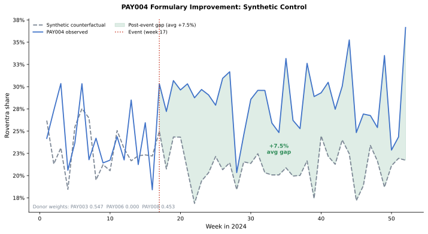

# Chapter 7: Competitive Intelligence and Market Access

Roventra's market share is uneven across the country. In some payer-region cells it converts new patients well; in others it stalls. The brand team wants to know why. When patients cannot get the drug, market access has to renegotiate coverage terms with the plan. When coverage is workable and prescribers still pick a competitor first, field analytics has to investigate adoption. Both problems look the same on the surface: low Roventra share. Observed share alone cannot separate an access barrier from an adoption gap.

The evidence comes from assembling an effective-dated access landscape, counting new starts with the prescription-volume measures, turning raw pharmacy transactions into clean prescription attempts, estimating corrected competitive share with its uncertainty, and measuring a real formulary change against a control to attribute the gain.

The analysis reuses the synthetic data source and the derived journey and HCP-account outputs, and adds two new tables: a plan-region enrollment count and a weekly formulary-event panel, including the planted PAY004 effect. Open [`chapter7_walkthrough.ipynb`](chapter7_walkthrough.ipynb), or run through the shared analysis entry point.

## 7.1 Generate Teaching Datasets

Run the blocks in order from the repository root. Generate the supplemental data first:

```bash
uv run python ch07_competitive/generation_modules/generate_ch07_data.py
```

```text
Chapter 7 supplemental data
  access_history: 98 rows
  plan_region_enrollment: 32 rows
  formulary_event_panel: 208 rows
Wrote Chapter 7-only data to ch07_competitive/data/generated
```

The block below loads every input.

`run_analysis()` in `run_analysis.py` orchestrates the full Chapter 7 evidence pipeline—calling `build_policy()` and `covered_lives_summary()` from `policy.py`, `build_attempts()` from `transactions.py`, `build_competitive_starts()` from `cohort.py`, `payer_region_decisions()` from `decomposition.py`, and `controlled_its()` and `synthetic_control()` from `formulary_event.py`—and returns the complete `results` dictionary that every subsequent listing reads. Listing 7.1 calls it here.

**Listing 7.1**: Load the shared analysis results

```python
from pathlib import Path
import sys

import pandas as pd

ROOT = Path.cwd().resolve()
sys.path.insert(0, str(ROOT))

from ch07_competitive.scripts.run_analysis import run_analysis

results = run_analysis(ROOT)
headline = results["headline"].iloc[0]
print(f"New-to-therapy patients: {int(headline.new_to_therapy_patients):,}")
print(f"Roventra new starts: {int(headline.roventra_new_starts):,}")
print(
    f"Materially restricted lives: {int(headline.restricted_lives):,} "
    f"of {int(headline.total_lives):,} "
    f"({headline.restricted_lives / headline.total_lives:.1%})"
)
print(f"Payer-region access flags: {int(headline.payer_region_access_flags)} of 32")
print(f"Payer-region adoption flags: {int(headline.payer_region_adoption_flags)} of 32")
```

```text
New-to-therapy patients: 3,415
Roventra new starts: 2,798
Materially restricted lives: 6,740,000 of 10,926,000 (61.7%)
Payer-region access flags: 20 of 32
Payer-region adoption flags: 3 of 32
```

The 3,415 new-to-therapy patients and 2,798 Roventra starts come from the patient-journey washout analysis. The access and adoption flags are newly produced here.

> **Note:** All products, patients, payers, accounts, and events here are fictional and synthetic. One formulary event for PAY004 carries a planted effect with a known answer for verifying the measurement code.


## 7.2 Build Effective-Dated Access

A formulary record carries an effective window, and a plan can revise Roventra's terms mid-year. PAY005 South covered Roventra in January, added a step edit in July, and dropped it to non-covered in October. The access state on any analysis date is the record whose effective window contains that date.

`build_policy()` in `policy.py` merges the effective-dated access history with enrolled lives and formulary status, producing `results["access_history"]`; Listing 7.2 reads it here.

**Listing 7.2**: Select the access record in force on the analysis date

```python
import pandas as pd

history = results["access_history"].query(
    "payer_id == 'PAY005' and region == 'South' and product_name == 'Roventra'"
)
cols = ["effective_start", "effective_end", "coverage_status", "step_edit"]
print(history[cols].to_string(index=False))

analysis_date = pd.Timestamp("2024-12-31")
active = history.query("effective_start <= @analysis_date <= effective_end")
print(f"\nIn force on {analysis_date.date()}: {active.iloc[0].coverage_status}")
```

```text
effective_start effective_end coverage_status step_edit
     2024-01-01    2024-06-30         Covered        No
     2024-07-01    2024-09-30         Covered       Yes
     2024-10-01    2025-12-31     Non-covered        No

In force on 2024-12-31: Non-covered
```

On 2024-12-31, PAY005 South sits behind a non-coverage barrier. 

The same selection runs for all 32 cells, three measures summarize the records in force on the analysis date, 2024-12-31: plan-region record coverage (each plan weighted equally), covered lives (each record weighted by enrolled patients), and the access-quality score (each plan weighted by ease of access). The access-quality weights come from the market-sizing analysis: Covered 0.90, Covered with step edit 0.75, Covered with prior authorization 0.65, Non-covered 0.10, same weights we used in the market sizing analysis.

`covered_lives_summary()` in `policy.py` aggregates plan-region records by payer type and access state, producing `results["covered_lives_summary"]`; Listing 7.3 reads it here.

**Listing 7.3**: Plan coverage, covered lives, and access quality

```python
summary = results["covered_lives_summary"].query("payer_type == 'All'").iloc[0]
print(f"Plan-region records:          {int(summary.plans)}")
print(f"Records covering Roventra:    {int(summary.covered_plans)} ({summary.plan_coverage_rate:.1%})")
print(f"Enrolled lives:               {int(summary.total_lives):,}")
print(f"Lives with workable coverage: {int(summary.covered_lives):,} ({summary.covered_lives_rate:.1%})")
print(f"Lives with no restriction:    {int(summary.unrestricted_lives):,} ({summary.unrestricted_lives_rate:.1%})")
print(f"Access-quality score:         {summary.access_quality_score:.3f}")
```

```text
Plan-region records:          32
Records covering Roventra:    24 (75.0%)
Enrolled lives:               10,926,000
Lives with workable coverage: 8,314,000 (76.1%)
Lives with no restriction:    0 (0.0%)
Access-quality score:         0.533
```

24 of 32 (75%) plan-region records cover Roventra, and they hold 8,314,000 of the 10,926,000 (76.1%) lives. The coverage looks healthy, but every covered cell still carries prior authorization, step therapy, specialty-pharmacy routing, or a quantity limit: zero lives have no restriction at all. The weighted access-quality score is 0.533.

The distribution by access state shows where those lives sit.

`restriction_lives()` in `policy.py` counts enrolled lives by access-state category, producing `results["restriction_lives"]`; Listing 7.4 reads it here.

**Listing 7.4**: Lives by access state

```python
restriction_lives = results["restriction_lives"].copy()
restriction_lives["lives_share"] = (
    restriction_lives.lives_share.map(lambda v: f"{v:.1%}")
)
print(restriction_lives.to_string(index=False))
```

```text
       access_state  payer_region_cells  enrolled_lives lives_share
Prior authorization                  12         4186000       38.3%
          Step edit                  12         4128000       37.8%
        Non-covered                   8         2612000       23.9%
```

A plan that puts Roventra behind step therapy could still win if it puts every competitor behind non-coverage. The relative-position view compares Roventra's access state with its competitor.

`relative_position()` in `policy.py` compares the brand's access tier with the strongest competitor in each payer-region cell, producing `results["relative_position"]`; Listing 7.5 reads it here.

**Listing 7.5**: Relative formulary position against the strongest competitor

```python
relative = results["relative_position"]
print(relative.position.value_counts().to_string())
```

```text
position
Competitor favored    20
Parity                 8
Brand favored          4
```

A competitor holds the better formulary position in 20 of 32 cells: Roventra has access disadvantage, contracting's negotiation has some work to do.

## 7.3 Measure Prescriptions: NBRx, NRx, and TRx

Competitive share has to be built on new prescription starts. TRx (total prescriptions) counts every Roventra fill, including refills. NRx (new prescriptions) doesn't count refills; it counts each new prescription written, including both patients who are brand-new to the drug and patients restarting after a gap; one patient can generate multiple NRxs over time. NBRx (new-to-brand prescriptions) counts each patient exactly once for a given drug, the first prescription they ever fill for it. A patient who stopped Roventra and restarted generates a new NRx but not a new NBRx. NBRx captures only patients genuinely new to Roventra, making it the right matrics for competitive share. The washout filter in the patient-journey analysis produces the NBRx count by removing any patient with a prior Roventra claim.


*Figure 7.1. TRx grows with every refill. A restart after a treatment gap adds one NRx but no NBRx. NBRx is capped at one per patient per drug. Synthetic data.*

`build_attempts()` in `transactions.py` groups raw pharmacy transactions into attempt chains and produces `results["prescription_attempts"]`; `build_competitive_starts()` in `cohort.py` applies the washout rule and produces `results["corrected_line1"]` and `results["source_of_business"]`. Listing 7.6 reads all three.

**Listing 7.6**: TRx, NRx, and NBRx by brand

```python
import pandas as pd

attempts = results["prescription_attempts"]
completed = attempts.query("final_outcome == 'Completed'")
therapy_brands = ["Roventra", "Vexpro", "Nexoral"]
therapy = completed.query("product_name in @therapy_brands")
nbrx_reg = results["corrected_line1"].groupby("first_regimen").patient_id.nunique()
sob = results["source_of_business"]
all_nbrx = int(sob.loc[sob.source_of_business == "New to therapy", "patients"].iloc[0])
combo_nbrx = int(nbrx_reg.get("Nexoral + Vexpro", 0))

def fmt_brand(prod):
    sub = completed.query(f"product_name == '{prod}'")
    trx = len(sub)
    nrx = len(sub.query("fill_number == 0"))
    nbrx = int(nbrx_reg.get(prod, 0))
    return [f"{trx:,}", f"{nrx:,}", f"{nbrx:,}", f"{nbrx / all_nbrx:.1%}"]

tbl = pd.DataFrame(
    {
        "All brands":     [f"{len(therapy):,}", f"{len(therapy.query('fill_number == 0')):,}", f"{all_nbrx:,}", "100%"],
        "Roventra":       fmt_brand("Roventra"),
        "Vexpro":         fmt_brand("Vexpro"),
        "Nexoral":        fmt_brand("Nexoral"),
        "Nexoral+Vexpro": ["", "", f"{combo_nbrx:,}", f"{combo_nbrx / all_nbrx:.1%}"],
    },
    index=["TRx", "NRx", "NBRx", "Share"],
)
print(tbl.to_string())
```

```text
       All brands Roventra Vexpro Nexoral Nexoral+Vexpro
TRx        30,552   16,636  6,884   7,032               
NRx        13,867    6,401  3,684   3,782               
NBRx        3,415    2,798    309     303              5
Share        100%    81.9%   9.0%    8.9%           0.1%
```

"All brands" covers the three therapy-class products. TRx and NRx are script counts; NBRx is the washout-corrected new-patient count per drug. Five patients started on Nexoral and Vexpro together. The Share row reads from NBRx: Roventra holds 81.9% of new-to-therapy first regimens.

## 7.4 Separate Access from Adoption

Low Roventra share can have two causes. A coverage barrier or prescribers choose a competitor. To separate the two, the analysis assigns independent access and adoption flags to each payer-region cell.

### 7.4.1 Partial Pooling

The counts in payer-region cells might be small. A small cell with 7 Rovertra starts out of 9 treatted patients carries less certainty than cell with 88 Roventra starts out of 118 treated patients. This section addresses this issue with a method called partial pooling. The same technique appears in pharmaceutical commercial analytics under several other names: empirical Bayes shrinkage, hierarchical Bayes, or multilevel regression.

Before observing a makret share in a payer-region cell, we need a starting belief about Roventra's true share there. That starting belief is the prior. It comes from the corrected national picture: 81.9% of new-to-therapy patients across all 32 cells started on Roventra. We encode that belief as if we had already observed 40 patients in that cell, 32.8 of whom chose Roventra. The number 40 is the prior strength, a judgment cal here. It sets how much national evidence we carry into each local cell before any local data arrives. Prior and local data carry equal weight when a cell reaches exactly 40 real patients; below that, the national rate dominates. Setting 40 near the 30-patient minimum required to raise an adoption flag keeps borderline cells anchored to the national rate when evidence is thin.

When a cell's data arrives, the prior and the local observations combine. A cell with 7 Roventra starts out of 9 treated patients updates the prior by addition: (32.8 + 7) Roventra starts out of (40 + 9) total. The posterior share is 39.8 / 49 = 81.2%. The 7 local patients barely move the estimate because 40 pseudo-patients of national evidence dominate. A larger cell with 88 starts out of 118 patients gives (32.8 + 88) / (40 + 118) = 76.4%: here 118 real patients outweigh the 40-patient prior, and the estimate lands close to the raw 74.6%.

This is partial pooling: each cell borrows strength from the national average, and the amount borrowed shrinks as local evidence grows. The underlying model is the beta-binomial: a Beta distribution describes our uncertainty about the true share in a cell, and a Binomial distribution counts how many Roventra starts that true share would produce. The key property: small cells shrink toward the national rate while large cells stay near their own data.

> **Note:** The theoretical foundation appears in Efron and Morris (1977), "Stein's Paradox in Statistics," *Scientific American*, 236(5):119–127, and in Gelman et al. (2013), *Bayesian Data Analysis*, 3rd ed., Chapter 5. The `scipy.stats.beta` functions used below implement the same posterior exactly.

The posterior share $\hat{p}$ for a cell with $s$ Roventra starts and $n$ total treated patients is:

$$
\hat{p} = \frac{s + \alpha_0}{n + \alpha_0 + \beta_0},
\qquad
\alpha_0 = 0.819 \times 40 = 32.8,
\qquad
\beta_0 = (1 - 0.819) \times 40 = 7.2
$$

$\alpha_0$ and $\beta_0$ are the prior Roventra and competitor pseudo-counts. When $n$ is small, the prior terms dominate and $\hat{p}$ stays near 81.9%. When $n$ is large, the prior terms shrink in relative weight and $\hat{p}$ approaches $s/n$.


*Figure 7.2. Each point is one payer-region cell. Small cells (light color) are pulled far toward the 81.9% national prior. Large cells (dark color) stay near the diagonal because local evidence outweighs the prior. Synthetic data.*

`payer_region_decisions()` in `decomposition.py` computes the Beta posterior for each cell and sets the access and adoption flags, producing `results["payer_region_decisions"]`; Listings 7.7 and 7.8 illustrate the partial-pooling calculation and read from that result.

**Listing 7.7**: Shrink two cells toward the national prior

```python
from scipy.stats import beta

prior_mean = 0.8193           # national corrected Roventra share
prior_strength = 40           # pseudo-patients of prior weight
alpha0 = prior_mean * prior_strength
beta0 = (1 - prior_mean) * prior_strength
benchmark = 0.82

for name, brand_starts, competitor_starts in [
    ("Small cell", 7, 2),
    ("Large cell", 88, 30),
]:
    treated = brand_starts + competitor_starts
    raw = brand_starts / treated
    pooled = (brand_starts + alpha0) / (treated + alpha0 + beta0)
    prob_below = beta.cdf(benchmark, brand_starts + alpha0, competitor_starts + beta0)
    print(
        f"{name}: raw {raw:.1%}, pooled {pooled:.1%}, "
        f"P(true share < 82%) {prob_below:.1%}"
    )
```

```text
Small cell: raw 77.8%, pooled 81.2%, P(true share < 82%) 52.9%
Large cell: raw 74.6%, pooled 76.4%, P(true share < 82%) 95.7%
```

`P(true share < 82%)` is the fraction of the posterior Beta distribution that falls below the benchmark, computed as `beta.cdf(0.82, s + alpha0, c + beta0)`. For the small cell, 9 real patients leave the posterior wide: the distribution straddles the 82% line, and 52.9% falls below it. For the large cell, 118 real patients narrow the posterior sharply and place it well below 82%: 95.7% falls below. At 52.9%, the evidence is close to a coin flip, it cannot distinguish a genuine gap from sampling variation; the small cell does not reach the 80% adoption flag threshold.

The adoption flag uses that posterior probability: a cell is flagged only with at least 30 treated patients and at least 80% posterior probability of trailing the benchmark.


### 7.4.2 Payer-Region Actions

Now in each cell we define an access flag from its policy state and friction, and an adoption flag from the pooled posterior. The conditions:

- **Access flag** True: cell has a material barrier (non-covered or step-edit) AND at least 25% of enrolled lives sit behind that barrier, OR the unresolved attempt rate exceeds 15%.
- **Adoption flag** True: at least 30 treated patients observed AND posterior probability of trailing the 82% benchmark exceeds 80%.
- **Evidence sparse**: fewer than 30 treated patients; routes to Monitor regardless of the other flags.

Those conditions combine into four routing actions:

| Access flag | Adoption flag | Action |
| --- | --- | --- |
| No | No | Sustain |
| No | Yes | Adoption review |
| Yes | No | Access review |
| Yes | Yes | Dual workstream |
| Sparse evidence | Sparse evidence | Monitor |

**Listing 7.8**: Three payer-region decisions side by side

```python
decisions = results["payer_region_decisions"]
sel = decisions.set_index(["payer_id", "region"]).loc[
    [("PAY002", "Northeast"), ("PAY004", "Midwest"), ("PAY005", "South")]
]
view = pd.DataFrame(
    {
        "access_state": sel.access_state,
        "treated_patients": sel.treated_patients.astype(int),
        "brand_share": sel.brand_share.map(lambda v: f"{v:.1%}"),
        "share_95ci": sel.apply(
            lambda x: f"{x.share_lower_95:.0%}-{x.share_upper_95:.0%}", axis=1
        ),
        "prob_below_82": sel.probability_below_benchmark.map(lambda v: f"{v:.0%}"),
        "access_flag": sel.access_flag,
        "adoption_flag": sel.adoption_flag,
        "action": sel.action,
    }
)
view.index = [f"{p} {r}" for p, r in view.index]
print(view.T.to_string())
```

```text
                 PAY002 Northeast       PAY004 Midwest     PAY005 South
access_state          Non-covered  Prior authorization      Non-covered
treated_patients              100                  118              129
brand_share                 85.0%                77.1%            75.2%
share_95ci                77%-91%              69%-84%          67%-82%
prob_below_82                 24%                  87%              95%
access_flag                  True                False             True
adoption_flag               False                 True             True
action              Access review      Adoption review  Dual workstream
```

PAY002 Northeast has access_flag True (non-covered, all enrolled lives restricted) and adoption_flag False: its 24% posterior probability does not reach the 80% threshold. Access review. PAY004 Midwest has access_flag False and adoption_flag True: prior-authorization access is workable, but 87% posterior probability with 118 treated patients meets both adoption flag conditions. Adoption review. PAY005 South has both flags True: a non-covered barrier and 95% posterior probability with 129 treated patients. Dual workstream. Three cells reach three different actions because access and adoption route independently.


*Figure 7.3. The adoption flag and access flag are set independently from share uncertainty and restricted lives; the action column combines them. Wide share intervals mark the small cells the partial-pooling rule holds back. Synthetic data.*

The 32 cells distribute across five actions.

```python
print(decisions.action.value_counts().to_string())
```

```text
action
Access review      19
Sustain            10
Adoption review     2
Dual workstream     1
```

## 7.5 Measure the Formulary Event

At week 17 of 2024, PAY004 Northeast moved Roventra from a prior-authorization tier to preferred formulary coverage. PAY004 Northeast carried workable PA-gated coverage before the event: prior-authorization is workable, so it did not trigger an access flag, but Roventra sat at parity with competitors on the formulary and contracting pursued the improvement to open an advantage. The central question is attribution: did Roventra's share in PAY004 Northeast actually rise because of this formulary change, or would share have moved in the same direction anyway, driven by factors affecting every payer in the market at the same time?

Attribution matters commercially. If the class was already growing during weeks 17 to 52 and PAY004 just rose with it, the contracting team deserves no credit for the gain, and the same budget directed at a different payer might have delivered more. If the class trend was flat or declining and PAY004 still gained, the formulary event was the cause and a repeated playbook at similar payers is warranted. A raw before-and-after average cannot separate these scenarios: it takes the full observed change in PAY004 and calls it the effect, without asking what PAY004 would have looked like had the formulary event never happened.

The controlled ITS and the synthetic control both estimate that missing counterfactual, what PAY004 Northeast's share would have been absent the formulary event, through different mechanisms. Both rely on three donor payers that did not receive the event: PAY003 South, PAY006 West, and PAY008 Midwest. The shared assumption is that donor payers track the same class trend and seasonality as PAY004 Northeast, so their post-event trajectory represents the baseline PAY004 would have followed without the intervention.

Selecting donors from a larger pool requires three filters before the optimizer runs. Any payer-region that received the same or a related formulary event during the study window is excluded. Donors must be structurally comparable: same payer type, same therapy class, and a share range that brackets the treated unit so the synthetic control interpolates rather than extrapolates. A pre-event parallel-trends check removes candidates whose weekly share moves in a systematically different direction from the treated unit. The convex weight optimization then assigns zero weight to remaining poor matches automatically. PAY006 illustrates this: it was in the donor pool but received zero weight because PAY003 and PAY008 already reconstruct PAY004's pre-event trajectory without it.

### 7.5.1 Fit the Controlled Interrupted Time Series

An ITS model fits PAY004's weekly share as a pre-event baseline level and slope, an immediate jump at the event week, and a continued slope change after it. The control term is the mean Roventra share across the three donor payers each week. Adding that mean as a covariate absorbs whatever is driving all payers together; the jump and slope-change terms then measure only what changed for PAY004.

$$
\text{share}_t =
\beta_0 +
\beta_1(t - t_0) +
\beta_2\,\mathbf{1}(t \ge t_0) +
\beta_3\max(0,\, t - t_0) +
\beta_4\,\bar{s}_t +
\varepsilon_t
$$

| Symbol | Definition |
| --- | --- |
| $t$ | Week number |
| $t_0$ | Event week (PAY004 formulary improvement, $t_0 = 17$) |
| $\mathbf{1}(t \ge t_0)$ | Indicator: 1 from week $t_0$ onward, 0 before |
| $\bar{s}_t$ | Mean Roventra share of the three donor payers in week $t$ |
| $\varepsilon_t$ | Residual (Newey-West standard errors, 4-week lag) |
| $\beta_0$ | Baseline share at the event week |
| $\beta_1$ | Pre-event weekly slope |
| $\beta_2$ | Immediate level jump at the event |
| $\beta_3$ | Added weekly growth rate after the event |
| $\beta_4$ | Coefficient on the donor market trend |

`controlled_its()` in `formulary_event.py` fits the interrupted time-series model and produces `results["formulary_event_effect"]`; Listing 7.9 reads it here.

**Listing 7.9**: Report the controlled event effect

```python
event = results["formulary_event_effect"].iloc[0]
print(f"Immediate level effect: {event.immediate_effect:+.1%}")
print(f"Slope change per week: {event.slope_change_per_week:+.2%}")
print(
    f"Week {int(event.effect_week)} effect: {event.effect_at_week:+.1%} "
    f"(95% CI {event.effect_at_week_lower_95:+.1%} "
    f"to {event.effect_at_week_upper_95:+.1%})"
)
```

```text
Immediate level effect: +7.4%
Slope change per week: +0.24%
Week 28 effect: +10.0% (95% CI +6.1% to +14.0%)
```

The model reads a 7.4-point jump at the event and continued growth reaching a 10.0-point lift by week 28, with a confidence interval that stays clear of zero. The generator planted a 6-point level effect plus post-event growth; the estimate lands within that interval.


*Figure 7.4. The counterfactual (dashed gray) follows the slightly downward class trend the donors carry; PAY004's observed share rises above that baseline after week 17. The lower panel dots show the observed gap each week; the green line is the model's linear estimate, reaching +10.0 points by week 28. Synthetic data.*

### 7.5.2 Check with Synthetic Control

A synthetic control provides a nonparametric robustness check on the ITS result. The controlled ITS imposes a linear model structure; the synthetic control makes no functional-form assumption. It finds non-negative weights for the three donor payers (PAY003, PAY006, PAY008) that minimize the pre-event tracking error, then projects the weighted blend forward as a data-driven counterfactual. The post-event gap between PAY004 and its weighted-donor twin is the effect estimate. Two methods with different assumptions reaching the same answer reduces the risk that either result is a modeling artifact.

```python
diagnostic = results["synthetic_control_diagnostics"].iloc[0]
print(f"Pre-period RMSPE: {diagnostic.pre_rmspe:.3f}")
print(f"Post-period mean gap: {diagnostic.post_mean_gap:+.1%}")
print(
    "Donor weights: "
    f"PAY003={diagnostic.weight_PAY003:.3f}, "
    f"PAY006={diagnostic.weight_PAY006:.3f}, "
    f"PAY008={diagnostic.weight_PAY008:.3f}"
)
```

```text
Pre-period RMSPE: 0.038
Post-period mean gap: +7.5%
Donor weights: PAY003=0.547, PAY006=0.000, PAY008=0.453
```

The blend fits the pre-event weeks closely (RMSPE 0.038) and reads a +7.5-point post-event gap, consistent with the controlled time-series estimate.



*Figure 7.5. The synthetic counterfactual (dashed gray) follows the weighted-donor blend through the pre-event weeks with RMSPE 0.038. After week 17, PAY004's observed share (blue) separates from the counterfactual; the green-shaded gap averages +7.5 points across the post-event period. PAY006 receives zero weight because it tracks PAY004 less well than PAY003 and PAY008 in the pre-event period. Synthetic data.*

The synthetic control does not carry a confidence interval in the same sense as the ITS. The optimization is deterministic and produces one weighted counterfactual; there is no residual distribution to integrate over. Formal inference uses permutation tests: apply the same procedure to each donor in turn as a placebo treated unit, then compare PAY004's post-event gap against the distribution of placebo gaps. With three donors here, the minimum permutation p-value is 1/4. The chapter therefore uses the synthetic control as a convergent robustness check: the ITS carries the formal inference with its confidence interval; the synthetic control confirms the estimate is not an artifact of the linear model structure.

**Conclusion.** The opening question was whether PAY004's Roventra share gain came from the formulary event or from market-wide factors. The evidence is unambiguous. The donor payers show that the background market trend during this period was slightly declining: without the formulary change, PAY004's Roventra share would have drifted lower with the class. The observed gain stands against that declining baseline, not on top of a rising tide. The ITS estimates a +7.4-point immediate lift at week 17 growing to +10.0 points by week 28 (95% CI: +6.1 to +14.0); the synthetic control confirms +7.5 points using a different method and no functional-form assumption. The PAY004 Northeast formulary improvement drove a genuine, measurable increase in Roventra share. PAY004 Northeast's PA barrier lifted, and its end-of-year share sits above the 82% benchmark. A comparable contracting effort at PA-gated cells where Roventra still sits at parity with competitors is the next action.

## 7.6 Summary

Roventra's uneven uptake raised one question: access or adoption. Observed share mixes the two, and small cells make the raw signal unreliable. Cell-by-cell evidence separates them.

Effective-dated policy and enrolled lives settled the access state for each of the 32 cells. The washout correction reduced 6,401 patients who looked new to 2,798 genuine new-to-brand starts; competitive share rests on that corrected count. Partial pooling distinguished real adoption gaps from small-cell noise. A controlled time series and a synthetic control confirmed that the PAY004 formulary win pulled through 7 to 10 points of share on top of the underlying market trend. The result is a routed payer-region queue: 19 access-review cells, 2 adoption-review cells, 1 dual-workstream cell, and 10 sustain cells.

The cells where Roventra trails named competitors on the formulary go to contracting. Cells where coverage is workable and adoption is the gap go to field teams.

In this chapter you learned:

- Effective-dated policy records define the access state on the analysis date.
- Plan coverage, covered lives, lives with no restriction, and the access-quality score answer different questions.
- TRx, NRx, and NBRx are different metrics; use washout-corrected NBRx for competitive share analysis.
- Partial pooling pulls small-cell share toward the national prior; the adoption flag uses the posterior probability of trailing the benchmark.
- Access and adoption stay separate flags; a cell can earn both and route to a dual workstream.
- A controlled interrupted time series and a synthetic control measure a formulary event against contemporaneous donor trends; the ITS carries the confidence interval and the synthetic control confirms the estimate holds under a different set of assumptions.

## 7.7 Exercises

1. **Rebuild covered lives.** Use Section 7.2. Pick 4 payer-region rows from `policy_landscape`, compute plan coverage, covered lives, lives with no restriction, and the access-quality score by hand, then reproduce the values in fewer than 20 lines of pandas. Which measure belongs in a payer contracting review, and which belongs in a field plan?
2. **Trace an attempt.** Pick 1 patient with a PENDED transaction from `results["prescription_attempts"]`, print the full transaction chain, and classify the final attempt outcome. State which raw row count would overstate access friction and why.
3. **Change the decision rule.** Use Section 7.4. Move the adoption benchmark from 82% to 80%, rerun the payer-region decisions, and compare the actions. State whether the underlying evidence changed or only the operating policy changed.

Worked solutions are in [`exercise_solutions.ipynb`](exercise_solutions.ipynb). Each solution ends with the judgment an analyst should record for real data.

The contact-sequence and channel-response analysis reads the access and adoption routing into the engagement plan.
