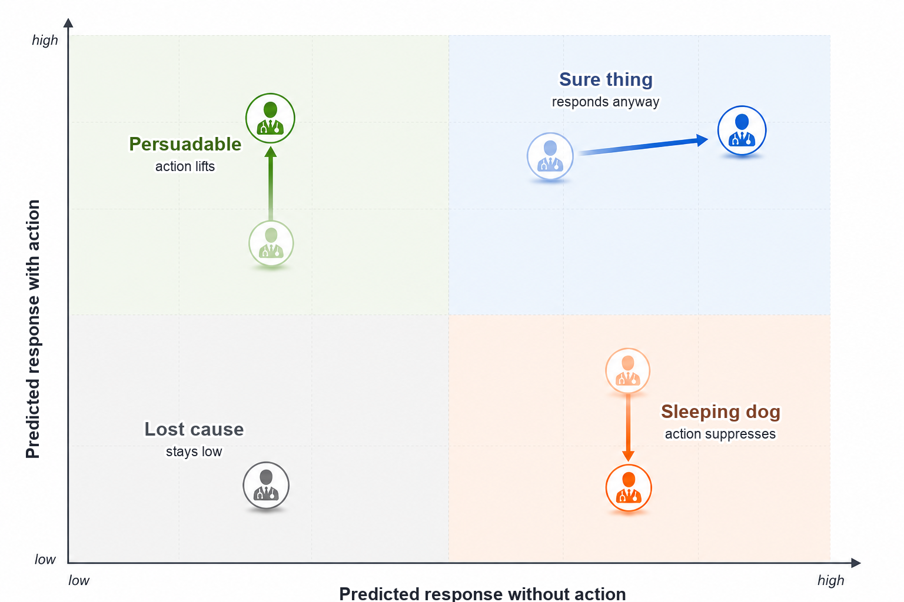

# Chapter 8: Omnichannel Analytics

The HCP targeting provides account priority, access flags, and field capacity. The commercial decision now is: what engagement action should run in the next 4 weeks, and on which channel?

In this chapter, you follow 2 HCPs, HCP0280 and HCP0389, to build the event ledger that unifies ten communication channel systems into a trusted record, a response model that predict responses, an attribution analysis that identifies which past channels are associated with response, uplift analysis that tests whether those channels actually caused it, channel economics that convert causal estimates into cost per incremental response, a governed channel plan, and a measurement contract that feeds the next-best-action engine in the next chapter.

Open [`ch08_walkthrough.ipynb`](ch08_walkthrough.ipynb), or run the blocks below from the repository root.

> **Note:** All products, HCPs, accounts, campaigns, and events are fictional and synthetic.

## 8.1 Teaching Data

Generate the supplemental engagement records:

```bash
uv run python ch08_omnichannel/generation_modules/generate_ch08_data.py
```

```text
Omnichannel supplemental data
  engagement_events: 3,650 rows
  engagement_truth: 3,650 rows
Wrote omnichannel data to ch08_omnichannel/data/generated
```

The generator reads the existing HCP, account, permission, and access outputs and adds 10 source channels from January 2024 through March 2025: field, approved email, authenticated web, peer program, speaker program, paid media, conference, direct mail, phone, and account support. It also writes an answer-key file with the planted response probabilities, planted live-program treatment effect, planted field-then-digital sequence effect, and machine-open flags. Those answer-key columns stay outside the analysis. They check whether each method recovers a known truth.

Each monthly snapshot contains one row for one HCP at one affiliated account. Earlier snapshots train the model, and later snapshots test it.

**Listing 8.1**: Load the complete analysis package

```python
from pathlib import Path
import sys
import pandas as pd

ROOT = Path.cwd().resolve()
sys.path.insert(0, str(ROOT))

from ch08_omnichannel.scripts.run_analysis import run_analysis

results = run_analysis(ROOT)
print(f"Ledger events: {len(results['event_ledger']):,}")
print(f"HCP-account snapshots: {len(results['snapshot_panel']):,}")
print(f"Planning HCP-account rows: {len(results['channel_plan']):,}")
```

```text
Ledger events: 3,650
HCP-account snapshots: 1,422
Planning HCP-account rows: 158
```

## 8.2 Prepare the Modeling Data

Section 8.2 prepares the training data for the response model in section 8.3. The event ledger standardizes measurement across ten source channels. Snapshot features turn event history into model-ready input features and outcome label. Sparse response rate is one of the input features that need to be standardized.

### 8.2.1 The Event Ledger

The first step is to turn ten source systems into one trustworthy record. The ledger keeps the source event and the common planning fields. Each source keeps its activity fields.

The ledger keeps the following source-specific fields for each channel:

1. **Phone:** interaction outcome and follow-up status
2. **Email:** delivery, open, click, qualified action, and opt-out
3. **Direct mail:** delivery, tracked landing visits, and follow-up requests
4. **Paid media:** impressions, viewable impressions, clicks, landing visits, and downloads
5. **Web:** impressions, viewable impressions, clicks, landing visits, and downloads
6. **Peer program (small peer-to-peer education):** invitation, registration, attendance, and follow-up
7. **Speaker program (formal speaker-led education):** invitation, registration, attendance, and follow-up
8. **Conference (congress or event engagement):** registration, attendance, content download, and follow-up
9. **Account support:** access work, transfer status, and resolution
10. **Field:** interaction outcome and follow-up status

Conference engagement covers congress, booth, or symposium activity, such as `Annual J.P. Morgan Healthcare Conference` and `ASCO Annual Meeting`. Speaker programs are formal brand-run speaker-led events, such as `Roventra Clinical Update Series`. Peer programs are smaller brand-run peer-to-peer sessions, such as `Roventra Clinical Roundtable` and `Roventra Local Faculty Session`.

`build_event_ledger()` in `event_ledger.py` constructs the ledger and attaches the channel-specific `meaningful_response` flag. Listing 8.2 calls `channel_delivery_summary()` and Listing 8.3 calls `email_quality_summary()` from the same module.

**Listing 8.2**: Summarize delivery and meaningful response by channel

```python
summary = results["channel_summary"].copy()
summary["response"] = summary.response_rate_per_delivered.map(
    lambda x: f"{x:.1%}"
)
view = summary[
    ["channel", "events", "delivered_events",
     "meaningful_responses", "response"]
].set_index("channel")
print(view)
```

```text
                 events  delivered_events  meaningful_responses response
channel                                                                 
Field               815               804                   627    78.0%
Email               724               712                   499    70.1%
Web                 420               415                   287    69.2%
Phone               377               369                   245    66.4%
Paid media          270               249                   120    48.2%
Peer program        256               251                   171    68.1%
Direct mail         246               242                   173    71.5%
Speaker program     211               206                   142    68.9%
Conference          184               180                   123    68.3%
Account support     147               145                    96    66.2%
```

**Note:** To keep the teaching signal visible, the synthetic response rates are purposely shifted toward the high end. Real omnichannel response rates are far lower, especially email click rates, which often sit in the low single digits.

**Note:** The `meaningful_response` flag uses a channel-specific rule: positive or follow-up outcome for field and phone; click for email, web, and paid media; tracked landing visit for direct mail; attendance for peer programs, speaker programs, and conferences; and resolution for account support.

The ledger keeps the raw intermediate activity metrics: opens, registrations, impressions, landing visits, downloads, follow-up requests, transfers, and resolutions. The code demonstration collapses each source into delivery and meaningful response.

Each channel also has a measurement failure mode. For example, Apple Mail Privacy Protection can download remote content in the background, so a recorded open may be a machine event. The ledger keeps `Opened` as a response type and sets `meaningful_response = False` for this standalone open.


**Listing 8.3**: Compare open and click measures

```python
email = results["email_quality"].copy()
email["rate"] = email.rate.map(lambda x: f"{x:.1%}")
print(email)
```

```text
                         metric  events  base_events   rate
0                 Raw open rate     626          712  87.9%
1  Human open rate (answer key)     563          712  79.1%
2                    Click rate     499          712  70.1%
3            Click-to-open rate     499          626  79.7%
```

### 8.2.2 Past State and Later Outcome

A snapshot is a cross-sectional record for one HCP-account row at a single point in time, capturing everything known up to that moment and labeling whether a meaningful response follows. The feature window looks back from the snapshot date; the outcome window looks forward; the boundary between them is the snapshot date itself, with no event falling in both windows.

Snapshot dates fall on the last calendar day of each month: January 31, February 28, March 31, and so on through the full 14-month ledger period. Monthly boundaries align with how commercial field planning actually runs: rep territory cycles, promotional budgets, and speaker-program calendars all operate on monthly rhythms. Daily snapshots would produce far more training rows, but a 28-day outcome window means consecutive daily snapshots would have outcome windows that overlap by 27 days, making a clean time-based train/test split nearly impossible without discarding most rows. Weekly snapshots reduce the overlap to 21 days but still require wide gap-based splits. Monthly snapshots solve the problem cleanly: the 28-day outcome window fits inside the one-month gap between snapshot dates, so every row has a non-overlapping outcome window and a clean boundary can be drawn at a single calendar date.

For the February 28 snapshot, the 90-day feature window runs from December 1 through February 28 inclusive; the 28-day outcome window runs from March 1 through March 28. Events on the snapshot date are included in the feature window and never in the outcome window, so there is no same-day leakage.

`build_snapshot_panel()` in `features.py` assembles one row per HCP-account per month, applying these boundary rules. Listing 8.4 traces the raw events for HCP0280 from the event ledger; Listing 8.5 shows the resulting snapshot row.

**Listing 8.4**: HCP0280's past 90-days events

```python
ledger = results["event_ledger"]
cols = ["event_date", "channel", "response_type", "meaningful_response"]
trace = ledger.loc[ledger.npi.eq("9000000280"), cols].tail(3)
print(trace)
```

```text
     event_date channel     response_type  meaningful_response
1690 2025-01-15   Field          Positive                 True
1691 2025-01-24   Email            Opened                False
1692 2025-02-10     Web  Qualified action                 True
```


*Figure 8.1. HCP0280's prior 90-day events build the February 28 state. Events above the timeline produced a meaningful response; events below did not. Outcome events after the dashed line are not shown because HCP0280 had none in the next 28 days. Synthetic data.*

**Listing 8.5**: Inspect the feature and outcome boundary

```python
panel = results["snapshot_panel"]
row = panel.loc[
    panel.npi.eq("9000000280")
    & panel.snapshot_date.eq("2025-02-28")
].iloc[0]
print(f"Snapshot: {row.snapshot_date:%Y-%m-%d}")
print(f"Outcome end: {row.outcome_end:%Y-%m-%d}")
print(f"90-day contact pressure: {int(row.total_pressure_90)} events")
print(f"Later meaningful response: {int(row.future_response)}")
```

```text
Snapshot: 2025-02-28
Outcome end: 2025-03-28
90-day contact pressure: 3 events
Later meaningful response: 0
```

HCP0280 had 3 events in the prior 90 days, 1 in the prior 30 days, and no meaningful responses in the next 28. Static targeting fields repeat across snapshots; event features are rebuilt as time moves. The 19 features passed to the response model are listed below. Section 8.2.3 explains how the shrunken response rate is computed.

| Group | Feature | Window | Unit |
| --- | --- | --- | --- |
| Contact pressure | Total channel touches | 30-day | Count |
| Contact pressure | Total channel touches | 90-day | Count |
| Contact pressure | Recency-weighted touches | 90-day | Weighted count |
| Channel activity | Field meaningful responses | 90-day | Count |
| Channel activity | Email clicks | 90-day | Count |
| Channel activity | Web qualified actions | 90-day | Count |
| Channel activity | Paid-media clicks | 90-day | Count |
| Channel activity | Live-program attendances | 180-day | Count |
| Channel activity | Account-support resolutions | 90-day | Count |
| Channel activity | All-channel engagements | 90-day | Count |
| Response history | Days since last meaningful response | All time | Days |
| Response history | Shrunken response rate | 90-day | Ratio [0, 1] |
| Response history | Recency-weighted responses | 90-day | Weighted count |
| Response history | Digital channel response rate | All time | Ratio [0, 1] |
| Response history | Field channel response rate | All time | Ratio [0, 1] |
| Response history | Last channel to produce a response | All time | Category |
| Static targeting | Evidence need score | Static | Score [0, 1] |
| Static targeting | Access resource score | Static | Score [0, 1] |
| Static targeting | Review opportunity score | Static | Score [0, 1] |

### 8.2.3 Sparse Response Signals

A single click after one delivered email is a weak signal. A one-event rate carries high uncertainty, so the `shrunken_response_rate_90` feature pulls each raw per-HCP rate toward the market-wide rate, with the pull strongest when event count is small. The method is the same beta-binomial partial pooling used in the competitive access and adoption (section 7.4.1): a sparse local rate borrows strength from the market prior, while larger samples stay close to their own data. With a market rate of 72% and a prior weight of 8, an HCP with one response in one event moves from 100% to 75%; an HCP with nine responses in nine events moves from 100% to 87%.

`response_shrinkage_summary()` in `features.py` applies the beta-binomial shrinkage and selects representative sparse and established rows for inspection.

**Listing 8.6**: Shrink sparse response rates

```python
shrinkage = results["response_shrinkage"].copy()
for col in ["observed_response_rate_90", "shrunken_response_rate_90"]:
    shrinkage[col] = shrinkage[col].map(lambda x: f"{x:.1%}")
print(shrinkage[
    ["evidence_level", "npi", "meaningful_responses_90", "total_pressure_90",
     "observed_response_rate_90", "shrunken_response_rate_90"]
].to_string(index=False))
```

```text
evidence_level        npi  meaningful_responses_90  total_pressure_90 observed_response_rate_90 shrunken_response_rate_90
        Sparse 9000000008                        1                  1                    100.0%                     71.4%
        Sparse 9000000085                        1                  1                    100.0%                     71.4%
        Sparse 9000000122                        1                  1                    100.0%                     71.4%
   Established 9000000128                        8                  8                    100.0%                     83.9%
   Established 9000000631                        8                  8                    100.0%                     83.9%
   Established 9000000462                        3                  8                     37.5%                     52.7%
```

Every one-event HCP-account row at 100% raw lands at 74.7% shrunken, near the market rate. Rows with 8 or 9 responses still shrink and stay closer to their observed result. The shrunken rate is 1 of the 19 predictors listed in section 8.2.2. With the ledger built, features computed, and rates stabilized, the training data is ready for section 8.3.

## 8.3 The Response Model: From Logistic Regression to Transformer Sequence Architecture

Section 8.3 builds and evaluates the model that scores each HCP-account row for the likelihood of a meaningful response in the next 28 days. Section 8.3.1 covers the regularized logistic regression: its formula, regularization choice, temporal evaluation design, and how to read the output coefficients. Section 8.3.2 examines channel order effects and the path from the current aggregate baseline to a recurrent or transformer sequence model.

### 8.3.1 Regularized Logistic Regression

The model is a regularized logistic regression. The predicted outcome is binary: did a meaningful response occur in the next 28 days? The 19 features from section 8.2 are the inputs, 18 numeric features and 1 categorical response-history field. Logistic regression converts a weighted sum of those features into a response occurrence probability:

$$
p_i = \frac{1}{1 + \exp(-z_i)}, \qquad
z_i = \beta_0 + \sum_{j=1}^{J}\beta_j x_{ij}
$$

For snapshot $i$, each feature $x_{ij}$ carries a fitted coefficient $\beta_j$ that shifts the log-odds of a later meaningful response up or down. Numeric features are standardized; the last-response-channel categorical feature is one-hot encoded.

$$
\mathcal{L} = -\sum_i \left[y_i \log(p_i) + (1 - y_i)\log(1 - p_i)\right] + \lambda \sum_{j=1}^{J}\beta_j^2
$$

In LogisticRegression(C=0.05), C is the inverse of regularization strength in the fitting objective inside scikit-learn, $C = 1 / \lambda$, so $C=0.05$ means a stronger penalty on large coefficients. This regularization keeps coefficients stable with 19 inputs across roughly 950 training snapshots.

This predictive model is not a causal estimate. An HCP with a high score is likely to respond; it may or may not respond because of the next action. That causation link requires the incrementality analysis in section 8.4.2.

[`TimeSeriesSplit`](https://scikit-learn.org/stable/modules/generated/sklearn.model_selection.TimeSeriesSplit.html) orders calendar events for training and evaluation. Snapshots through November train the model, December checks the probability scale, and January through February form the test set.

`fit_response_model()` in `modeling.py` fits the classifier and produces `model_metrics`, `response_history_baseline`, and `model_coefficients`. Listing 8.8 reads the first two; Listing 8.9 reads the third.

**Listing 8.8**: Review the temporal model test and response-history baseline

```python
metrics = results["model_metrics"].copy()
for col in [
    "response_rate", "roc_auc", "average_precision",
    "brier_score", "base_rate_brier",
]:
    metrics[col] = metrics[col].round(3)
print(metrics[[
    "split", "snapshots", "response_rate",
    "roc_auc", "average_precision",
]])
print()
print(metrics[["split", "brier_score", "base_rate_brier"]])
print()
comparison = results["response_history_baseline"].copy()
for col in [
    "test_auc", "average_precision",
    "brier_score", "top_20_response_rate",
]:
    comparison[col] = comparison[col].map(lambda x: f"{x:.3f}")
comparison["top_20_lift"] = comparison.top_20_lift.map(lambda x: f"{x:.2f}x")
comparison = comparison.rename(columns={
    "average_precision": "avg_precision",
    "top_20_response_rate": "top20_rate",
    "top_20_lift": "top20_lift",
})
print(comparison[
    ["model", "test_auc", "avg_precision",
     "brier_score", "top20_rate", "top20_lift"]
].to_string(index=False))
```

```text
        split  snapshots  response_rate  roc_auc  average_precision
0       train        948          0.626    0.667              0.745
1  validation        158          0.437    0.636              0.533
2        test        316          0.484    0.711              0.688

        split  brier_score  base_rate_brier
0       train        0.215            0.234
1  validation        0.266            0.282
2        test        0.234            0.270

                    model test_auc avg_precision brier_score top20_rate top20_lift
               full_model    0.711         0.688       0.234      0.734      1.52x
response_history_baseline    0.641         0.639       0.281      0.719      1.48x
```

The test area under the ROC curve is 0.711. Average precision is 0.688 against a 48.4% response rate. The Brier score is 0.234, better than the 0.270 constant-rate baseline. Those metrics are good for ranking a constrained planning set, but not an indication that any channel caused the response.

The `brier_score` is the mean squared error between each predicted probability and the actual 0/1 outcome, the smaller the better. The `base_rate_brier` column uses one constant probability for every row, equal to the training-set response rate.

The response model baseline performance uses only `shrunken_response_rate_90`, which is the simple rule "prior high responders stay high." The full model improves test AUC from 0.641 to 0.711 and improves Brier score from 0.281 to 0.234. The top-20% response lift changes only from 1.48x to 1.52x, which means past response already carries much of the ranking signal. The model is able to identify high-likelihood response HCPs, then leaves causation and budget movement to uplift and measurement in the next section.

**Listing 8.9**: Inspect top feature effects by standardized coefficient

```python
features = (
    results["model_coefficients"]
    .assign(abs_coefficient=lambda frame: frame.coefficient.abs())
    .sort_values("abs_coefficient", ascending=False)
    .head(8)
    .copy()
)
features["feature"] = features.feature.str.replace(
    "last_response_channel_", "last_channel=", regex=False
)
features["coefficient"] = features.coefficient.map(lambda x: f"{x:+.3f}")
features["odds_ratio"] = features.odds_ratio.map(lambda x: f"{x:.2f}")
print(features[["feature", "coefficient", "odds_ratio"]].to_string(index=False))
```

```text
                    feature coefficient odds_ratio
      access_resource_score      +0.215       1.24
      digital_response_rate      +0.185       1.20
live_program_attendance_180      +0.177       1.19
    last_channel=Paid media      -0.126       0.88
   last_channel=Direct mail      -0.123       0.88
        days_since_response      -0.112       0.89
           last_channel=Web      +0.106       1.11
         field_responses_90      +0.098       1.10
```

Feature coefficients explain how the model weights inputs to form the ranking. They are associations after regularization, not causal effects: a high score means an HCP is likely to respond, not that the next planned action will cause the response.

All numeric inputs are standardized before fitting: each coefficient is the log-odds change per one standard deviation, so magnitudes are on a comparable scale across features. The `last_response_channel` dummies are binary 0/1 and not standardized; their coefficients measure log-odds relative to an implicit reference category: every other last-response channel (field, email, web, phone, and the rest).

A negative coefficient does not mean the feature is unimportant; it means higher values push the predicted probability down. `days_since_response` is negative because recency matters: one standard deviation more time since last response reduces the odds of future response by a factor of 0.89. `last_channel=Paid media` and `last_channel=Direct mail` are negative relative to the reference group: an HCP whose most recent meaningful response was a paid-media click or a direct-mail reply is predicted to be less likely to respond than one whose last response came through field, email, web, or phone. Those two channels tend to capture lower-intent engagements, so the direction is sensible.


### 8.3.2 Channel Order and Sequence Effects (LSTM and Transformer)

HCP0280 reached this snapshot after a field response, an email open, and a web qualified action, in that order. That sequence is not arbitrary. The synthetic data plants a field-then-digital effect: rows with a field response in the prior 90 days respond at 60.3% over the next 28 days, against 55.4% without one. To verify the planted signal and quantify the AUC gain from adding sequence features, Listing 8.10 builds two logistic regression models. `aggregate_only` trains on four aggregate features: `total_pressure_90`, `shrunken_response_rate_90`, `evidence_need_score`, and `access_resource_score`. `aggregate_plus_sequence` adds the two handcrafted sequence features, `field_then_digital` and `repeated_email`, bringing the feature count to six. The first output table confirms the 60.3% vs 55.4% response rate split among Email/Web last-channel rows; the second compares test AUC for the two models. The 0.707 to 0.714 improvement reflects both sequence features combined; `repeated_email` contributes but is not broken out separately. The response rate table comes from `field_then_digital_contrast()` and the AUC comparison from `sequence_feature_model()`, both in `modern_methods.py`.

**Listing 8.10**: Compare response rates by recent field response and sequence model AUC gain

```python
contrast = results["field_then_digital_contrast"].copy()
contrast["future_response_rate"] = contrast.future_response_rate.map(
    lambda x: f"{x:.1%}"
)
print(contrast.to_string(index=False))
print()
sequence_models = results["sequence_model_comparison"].copy()
sequence_models["roc_auc"] = sequence_models.roc_auc.round(3)
sequence_models["average_precision"] = sequence_models.average_precision.round(3)
print(sequence_models)
```

```text
          recent_field_response  snapshots  future_responses future_response_rate
Field response in prior 90 days        156                94                60.3%
       No recent field response        303               168                55.4%

                     model  test_snapshots  roc_auc  average_precision
0           aggregate_only             427    0.707              0.664
1  aggregate_plus_sequence             427    0.714              0.670
```

The gain is real but modest. Handcrafted sequence features work when the relevant patterns are known in advance, small in number, and stable over time. They require domain expertise to define: which sequences matter? over what lag?

**When aggregate features are enough.** The 19 aggregate features already capture how much activity occurred in each channel window. For most commercial HCP populations, frequency and recency of contact explain more variance than exact ordering. Aggregate counts are interpretable, fast to compute, and stable across data volumes. If the model's lift curve is monotone and top-decile separation is adequate for the planning decision, there is no reason to add sequence complexity.

**When to consider a recurrent model.** A recurrent neural network, typically an LSTM, replaces the handcrafted sequence features with a learned encoder. The model reads each HCP's event history as an ordered sequence of (channel, date, response) tuples, updates a hidden state after each event, and passes the final state to a prediction head. This lets the model learn that "field to email click" two weeks apart predicts differently from "email click to field" in the same window, without being told which orderings matter. RNNs handle variable-length histories naturally and are a reasonable step up from aggregate logistic regression when event histories are long (more than 10 to 15 events per HCP) and labeled data is sufficient for a small sequence model (several thousand labeled rows with meaningful outcome variance). The practical limitation is gradient flow: information from early events degrades as sequence length grows, and training must process events step by step rather than in parallel, slowing iteration.

**When to consider a transformer.** A transformer processes the full event history in parallel through self-attention, allowing each event to attend directly to any earlier event regardless of distance. This eliminates the gradient degradation of RNNs and enables parallel training across the full sequence. In the omnichannel context, self-attention can learn that a live-program attendance two months ago is more predictive than an email open last week for a specific HCP segment, a cross-time dependency that aggregate counts and RNNs do not discover efficiently. Transformers require more labeled data and more tuning than logistic regression or LSTMs, but pre-trained medical-event and claims-event transformers are increasingly available as starting points for fine-tuning on commercial response outcomes.

## 8.4 Separate Credit from Impact

### 8.4.1 Attribution Credit

A meaningful response usually follows several touches. The same response can be preceded by paid media, email, a field visit, and a web visit. Attribution allocates credit across those recorded touches, and the brand review may read that credit as a budget signal.

The simplest attribution rules use position in the recorded path. Consider a path where Paid Media leads, then Email, then Field, ending in a response:

| Rule | Credit logic | Who wins this path |
| --- | --- | --- |
| First touch | 100% to the first recorded event | Paid Media |
| Last touch | 100% to the last recorded event | Field |
| Linear | Equal share across all events | 33.3% each |
| Time decay | More weight to events closer in time | Field > Email > Paid Media |

All four rules use the same events and the same 90-day window; only the accounting logic changes. `attribution_comparison()` in `sequences.py` applies all four rules to the 90-day paths in the event ledger.

**Listing 8.11**: Compare channel credit across heuristic rules

```python
credit = results["attribution"].set_index("channel")
credit = credit.rename(columns={
    "first_touch": "first", "last_touch": "last",
    "linear": "linear", "time_decay": "decay",
})
print(credit.round(1))
```

```text
                 first  last  linear  decay
channel                                    
Email             24.2  21.7    22.2   22.4
Field             15.9  25.5    20.7   22.1
Web               11.5  10.8    11.5   10.9
Phone             14.0   6.4     9.8    8.6
Peer program       7.6   8.9     9.1    9.6
Speaker program    7.0   5.7     6.7    6.1
Paid media         4.5   3.8     5.8    5.4
Direct mail        9.6   7.6     5.8    5.5
Conference         3.8   5.7     5.3    5.5
Account support    1.9   3.8     3.2    4.0
```

Email receives 24.2% of credit under first touch and 21.7% under last touch, because it opens recorded paths more often than it closes them. Field runs the other way: 15.9% under first touch and 25.5% under last touch, because it closes paths more often than it opens them.

The data-driven alternative models the journey as a chain of channel-to-channel transitions ending in response or nonresponse. The method is a Markov chain removal effect, implemented in three steps. First, every 90-day path is converted into a sequence of transitions: start → channel A → channel B → conversion (or null). Second, those transition counts are normalized into probabilities and assembled into a transition matrix. Solving the fundamental matrix of the absorbing Markov chain gives the baseline conversion probability across all observed paths. Third, for each channel, every transition into and out of that channel is removed from the matrix and the chain is re-solved. The removal effect is the relative drop in conversion probability: a channel that many converting paths pass through will cause a large drop when removed. Credits are the removal effects normalized to sum to 100%.

An alternative data-driven method is Shapley values, borrowed from cooperative game theory. Shapley treats each channel as a player in a coalition and defines a channel's credit as its average marginal contribution across all possible subsets of channels. It is theoretically more principled but requires evaluating 2ⁿ channel subsets, which is expensive for ten or more channels and demands enough path data to estimate each coalition's conversion rate reliably. Markov removal effect is cheaper, interpretable directly from the observed transition graph, and sufficient for commercial planning decisions where the goal is a relative budget signal rather than a rigorous game-theoretic allocation.

`markov_attribution()` in `sequences.py` fits the transition matrix and computes removal effects for all ten channels.

**Listing 8.12**: Allocate credit by Markov removal effect

```python
markov = results["markov_attribution"].copy()
markov["removal_effect"] = markov.removal_effect.map(lambda x: f"{x:.2f}")
markov["markov_credit"] = markov.markov_credit.map(lambda x: f"{x:.1f}")
print(markov.to_string(index=False))
```

```text
        channel removal_effect markov_credit
          Field           0.56          17.3
          Email           0.55          17.0
            Web           0.39          12.1
          Phone           0.36          11.2
   Peer program           0.30           9.2
Speaker program           0.27           8.3
    Direct mail           0.23           7.1
     Conference           0.21           6.5
     Paid media           0.21           6.4
Account support           0.16           4.9
```

Email and Field carry the most credit, near 18% each, and conference the least.

**Which rule to use.** First touch and last touch are simple and intuitive but extreme: one channel takes everything. They are useful for focused questions about what started the engagement or what closed it. They are misleading for channels that play a consistent middle role. Linear and time decay spread credit across the path; time decay is appropriate when recent touches are more diagnostic of response. Markov removal effect is the most defensible for data-driven budget reviews because it accounts for the actual frequency and sequence of channel transitions rather than imposing a positional rule. It requires enough path observations to estimate the transition matrix reliably.

No heuristic rule is causal. First-touch credit for paid media does not mean paid media caused response; it may mean paid media is deployed early in the engagement sequence regardless of outcome. The Markov removal effect is still path accounting. It reflects which channels appear on converting paths, not which channels caused conversion. The next 2 subsections separate path credit from causal contribution and cost.

### 8.4.2 Incrementality: Who Responds Because of Us

A response model scores who is likely to respond. Attribution scores which channels were present on the path to response. But The million dollar question is: does a specific action, such as a program invitation, an email, or a field visit, change whether this HCP-account row responds at all? Because some HCPs respond regardless, and sending a scarce program invitation to one of them wastes the budget.

Uplift modeling places every HCP-account row into one of four behavioral types, defined by two questions: would it respond without an action, and does the action change that?



*Figure 8.2. Four HCP behavioral types in uplift modeling. Arrows show how action changes predicted response: persuadable rows move up, sure things stay high, lost causes stay low, and sleeping dogs move down.*

- **Persuadables** are the primary target. Their baseline response is low, but the action moves them, so every program slot spent here produces genuine incremental return.
- **Sure Things** respond at high rates whether contacted or not; sending them a scarce program invitation looks good in a response-rate report but produces little to no incremental change, because they would have responded anyway.
- **Lost Causes** respond poorly regardless of what is done; budget spent here generates neither response nor goodwill.
- **Sleeping Dogs** are the most counterintuitive segment: their baseline response is high, but an action, particularly an unsolicited outreach, actually reduces their probability of response, perhaps because it disrupts an existing relationship or signals pressure.

Standard response models find Sure Things and Persuadables alike because Persuadables and Sure Things both score high on predicted response. Sending program invitations to Sure Things produces high observed response rates but no incremental return. To separate them, the analysis compares each row's predicted response *with* a program against its predicted response *without* one. That difference is the estimated uplift.

A T-learner estimates uplift from historical snapshots. The treatment is prior live-program contact. The action model trains on rows with prior live-program contact. The control model trains on rows without it. Both models use only pre-action features. At scoring time, every HCP-account row goes through both models. Let `p1` be the predicted response with program contact, and let `p0` be the predicted response without it.

$$
\hat{\tau}_i = \hat{p}_{1i} - \hat{p}_{0i}
$$


*Figure 8.3. A T-learner scores the same HCP-account row with action and control models, subtracts p0 from p1, and ranks rows by uplift. Synthetic data.*

Applied to the two HCP types: a Sure Thing might score 80% from the action model and 80% from the control model, with uplift near zero. A Persuadable might score 60% from the action model and 45% from the control, with uplift of 15 points. The Sure Thing has the higher raw response probability; the Persuadable has the higher expected change. Scarce program invitations should follow expected change after eligibility and compliance rules are satisfied.

`uplift_segment_summary()`, `uplift_ranking_comparison()`, and `uplift_diagnostics()` in `modern_methods.py` implement the T-learner and produce the ranking comparisons in Listings 8.13 and 8.14.

**Listing 8.13**: Estimate uplift and contrast it with response

```python
segments = results["uplift_segment_summary"].copy()
for col in ["response_rate", "mean_baseline_response",
            "mean_predicted_response_if_contacted", "mean_uplift"]:
    segments[col] = segments[col].map(lambda x: f"{x:.1%}")
print(segments.to_string(index=False))
```

```text
uplift_segment  snapshots response_rate mean_baseline_response mean_predicted_response_if_contacted mean_uplift
          High        285         45.3%                  43.0%                                57.0%       14.0%
      Mid-high        284         45.4%                  45.2%                                56.3%       11.1%
           Mid        284         60.9%                  50.6%                                59.8%        9.1%
       Mid-low        284         67.6%                  58.8%                                65.8%        7.0%
           Low        285         67.4%                  66.5%                                70.8%        4.3%
```

The uplift ranking inverts the priority list. `response_rate` is the observed response in the historical mix of contacted and uncontacted rows. `mean_baseline_response` is the control model's predicted response without program contact (`p0`). `mean_predicted_response_if_contacted` is the action model's predicted response under program contact (`p1`). `mean_uplift` is the average difference, `p1 - p0`. The high-uplift segment responds at 45.3% with a 43.0% baseline, but the action model predicts 57.0% response for those same rows under program contact, giving a 14.0% estimated uplift. The low-uplift segment responds at 67.4% with a 66.5% baseline and 70.8% predicted if contacted: program contact moves them only 4.3 points because they are close to their ceiling. Ranking by response sends programs to HCPs who would respond anyway. Ranking by uplift sends them where behavior changes by program contact.

Figure 8.4 makes the geometry of the two rankings visible in the same coordinate space.


*Figure 8.4. Each point is one HCP-account snapshot plotted by its control-model score (p0, x-axis) and action-model score (p1, y-axis). Color shows estimated uplift. The dotted diagonal is the zero-uplift line where p1 = p0. The gold band selects the top 20% by p0 (response ranking). The green region selects the top 20% by p1 − p0 (uplift ranking). The two selections share only 3 of 284 rows. Synthetic data.*

Response ranking draws a vertical cutoff: select everyone whose baseline response is already high. That sweeps in the Sure Things on the right: HCPs with a 72.4% mean baseline and only 5.7% mean estimated uplift. Uplift ranking draws a diagonal cutoff: select everyone far above the zero-uplift line regardless of where they sit horizontally. That sweeps in the Persuadables on the upper-left: HCPs with a 42.9% mean baseline whose action model predicts 57.0% response under program contact, giving 14.1% mean estimated uplift. Both rankings select 284 rows and agree on only 3 (1%): they are targeting almost entirely different HCPs. This teaching model uses synthetic data; a real launch should confirm the ranking with a randomized holdout before reallocating program budget.

> **Note on scale.** The scatter axes run from 25% to 90% because the synthetic data is calibrated toward higher response rates to keep the teaching signal visible (see the note in Section 8.2). In a real omnichannel dataset, field meaningful response rates typically sit in the 20% to 40% range and email click rates in the low single digits; the cloud of dots would compress to the lower-left corner of the chart. The geometric structure is preserved regardless of the absolute scale.

### 8.4.3 Credit, Lift, and Cost

Attribution said email and field each carry about 18% of the credit. Uplift said the highest responders often move the least. One budget input remains: what a touch costs. A channel can dominate the attribution dashboard, drive real incremental response, and still be too expensive to scale broadly.

The economics table places three numbers side by side for every channel.

**1. Attribution credit** (Markov removal effect): what share of response paths pass through this channel? This is path accounting, not causation.

**2. Incremental response per touch** ($\Delta\hat{p}_c$): the estimated change in predicted response probability when one additional touch from channel $c$ is added to a row, holding all other features fixed:

$$
\Delta\hat{p}_c = \hat{p}(\mathbf{x} + \mathbf{e}_c) - \hat{p}(\mathbf{x})
$$

where $\mathbf{e}_c$ is a unit increment to channel $c$'s touch count. This is observational, not a randomized holdout estimate. It should be confirmed with an experiment before a live budget shift.

**3. Cost per incremental response** ($\text{CPI}_c$): the unit cost of one touch divided by the estimated incremental response it produces:

$$
\text{CPI}_c = \frac{\text{unit cost}_c}{\Delta\hat{p}_c}
$$

When $\Delta\hat{p}_c \leq 0$, the channel shows no measurable lift and $\text{CPI}_c$ is undefined ("no lift"). Working through two concrete examples from the data: email costs \$0.25 per touch with a +0.3 pp incremental response, giving CPI ≈ \$73. Field costs \$225 per touch with a +1.4 pp incremental response, giving CPI ≈ \$16,000. Both channels carry nearly the same attribution credit (≈18%), but their cost structures differ by a factor of 220.

`channel_economics()` in `economics.py` joins the Markov credit shares, coefficient-based incremental response estimates, and unit costs into this table.

**Listing 8.16**: Join attribution credit with incremental response and cost

```python
econ = results["channel_economics"].copy()
econ["credit"] = econ.markov_credit.map(lambda x: f"{x:.1f}%")
econ["incremental"] = econ.incremental_per_touch.map(
    lambda x: f"{x * 100:+.1f} pp"
)
econ["unit_cost"] = econ.unit_cost.map(lambda x: f"${x:,.2f}")
econ["cost_per_incremental"] = econ.cost_per_incremental_response.map(
    lambda x: f"${x:,.0f}" if pd.notna(x) else "no lift"
)
print(econ[
    ["channel", "credit", "incremental", "unit_cost", "cost_per_incremental"]
].to_string(index=False))
```

```text
        channel credit incremental unit_cost cost_per_incremental
          Field  17.3%     +1.9 pp   $225.00              $12,049
          Email  17.0%     +1.4 pp     $0.25                  $17
            Web  12.1%     +0.0 pp     $0.12              no lift
          Phone  11.2%     -2.2 pp    $28.00              no lift
   Peer program   9.2%     +1.4 pp   $340.00              $24,169
Speaker program   8.3%     -0.9 pp $1,150.00              no lift
    Direct mail   7.1%     -2.4 pp     $2.60              no lift
     Conference   6.5%     +4.4 pp   $760.00              $17,394
     Paid media   6.4%     +1.0 pp     $1.40                 $142
Account support   4.9%     -1.3 pp   $130.00              no lift
```


*Figure 8.5. Email, field, and web look different once path credit, adjusted lift, and cost per incremental response are read together. Synthetic data.*

Read the table left to right. Field and email carry almost the same credit, 17.3% and 17.0%, while their cost per incremental response is $12,049 against $17. Paid media carries less credit than either, but its low unit cost produces a $142 cost per incremental response. Web, phone, speaker program, direct mail, and account support show no measurable adjusted lift. Their attribution credit reflects position on converting paths, not demonstrated response. Conference earns 6.5% of credit and has a high cost per incremental response at $17,394.

The budget decision uses all 3 columns. Email is cheap, so even a small incremental return can support broad use. Field is costly, so it belongs in the few rows whose uplift justifies $225 a touch. Channels with no measurable lift are candidates to reduce, whatever the credit dashboard says.

## 8.5 Summary

The opening decision was which engagement action and channel each eligible HCP at an account should receive during the next 4 weeks. The event ledger unified 10 channel families while preserving each source's distinct measurement meaning. Past-window snapshots kept features and outcomes on opposite sides of the snapshot date, and the response model ranked the eligible set with a test AUC of 0.711 and a 1.52× top-quintile lift.

Attribution credited field and email near 17% each. The cost view showed that those nearly equal credit shares carry very different economics: about $17 per incremental response on email versus $12,049 on field. The uplift model separated Persuadables (HCPs with moderate baseline response who move substantially with the program) from Sure Things who respond regardless and Lost Causes who are unlikely to move.

The channel plan closes the omnichannel analysis and hands a dated state to the next-best-action engine. That engine turns the state into one governed action per HCP-account row, then evaluates alternative policies before a live test.

## 8.6 Exercises

1. **Change the response definition.** Use the event ledger. Count email opens as meaningful responses, rebuild the snapshot panel, and compare the test response rate and lift table. State whether the added events represent a stronger signal or a looser label. (The event ledger and the response model.)
2. **Rank by uplift.** Use the uplift output. Select the 16 promotional slots by estimated uplift, then compare which HCP-account rows enter the plan under the response-ranked version. State which rows drop out and why a sure-thing responder might be a weak use of a scarce program invitation. (Incrementality.)
3. **Design a holdout.** Use the measurement contract. Select the HCP-account rows eligible for email, peer-program, or speaker-program follow-up, assign 50% to holdout with a fixed seed, and produce an assignment table in fewer than 20 lines. Name the primary outcome, window, and exclusion rule you would register before execution. (The measurement contract.)

Worked solutions are in [`ch08_exercise_solutions.ipynb`](ch08_exercise_solutions.ipynb). Each solution ends with the judgment an analyst should record for real data.
