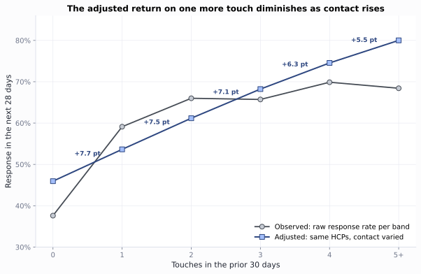
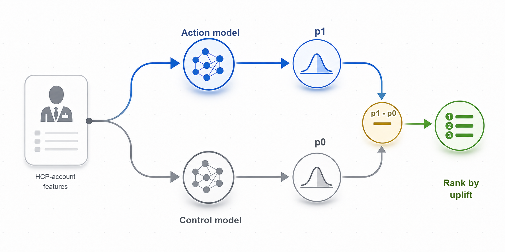

# Chapter 8: Omnichannel Analytics

The HCP targeting output from the previous chapter provides account priority, access flags, and field capacity. The commercial decision now is: what engagement action should run in the next 4 weeks, and on which channel?

We follow HCP0280 and HCP0389 from raw channel events to released plan rows. You will build the event ledger, measure response, credit, lift, and cost as separate quantities, price the channel choices, and release a governed plan that the next-best-action (NBA) engine can consume in the next chapter.

Open [`ch08_walkthrough.ipynb`](ch08_walkthrough.ipynb), or run the blocks below from the repository root.

> **Note:** All products, HCPs, accounts, campaigns, and events are fictional and synthetic.

## 8.1 The Event Ledger

### 8.1.1 Generate the Engagement Data

Generate the supplemental engagement records:

```bash
uv run python ch08_omnichannel/generation_modules/generate_ch08_data.py
```

```text
Omnichannel supplemental data
  engagement_events: 3,650 rows
  engagement_truth: 3,650 rows
Wrote omnichannel data to ch08_omnichannel/data/generated
```

The generator reads the existing HCP, account, permission, and access outputs and adds 10 source channels from January 2024 through March 2025: field, approved email, authenticated web, peer program, speaker program, paid media, conference, direct mail, phone, and account support. It also writes an answer-key file with the planted response probabilities, planted live-program treatment effect, planted field-then-digital sequence effect, and machine-open flags. Those answer-key columns stay outside the analysis. They check whether each method recovers a known truth.

Each monthly snapshot contains one row for one HCP at one affiliated account. Earlier snapshots train the model, and later snapshots test it.

**Listing 8.1**: Load the complete analysis package

```python
from pathlib import Path
import sys
import pandas as pd

ROOT = Path.cwd().resolve()
sys.path.insert(0, str(ROOT))

from ch08_omnichannel.scripts.run_analysis import run_analysis

results = run_analysis(ROOT)
print(f"Ledger events: {len(results['event_ledger']):,}")
print(f"HCP-account snapshots: {len(results['snapshot_panel']):,}")
print(f"Planning HCP-account rows: {len(results['channel_plan']):,}")
```

```text
Ledger events: 3,650
HCP-account snapshots: 1,422
Planning HCP-account rows: 158
```

### 8.1.2 Standardize the Ten Channels

The first step is to turn 10 source systems into one trustworthy record. The ledger keeps the source event and the following source-specific fields for each channel:

1. **Phone:** interaction outcome and follow-up status
2. **Email:** delivery, open, click, qualified action, and opt-out
3. **Direct mail:** delivery, tracked landing visits, and follow-up requests
4. **Paid media:** impressions, viewable impressions, clicks, landing visits, and downloads
5. **Web:** impressions, viewable impressions, clicks, landing visits, and downloads
6. **Peer program (small peer-to-peer education):** invitation, registration, attendance, and follow-up
7. **Speaker program (formal speaker-led education):** invitation, registration, attendance, and follow-up
8. **Conference (congress or event engagement):** registration, attendance, content download, and follow-up
9. **Account support:** access work, transfer status, and resolution
10. **Field:** interaction outcome and follow-up status

Conference engagement covers congress, booth, or symposium activity, such as `Annual J.P. Morgan Healthcare Conference` and `ASCO Annual Meeting`. Speaker programs are formal brand-run speaker-led events, such as `Roventra Clinical Update Series`. Peer programs are smaller brand-run peer-to-peer sessions, such as `Roventra Clinical Roundtable` and `Roventra Local Faculty Session`.

`build_event_ledger()` in `event_ledger.py` constructs the ledger and attaches the channel-specific `meaningful_response` flag. Listing 8.2 calls `channel_delivery_summary()` and Listing 8.3 calls `email_quality_summary()`.

**Listing 8.2**: Summarize delivery and meaningful response by channel

```python
summary = results["channel_summary"].copy()
summary["response"] = summary.response_rate_per_delivered.map(
    lambda x: f"{x:.1%}"
)
view = summary[
    ["channel", "events", "delivered_events",
     "meaningful_responses", "response"]
].set_index("channel")
print(view)
```

```text
                 events  delivered_events  meaningful_responses response
channel                                                                 
Field               815               804                   627    78.0%
Email               724               712                   499    70.1%
Web                 420               415                   287    69.2%
Phone               377               369                   245    66.4%
Paid media          270               249                   120    48.2%
Peer program        256               251                   171    68.1%
Direct mail         246               242                   173    71.5%
Speaker program     211               206                   142    68.9%
Conference          184               180                   123    68.3%
Account support     147               145                    96    66.2%
```

> **Note:** To keep the teaching signal visible, the synthetic response rates are purposely shifted toward the high end. Real omnichannel response rates are far lower, especially email click rates, which often sit in the low single digits.

> **Note:** The `meaningful_response` flag uses a channel-specific rule: positive or follow-up outcome for field and phone; click for email, web, and paid media; tracked landing visit for direct mail; attendance for peer programs, speaker programs, and conferences; and resolution for account support.

The ledger keeps the raw intermediate activity metrics: opens, registrations, impressions, landing visits, downloads, follow-up requests, transfers, and resolutions. The code demonstration collapses each source into delivery and meaningful response.

Each channel also has a measurement failure mode. For example, Apple Mail Privacy Protection can download remote content in the background, so a recorded open may be a machine event. The ledger keeps `Opened` as a response type and sets `meaningful_response = False` for this standalone machine open.

**Listing 8.3**: Compare open and click measures

```python
email = results["email_quality"].copy()
email["rate"] = email.rate.map(lambda x: f"{x:.1%}")
print(email)
```

```text
                         metric  events  base_events   rate
0                 Raw open rate     626          712  87.9%
1  Human open rate (answer key)     563          712  79.1%
2                    Click rate     499          712  70.1%
3            Click-to-open rate     499          626  79.7%
```

## 8.2 Prepare the Modeling Data

The response model in section 8.3 trains on snapshot rows: features built strictly from the past, one outcome label read strictly from the future, and sparse response rates stabilized before they enter as features.

### 8.2.1 Past State and Later Outcome

A snapshot is a cross-sectional record for one HCP-account row at a single point in time, capturing everything known up to that moment and labeling whether a meaningful response follows. The feature window looks back from the snapshot date; the outcome window looks forward; the boundary between them is the snapshot date itself, with no event falling in both windows.

Snapshot dates fall on the last calendar day of each month: January 31, February 28, March 31, and so on through the full 14-month ledger period. Monthly boundaries align with how commercial field planning actually runs: rep territory cycles, promotional budgets, and speaker-program calendars all operate on monthly rhythms. Daily snapshots would produce far more training rows, but a 28-day outcome window means consecutive daily snapshots would have outcome windows that overlap by 27 days, making a clean time-based train/test split nearly impossible without discarding most rows. Weekly snapshots reduce the overlap to 21 days but still require wide gap-based splits. Monthly snapshots solve the problem cleanly: the 28-day outcome window fits inside the one-month gap between snapshot dates, so every row has a non-overlapping outcome window and a clean boundary can be drawn at a single calendar date.

For the February 28 snapshot, the 90-day feature window runs from December 1 through February 28 inclusive; the 28-day outcome window runs from March 1 through March 28. Events on the snapshot date are included in the feature window and never in the outcome window, so there is no same-day leakage.

`build_snapshot_panel()` in `features.py` assembles one row per HCP-account per month, applying these boundary rules. Listing 8.4 traces the raw events for HCP0280 from the event ledger; Listing 8.5 shows the resulting snapshot row.

**Listing 8.4**: HCP0280's past 90-days events

```python
ledger = results["event_ledger"]
cols = ["event_date", "channel", "response_type", "meaningful_response"]
trace = ledger.loc[ledger.npi.eq("9000000280"), cols].tail(3)
print(trace)
```

```text
     event_date channel     response_type  meaningful_response
1690 2025-01-15   Field          Positive                 True
1691 2025-01-24   Email            Opened                False
1692 2025-02-10     Web  Qualified action                 True
```


*Figure 8.1. HCP0280's prior 90-day events build the February 28 state. Events above the timeline produced a meaningful response; events below did not. Outcome events after the dashed line are not shown because HCP0280 had none in the next 28 days. Synthetic data.*

**Listing 8.5**: Inspect the feature and outcome boundary

```python
panel = results["snapshot_panel"]
row = panel.loc[
    panel.npi.eq("9000000280")
    & panel.snapshot_date.eq("2025-02-28")
].iloc[0]
print(f"Snapshot: {row.snapshot_date:%Y-%m-%d}")
print(f"Outcome end: {row.outcome_end:%Y-%m-%d}")
print(f"90-day contact pressure: {int(row.total_pressure_90)} events")
print(f"Later meaningful response: {int(row.future_response)}")
```

```text
Snapshot: 2025-02-28
Outcome end: 2025-03-28
90-day contact pressure: 3 events
Later meaningful response: 0
```

HCP0280 had 3 events in the prior 90 days, 1 in the prior 30 days, and no meaningful responses in the next 28. Static targeting fields repeat across snapshots; event features are rebuilt as time moves. The 19 features passed to the response model are listed below. Section 8.2.2 explains how the shrunken response rate is computed.

| Group | Feature | Window | Unit |
| --- | --- | --- | --- |
| Contact pressure | Total channel touches | 30-day | Count |
| Contact pressure | Total channel touches | 90-day | Count |
| Contact pressure | Recency-weighted touches | 90-day | Weighted count |
| Channel activity | Field meaningful responses | 90-day | Count |
| Channel activity | Email clicks | 90-day | Count |
| Channel activity | Web qualified actions | 90-day | Count |
| Channel activity | Paid-media clicks | 90-day | Count |
| Channel activity | Live-program attendances | 180-day | Count |
| Channel activity | Account-support resolutions | 90-day | Count |
| Channel activity | All-channel engagements | 90-day | Count |
| Response history | Days since last meaningful response | All time | Days |
| Response history | Shrunken response rate | 90-day | Ratio [0, 1] |
| Response history | Recency-weighted responses | 90-day | Weighted count |
| Response history | Digital channel response rate | All time | Ratio [0, 1] |
| Response history | Field channel response rate | All time | Ratio [0, 1] |
| Response history | Last channel to produce a response | All time | Category |
| Static targeting | Evidence need score | Static | Score [0, 1] |
| Static targeting | Access resource score | Static | Score [0, 1] |
| Static targeting | Review opportunity score | Static | Score [0, 1] |

### 8.2.2 Sparse Response Signals

A single click after one delivered email is a weak signal. A one-event rate carries high uncertainty, so the `shrunken_response_rate_90` feature pulls each raw per-HCP rate toward the market-wide rate, with the pull strongest when event count is small. The method is the same beta-binomial partial pooling used for the competitive access and adoption rates: a sparse local rate borrows strength from the market prior, while larger samples stay close to their own data. With a 90-day market rate near 68% and a prior weight of 8, an HCP with 1 response in 1 event moves from 100% to 71.4%; an HCP with 8 responses in 8 events moves from 100% to 83.9%.

`response_shrinkage_summary()` in `features.py` applies the beta-binomial shrinkage and selects representative sparse and established rows for inspection.

**Listing 8.6**: Shrink sparse response rates

```python
shrinkage = results["response_shrinkage"].copy()
for col in ["observed_response_rate_90", "shrunken_response_rate_90"]:
    shrinkage[col] = shrinkage[col].map(lambda x: f"{x:.1%}")
print(shrinkage[
    ["evidence_level", "npi", "meaningful_responses_90", "total_pressure_90",
     "observed_response_rate_90", "shrunken_response_rate_90"]
].to_string(index=False))
```

```text
evidence_level        npi  meaningful_responses_90  total_pressure_90 observed_response_rate_90 shrunken_response_rate_90
        Sparse 9000000008                        1                  1                    100.0%                     71.4%
        Sparse 9000000085                        1                  1                    100.0%                     71.4%
        Sparse 9000000122                        1                  1                    100.0%                     71.4%
   Established 9000000128                        8                  8                    100.0%                     83.9%
   Established 9000000631                        8                  8                    100.0%                     83.9%
   Established 9000000462                        3                  8                     37.5%                     52.7%
```

Every 1-event HCP-account row at 100% raw lands at 71.4% shrunken, near the market rate. Rows with 8 responses in 8 events still shrink and stay closer to their own data at 83.9%. The shrunken rate is 1 of the 19 predictors listed in section 8.2.1. With the ledger built, features computed, and rates stabilized, the training data is ready for section 8.3.

## 8.3 The Response Model

Section 8.3 builds and evaluates the model that scores each HCP-account row for the likelihood of a meaningful response in the next 28 days. Section 8.3.1 covers the regularized logistic regression: its formula, regularization choice, temporal evaluation design, a leakage demonstration, and how to read the calibration and the output coefficients. Section 8.3.2 examines channel order effects and when a sequence model earns its complexity.

### 8.3.1 Regularized Logistic Regression

The model is a regularized logistic regression. The predicted outcome is binary: did a meaningful response occur in the next 28 days? The 19 features from section 8.2 are the inputs, 18 numeric features and 1 categorical response-history field. Logistic regression converts a weighted sum of those features into a response occurrence probability:

$$
p_i = \frac{1}{1 + \exp(-z_i)}, \qquad
z_i = \beta_0 + \sum_{j=1}^{J}\beta_j x_{ij}
$$

For snapshot $i$, each feature $x_{ij}$ carries a fitted coefficient $\beta_j$ that shifts the log-odds of a later meaningful response up or down. Numeric features are standardized; the last-response-channel categorical feature is one-hot encoded.

$$
\mathcal{L} = -\sum_i \left[y_i \log(p_i) + (1 - y_i)\log(1 - p_i)\right] + \lambda \sum_{j=1}^{J}\beta_j^2
$$

In LogisticRegression(C=0.05), C is the inverse of regularization strength in the fitting objective inside scikit-learn, $C = 1 / \lambda$, so $C=0.05$ means a stronger penalty on large coefficients. This regularization keeps coefficients stable with 19 inputs across roughly 950 training snapshots.

This predictive model is not a causal estimate. An HCP with a high score is likely to respond; it may or may not respond because of the next action. That causation link requires the incrementality analysis in section 8.4.3.

`temporal_split()` in `modeling.py` splits the panel by calendar date: snapshots through November 30 train the model, the December 31 snapshot serves as a validation check, and the January and February snapshots form the test set. A random split would let the model train on February rows and be graded on August rows; the calendar split scores every test row with a model that knew nothing after November, which is the situation a deployed model actually faces.

The window discipline from section 8.2.1 is worth demonstrating rather than asserting. `leakage_check()` in `modeling.py` refits the same pipeline twice: once with the 19 past-window features, and once with one extra feature, the count of meaningful responses inside the outcome window itself. That extra column is information from the future dressed up as a feature.

**Listing 8.7**: Demonstrate what one leaked feature does to the score

```python
print(results["leakage_check"].round(3))
```

```text
              model  train_auc  test_auc
0         past_only      0.667     0.711
1  same_window_leak      1.000     1.000
```

The leaked model scores a perfect 1.000 on train and test because its input already contains the answer. In real omnichannel data the leak arrives quietly: a vendor engagement score refreshed after the boundary date, a rolled-up response flag, a file stamped later than its content. An AUC near 1.0 on a promotional response problem is a signal to audit the feature windows, and the honest 0.711 beside it is what a clean past-only model looks like on this problem.

`fit_response_model()` in `modeling.py` fits the classifier and produces `model_metrics`, `response_history_baseline`, `calibration`, and `model_coefficients`. Listing 8.8 reads the first two, Listing 8.9 the calibration table, and Listing 8.10 the coefficients.

**Listing 8.8**: Review the temporal model test and response-history baseline

```python
metrics = results["model_metrics"].copy()
for col in [
    "response_rate", "roc_auc", "average_precision",
    "brier_score", "base_rate_brier",
]:
    metrics[col] = metrics[col].round(3)
print(metrics[[
    "split", "snapshots", "response_rate",
    "roc_auc", "average_precision",
]])
print()
print(metrics[["split", "brier_score", "base_rate_brier"]])
print()
comparison = results["response_history_baseline"].copy()
for col in [
    "test_auc", "average_precision",
    "brier_score", "top_20_response_rate",
]:
    comparison[col] = comparison[col].map(lambda x: f"{x:.3f}")
comparison["top_20_lift"] = comparison.top_20_lift.map(lambda x: f"{x:.2f}x")
comparison = comparison.rename(columns={
    "average_precision": "avg_precision",
    "top_20_response_rate": "top20_rate",
    "top_20_lift": "top20_lift",
})
print(comparison[
    ["model", "test_auc", "avg_precision",
     "brier_score", "top20_rate", "top20_lift"]
].to_string(index=False))
```

```text
        split  snapshots  response_rate  roc_auc  average_precision
0       train        948          0.626    0.667              0.745
1  validation        158          0.437    0.636              0.533
2        test        316          0.484    0.711              0.688

        split  brier_score  base_rate_brier
0       train        0.215            0.234
1  validation        0.266            0.282
2        test        0.234            0.270

                    model test_auc avg_precision brier_score top20_rate top20_lift
               full_model    0.711         0.688       0.234      0.734      1.52x
response_history_baseline    0.641         0.639       0.281      0.719      1.48x
```

The test area under the ROC curve is 0.711. Average precision is 0.688 against a 48.4% response rate. The Brier score is 0.234, better than the 0.270 constant-rate baseline. Those metrics are good for ranking a constrained planning set, but not an indication that any channel caused the response.

The `brier_score` is the mean squared error between each predicted probability and the actual 0/1 outcome, the smaller the better. The `base_rate_brier` column uses one constant probability for every row, equal to the training-set response rate.

The response model baseline performance uses only `shrunken_response_rate_90`, which is the simple rule "prior high responders stay high." The full model improves test AUC from 0.641 to 0.711 and improves Brier score from 0.281 to 0.234. The top-20% response lift changes only from 1.48x to 1.52x, which means past response already carries much of the ranking signal. The model is able to identify high-likelihood response HCPs, then leaves causation and budget movement to uplift and measurement in the next section.

AUC grades ranking: does a responder outrank a nonresponder? The channel plan in section 8.5 also multiplies these probabilities into expected response counts, and that use needs the probability scale itself to be honest. The calibration table cuts the test set into 5 score bins and compares the mean predicted probability in each bin with the observed response rate.

**Listing 8.9**: Check the probability scale against observed rates

```python
cal = results["calibration"].copy()
cal["mean_predicted"] = cal.mean_predicted.map(lambda x: f"{x:.1%}")
cal["observed_rate"] = cal.observed_rate.map(lambda x: f"{x:.1%}")
print(cal.to_string(index=False))
```

```text
 bin_order  snapshots mean_predicted observed_rate
         1         64          40.7%         23.4%
         2         63          52.9%         36.5%
         3         63          61.3%         44.4%
         4         63          68.8%         65.1%
         5         63          78.5%         73.0%
```

The ordering holds in every bin, so the ranking is trustworthy. The scale is optimistic at the bottom: bin 1 predicts 40.7% against an observed 23.4%. The model is most generous exactly where its evidence is thinnest, on the low-activity rows. The channel plan keeps those rows in observation rather than spend, and any expected-response total built from low-score rows inherits this optimism.

**Listing 8.10**: Inspect top feature effects by standardized coefficient

```python
features = (
    results["model_coefficients"]
    .assign(abs_coefficient=lambda frame: frame.coefficient.abs())
    .sort_values("abs_coefficient", ascending=False)
    .head(8)
    .copy()
)
features["feature"] = features.feature.str.replace(
    "last_response_channel_", "last_channel=", regex=False
)
features["coefficient"] = features.coefficient.map(lambda x: f"{x:+.3f}")
features["odds_ratio"] = features.odds_ratio.map(lambda x: f"{x:.2f}")
print(features[["feature", "coefficient", "odds_ratio"]].to_string(index=False))
```

```text
                    feature coefficient odds_ratio
      access_resource_score      +0.215       1.24
      digital_response_rate      +0.185       1.20
live_program_attendance_180      +0.177       1.19
    last_channel=Paid media      -0.126       0.88
   last_channel=Direct mail      -0.123       0.88
        days_since_response      -0.112       0.89
           last_channel=Web      +0.106       1.11
         field_responses_90      +0.098       1.10
```

Feature coefficients explain how the model weights inputs to form the ranking. They are associations after regularization, not causal effects: a high score means an HCP is likely to respond, not that the next planned action will cause the response.

All numeric inputs are standardized before fitting: each coefficient is the log-odds change per one standard deviation, so magnitudes are on a comparable scale across features. The `last_response_channel` dummies are binary 0/1 and not standardized; their coefficients measure log-odds relative to an implicit reference category: every other last-response channel (field, email, web, phone, and the rest).

A negative coefficient does not mean the feature is unimportant; it means higher values push the predicted probability down. `days_since_response` is negative because recency matters: one standard deviation more time since last response reduces the odds of future response by a factor of 0.89. `last_channel=Paid media` and `last_channel=Direct mail` are negative relative to the reference group: an HCP whose most recent meaningful response was a paid-media click or a direct-mail reply is predicted to be less likely to respond than one whose last response came through field, email, web, or phone. Those two channels tend to capture lower-intent engagements, so the direction is sensible.

### 8.3.2 Channel Order Effects

HCP0280 reached this snapshot after a field response, an email open, and a web qualified action, in that order. That sequence is not arbitrary. The synthetic data plants a field-then-digital effect: rows with a field response in the prior 90 days respond at 60.3% over the next 28 days, against 55.4% without one. To verify the planted signal and quantify the AUC gain from adding sequence features, Listing 8.11 builds two logistic regression models. `aggregate_only` trains on four aggregate features: `total_pressure_90`, `shrunken_response_rate_90`, `evidence_need_score`, and `access_resource_score`. `aggregate_plus_sequence` adds the two handcrafted sequence features, `field_then_digital` and `repeated_email`, bringing the feature count to six. The first output table confirms the 60.3% vs 55.4% response rate split among Email/Web last-channel rows; the second compares test AUC for the two models. The 0.707 to 0.714 improvement reflects both sequence features combined; `repeated_email` contributes but is not broken out separately. The response rate table comes from `field_then_digital_contrast()` and the AUC comparison from `sequence_feature_model()`, both in `modern_methods.py`.

**Listing 8.11**: Compare response rates by recent field response and sequence model AUC gain

```python
contrast = results["field_then_digital_contrast"].copy()
contrast["future_response_rate"] = contrast.future_response_rate.map(
    lambda x: f"{x:.1%}"
)
print(contrast.to_string(index=False))
print()
sequence_models = results["sequence_model_comparison"].copy()
sequence_models["roc_auc"] = sequence_models.roc_auc.round(3)
sequence_models["average_precision"] = sequence_models.average_precision.round(3)
print(sequence_models)
```

```text
          recent_field_response  snapshots  future_responses future_response_rate
Field response in prior 90 days        156                94                60.3%
       No recent field response        303               168                55.4%

                     model  test_snapshots  roc_auc  average_precision
0           aggregate_only             427    0.707              0.664
1  aggregate_plus_sequence             427    0.714              0.670
```

The gain is real but modest. Handcrafted sequence features work when the relevant patterns are known in advance, small in number, and stable over time. They require domain expertise to define: which sequences matter? over what lag?

Three feature strategies cover the practical range, and the choice is a data-volume decision:

| Feature strategy | What it can learn | Data it needs | Where it fits |
| --- | --- | --- | --- |
| Aggregate counts (the 19 features here) | How much, how recently, per channel | Hundreds of labeled rows | Default for planning models |
| Handcrafted order flags (`field_then_digital`) | A few named sequences | The same rows plus domain knowledge | Known, stable sequence effects |
| Learned sequence encoders (LSTM, transformer) | Orderings and cross-time patterns nobody named in advance | Long histories (10 to 15+ events per row) and thousands of labeled outcomes | Deep event streams where aggregate lift has flattened |

For most commercial HCP populations, frequency and recency of contact explain more variance than exact ordering, and the 0.007 AUC gain above is typical of what explicit order information adds. A learned encoder replaces the handcrafted flags with patterns discovered from the raw event stream, at the price of more data, more tuning, and less interpretability. It earns that price only when event histories are deep, labeled outcomes are plentiful, and the sequence model beats the aggregate baseline on the same calendar-split test that graded the logistic regression.

## 8.4 Separate Credit from Impact

The response model in section 8.3 ranks HCP-account rows by how likely a meaningful response is. It does not say how much of that response any single touch caused. This section separates the two: it first reads reach and saturation, then allocates path credit across channels, then estimates who responds because of an action, and finally prices that caused response against what a touch costs.

### 8.4.1 Reach and Saturation

Two questions sit underneath every channel budget: which channel mix reaches which HCP-account rows, and what does one more touch add? The first is reach, the second is marginal return, and the raw response rate answers neither on its own. Separating them is where separating credit from impact begins.

Start with reach. HCP0280's prior 90 days hold a field visit, an email, and a web visit, so that row sits in the field-and-digital cell. A digital touch here means email, web, or paid media. Four `reach_group` cells cover all 158 planning rows. `reach_overlap_summary()` in `features.py` builds the table at the February 28 snapshot.

**Listing 8.12**: Cross field and digital reach at the analysis date

```python
overlap = results["reach_overlap"].copy()
overlap["share"] = overlap.share.map(lambda x: f"{x:.1%}")
overlap["response"] = overlap.future_response_rate.map(lambda x: f"{x:.1%}")
print(overlap[
    ["reach_group", "rows", "share", "response"]
].to_string(index=False))
```

```text
      reach_group  rows share response
Field and digital    67 42.4%    67.2%
     Digital only    46 29.1%    52.2%
       Field only    16 10.1%    43.8%
          Neither    29 18.4%     3.4%
```

67 of 158 rows (42.4%) received both field and digital contact in the prior 90 days, and 29 rows (18.4%) received neither. The response column falls in the same order, from 67.2% down to 3.4%.

Read quickly, that looks like proof that more channels cause more response. It is mostly the reverse. The field team calls on the HCPs it expects to answer, and email lists fill up where people click, so the most responsive HCPs are the ones that accumulate the most channels. Contact volume and responsiveness rise together, but the responsiveness came first. The response column is two things blended into one number: who was selected for contact, and what the contact then did. Reach alone cannot pull them apart.

The saturation table pulls them apart by asking the response question two different ways. `saturation_summary()` in `features.py` groups the snapshots by how many touches each received in the prior 30 days, then reports two rates for each band.

The **observed** column is the plain response rate of the rows that actually fall in each band. The 343 snapshots with zero recent touches responded at 37.6%; the 433 with one touch responded at 59.1%. Each band holds a different set of HCPs, so the jump from one observed rate to the next mixes the effect of the touch with the difference between whoever landed in each band.

The **adjusted** column asks a counterfactual instead. A logistic regression fits future response on each row's stable traits, review opportunity, evidence need, access need, and channel affinity, together with its recent touch count. To fill the band-0 cell, the model takes every one of the snapshots, sets its recent touch count to 0 while leaving its own traits untouched, and averages the predicted response: 45.9%. For band 1 it resets every row to a single touch and re-averages: 53.6%. Each adjusted cell is the same full population moved to a common touch level, so the step from one cell to the next isolates the touch and holds the mix of HCPs fixed.

The two columns disagree precisely where selection hides. Observed band 0 sits at 37.6% while adjusted band 0 sits at 45.9%: the rows that genuinely received no contact are below-average responders, so their raw rate understates what zero touches would look like for a typical HCP. `adjusted_marginal_gain` is then the difference between one adjusted band and the band below it, the return on a single added touch for the same HCP.

**Listing 8.13**: Separate selection from the marginal return of a touch

```python
sat = results["saturation"].copy()
for col in ["observed_reach", "adjusted_reach", "adjusted_marginal_gain"]:
    sat[col] = sat[col].map(lambda x: f"{x:.1%}" if pd.notna(x) else "")
print(sat[[
    "recent_events", "snapshots", "observed_reach",
    "adjusted_reach", "adjusted_marginal_gain",
]])
```

```text
  recent_events  snapshots observed_reach adjusted_reach adjusted_marginal_gain
0             0        343          37.6%          45.9%                       
1             1        433          59.1%          53.6%                   7.7%
2             2        350          66.0%          61.2%                   7.5%
3             3        175          65.7%          68.2%                   7.1%
4             4         83          69.9%          74.6%                   6.3%
5            5+         38          68.4%          80.0%                   5.5%
```



*Figure 8.2. Observed response rises steeply then flattens because higher-contact bands hold more responsive HCPs; the adjusted curve moves the same full population across contact levels, and its marginal gain shrinks from 7.7 to 5.5 points. Synthetic data.*

The observed rate jumps 21.5 points between zero and one recent touch, then flattens. The adjusted gain tells: one more touch is worth 7.7 points at low contact and 5.5 points at high contact. Each added touch buys less than the one before it, the diminishing-returns shape every channel budget eventually expects. Neither column proves any single touch caused anything; that question needs the incrementality analysis in section 8.4.3.

### 8.4.2 Attribution Credit

A meaningful response usually follows several touches. The same response can be preceded by paid media, email, a field visit, and a web visit. Attribution allocates credit across those recorded touches, and the brand review may read that credit as a budget signal.

The simplest attribution rules use position in the recorded path. Consider a path where Paid Media leads, then Email, then Field, ending in a response:

| Rule | Credit logic | Who wins this path |
| --- | --- | --- |
| First touch | 100% to the first recorded event | Paid Media |
| Last touch | 100% to the last recorded event | Field |
| Linear | Equal share across all events | 33.3% each |
| Time decay | More weight to events closer in time | Field > Email > Paid Media |

All four rules use the same events and the same 90-day window; only the accounting logic changes. `attribution_comparison()` in `sequences.py` applies all four rules to the 90-day paths in the event ledger.

**Listing 8.14**: Compare channel credit across heuristic rules

```python
credit = results["attribution"].set_index("channel")
credit = credit.rename(columns={
    "first_touch": "first", "last_touch": "last",
    "linear": "linear", "time_decay": "decay",
})
print(credit.round(1))
```

```text
                 first  last  linear  decay
channel                                    
Email             24.2  21.7    22.2   22.4
Field             15.9  25.5    20.7   22.1
Web               11.5  10.8    11.5   10.9
Phone             14.0   6.4     9.8    8.6
Peer program       7.6   8.9     9.1    9.6
Speaker program    7.0   5.7     6.7    6.1
Paid media         4.5   3.8     5.8    5.4
Direct mail        9.6   7.6     5.8    5.5
Conference         3.8   5.7     5.3    5.5
Account support    1.9   3.8     3.2    4.0
```

Email receives 24.2% of credit under first touch and 21.7% under last touch, because it opens recorded paths more often than it closes them. Field runs the other way: 15.9% under first touch and 25.5% under last touch, because it closes paths more often than it opens them.

The data-driven alternative models the journey as a chain of channel-to-channel transitions ending in response or nonresponse. The method is a Markov chain removal effect, implemented in three steps. First, every 90-day path is converted into a sequence of transitions: start → channel A → channel B → conversion (or null). Second, those transition counts are normalized into probabilities and assembled into a transition matrix. Solving the fundamental matrix of the absorbing Markov chain gives the baseline conversion probability across all observed paths. Third, for each channel, every transition into and out of that channel is removed from the matrix and the chain is re-solved. The removal effect is the relative drop in conversion probability: a channel that many converting paths pass through will cause a large drop when removed. Credits are the removal effects normalized to sum to 100%.

An alternative data-driven method is Shapley values, borrowed from cooperative game theory. Shapley treats each channel as a player in a coalition and defines a channel's credit as its average marginal contribution across all possible subsets of channels. It is theoretically more principled but requires evaluating 2ⁿ channel subsets, which is expensive for ten or more channels and demands enough path data to estimate each coalition's conversion rate reliably. Markov removal effect is cheaper, interpretable directly from the observed transition graph, and sufficient for commercial planning decisions where the goal is a relative budget signal rather than a rigorous game-theoretic allocation.

`markov_attribution()` in `sequences.py` fits the transition matrix and computes removal effects for all ten channels.

**Listing 8.15**: Allocate credit by Markov removal effect

```python
markov = results["markov_attribution"].copy()
markov["removal_effect"] = markov.removal_effect.map(lambda x: f"{x:.2f}")
markov["markov_credit"] = markov.markov_credit.map(lambda x: f"{x:.1f}")
print(markov.to_string(index=False))
```

```text
        channel removal_effect markov_credit
          Field           0.56          17.3
          Email           0.55          17.0
            Web           0.39          12.1
          Phone           0.36          11.2
   Peer program           0.30           9.2
Speaker program           0.27           8.3
    Direct mail           0.23           7.1
     Conference           0.21           6.5
     Paid media           0.21           6.4
Account support           0.16           4.9
```

Field and Email carry the most credit at 17.3% and 17.0%, and account support the least at 4.9%.

**Which rule to use.** First touch and last touch are simple and intuitive but extreme: one channel takes everything. They are useful for focused questions about what started the engagement or what closed it. They are misleading for channels that play a consistent middle role. Linear and time decay spread credit across the path; time decay is appropriate when recent touches are more diagnostic of response. Markov removal effect is the most defensible for data-driven budget reviews because it accounts for the actual frequency and sequence of channel transitions rather than imposing a positional rule. It requires enough path observations to estimate the transition matrix reliably.

No heuristic rule is causal. First-touch credit for paid media does not mean paid media caused response; it may mean paid media is deployed early in the engagement sequence regardless of outcome. The Markov removal effect is still path accounting. It reflects which channels appear on converting paths, not which channels caused conversion.

Attribution is also one of three measurement families a commercial team runs together, and knowing which family answers which question prevents most measurement arguments. Path attribution, this section, reads recorded touch sequences and produces relative credit. Randomized experiments manufacture the counterfactual for one action at a time and carry the most evidential weight; the experiments and incrementality work later in the book builds them. Marketing mix modeling works top-down from spend and outcome time series and covers channels that leave no individual trace, such as congress presence or unauthenticated media reach; the unified measurement chapter builds it. Consumer marketing shifted its weight toward the last two families when privacy changes broke user-level tracking. HCP promotion still runs largely on first-party systems against a known prescriber universe, so path-level attribution stays feasible here. The next 2 subsections answer: who responds because of an action, and what the caused response costs.

### 8.4.3 Incrementality: Who Responds Because of Us

A response model scores who is likely to respond, and attribution scores which channels sat on the recorded path. The budget question is narrower: does a specific action, such as a program invitation, an email, or a field visit, change whether this HCP-account row responds at all? Some HCPs respond regardless, and a scarce program invitation spent on one of them buys nothing that was not already coming.

Uplift modeling places every HCP-account row into one of four behavioral types, defined by two questions: would it respond without an action, and does the action change that?


*Figure 8.3. Four HCP behavioral types in uplift modeling. Arrows show how action changes predicted response: persuadable rows move up, sure things stay high, lost causes stay low, and sleeping dogs move down.*

- **Persuadables** are the primary target. Their baseline response is low, but the action moves them, so every program slot spent here produces genuine incremental return.
- **Sure Things** respond at high rates whether contacted or not; sending them a scarce program invitation looks good in a response-rate report but produces little to no incremental change, because they would have responded anyway.
- **Lost Causes** respond poorly regardless of what is done; budget spent here generates neither response nor goodwill.
- **Sleeping Dogs** are the most counterintuitive segment: their baseline response is high, but an action, particularly an unsolicited outreach, actually reduces their probability of response, perhaps because it disrupts an existing relationship or signals pressure.

Standard response models find Sure Things and Persuadables alike because Persuadables and Sure Things both score high on predicted response. Sending program invitations to Sure Things produces high observed response rates but no incremental return. To separate them, the analysis compares each row's predicted response *with* a program against its predicted response *without* one. That difference is the estimated uplift.

A T-learner estimates uplift from historical snapshots. The treatment is prior live-program contact. The action model trains on rows with prior live-program contact. The control model trains on rows without it. Both models use only pre-action features. At scoring time, every HCP-account row goes through both models. Let `p1` be the predicted response with program contact, and let `p0` be the predicted response without it.

$$
\hat{\tau}_i = \hat{p}_{1i} - \hat{p}_{0i}
$$



*Figure 8.4. A T-learner scores the same HCP-account row with action and control models, subtracts p0 from p1, and ranks rows by uplift. Synthetic data.*

Applied to the two HCP types: a Sure Thing might score 80% from the action model and 80% from the control model, with uplift near zero. A Persuadable might score 60% from the action model and 45% from the control, with uplift of 15 points. The Sure Thing has the higher raw response probability; the Persuadable has the higher expected change. Scarce program invitations should follow expected change after eligibility and compliance rules are satisfied.

`uplift_segment_summary()`, `uplift_ranking_comparison()`, and `uplift_diagnostics()` in `modern_methods.py` implement the T-learner and produce the outputs in Listings 8.16 and 8.17.

**Listing 8.16**: Estimate uplift and contrast it with response

```python
segments = results["uplift_segment_summary"].copy()
for col in ["response_rate", "mean_baseline_response",
            "mean_predicted_response_if_contacted", "mean_uplift"]:
    segments[col] = segments[col].map(lambda x: f"{x:.1%}")
print(segments.to_string(index=False))
```

```text
uplift_segment  snapshots response_rate mean_baseline_response mean_predicted_response_if_contacted mean_uplift
          High        285         45.3%                  43.0%                                57.0%       14.0%
      Mid-high        284         45.4%                  45.2%                                56.3%       11.1%
           Mid        284         60.9%                  50.6%                                59.8%        9.1%
       Mid-low        284         67.6%                  58.8%                                65.8%        7.0%
           Low        285         67.4%                  66.5%                                70.8%        4.3%
```

The uplift ranking inverts the priority list. `response_rate` is the observed response in the historical mix of contacted and uncontacted rows. `mean_baseline_response` is the control model's predicted response without program contact (`p0`). `mean_predicted_response_if_contacted` is the action model's predicted response under program contact (`p1`). `mean_uplift` is the average difference, `p1 - p0`. The high-uplift segment responds at 45.3% with a 43.0% baseline, but the action model predicts 57.0% response for those same rows under program contact, giving a 14.0% estimated uplift. The low-uplift segment responds at 67.4% with a 66.5% baseline and 70.8% predicted if contacted: program contact moves them only 4.3 points because they are close to their ceiling. Ranking by response sends programs to HCPs who would respond anyway. Ranking by uplift sends them where behavior changes by program contact.

Figure 8.5 makes the geometry of the two rankings visible in the same coordinate space.


*Figure 8.5. Each point is one HCP-account snapshot plotted by its control-model score (p0, x-axis) and action-model score (p1, y-axis). Color shows estimated uplift. The dotted diagonal is the zero-uplift line where p1 = p0. The gold band selects the top 20% by p0 (response ranking). The green region selects the top 20% by p1 − p0 (uplift ranking). The two selections share only 3 of 284 rows. Synthetic data.*

Response ranking draws a vertical cutoff: select everyone whose baseline response is already high. That sweeps in the Sure Things on the right. Uplift ranking draws a diagonal cutoff: select everyone far above the zero-uplift line regardless of where they sit horizontally. That sweeps in the Persuadables on the upper-left. Listing 8.17 prints the comparison behind the figure, then the diagnostics that stress-test the estimate itself.

**Listing 8.17**: Compare the two rankings and check the estimate against selection

```python
ranking = results["uplift_ranking_comparison"].copy()
for col in ["mean_baseline_response", "mean_estimated_uplift"]:
    ranking[col] = ranking[col].map(lambda x: f"{x:.1%}")
ranking = ranking.rename(columns={
    "mean_baseline_response": "mean_baseline",
    "mean_estimated_uplift": "mean_uplift",
    "rows_shared_with_other_ranking": "shared_rows",
})
print(ranking.to_string(index=False))
print()
diagnostics = results["uplift_diagnostics"].copy()
for col in [c for c in diagnostics.columns if "snapshots" not in c]:
    diagnostics[col] = diagnostics[col].map(lambda x: f"{x:.1%}")
print(diagnostics.T.rename(columns={0: "value"}))
```

```text
        ranking  selected mean_baseline mean_uplift  shared_rows
response_ranked       284         72.4%        5.7%            3
  uplift_ranked       284         42.9%       14.1%            3

                                 value
treated_snapshots                  782
control_snapshots                  640
naive_treated_minus_control      17.0%
mean_estimated_uplift             9.1%
observed_uplift_top_quartile     14.4%
observed_uplift_bottom_quartile   7.3%
```

Both rankings select 284 rows and agree on only 3 (1%): they target almost entirely different HCPs. The response ranking's selections carry a 72.4% baseline and 5.7% estimated uplift; the uplift ranking's carry a 42.9% baseline and 14.1% estimated uplift.

The diagnostics rows apply the same skepticism to the uplift estimate that this chapter applied to attribution. Live-program attendance is not assigned at random: the brand invites the HCPs it expects to engage, and the HCP then chooses to attend, so attendees were more responsive before any program effect existed. That selection is visible in the numbers: the raw gap between attended and unattended rows is 17.0 points, while the T-learner's covariate-adjusted mean uplift is 9.1 points. Nearly half of the raw gap was who attends rather than what attendance does. The adjustment is only as good as the measured covariates; an unmeasured reason for attending, a KOL relationship or a trial-site history, passes through it untouched. The last two rows check whether the ranking still finds real signal after adjustment: rows the model places in its top uplift quartile show a 14.4-point observed treated-minus-control gap, against 7.3 points in the bottom quartile, so the ranking separates genuinely different rows rather than noise.

Where treatment groups are badly imbalanced, an X-learner stabilizes the thin side; doubly robust learners add a propensity model so the estimate survives one of the two models being wrong; causal forests attach uncertainty to each row's estimate. Those tools arrive with the observational causal inference work later in the book. Before a live budget shift, a randomized holdout remains the confirmation that no observational estimate, including this one, can supply.

> **Note on scale.** The scatter axes run from 25% to 90% because the synthetic data is calibrated toward higher response rates to keep the teaching signal visible (see the note in section 8.1.2). In a real omnichannel dataset, field meaningful response rates typically sit in the 20% to 40% range and email click rates in the low single digits; the cloud of dots would compress to the lower-left corner of the chart. The geometric structure is preserved regardless of the absolute scale.

### 8.4.4 Credit, Lift, and Cost

Attribution said email and field each carry about 17% of the credit. Uplift said the highest responders often move the least. One budget input remains: what a touch costs. A channel can dominate the attribution dashboard, drive real incremental response, and still be too expensive to scale broadly.

The economics table places three numbers side by side for every channel.

**1. Attribution credit** (Markov removal effect): what share of response paths pass through this channel? This is path accounting, not causation.

**2. Incremental response per touch** ($\Delta\hat{p}_c$): the estimated change in predicted response probability when one additional touch from channel $c$ is added to a row, holding all other features fixed:

$$
\Delta\hat{p}_c = \hat{p}(\mathbf{x} + \mathbf{e}_c) - \hat{p}(\mathbf{x})
$$

where $\mathbf{e}_c$ is a unit increment to channel $c$'s touch count. This is observational, not a randomized holdout estimate. It should be confirmed with an experiment before a live budget shift. It is also a local estimate at current contact levels: the saturation table in section 8.4.1 showed the marginal gain shrinking as contact rises, so this number does not scale to "add ten more touches."

**3. Cost per incremental response** ($\text{CPI}_c$): the unit cost of one touch divided by the estimated incremental response it produces:

$$
\text{CPI}_c = \frac{\text{unit cost}_c}{\Delta\hat{p}_c}
$$

When $\Delta\hat{p}_c \leq 0$, the channel shows no measurable lift and $\text{CPI}_c$ is undefined ("no lift"). Working through two concrete rows from the table below: email costs \$0.25 per touch and one more email adds 1.4 points of predicted response, so an incremental email response costs about \$17. Field costs \$225 per touch and adds 1.9 points, so an incremental field response costs about \$12,000. The two channels carry almost identical attribution credit, and their cost per incremental response differs by a factor of roughly 700.

`channel_economics()` in `economics.py` joins the Markov credit shares, coefficient-based incremental response estimates, and unit costs into this table.

**Listing 8.18**: Join attribution credit with incremental response and cost

```python
econ = results["channel_economics"].copy()
econ["credit"] = econ.markov_credit.map(lambda x: f"{x:.1f}%")
econ["incremental"] = econ.incremental_per_touch.map(
    lambda x: f"{x * 100:+.1f} pp"
)
econ["unit_cost"] = econ.unit_cost.map(lambda x: f"${x:,.2f}")
econ["cost_per_incremental"] = econ.cost_per_incremental_response.map(
    lambda x: f"${x:,.0f}" if pd.notna(x) else "no lift"
)
print(econ[
    ["channel", "credit", "incremental", "unit_cost", "cost_per_incremental"]
].to_string(index=False))
```

```text
        channel credit incremental unit_cost cost_per_incremental
          Field  17.3%     +1.9 pp   $225.00              $12,049
          Email  17.0%     +1.4 pp     $0.25                  $17
            Web  12.1%     +0.0 pp     $0.12              no lift
          Phone  11.2%     -2.2 pp    $28.00              no lift
   Peer program   9.2%     +1.4 pp   $340.00              $24,169
Speaker program   8.3%     -0.9 pp $1,150.00              no lift
    Direct mail   7.1%     -2.4 pp     $2.60              no lift
     Conference   6.5%     +4.4 pp   $760.00              $17,394
     Paid media   6.4%     +1.0 pp     $1.40                 $142
Account support   4.9%     -1.3 pp   $130.00              no lift
```


*Figure 8.6. Email, field, and web look different once path credit, adjusted lift, and cost per incremental response are read together. Synthetic data.*

Read the table left to right. Field and email carry almost the same credit, 17.3% and 17.0%, while their cost per incremental response is $12,049 against $17. Paid media carries less credit than either, but its low unit cost produces a $142 cost per incremental response. Conference earns 6.5% of credit and has a high cost per incremental response at $17,394.

Four channels print negative adjusted lift. A negative number here almost never means the touch suppresses response. Phone and account support fire when something has already gone wrong, an access barrier or a fulfillment problem, and direct mail is aimed at HCPs the digital channels fail to reach. The table prints "no lift" rather than a negative cost for this reason. Treating it as a measured zero. These channels are candidates for an experiment, and candidates to hold rather than grow while the estimate stays unmeasured.

The table also appears to disagree with section 8.4.3: the T-learner recovered a positive live-program effect, yet speaker program prints no lift while peer program prints +1.4 points. The two methods answer different questions. The T-learner estimates what attendance changes for the selected population that gets invited and attends. The economics model estimates the average change from one additional touch spread across every row, including the many rows a program would never reach. A channel can move its targeted audience and still show little on the average-touch question. That gap is exactly why scarce program invitations run as ranked, capacity-capped selections rather than as broad frequency, and why exercise 2 re-ranks those selections by uplift.

Cost per incremental response prices a channel in responses. The brand pays in dollars and is paid in prescriptions, so the last step converts the response into value. A meaningful response is a proximal outcome: a click, an attendance, a positive field conversation. The terminal outcome is the prescribing behavior it precedes. This chapter carries that conversion as one documented scenario constant, shared with the next-best-action engine: one incremental meaningful response is worth \$4,000 in expected net TRx value. The constant is a planning assumption, to be replaced by a measured conversion once the experiments and incrementality work later in the book links engagement response to prescribing.

One more email adds 1.4 points of response probability, and 1.4% of \$4,000 is \$58 of expected value against \$0.25 of cost. One more field call adds 1.9 points, \$75 of expected value against \$225 of cost, so the average field touch loses about \$150. The breakeven column generalizes the comparison: a touch pays for itself when its response lift exceeds its unit cost divided by \$4,000. `channel_value_bridge()` in `economics.py` computes the value columns from the economics table.

**Listing 8.19**: Convert incremental response into expected value per touch

```python
bridge = results["channel_value_bridge"].copy()
bridge["lift"] = bridge.incremental_per_touch.map(lambda x: f"{x * 100:+.1f} pp")
bridge["value_per_touch"] = bridge.expected_value_per_touch.map(
    lambda x: f"${x:,.0f}" if pd.notna(x) else "not measurable"
)
bridge["unit_cost"] = bridge.unit_cost.map(lambda x: f"${x:,.2f}")
bridge["net_per_touch"] = bridge.net_value_per_touch.map(
    lambda x: f"${x:,.0f}" if pd.notna(x) else "not measurable"
)
bridge["breakeven_lift"] = bridge.breakeven_lift.map(lambda x: f"{x * 100:.2f} pp")
print(bridge[[
    "channel", "lift", "value_per_touch", "unit_cost",
    "net_per_touch", "breakeven_lift",
]].to_string(index=False))
```

```text
        channel    lift value_per_touch unit_cost  net_per_touch breakeven_lift
          Email +1.4 pp             $58     $0.25            $57        0.01 pp
     Paid media +1.0 pp             $39     $1.40            $38        0.03 pp
          Field +1.9 pp             $75   $225.00          $-150        5.62 pp
   Peer program +1.4 pp             $56   $340.00          $-284        8.50 pp
     Conference +4.4 pp            $175   $760.00          $-585       19.00 pp
            Web +0.0 pp  not measurable     $0.12 not measurable        0.00 pp
          Phone -2.2 pp  not measurable    $28.00 not measurable        0.70 pp
Speaker program -0.9 pp  not measurable $1,150.00 not measurable       28.75 pp
    Direct mail -2.4 pp  not measurable     $2.60 not measurable        0.07 pp
Account support -1.3 pp  not measurable   $130.00 not measurable        3.25 pp
```

Email and paid media clear their breakeven at any plausible lift, which is why cheap channels run broadly. Field breaks even at 5.62 points against a 1.9-point average, so broad field frequency loses money at these scenario numbers; the high-uplift tier in section 8.4.3 moves about 14 points, and that is where a \$225 touch pays. Peer programs follow the same logic at an 8.50-point breakeven. Conference needs 19 points, more than even the persuadable tier delivers, so at this scenario value conference spending needs a justification beyond per-touch response, such as reaching HCPs no other channel can. Speaker programs would need 28.75 points before any lift is even measured, which is why they run as a few targeted seats and never as media. The channel plan in the next section operationalizes this logic: cheap channels run broadly, and expensive actions sit behind capacity limits that concentrate them on ranked rows.

## 8.5 The Channel Plan

Everything so far produces evidence: reach, scores, credit, uplift, and cost. The channel plan converts that evidence into one released action per HCP-account row for the 4-week cycle, and it applies the rules in a fixed order: permission and account holds first, access routing second, pressure caps third, field capacity fourth, and only then response ranking inside the eligible set. A row with a coverage barrier gets access work before any promotion regardless of its score, and a row that opted out gets nothing at all. `build_channel_plan()` and `plan_summary()` in `policy.py` implement the rule set, `channel_affinity_trace()` in `economics.py` shows the routing input, and `capacity_value_summary()` in `run_analysis.py` compares capacity selections. Listings 8.20 through 8.23 read them in order.

Promotion routes through the channel each HCP actually answers. Every HCP carries a stable digital and field response rate from the targeting work, and the dominant rate names the responsive channel.

**Listing 8.20**: Route each action to the responsive channel

```python
aff = results["channel_affinity"].copy()
for col in ["digital_response_rate", "field_response_rate"]:
    aff[col] = aff[col].map(lambda x: f"{x:.0%}")
aff = aff.rename(columns={
    "digital_response_rate": "digital_rate",
    "field_response_rate": "field_rate",
})
print(aff[[
    "npi", "digital_rate", "field_rate",
    "channel_affinity", "recommended_channel",
]].to_string(index=False))
```

```text
       npi digital_rate field_rate  channel_affinity recommended_channel
9000000522          80%        20% Digital responder               Email
9000000567          24%        78%   Field responder               Field
9000000406          70%        14% Digital responder               Email
```

HCP 9000000522 responds digitally at 80% and through field at 20%, so its follow-up goes to email. HCP 9000000567 runs the other way and gets field. Each row receives one action through its own responsive channel.

**Listing 8.21**: Release the plan and count the actions

```python
plan = results["plan_summary"].copy()
plan["mean_score"] = plan.mean_predicted_response.map(lambda x: f"{x:.1%}")
print(plan[[
    "recommended_action", "relationships",
    "planned_contacts", "mean_score",
]].rename(columns={
    "relationships": "hcp_account_rows",
    "planned_contacts": "planned_engagements",
}))
```

```text
           recommended_action  hcp_account_rows  planned_engagements mean_score
0                     Observe                61                    0      58.6%
1                    Suppress                46                    0      51.0%
2         Access coordination                35                   35      66.5%
3             Email follow-up                 6                   12      75.1%
4     Peer-program invitation                 5                    5      75.1%
5  Speaker-program invitation                 4                    4      77.8%
6             Field follow-up                 1                    2      65.9%
```

The gates dispose of most of the 158 planning rows before promotion enters. 46 rows are suppressed on permission, 35 route to access coordination because a coverage barrier blocks treatment ahead of any promotional message, and 61 sit in observation with no planned touch. The remaining 16 rows receive promotional actions matched to their own response history: 6 email follow-ups carrying up to 2 emails each, 5 peer-program and 4 speaker-program invitations, and 1 field follow-up. Each released row carries a reason code, a cycle frequency cap, a measurement hook, the rule-set version, and a refresh date.

Capacity is the binding constraint on those 16 promotional slots: 2 field-led actions per territory across 8 territories, with 72 promotion-eligible rows competing for them. Whether ranking those slots by model score is worth anything is a measurable question.

**Listing 8.22**: Value the capacity ranking against a territory-order baseline

```python
value = results["capacity_value"].copy()
value["expected_responses"] = value.expected_responses.map(lambda x: f"{x:.2f}")
value["mean_score"] = value.mean_predicted_response.map(lambda x: f"{x:.1%}")
print(value[[
    "selection_rule", "relationships",
    "expected_responses", "mean_score",
]].rename(columns={"relationships": "hcp_account_rows"}))
```

```text
             selection_rule  hcp_account_rows expected_responses mean_score
0              model_ranked                16              12.03      75.2%
1  territory_order_baseline                16              11.41      71.3%
```

Filling the same 16 slots by model rank rather than territory order raises expected responses from 11.41 to 12.03, a 5% gain from ranking alone, priced in the model probabilities whose scale section 8.3.1 checked. The final view is the released row itself, traced for the HCPs followed through the book.

**Listing 8.23**: Trace released plan rows

```python
ids = ["9000000174", "9000000239", "9000000280",
       "9000000389", "9000000430", "9000000469"]
cols = [
    "npi", "recommended_action", "recommended_channel",
    "predicted_response", "maximum_cycle_frequency",
    "measurement_hook", "policy_version", "refresh_date", "reason_code",
]
traces = results["channel_plan"].loc[
    results["channel_plan"].npi.isin(ids), cols
].sort_values("npi")
for row in traces.itertuples(index=False):
    refresh = pd.to_datetime(row.refresh_date).date()
    print(f"{row.npi}: {row.recommended_action}")
    print(f"  channel: {row.recommended_channel}")
    print(f"  score: {row.predicted_response:.1%}")
    print(f"  max frequency: {row.maximum_cycle_frequency}")
    print(f"  hook: {row.measurement_hook}")
    print(f"  version: {row.policy_version}")
    print(f"  refresh: {refresh}")
    print(f"  reason: {row.reason_code}")
```

```text
9000000174: Email follow-up
  channel: Email
  score: 79.9%
  max frequency: 2
  hook: Track delivery and click
  version: ch08-channel-policy-v1.1
  refresh: 2025-03-31
  reason: CAPACITY_RANKED_DIGITAL_RESPONSE
9000000239: Peer-program invitation
  channel: Peer program
  score: 83.9%
  max frequency: 1
  hook: Track invitation, attendance, and follow-up
  version: ch08-channel-policy-v1.1
  refresh: 2025-03-31
  reason: CAPACITY_RANKED_PEER_RESPONSE
9000000280: Observe
  channel: None
  score: 49.6%
  max frequency: 0
  hook: Refresh pressure and response state
  version: ch08-channel-policy-v1.1
  refresh: 2025-03-31
  reason: OBSERVE_BELOW_CAPACITY_CUTOFF
9000000389: Observe
  channel: None
  score: 59.3%
  max frequency: 0
  hook: Refresh pressure and response state
  version: ch08-channel-policy-v1.1
  refresh: 2025-03-31
  reason: OBSERVE_BELOW_CAPACITY_CUTOFF
9000000430: Access coordination
  channel: Access support
  score: 53.6%
  max frequency: 1
  hook: Track access status and resolved attempts
  version: ch08-channel-policy-v1.1
  refresh: 2025-03-31
  reason: ROUTE_ACCESS_BOUNDARY
9000000469: Suppress
  channel: None
  score: 65.0%
  max frequency: 0
  hook: Audit suppression compliance
  version: ch08-channel-policy-v1.1
  refresh: 2025-03-31
  reason: SUPPRESS_PERMISSION
```

Every release and every hold is auditable. HCP 9000000174 responds digitally and gets an email follow-up; 9000000239 attends peer programs and gets the next invitation. HCP0280, the row followed since the ledger section, stays in observation: 3 touches in 90 days and a 49.6% predicted response leave it below the capacity cutoff, and nothing is forced. HCP0389, the second carried case, also lands in observation at a 59.3% predicted response even though its recent email click, web action, and field follow-up mark it as engaged. Response-ranked capacity leaves rows like this behind; the next-best-action engine revisits the same state with expected incremental value per action and reaches a different answer for exactly this row. HCP 9000000430's coverage barrier routes it to access coordination, and 9000000469's opt-out suppresses all contact.

The opening decision is now answered for every row. Of 158 HCP-account rows, 46 are suppressed on permission, 35 route to access work ahead of promotion, 61 wait in observation, and 16 receive a promotional action on the channel each HCP answers, under a frequency cap, with a reason code and a measurement hook attached. The evidence behind the releases is honest about its own limits: the response ranking is calibrated but optimistic at the low end, the per-touch lift and uplift estimates are observational, and the \$4,000 response value is a scenario constant. The plan ships with its warning attached: confirm the uplift ranking with a randomized holdout before moving real program budget, and treat the released cycle itself as the first measurement.

## 8.6 Summary

The opening decision was which engagement action each eligible HCP-account row should receive in the next 4 weeks, and on which channel. The event ledger made 10 source systems comparable while preserving what each channel can honestly claim to measure. The reach table showed where the channel families overlap, and the saturation curve separated selection from return, with the adjusted gain of one more touch falling from 7.7 to 5.5 points as contact rises. Snapshots kept features and outcomes on opposite sides of a boundary date, the leakage check showed the perfect score that boundary prevents, and the response model ranked the eligible set at a 0.711 test AUC with a calibration table honest about its weak low end. Attribution credited field and email about 17% each, uplift showed that response ranking and uplift ranking share 3 rows in 284, economics priced an incremental response at \$17 on email against roughly \$12,000 on field, and the value bridge converted lift into dollars per touch against a \$4,000 scenario response value. The channel plan released the result as governed, reason-coded rows.

You can now unify heterogeneous channel systems into an event ledger that preserves each source's measurement semantics, read reach and saturation before modeling, build and temporally validate a leakage-free response model and check its calibration, allocate attribution credit and state exactly what it does and does not claim, estimate uplift with a T-learner and stress-test it against selection, convert channel lift into cost per incremental response and expected value per touch, and release a governed, reason-coded channel plan that a next-best-action engine can consume.

## 8.7 Exercises

1. **Audit the snapshot boundary.** Use the event ledger and snapshot panel. For HCP0280 on February 28, 2025, count prior 90-day events, count future events in the next 28 days, and compare those counts with the snapshot row. State why the response model must keep past features and future outcomes on opposite sides of the snapshot date. (Past state and later outcome.)
2. **Rank by uplift.** Use the uplift output. The channel plan's capacity ranking released 16 promotional slots by predicted response. Select 16 slots by estimated uplift instead, then compare which HCP-account rows enter the plan under each version. State which rows drop out and why a sure-thing responder might be a weak use of a scarce program invitation. (Incrementality.)
3. **Stress-test channel economics.** Use the channel economics table. Double the unit cost of email and cut paid media's incremental response by half, then recompute cost per incremental response for both channels. State whether the ranking changes and which assumption drives the change. (Credit, lift, and cost.)

Worked solutions are in [`ch08_exercise_solutions.ipynb`](ch08_exercise_solutions.ipynb). Each solution ends with the judgment an analyst should record for real data. The plan state built here, one dated row per HCP-account with an action, a reason code, and a measurement hook, is the input the next-best-action engine turns into a single governed recommendation.
