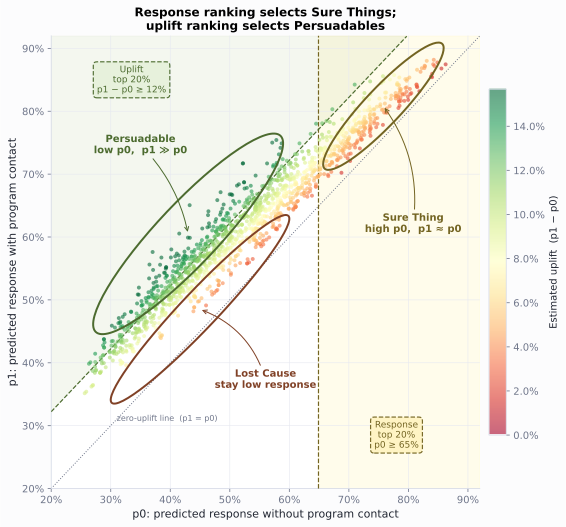

# Omnichannel Analytics

Build the 4-week channel plan for the fictional Roventra launch. Start with HCP-account targeting, turn 10 source channels into one event ledger, build a dated channel state, compare response, attribution, uplift, and cost, then release a governed plan row for the next-best-action engine.


```python
from pathlib import Path
import sys
import pandas as pd

ROOT = Path.cwd().resolve()
if not (ROOT / "pyproject.toml").exists():
    ROOT = ROOT.parent
sys.path.insert(0, str(ROOT))
sys.path.insert(0, str(ROOT / "ch08_omnichannel" / "generation_modules"))
sys.path.insert(0, str(ROOT / "ch08_omnichannel" / "scripts"))

from ch08_omnichannel.generation_modules.synthetic import generate  # noqa: E402
from ch08_omnichannel.scripts.run_analysis import run_analysis  # noqa: E402

pd.set_option("display.width", 88)
pd.set_option("display.max_columns", None)
generate(ROOT, ROOT / "ch08_omnichannel" / "data" / "generated")
results = run_analysis(ROOT)
print(f"Ledger events: {len(results['event_ledger']):,}")
print(f"HCP-account snapshots: {len(results['snapshot_panel']):,}")
print(f"Planning HCP-account rows: {len(results['channel_plan']):,}")

```

    Ledger events: 3,650
    HCP-account snapshots: 1,422
    Planning HCP-account rows: 158


## Descriptive: the event ledger


```python
summary = results["channel_summary"].copy()
summary["response"] = summary.response_rate_per_delivered.map(lambda x: f"{x:.1%}")
print(summary[[
    "channel", "events", "delivered_events",
    "meaningful_responses", "response",
]].set_index("channel"))

```

                     events  delivered_events  meaningful_responses response
    channel                                                                 
    Field               815               804                   627    78.0%
    Email               724               712                   499    70.1%
    Web                 420               415                   287    69.2%
    Phone               377               369                   245    66.4%
    Paid media          270               249                   120    48.2%
    Peer program        256               251                   171    68.1%
    Direct mail         246               242                   173    71.5%
    Speaker program     211               206                   142    68.9%
    Conference          184               180                   123    68.3%
    Account support     147               145                    96    66.2%


Email opens stay visible in the ledger. Clicks define meaningful email response.


```python
email = results["email_quality"].copy()
email["rate"] = email.rate.map(lambda x: f"{x:.1%}")
print(email)

```

                             metric  events  base_events   rate
    0                 Raw open rate     626          712  87.9%
    1  Human open rate (answer key)     563          712  79.1%
    2                    Click rate     499          712  70.1%
    3            Click-to-open rate     499          626  79.7%


```python
ledger = results["event_ledger"]
cols = ["event_date", "channel", "response_type", "meaningful_response"]
print(ledger.loc[ledger.npi.eq("9000000280"), cols].tail(3))

```

         event_date channel     response_type  meaningful_response
    1690 2025-01-15   Field          Positive                 True
    1691 2025-01-24   Email            Opened                False
    1692 2025-02-10     Web  Qualified action                 True


## Descriptive: reach, overlap, and saturation


The reach table crosses the two largest channel families. The response column mixes who was chosen with what the contact did: the field team calls on the HCPs it expects to answer.


```python
overlap = results["reach_overlap"].copy()
overlap["share"] = overlap.share.map(lambda x: f"{x:.1%}")
overlap["response"] = overlap.future_response_rate.map(lambda x: f"{x:.1%}")
print(overlap[[
    "reach_group", "rows", "share", "response",
]].to_string(index=False))

```

          reach_group  rows share response
    Field and digital    67 42.4%    67.2%
         Digital only    46 29.1%    52.2%
           Field only    16 10.1%    43.8%
              Neither    29 18.4%     3.4%


The saturation table splits selection from return. The adjusted gain of one more touch shrinks from 7.7 to 5.5 points as contact rises.


```python
sat = results["saturation"].copy()
for col in ["observed_reach", "adjusted_reach", "adjusted_marginal_gain"]:
    sat[col] = sat[col].map(lambda x: f"{x:.1%}" if pd.notna(x) else "")
print(sat[[
    "recent_events", "snapshots", "observed_reach",
    "adjusted_reach", "adjusted_marginal_gain",
]])

```

      recent_events  snapshots observed_reach adjusted_reach adjusted_marginal_gain
    0             0        343          37.6%          45.9%                       
    1             1        433          59.1%          53.6%                   7.7%
    2             2        350          66.0%          61.2%                   7.5%
    3             3        175          65.7%          68.2%                   7.1%
    4             4         83          69.9%          74.6%                   6.3%
    5            5+         38          68.4%          80.0%                   5.5%


*Figure 8.2. Observed response rises steeply then flattens because higher-contact bands hold more responsive HCPs; the adjusted curve moves the same full population across contact levels, and its marginal gain shrinks from 7.7 to 5.5 points. Synthetic data.*


## Predictive: past state and later outcome


```python
panel = results["snapshot_panel"]
row = panel.loc[
    panel.npi.eq("9000000280")
    & panel.snapshot_date.eq("2025-02-28")
].iloc[0]
print(f"Snapshot: {row.snapshot_date:%Y-%m-%d}")
print(f"Outcome end: {row.outcome_end:%Y-%m-%d}")
print(f"90-day contact pressure: {int(row.total_pressure_90)} events")
print(f"Later meaningful response: {int(row.future_response)}")

```

    Snapshot: 2025-02-28
    Outcome end: 2025-03-28
    90-day contact pressure: 3 events
    Later meaningful response: 0


*Figure 8.1. HCP0280's prior 90-day events build the February 28 state. Events above the timeline produced a meaningful response; events below did not. Outcome events after the dashed line are not shown because HCP0280 had none in the next 28 days. Synthetic data.*


## Predictive: sparse response signals


```python
shrinkage = results["response_shrinkage"].copy()
for col in ["observed_response_rate_90", "shrunken_response_rate_90"]:
    shrinkage[col] = shrinkage[col].map(lambda x: f"{x:.1%}")
print(shrinkage[[
    "evidence_level", "npi", "meaningful_responses_90", "total_pressure_90",
    "observed_response_rate_90", "shrunken_response_rate_90",
]])

```

      evidence_level         npi  meaningful_responses_90  total_pressure_90  \
    0         Sparse  9000000008                        1                  1   
    1         Sparse  9000000085                        1                  1   
    2         Sparse  9000000122                        1                  1   
    3    Established  9000000128                        8                  8   
    4    Established  9000000631                        8                  8   
    5    Established  9000000462                        3                  8   
    
      observed_response_rate_90 shrunken_response_rate_90  
    0                    100.0%                     71.4%  
    1                    100.0%                     71.4%  
    2                    100.0%                     71.4%  
    3                    100.0%                     83.9%  
    4                    100.0%                     83.9%  
    5                     37.5%                     52.7%  


## Predictive: the response model


```python
print(results["leakage_check"].round(3))

```

                  model  train_auc  test_auc
    0         past_only      0.667     0.711
    1  same_window_leak      1.000     1.000


```python
metrics = results["model_metrics"].copy()
for column in [
    "response_rate", "roc_auc", "average_precision",
    "brier_score", "base_rate_brier",
]:
    metrics[column] = metrics[column].round(3)
print(metrics[[
    "split", "snapshots", "response_rate",
    "roc_auc", "average_precision",
]])
print()
print(metrics[["split", "brier_score", "base_rate_brier"]])
print()
comparison = results["response_history_baseline"].copy()
for column in [
    "test_auc", "average_precision",
    "brier_score", "top_20_response_rate",
]:
    comparison[column] = comparison[column].map(lambda x: f"{x:.3f}")
comparison["top_20_lift"] = comparison.top_20_lift.map(lambda x: f"{x:.2f}x")
comparison = comparison.rename(columns={
    "average_precision": "avg_precision",
    "top_20_response_rate": "top20_rate",
    "top_20_lift": "top20_lift",
})
print(comparison[[
    "model", "test_auc", "avg_precision",
    "brier_score", "top20_rate", "top20_lift",
]])
print()
features = (
    results["model_coefficients"]
    .assign(abs_coefficient=lambda frame: frame.coefficient.abs())
    .sort_values("abs_coefficient", ascending=False)
    .head(8)
    .copy()
)
features["feature"] = features.feature.str.replace(
    "last_response_channel_", "last_channel=", regex=False
)
features["coefficient"] = features.coefficient.map(lambda x: f"{x:+.3f}")
features["odds_ratio"] = features.odds_ratio.map(lambda x: f"{x:.2f}")
print(features[["feature", "coefficient", "odds_ratio"]])

```

            split  snapshots  response_rate  roc_auc  average_precision
    0       train        948          0.626    0.667              0.745
    1  validation        158          0.437    0.636              0.533
    2        test        316          0.484    0.711              0.688
    
            split  brier_score  base_rate_brier
    0       train        0.215            0.234
    1  validation        0.266            0.282
    2        test        0.234            0.270
    
                           model test_auc avg_precision brier_score top20_rate top20_lift
    0                 full_model    0.711         0.688       0.234      0.734      1.52x
    1  response_history_baseline    0.641         0.639       0.281      0.719      1.48x
    
                            feature coefficient odds_ratio
    0         access_resource_score      +0.215       1.24
    1         digital_response_rate      +0.185       1.20
    2   live_program_attendance_180      +0.177       1.19
    28      last_channel=Paid media      -0.126       0.88
    27     last_channel=Direct mail      -0.123       0.88
    26          days_since_response      -0.112       0.89
    3              last_channel=Web      +0.106       1.11
    4            field_responses_90      +0.098       1.10


The calibration table checks the probability scale the channel plan multiplies into expected responses. The ordering holds in every bin; the lowest bin is optimistic.


```python
cal = results["calibration"].copy()
cal["mean_predicted"] = cal.mean_predicted.map(lambda x: f"{x:.1%}")
cal["observed_rate"] = cal.observed_rate.map(lambda x: f"{x:.1%}")
print(cal.to_string(index=False))

```

     bin_order  snapshots mean_predicted observed_rate
             1         64          40.7%         23.4%
             2         63          52.9%         36.5%
             3         63          61.3%         44.4%
             4         63          68.8%         65.1%
             5         63          78.5%         73.0%


The field-then-digital order effect is real and modest: two explicit order features move test AUC from 0.707 to 0.714.


```python
contrast = results["field_then_digital_contrast"].copy()
contrast["future_response_rate"] = contrast.future_response_rate.map(
    lambda x: f"{x:.1%}"
)
print(contrast)
print()
sequence_models = results["sequence_model_comparison"].copy()
sequence_models["roc_auc"] = sequence_models.roc_auc.round(3)
sequence_models["average_precision"] = sequence_models.average_precision.round(3)
print(sequence_models)

```

                 recent_field_response  snapshots  future_responses future_response_rate
    0  Field response in prior 90 days        156                94                60.3%
    1         No recent field response        303               168                55.4%
    
                         model  test_snapshots  roc_auc  average_precision
    0           aggregate_only             427    0.707              0.664
    1  aggregate_plus_sequence             427    0.714              0.670


## Causal: who gets credit (attribution)


```python
credit = results["attribution"].set_index("channel")
credit = credit.rename(columns={
    "first_touch": "first", "last_touch": "last",
    "time_decay": "decay",
})
print(credit.round(1))

```

                     first  last  linear  decay
    channel                                    
    Email             24.2  21.7    22.2   22.4
    Field             15.9  25.5    20.7   22.1
    Web               11.5  10.8    11.5   10.9
    Phone             14.0   6.4     9.8    8.6
    Peer program       7.6   8.9     9.1    9.6
    Speaker program    7.0   5.7     6.7    6.1
    Paid media         4.5   3.8     5.8    5.4
    Direct mail        9.6   7.6     5.8    5.5
    Conference         3.8   5.7     5.3    5.5
    Account support    1.9   3.8     3.2    4.0


```python
markov = results["markov_attribution"].copy()
markov["removal_effect"] = markov.removal_effect.map(lambda x: f"{x:.2f}")
markov["markov_credit"] = markov.markov_credit.map(lambda x: f"{x:.1f}")
print(markov)

```

               channel removal_effect markov_credit
    0            Field           0.56          17.3
    1            Email           0.55          17.0
    2              Web           0.39          12.1
    3            Phone           0.36          11.2
    4     Peer program           0.30           9.2
    5  Speaker program           0.27           8.3
    6      Direct mail           0.23           7.1
    7       Conference           0.21           6.5
    8       Paid media           0.21           6.4
    9  Account support           0.16           4.9


## Causal: who responds because of us (uplift)


The T-learner treats prior live-program action as the action and next-28-day meaningful response as the outcome. It fits one response model on HCP-account rows with prior live-program action and one on rows without it, then scores every row under both models. The difference is estimated uplift.


*Figure 8.3. Four HCP behavioral types in uplift modeling. Arrows show how action changes predicted response: persuadable rows move up, sure things stay high, lost causes stay low, and sleeping dogs move down.*


```python
segments = results["uplift_segment_summary"].copy()
for col in ["mean_uplift", "response_rate", "mean_baseline_response"]:
    segments[col] = segments[col].map(lambda x: f"{x:.1%}")
print(segments)

```

      uplift_segment  snapshots response_rate mean_baseline_response  \
    0           High        285         45.3%                  43.0%   
    1       Mid-high        284         45.4%                  45.2%   
    2            Mid        284         60.9%                  50.6%   
    3        Mid-low        284         67.6%                  58.8%   
    4            Low        285         67.4%                  66.5%   
    
       mean_predicted_response_if_contacted mean_uplift  
    0                              0.570106       14.0%  
    1                              0.563355       11.1%  
    2                              0.597616        9.1%  
    3                              0.658259        7.0%  
    4                              0.708292        4.3%  


The diagnostics quantify selection: attended rows show a 17.0-point raw gap, while the covariate-adjusted mean uplift is 9.1 points. Nearly half of the raw gap was who attends, not what attendance does.


```python
ranking = results["uplift_ranking_comparison"].copy()
for col in ["mean_baseline_response", "mean_estimated_uplift"]:
    ranking[col] = ranking[col].map(lambda x: f"{x:.1%}")
ranking = ranking.rename(columns={
    "mean_baseline_response": "mean_baseline",
    "mean_estimated_uplift": "mean_uplift",
    "rows_shared_with_other_ranking": "shared_rows",
})
print(ranking.to_string(index=False))
print()
diagnostics = results["uplift_diagnostics"].copy()
for col in [c for c in diagnostics.columns if "snapshots" not in c]:
    diagnostics[col] = diagnostics[col].map(lambda x: f"{x:.1%}")
print(diagnostics.T.rename(columns={0: "value"}))

```

            ranking  selected mean_baseline mean_uplift  shared_rows
    response_ranked       284         72.4%        5.7%            3
      uplift_ranked       284         42.9%       14.1%            3
    
                                     value
    treated_snapshots                  782
    control_snapshots                  640
    naive_treated_minus_control      17.0%
    mean_estimated_uplift             9.1%
    observed_uplift_top_quartile     14.4%
    observed_uplift_bottom_quartile   7.3%


*Figure 8.4. A T-learner scores the same HCP-account row with action and control models, subtracts p0 from p1, and ranks rows by uplift. Synthetic data.*




*Figure 8.5. Each point is one HCP-account snapshot plotted by its control-model score and action-model score. Color shows estimated uplift. Synthetic data.*


## Causal: credit, lift, and cost


```python
econ = results["channel_economics"].copy()
econ["credit"] = econ.markov_credit.map(lambda x: f"{x:.1f}%")
econ["incremental"] = econ.incremental_per_touch.map(lambda x: f"{x * 100:+.1f} pp")
econ["unit_cost"] = econ.unit_cost.map(lambda x: f"${x:,.2f}")
econ["cost_per_incremental"] = econ.cost_per_incremental_response.map(
    lambda x: f"${x:,.0f}" if pd.notna(x) else "no lift"
)
print(econ[[
    "channel", "credit", "incremental", "unit_cost", "cost_per_incremental",
]])

```

               channel credit incremental  unit_cost cost_per_incremental
    0            Field  17.3%     +1.9 pp    $225.00              $12,049
    1            Email  17.0%     +1.4 pp      $0.25                  $17
    2              Web  12.1%     +0.0 pp      $0.12              no lift
    3            Phone  11.2%     -2.2 pp     $28.00              no lift
    4     Peer program   9.2%     +1.4 pp    $340.00              $24,169
    5  Speaker program   8.3%     -0.9 pp  $1,150.00              no lift
    6      Direct mail   7.1%     -2.4 pp      $2.60              no lift
    7       Conference   6.5%     +4.4 pp    $760.00              $17,394
    8       Paid media   6.4%     +1.0 pp      $1.40                 $142
    9  Account support   4.9%     -1.3 pp    $130.00              no lift


*Figure 8.6. Email, field, and web look different once path credit, adjusted lift, and cost per incremental response are read together. Synthetic data.*


The value bridge converts lift into dollars per touch against the $4,000 scenario value of one incremental meaningful response, the same constant the next-best-action engine uses. A touch pays for itself when its lift exceeds unit cost divided by $4,000.


```python
bridge = results["channel_value_bridge"].copy()
bridge["lift"] = bridge.incremental_per_touch.map(lambda x: f"{x * 100:+.1f} pp")
bridge["value_per_touch"] = bridge.expected_value_per_touch.map(
    lambda x: f"${x:,.0f}" if pd.notna(x) else "not measurable"
)
bridge["unit_cost"] = bridge.unit_cost.map(lambda x: f"${x:,.2f}")
bridge["net_per_touch"] = bridge.net_value_per_touch.map(
    lambda x: f"${x:,.0f}" if pd.notna(x) else "not measurable"
)
bridge["breakeven_lift"] = bridge.breakeven_lift.map(lambda x: f"{x * 100:.2f} pp")
print(bridge[[
    "channel", "lift", "value_per_touch", "unit_cost",
    "net_per_touch", "breakeven_lift",
]].to_string(index=False))

```

            channel    lift value_per_touch unit_cost  net_per_touch breakeven_lift
              Email +1.4 pp             $58     $0.25            $57        0.01 pp
         Paid media +1.0 pp             $39     $1.40            $38        0.03 pp
              Field +1.9 pp             $75   $225.00          $-150        5.62 pp
       Peer program +1.4 pp             $56   $340.00          $-284        8.50 pp
         Conference +4.4 pp            $175   $760.00          $-585       19.00 pp
                Web +0.0 pp  not measurable     $0.12 not measurable        0.00 pp
              Phone -2.2 pp  not measurable    $28.00 not measurable        0.70 pp
    Speaker program -0.9 pp  not measurable $1,150.00 not measurable       28.75 pp
        Direct mail -2.4 pp  not measurable     $2.60 not measurable        0.07 pp
    Account support -1.3 pp  not measurable   $130.00 not measurable        3.25 pp


## Prescriptive: channel policy and the plan


```python
aff = results["channel_affinity"].copy()
for col in ["digital_response_rate", "field_response_rate"]:
    aff[col] = aff[col].map(lambda x: f"{x:.0%}")
aff = aff.rename(columns={
    "digital_response_rate": "digital_rate",
    "field_response_rate": "field_rate",
})
print(aff[[
    "npi", "digital_rate", "field_rate",
    "channel_affinity", "recommended_channel",
]].to_string(index=False))

```

           npi digital_rate field_rate  channel_affinity recommended_channel
    9000000522          80%        20% Digital responder               Email
    9000000567          24%        78%   Field responder               Field
    9000000406          70%        14% Digital responder               Email


```python
plan = results["plan_summary"].copy()
plan["mean_score"] = plan.mean_predicted_response.map(lambda x: f"{x:.1%}")
print(plan[[
    "recommended_action", "relationships",
    "planned_contacts", "mean_score",
]].rename(columns={
    "relationships": "hcp_account_rows",
    "planned_contacts": "planned_engagements",
}))

```

               recommended_action  hcp_account_rows  planned_engagements mean_score
    0                     Observe                61                    0      58.6%
    1                    Suppress                46                    0      51.0%
    2         Access coordination                35                   35      66.5%
    3             Email follow-up                 6                   12      75.1%
    4     Peer-program invitation                 5                    5      75.1%
    5  Speaker-program invitation                 4                    4      77.8%
    6             Field follow-up                 1                    2      65.9%


```python
value = results["capacity_value"].copy()
value["expected_responses"] = value.expected_responses.map(lambda x: f"{x:.2f}")
value["mean_score"] = value.mean_predicted_response.map(lambda x: f"{x:.1%}")
print(value[[
    "selection_rule", "relationships",
    "expected_responses", "mean_score",
]].rename(columns={"relationships": "hcp_account_rows"}))

```

                 selection_rule  hcp_account_rows expected_responses mean_score
    0              model_ranked                16              12.03      75.2%
    1  territory_order_baseline                16              11.41      71.3%


```python
ids = ["9000000174", "9000000239", "9000000280",
       "9000000389", "9000000430", "9000000469"]
cols = ["npi", "account_id", "recommended_action", "reason_code"]
traces = results["channel_plan"].loc[
    results["channel_plan"].npi.isin(ids), cols
].sort_values("npi").reset_index(drop=True)
print(traces.to_string(index=False))

```

           npi account_id      recommended_action                      reason_code
    9000000174     ACC032         Email follow-up CAPACITY_RANKED_DIGITAL_RESPONSE
    9000000239     ACC009 Peer-program invitation    CAPACITY_RANKED_PEER_RESPONSE
    9000000280     ACC089                 Observe    OBSERVE_BELOW_CAPACITY_CUTOFF
    9000000389     ACC155                 Observe    OBSERVE_BELOW_CAPACITY_CUTOFF
    9000000430     ACC189     Access coordination            ROUTE_ACCESS_BOUNDARY
    9000000469     ACC121                Suppress              SUPPRESS_PERMISSION


HCP0389 lands in observation at a 59.3% predicted response. Response-ranked capacity leaves rows like this behind; the next-best-action engine revisits the same state with expected incremental value and reaches a different answer for exactly this row.


## Conclusion

The ledger preserves channel meaning, the reach and saturation tables show that raw response rises mostly from selection, and the temporal test limits leakage. Attribution credits field and email about 17% each, while the cost view shows very different economics: about $17 per incremental response on email and $12,049 on field, and the value bridge prices the average field touch below its $225 cost at the $4,000 scenario response value. The rule set keeps permission, access, pressure, and capacity ahead of response signals, routes each action to the HCP's own responsive channel, and releases 16 promotional rows with a reason code, cycle cap, measurement hook, rule-set version, and refresh date. That dated state becomes the input to the next-best-action engine.

