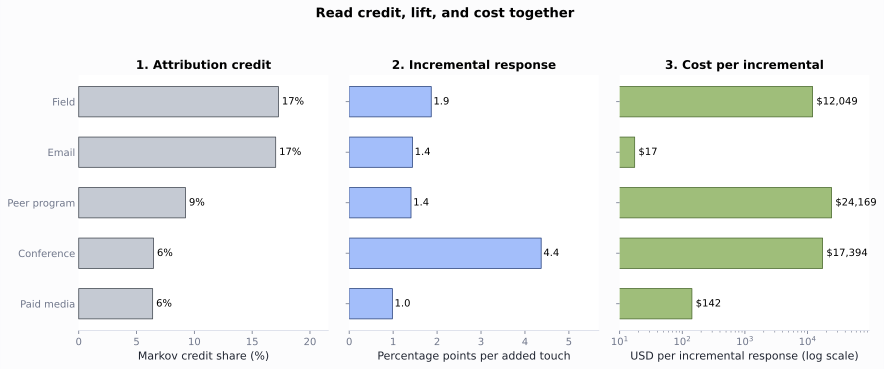

# Omnichannel Analytics

Build the 4-week channel plan for the fictional Roventra launch. Start with HCP-account targeting, turn 10 source channels into one event ledger, build a dated channel state, compare response, attribution, uplift, and cost, then release a governed plan row for the next-best-action engine.


```python
from pathlib import Path
import sys
import pandas as pd

ROOT = Path.cwd().resolve()
if not (ROOT / "pyproject.toml").exists():
    ROOT = ROOT.parent
sys.path.insert(0, str(ROOT))
sys.path.insert(0, str(ROOT / "ch08_omnichannel" / "generation_modules"))
sys.path.insert(0, str(ROOT / "ch08_omnichannel" / "scripts"))

from ch08_omnichannel.generation_modules.synthetic import generate  # noqa: E402
from ch08_omnichannel.scripts.run_analysis import run_analysis  # noqa: E402

pd.set_option("display.width", 140)
pd.set_option("display.max_columns", None)
generate(ROOT, ROOT / "ch08_omnichannel" / "data" / "generated")
results = run_analysis(ROOT)
print(f"Ledger events: {len(results['event_ledger']):,}")
print(f"HCP-account snapshots: {len(results['snapshot_panel']):,}")
print(f"Planning HCP-account rows: {len(results['channel_plan']):,}")

```

    Ledger events: 3,650
    HCP-account snapshots: 1,422
    Planning HCP-account rows: 158


## Descriptive: the event ledger


```python
summary = results["channel_summary"].copy()
summary["response"] = summary.response_rate_per_delivered.map(lambda x: f"{x:.1%}")
print(summary[[
    "channel", "events", "delivered_events",
    "meaningful_responses", "response",
]].set_index("channel"))

```

                     events  delivered_events  meaningful_responses response
    channel                                                                 
    Field               815               804                   627    78.0%
    Email               724               712                   499    70.1%
    Web                 420               415                   287    69.2%
    Phone               377               369                   245    66.4%
    Paid media          270               249                   120    48.2%
    Peer program        256               251                   171    68.1%
    Direct mail         246               242                   173    71.5%
    Speaker program     211               206                   142    68.9%
    Conference          184               180                   123    68.3%
    Account support     147               145                    96    66.2%


Email opens stay visible in the ledger. Clicks define meaningful email response.


```python
email = results["email_quality"].copy()
email["rate"] = email.rate.map(lambda x: f"{x:.1%}")
print(email)

```

                             metric  events  base_events   rate
    0                 Raw open rate     626          712  87.9%
    1  Human open rate (answer key)     563          712  79.1%
    2                    Click rate     499          712  70.1%
    3            Click-to-open rate     499          626  79.7%


```python
ledger = results["event_ledger"]
cols = ["event_date", "channel", "response_type", "meaningful_response"]
print(ledger.loc[ledger.npi.eq("9000000280"), cols].tail(3))

```

         event_date channel     response_type  meaningful_response
    1690 2025-01-15   Field          Positive                 True
    1691 2025-01-24   Email            Opened                False
    1692 2025-02-10     Web  Qualified action                 True


## Descriptive: contact volume and selection


```python
sat = results["saturation"].copy()
for col in ["observed_reach", "adjusted_reach", "adjusted_marginal_gain"]:
    sat[col] = sat[col].map(lambda x: f"{x:.1%}" if pd.notna(x) else "")
print(sat[[
    "recent_events", "snapshots", "observed_reach",
    "adjusted_reach", "adjusted_marginal_gain",
]].to_string(index=False))

```

    recent_events  snapshots observed_reach adjusted_reach adjusted_marginal_gain
                0        343          37.6%          45.9%                       
                1        433          59.1%          53.6%                   7.7%
                2        350          66.0%          61.2%                   7.5%
                3        175          65.7%          68.2%                   7.1%
                4         83          69.9%          74.6%                   6.3%
               5+         38          68.4%          80.0%                   5.5%


## Predictive: past state and later outcome


```python
panel = results["snapshot_panel"]
row = panel.loc[
    panel.npi.eq("9000000280")
    & panel.snapshot_date.eq("2025-02-28")
].iloc[0]
print(f"Snapshot: {row.snapshot_date:%Y-%m-%d}")
print(f"Outcome end: {row.outcome_end:%Y-%m-%d}")
print(f"90-day contact pressure: {int(row.total_pressure_90)} events")
print(f"Later meaningful response: {int(row.future_response)}")

```

    Snapshot: 2025-02-28
    Outcome end: 2025-03-28
    90-day contact pressure: 3 events
    Later meaningful response: 0


*Figure 8.1. HCP0280's prior 90-day events build the February 28 state. Events above the timeline produced a meaningful response; events below did not. Outcome events after the dashed line are not shown because HCP0280 had none in the next 28 days. Synthetic data.*


## Predictive: sparse response signals


```python
shrinkage = results["response_shrinkage"].copy()
for col in ["observed_response_rate_90", "shrunken_response_rate_90"]:
    shrinkage[col] = shrinkage[col].map(lambda x: f"{x:.1%}")
print(shrinkage[[
    "evidence_level", "npi", "meaningful_responses_90", "total_pressure_90",
    "observed_response_rate_90", "shrunken_response_rate_90",
]].to_string(index=False))

```

    evidence_level        npi  meaningful_responses_90  total_pressure_90 observed_response_rate_90 shrunken_response_rate_90
            Sparse 9000000008                        1                  1                    100.0%                     71.4%
            Sparse 9000000085                        1                  1                    100.0%                     71.4%
            Sparse 9000000122                        1                  1                    100.0%                     71.4%
       Established 9000000128                        8                  8                    100.0%                     83.9%
       Established 9000000631                        8                  8                    100.0%                     83.9%
       Established 9000000462                        3                  8                     37.5%                     52.7%


## Predictive: the response model


```python
print(results["leakage_check"].round(3).to_string(index=False))

```

               model  train_auc  test_auc
           past_only      0.667     0.711
    same_window_leak      1.000     1.000


```python
metrics = results["model_metrics"].copy()
for column in [
    "response_rate", "roc_auc", "average_precision",
    "brier_score", "base_rate_brier",
]:
    metrics[column] = metrics[column].round(3)
print(metrics[[
    "split", "snapshots", "response_rate",
    "roc_auc", "average_precision",
]])
print()
print(metrics[["split", "brier_score", "base_rate_brier"]])
print()
comparison = results["response_history_baseline"].copy()
for column in [
    "test_auc", "average_precision",
    "brier_score", "top_20_response_rate",
]:
    comparison[column] = comparison[column].map(lambda x: f"{x:.3f}")
comparison["top_20_lift"] = comparison.top_20_lift.map(lambda x: f"{x:.2f}x")
comparison = comparison.rename(columns={
    "average_precision": "avg_precision",
    "top_20_response_rate": "top20_rate",
    "top_20_lift": "top20_lift",
})
print(comparison[[
    "model", "test_auc", "avg_precision",
    "brier_score", "top20_rate", "top20_lift",
]].to_string(index=False))
print()
features = (
    results["model_coefficients"]
    .assign(abs_coefficient=lambda frame: frame.coefficient.abs())
    .sort_values("abs_coefficient", ascending=False)
    .head(8)
    .copy()
)
features["feature"] = features.feature.str.replace(
    "last_response_channel_", "last_channel=", regex=False
)
features["coefficient"] = features.coefficient.map(lambda x: f"{x:+.3f}")
features["odds_ratio"] = features.odds_ratio.map(lambda x: f"{x:.2f}")
print(features[["feature", "coefficient", "odds_ratio"]].to_string(index=False))

```

            split  snapshots  response_rate  roc_auc  average_precision
    0       train        948          0.626    0.667              0.745
    1  validation        158          0.437    0.636              0.533
    2        test        316          0.484    0.711              0.688
    
            split  brier_score  base_rate_brier
    0       train        0.215            0.234
    1  validation        0.266            0.282
    2        test        0.234            0.270
    
                        model test_auc avg_precision brier_score top20_rate top20_lift
                   full_model    0.711         0.688       0.234      0.734      1.52x
    response_history_baseline    0.641         0.639       0.281      0.719      1.48x
    
                        feature coefficient odds_ratio
          access_resource_score      +0.215       1.24
          digital_response_rate      +0.185       1.20
    live_program_attendance_180      +0.177       1.19
        last_channel=Paid media      -0.126       0.88
       last_channel=Direct mail      -0.123       0.88
            days_since_response      -0.112       0.89
               last_channel=Web      +0.106       1.11
             field_responses_90      +0.098       1.10


The field-then-digital order effect is real and modest: two explicit order features move test AUC from 0.707 to 0.714.


```python
contrast = results["field_then_digital_contrast"].copy()
contrast["future_response_rate"] = contrast.future_response_rate.map(
    lambda x: f"{x:.1%}"
)
print(contrast.to_string(index=False))
print()
sequence_models = results["sequence_model_comparison"].copy()
sequence_models["roc_auc"] = sequence_models.roc_auc.round(3)
sequence_models["average_precision"] = sequence_models.average_precision.round(3)
print(sequence_models)

```

              recent_field_response  snapshots  future_responses future_response_rate
    Field response in prior 90 days        156                94                60.3%
           No recent field response        303               168                55.4%
    
                         model  test_snapshots  roc_auc  average_precision
    0           aggregate_only             427    0.707              0.664
    1  aggregate_plus_sequence             427    0.714              0.670


## Causal: who gets credit (attribution)


```python
credit = results["attribution"].set_index("channel")
credit = credit.rename(columns={
    "first_touch": "first", "last_touch": "last",
    "time_decay": "decay",
})
print(credit.round(1))

```

                     first  last  linear  decay
    channel                                    
    Email             24.2  21.7    22.2   22.4
    Field             15.9  25.5    20.7   22.1
    Web               11.5  10.8    11.5   10.9
    Phone             14.0   6.4     9.8    8.6
    Peer program       7.6   8.9     9.1    9.6
    Speaker program    7.0   5.7     6.7    6.1
    Paid media         4.5   3.8     5.8    5.4
    Direct mail        9.6   7.6     5.8    5.5
    Conference         3.8   5.7     5.3    5.5
    Account support    1.9   3.8     3.2    4.0


```python
markov = results["markov_attribution"].copy()
markov["removal_effect"] = markov.removal_effect.map(lambda x: f"{x:.2f}")
markov["markov_credit"] = markov.markov_credit.map(lambda x: f"{x:.1f}")
print(markov.to_string(index=False))

```

            channel removal_effect markov_credit
              Field           0.56          17.3
              Email           0.55          17.0
                Web           0.39          12.1
              Phone           0.36          11.2
       Peer program           0.30           9.2
    Speaker program           0.27           8.3
        Direct mail           0.23           7.1
         Conference           0.21           6.5
         Paid media           0.21           6.4
    Account support           0.16           4.9


## Causal: who responds because of us (uplift)


The T-learner treats prior live-program action as the action and next-28-day meaningful response as the outcome. It fits one response model on HCP-account rows with prior live-program action and one on rows without it, then scores every row under both models. The difference is estimated uplift.


*Figure 8.2. Four HCP behavioral types in uplift modeling. Arrows show how action changes predicted response: persuadable rows move up, sure things stay high, lost causes stay low, and sleeping dogs move down.*


```python
segments = results["uplift_segment_summary"].copy()
for col in ["mean_uplift", "response_rate", "mean_baseline_response"]:
    segments[col] = segments[col].map(lambda x: f"{x:.1%}")
print(segments.to_string(index=False))

```

    uplift_segment  snapshots response_rate mean_baseline_response  mean_predicted_response_if_contacted mean_uplift
              High        285         45.3%                  43.0%                              0.570106       14.0%
          Mid-high        284         45.4%                  45.2%                              0.563355       11.1%
               Mid        284         60.9%                  50.6%                              0.597616        9.1%
           Mid-low        284         67.6%                  58.8%                              0.658259        7.0%
               Low        285         67.4%                  66.5%                              0.708292        4.3%


```python
ranking = results["uplift_ranking_comparison"].copy()
for col in ["mean_baseline_response", "mean_estimated_uplift"]:
    ranking[col] = ranking[col].map(lambda x: f"{x:.1%}")
print(ranking.to_string(index=False))
print()
diagnostics = results["uplift_diagnostics"].copy()
for col in [c for c in diagnostics.columns if "snapshots" not in c]:
    diagnostics[col] = diagnostics[col].map(lambda x: f"{x:.1%}")
print(diagnostics.T)

```

            ranking  selected mean_baseline_response mean_estimated_uplift  rows_shared_with_other_ranking
    response_ranked       284                  72.4%                  5.7%                               3
      uplift_ranked       284                  42.9%                 14.1%                               3
    
                                         0
    treated_snapshots                  782
    control_snapshots                  640
    naive_treated_minus_control      17.0%
    mean_estimated_uplift             9.1%
    observed_uplift_top_quartile     14.4%
    observed_uplift_bottom_quartile   7.3%


*Figure 8.3. A T-learner scores the same HCP-account row with action and control models, subtracts p0 from p1, and ranks rows by uplift. Synthetic data.*


*Figure 8.4. Each point is one HCP-account snapshot plotted by its control-model score and action-model score. Color shows estimated uplift. Synthetic data.*


## Causal: credit, lift, and cost


```python
econ = results["channel_economics"].copy()
econ["credit"] = econ.markov_credit.map(lambda x: f"{x:.1f}%")
econ["incremental"] = econ.incremental_per_touch.map(lambda x: f"{x * 100:+.1f} pp")
econ["unit_cost"] = econ.unit_cost.map(lambda x: f"${x:,.2f}")
econ["cost_per_incremental"] = econ.cost_per_incremental_response.map(
    lambda x: f"${x:,.0f}" if pd.notna(x) else "no lift"
)
print(econ[[
    "channel", "credit", "incremental", "unit_cost", "cost_per_incremental",
]].to_string(index=False))

```

            channel credit incremental unit_cost cost_per_incremental
              Field  17.3%     +1.9 pp   $225.00              $12,049
              Email  17.0%     +1.4 pp     $0.25                  $17
                Web  12.1%     +0.0 pp     $0.12              no lift
              Phone  11.2%     -2.2 pp    $28.00              no lift
       Peer program   9.2%     +1.4 pp   $340.00              $24,169
    Speaker program   8.3%     -0.9 pp $1,150.00              no lift
        Direct mail   7.1%     -2.4 pp     $2.60              no lift
         Conference   6.5%     +4.4 pp   $760.00              $17,394
         Paid media   6.4%     +1.0 pp     $1.40                 $142
    Account support   4.9%     -1.3 pp   $130.00              no lift




*Figure 8.5. Email, field, and web look different once path credit, adjusted lift, and cost per incremental response are read together. Synthetic data.*


## Prescriptive: channel policy and the plan


```python
aff = results["channel_affinity"].copy()
for col in ["digital_response_rate", "field_response_rate"]:
    aff[col] = aff[col].map(lambda x: f"{x:.0%}")
print(aff.to_string(index=False))

```

           npi digital_response_rate field_response_rate  channel_affinity last_response_channel recommended_channel
    9000000280                   26%                 84%   Field responder                   Web                None
    9000000389                   77%                 32% Digital responder                 Field                None
    9000000582                   12%                 88%   Field responder                 Field                None


```python
plan = results["plan_summary"].copy()
plan["mean_score"] = plan.mean_predicted_response.map(lambda x: f"{x:.1%}")
print(plan[[
    "recommended_action", "relationships",
    "planned_contacts", "mean_score",
]].rename(columns={
    "relationships": "hcp_account_rows",
    "planned_contacts": "planned_engagements",
}))

```

               recommended_action  hcp_account_rows  planned_engagements mean_score
    0                     Observe                61                    0      58.6%
    1                    Suppress                46                    0      51.0%
    2         Access coordination                35                   35      66.5%
    3             Email follow-up                 6                   12      75.1%
    4     Peer-program invitation                 5                    5      75.1%
    5  Speaker-program invitation                 4                    4      77.8%
    6             Field follow-up                 1                    2      65.9%


```python
value = results["capacity_value"].copy()
value["expected_responses"] = value.expected_responses.map(lambda x: f"{x:.2f}")
value["mean_score"] = value.mean_predicted_response.map(lambda x: f"{x:.1%}")
print(value[[
    "selection_rule", "relationships",
    "expected_responses", "mean_score",
]].rename(columns={"relationships": "hcp_account_rows"}))

```

                 selection_rule  hcp_account_rows expected_responses mean_score
    0              model_ranked                16              12.03      75.2%
    1  territory_order_baseline                16              11.41      71.3%


```python
ids = ["9000000174", "9000000239", "9000000280", "9000000430", "9000000469"]
cols = ["npi", "account_id", "recommended_action", "reason_code"]
traces = results["channel_plan"].loc[
    results["channel_plan"].npi.isin(ids), cols
].sort_values("npi").reset_index(drop=True)
print(traces)

```

              npi account_id       recommended_action                       reason_code
    0  9000000174     ACC032          Email follow-up  CAPACITY_RANKED_DIGITAL_RESPONSE
    1  9000000239     ACC009  Peer-program invitation     CAPACITY_RANKED_PEER_RESPONSE
    2  9000000280     ACC089                  Observe     OBSERVE_BELOW_CAPACITY_CUTOFF
    3  9000000430     ACC189      Access coordination             ROUTE_ACCESS_BOUNDARY
    4  9000000469     ACC121                 Suppress               SUPPRESS_PERMISSION


## Prescriptive: off-policy evaluation (handoff to next best action)


*Figure 8.6. Off-policy evaluation compares a candidate policy against logged behavior policy data, uses overlap where the logged and candidate actions agree, and estimates offline value through importance weighting, a reward model, or a doubly robust combination.*


```python
policy_eval = results["policy_evaluation"].copy()
focus = policy_eval[policy_eval.estimator.isin(["on_policy_mean", "snips"])].copy()
focus["estimated_response_rate"] = focus.estimated_response_rate.map(lambda x: f"{x:.1%}")
focus["effective_sample_size"] = focus.effective_sample_size.map(lambda x: f"{x:.1f}")
print(focus.to_string(index=False))

```

              policy      estimator estimated_response_rate  matched_snapshots effective_sample_size
       logged_policy on_policy_mean                   48.7%                158                 158.0
    candidate_policy          snips                   56.0%                 47                  45.5


```python
support = results["policy_support"].head(8).copy()
support["response_rate"] = support.response_rate.map(lambda x: f"{x:.1%}")
print(support.to_string(index=False))

```

    logged_action candidate_action  snapshots  responses response_rate
            Field            Field         24         20         83.3%
     Live program            Field         20          5         25.0%
          Observe          Observe         18          1          5.6%
     Live program            Email         14          8         57.1%
          Observe            Email         14          4         28.6%
          Observe            Field         14          2         14.3%
            Email            Field         13          9         69.2%
            Field          Observe         12          9         75.0%


## Conclusion

The ledger preserves channel meaning, the contact-volume curve shows that raw response rises mostly from selection, and the temporal test limits leakage. Attribution credits field and email near 17% each, while the cost view shows very different economics: about $17 per incremental response on email and $12,049 on field. The off-policy check finds the logged history too thin to rank a new policy yet. The rule set keeps permission, access, pressure, and capacity ahead of response signals, routes each action to the HCP's own responsive channel, and releases 16 promotional rows with a reason code, cycle cap, measurement hook, rule-set version, and refresh date.

