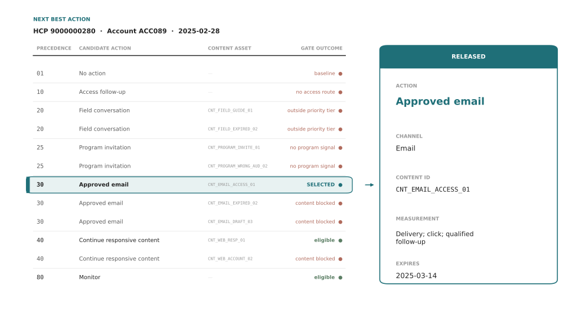
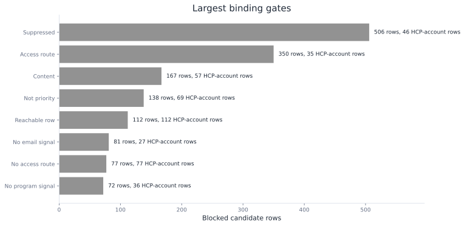
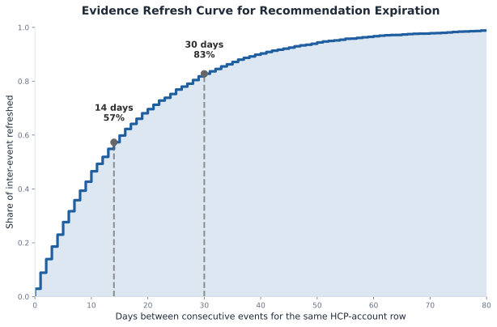

# Next Best Action

The omnichannel analysis produced a channel plan. Each row in that plan represents one HCP-account pair: a single healthcare provider at a single clinic or hospital. That row captures their current contact permission status, access state, recent engagement activity, predicted response likelihood, available field capacity, and the date you need to decide what to do next.

From there, the next best action engine, or NBA, reads that row and releases one executable action. It answers a critical pharmaceutical commercialization question: given what we know today, what single action can be released now, through which channel, with which approved content?

A released recommendation must work for a CRM, email system, field team, program team, or access team. It needs the selected action, rejected alternatives, approved content, reason code, timing, expiration, measurement hook, policy versions, and an override path.

HCP0280 at account ACC089 is the carried example. This HCP is contactable and recently engaged through both email and field visits. The HCP has received minimal recent contact (only one touch in 30 days), so sending email now won't violate frequency caps. The HCP has no program history and is not in the priority tier, which limits some actions but allows email. The engine releases an approved email about access and coverage support.

In this chapter, you will learn to build an NBA release engine:

- load and inspect the HCP-account state
- build a candidate menu and apply eligibility gates
- rank scarce actions by incremental value
- log propensities and explore inside gates
- evaluate policy changes against historical data
- measure execution, override, and feedback outcomes

Open [`ch09_walkthrough.ipynb`](ch09_walkthrough.ipynb), or run the blocks below from the repository root.

> **Note:** Roventra, the condition, HCPs, accounts, content assets, and events are fictional and synthetic.

## 9.1 Build The NBA Recommendation Engine

The NBA engine starts with the state: the HCP-account facts on the decision date. From there, the engine builds the candidate table: all 7 action types, expanded into 12 candidate rows when content options are included. Some candidates pass all gates; others fail (ineligible for field because outside priority tier; ineligible for program because no live-program signal). The engine then selects and releases the contract: one row with the chosen action (approved email), the channel (Email), the content asset (CNT_EMAIL_ACCESS_01), the reason (available frequency with qualifying signal), the measurement hook (delivery, click, qualified follow-up), expiration (March 14, 2025), and policy version (nba_policy_2025_02_v2).

Next comes the policy log: the historical record of what action was taken, with its assigned probability and whether it was an exploration or exploitation decision. This is how the team learns from past releases. Last is the execution log: what actually happened after release. Did the field team deliver the email? Did the HCP open it? Was the recommendation overridden because the situation changed? Execution logs are the feedback loop that tells the team whether the engine's timing, content choice, and action selection worked in practice.

`run_analysis()` in `next_best_action.py` recomputes the HCP-account state, content catalog, candidate menu, gates, recommendation contracts, policy history, off-policy replay, and feedback summaries. Listing 9.1 loads the full package.

**Listing 9.1**: Load the governed NBA package

```python
from pathlib import Path
import sys
import pandas as pd

ROOT = Path.cwd().resolve()
if not (ROOT / "pyproject.toml").exists():
    ROOT = ROOT.parent
sys.path.insert(0, str(ROOT))

from ch09_nba.scripts.next_best_action import run_analysis

pd.set_option("display.width", 220)
pd.set_option("display.max_columns", None)
results = run_analysis(ROOT)
print(f"Recommendations: {len(results['recommendations'])}")
print(f"Candidates after content expansion: {len(results['candidate_audit'])}")
```

```text
Recommendations: 158
Candidates after content expansion: 1896
```

The engine releases 158 recommendation rows. The audit table has 1,896 rows because every HCP-account row expands into multiple action and content candidates even for the ones not chosen. This is because NBA governance requires a transparent record of what was considered and why each option passed or failed.

### 9.1.1 Load The State

The engine begins with the state as of February 28, 2025. HCP0280 at ACC089 is contactable, has a low recent engagement burden, and has recent digital activity. It does not have a current access route, priority flag, or live-program signal. Those facts will decide which actions survive the gates.

`load_state()` in `next_best_action.py` joins the channel-plan state with the scored snapshot features and produces `results["state"]`. Listing 9.2 reads the carried row.

**Listing 9.2**: Inspect the carried HCP-account state

```python
row = results["state"].loc[results["state"].npi.eq("9000000280")].iloc[0]
for field in [
    "npi", "account_id", "territory", "account_action",
    "competitive_action", "contact_permission_status", "pressure_band",
    "total_pressure_30", "predicted_response", "digital_signal",
    "field_signal", "live_program_signal", "priority_flag", "context_bucket",
]:
    print(f"{field}: {row[field]}")
```

```text
npi: 9000000280
account_id: ACC089
territory: T02
account_action: Monitor
competitive_action: Defend and learn
contact_permission_status: Allowed
pressure_band: Low
total_pressure_30: 1
predicted_response: 0.4962414873343488
digital_signal: True
field_signal: True
live_program_signal: False
priority_flag: False
context_bucket: Digital-responsive
```

The state already blocks several actions. Contact is allowed (permission status). Access follow-up has no route (account action is Monitor). Field conversation requires priority status (false here). Program invitation requires a live program signal (false here). Approved email is still plausible because the row has a digital signal and low contact burden.

The snapshot layer can carry additional HCP context signals alongside these. TRx potential decile, recent external congress or symposium attendance, MSL visit recency, and an estimate of eligible patients in the HCP's panel are all signals that belong in the state table. They could slot into `feature_columns` in `build_nba_state()` and enrich the reward model's context.

### 9.1.2 Build and Gate the Candidate Menu

The NBA engine first builds the candidate menu by listing the actions that the policy is allowed to consider for this HCP-account row:

- no action
- access follow-up
- field conversation
- program invitation
- approved email
- continue responsive content
- monitor

`generate_action_menu()`, `attach_content_candidates()`, `apply_content_gates()`, and `candidate_audit()` in `next_best_action.py` build the candidate rows and produce `results["hcp0280_rejected_alternatives"]`. Listing 9.3 shows the complete carried-case trace.

**Listing 9.3**: Show all candidates for HCP0280

```python
trace = results["hcp0280_rejected_alternatives"][[
    "candidate_action", "content_id", "policy_precedence",
    "candidate_status", "binding_gate"
]].copy()
print(trace.to_string(index=False))
```

```text
           candidate_action               content_id  policy_precedence              candidate_status    binding_gate
                  No action                                           1                    Ineligible  not_suppressed
           Access follow-up                                          10                    Ineligible no_access_route
         Field conversation     CNT_FIELD_EXPIRED_02                 20                    Ineligible    not_priority
         Field conversation       CNT_FIELD_GUIDE_01                 20                    Ineligible    not_priority
         Program invitation    CNT_PROGRAM_INVITE_01                 25                    Ineligible  program_signal
         Program invitation CNT_PROGRAM_WRONG_AUD_02                 25                    Ineligible  program_signal
             Approved email      CNT_EMAIL_ACCESS_01                 30                      Selected          passed
             Approved email       CNT_EMAIL_DRAFT_03                 30                    Ineligible         content
             Approved email     CNT_EMAIL_EXPIRED_02                 30                    Ineligible         content
Continue responsive content       CNT_WEB_ACCOUNT_02                 40                    Ineligible         content
Continue responsive content          CNT_WEB_RESP_01                 40 Eligible but lower precedence          passed
                    Monitor                                          80 Eligible but lower precedence          passed
```

Precedence is the policy order. Lower numbers win after all gates run. HCP0280 has 3 eligible paths after content checks: approved email, continue responsive content, and monitor. Approved email wins because precedence 30 beats 40 and 80.

The blocked rows are as important as the selected row. Field conversation has approved content available, but the HCP-account row is outside the priority tier. Program invitation has an approved invitation asset, but the row has no live-program signal. Continue responsive content has one approved web asset, but it loses to approved email because the email action has stronger precedence.

Precedence is set by the brand team based on market opportunity, therapeutic strategy, and field capacity. For Roventra, approved email has higher precedence than responsive content because email reach is broader and email frequency is manageable. Access follow-up has even higher precedence because unblocked access is a gating condition for all other actions. The precedence order is business-specific: a different brand facing a different market barrier would order actions differently.



*Figure 9.1. HCP0280 candidate pipeline: state through action gates, content gates, and precedence to one released recommendation. Synthetic data.*

### 9.1.3 Understand the Content Approval Layer

The candidate trace in section 9.1.2 shows a `content` value in the `binding_gate` column for three rows. This section explains what the content gate checks. Content approval is a separate layer from action eligibility. A row cannot be released simply because an HCP is eligible for a channel. The content must be approved, active on the recommendation date, appropriate for the audience, and approved for the channel.

The `mlr_status` column records the result of Medical, Legal, and Regulatory review, known in the industry as MLR. Before any promotional asset reaches a prescriber, a review team of medical, legal, and regulatory reviewers checks that its claims match the approved product label, that benefit and risk information is balanced, and that nothing is false or misleading. This is not an internal style preference. In the United States, the FDA regulates prescription drug promotion under the Federal Food, Drug, and Cosmetic Act, and companies file their promotional pieces with the agency's Office of Prescription Drug Promotion. An asset that has not cleared MLR, or whose approval has expired, cannot be used. Sending one is a compliance violation that can draw an FDA warning letter and carries legal and reputational cost.

This is why the content gate sits apart from the response model, and why it belongs to different owners. Marketing creates the content. The MLR team approves it. The NBA engine only reads the recorded status and refuses to release anything that is not approved, active, on-audience, and on-channel. The engine does not judge whether a claim is compliant, and it should not. It enforces decisions that qualified reviewers already made. A recommendation that optimizes predicted response but ships an unapproved or expired asset is not a good recommendation. It is a liability, and in a regulated market that liability outweighs any modeled lift.

The synthetic catalog is small, but it teaches the production pattern. Approved email has 3 candidate assets. One passes. One is still in draft and has not cleared MLR. One was approved but expired before the recommendation date, because approvals lapse when a label changes or new safety information arrives. Responsive web content has 2 candidate assets. One is approved for HCP use. One is approved only for account use and fails the audience check. The `audience` and `approved_channel` columns carry those two constraints: an asset cleared for a payer account cannot be sent to a physician, and an asset cleared for web cannot be sent as email.

`content_gate_trace()` in `next_best_action.py` reads the HCP0280 content decisions from the candidate audit and produces `results["hcp0280_content_trace"]`. Listing 9.4 shows the content gate.

**Listing 9.4**: Inspect content approval decisions

```python
content = results["hcp0280_content_trace"][[
    "candidate_action", "content_id", "mlr_status", "audience",
    "approved_channel", "content_gate_reason", "eligible"
]].copy()
print(content.to_string(index=False))
```

```text
           candidate_action               content_id mlr_status audience approved_channel  content_gate_reason  eligible
             Approved email      CNT_EMAIL_ACCESS_01   Approved      HCP            Email               Passed      True
             Approved email       CNT_EMAIL_DRAFT_03      Draft      HCP            Email Content not approved     False
             Approved email     CNT_EMAIL_EXPIRED_02   Approved      HCP            Email      Content expired     False
Continue responsive content       CNT_WEB_ACCOUNT_02   Approved  Account              Web    Audience mismatch     False
Continue responsive content          CNT_WEB_RESP_01   Approved      HCP              Web               Passed      True
         Field conversation     CNT_FIELD_EXPIRED_02   Approved      HCP            Field      Content expired     False
         Field conversation       CNT_FIELD_GUIDE_01   Approved      HCP            Field               Passed     False
         Program invitation    CNT_PROGRAM_INVITE_01   Approved      HCP          Program               Passed     False
         Program invitation CNT_PROGRAM_WRONG_AUD_02   Approved  Account          Program    Audience mismatch     False
```

The `eligible` column is the final answer after both action gates and content gates. `CNT_FIELD_GUIDE_01` passes content review, but field conversation still fails because the row is outside the priority tier. `CNT_PROGRAM_INVITE_01` passes content review, but program invitation still fails because there is no live-program signal. `CNT_EMAIL_ACCESS_01` passes both layers and remains eligible.

This is the production boundary: a content asset can be valid while the action is blocked, and an action can be valid while a specific content asset is blocked. The audit needs both answers.

### 9.1.4 Read the Gate Distribution

The HCP0280 trace shows one row. The full cycle has 158 released rows and a much larger candidate table. Gate counts tell the team which constraint shapes the portfolio most: suppression, access routing, content expiry, or capacity.

`gate_summary_by_gate()` in `next_best_action.py` counts the first binding gate on the expanded candidate table and produces `results["gate_summary_by_gate"]`. Listing 9.5 prints the largest gates.

**Listing 9.5**: Count the largest binding gates

```python
gate = results["gate_summary_by_gate"].head(8).copy()
print(gate.to_string(index=False))
```

```text
   binding_gate  blocked_candidates  affected_hcp_account_rows     example_action
     suppressed                 506                         46   Access follow-up
   access_route                 350                         35 Field conversation
        content                 167                         57     Approved email
   not_priority                 138                         69 Field conversation
 not_suppressed                 112                        112          No action
no_email_signal                  81                         27     Approved email
no_access_route                  77                         77   Access follow-up
 program_signal                  72                         36 Program invitation
```

Suppression blocks the most candidates: 506 rows across 46 HCP-account rows, which points to a consent and policy question the team should review. Content blocks 167 candidates across 57 HCP-account rows, which usually means the approval calendar or the asset catalog needs attention. Access routing blocks 350 candidates, which is the engine working as intended: it holds promotional touches behind unresolved access work rather than sending them early.



*Figure 9.2. Largest binding gates across the expanded candidate table. Synthetic data.*

### 9.1.5 Set The Expiration

NBA recommendations are dated decisions. Each action type becomes stale under different conditions: access work expires when the access barrier resolves, email expires when content approval lapses or the HCP opts out, field conversations become stale when the representative completes a call, and monitor recommendations persist longer because the system is waiting for evidence rather than taking action. The policy must set a time-to-live (TTL) for each action type based on when that action typically loses validity.

The TTL is a business choice informed by historical evidence. The first step is to analyze the past data: how often do material events (state changes, engagement, HCP actions) occur? This inter-event gap analysis tells you the natural observation window for your customer base. Then you use that evidence plus domain judgment to set action-specific TTLs.

`expiration_analysis()` in `next_best_action.py` measures inter-event gaps in the past ledger for the same HCP-account row. Listing 9.6 reads that analysis.

**Listing 9.6**: Analyze historical inter-event gaps

```python
print(results["expiration_analysis"].to_string(index=False))
```

```text
                      metric  value
  Median days between events 12.000
    Mean days between events 17.300
Share of gaps within 14 days  0.573
Share of gaps within 30 days  0.828
```

The analysis shows a 12-day median gap: on average, something material (engagement, access state change, new contact) happens every 12 days for an HCP-account row. Fifty-seven percent of gaps are within 14 days; eighty-three percent are within 30 days.



*Figure 9.3. The vertical lines show the 14-day (57% of gaps) and 30-day (83%) marks. These anchor the TTL choices below.*

Based on this evidence, the team sets action-specific TTLs that respect the observed cadence:

| Action | TTL (days) | Stale When |
| --- | --- | --- |
| No action | 14 | Permission or access state changes |
| Access follow-up | 7 | Access-state change or resolved case |
| Field conversation | 21 | Completed call or territory refresh |
| Program invitation | 10 | Seat date, attendance, or new access barrier |
| Approved email | 14 | Content expiry, opt-out, or new engagement |
| Continue responsive content | 14 | Content expiry or new digital response |
| Monitor | 30 | Material evidence change or cycle refresh |

A 7-day access TTL is aggressive, matching the urgency of access work. A 14-day email TTL matches the median gap; content approval lasts about two weeks. A 30-day monitor TTL is conservative, letting the system wait for slower signals. The action-specific TTL is a business judgment call. It answers: given that cadence, how long should this action stay valid?

### 9.1.6 Write The Recommendation Contract

The selected action is written as a contract that downstream systems can execute and later audit. Each field in the contract answers a question.

| Field | Question Answered | Why It Matters |
| --- | --- | --- |
| `recommended_action` | What should happen next? | Execution role and workload |
| `recommended_channel` | Where should it happen? | CRM, email, program, or access routing |
| `content_id` | Which approved asset is used? | MLR, indication, audience, and expiry control |
| `reason_code` | Why was this action selected? | User trust and audit |
| `measurement_hook` | What must be observed later? | Learning and accountability |
| `expires_on` | When is the row stale? | Prevents outdated action release |
| `policy_version` | Which rule set produced it? | Rollback and model-risk review |

`select_recommendations()` in `next_best_action.py` applies precedence to eligible candidates, attaches scoring fields, writes expiration and version metadata, and produces `results["recommendation_contract"]` for HCP0280. Listing 9.7 prints the contract.

**Listing 9.7**: Read the released recommendation contract

```python
row = results["recommendation_contract"].iloc[0]
fields = [
    "recommendation_id", "recommended_action", "recommended_channel",
    "content_id", "content_family", "reason_code", "measurement_hook",
    "policy_version", "rule_set_version", "model_version",
    "expected_incremental_value", "expires_on", "review_required",
]
for field in fields:
    value = row[field]
    if field == "expected_incremental_value":
        value = f"{value:.2f}"
    print(f"{field}: {value}")
```

```text
recommendation_id: NBA00071
recommended_action: Approved email
recommended_channel: Email
content_id: CNT_EMAIL_ACCESS_01
content_family: Access support
reason_code: Available email frequency with a qualifying signal
measurement_hook: Delivery; click; qualified follow-up
policy_version: nba_policy_2025_02_v2
rule_set_version: nba_rules_2025_02_v2
model_version: omni_response_2025_02_v1
expected_incremental_value: 707.07
expires_on: 2025-03-14 00:00:00
review_required: False
```

This row is specific enough to act on. It tells the system to send approved email content `CNT_EMAIL_ACCESS_01` for access support, measure delivery, click, and qualified follow-up, and expire the row on March 14, 2025.

## 9.2 Improve The Baseline Engine

The baseline engine has selected one action per HCP-account row. The next two improvements make the policy more useful. First, scarce actions need value-aware allocation. Second, repeated uncertain decisions need a controlled learning mechanism.

### 9.2.1 Rank Resource-Constrained Actions

The omnichannel plan scored each HCP-account row by predicted response probability and used that score to allocate channel capacity. Response probability is the right input when capacity is not the binding constraint. For program invitations, field visits, and access follow-up work, it is not: response probability is the wrong ranking signal for constrained actions.

The reason is counterfactual. Response probability answers the question "who is likely to respond?" It does not answer "who is likely to respond because of this action?" An HCP with a 0.84 response probability may have reached that level organically. Spending a scarce program slot on that row wastes the invitation. A row at 0.59 response probability with a 0.26 uplift generates more incremental TRx lift per slot.

Email is cheap and broad enough that response-based ranking is a reasonable default. Program invitations, field conversations, and access follow-up work have explicit capacity constraints. For these, the NBA engine should rank by expected incremental value: estimated TRx lift times the net revenue value of an incremental prescriber response, minus cost and fatigue penalty.

`multi_action_uplift_table()` in `next_best_action.py` scores email, field, and program for each HCP-account row and identifies the best action by incremental value. HCP0280 is the carried case. High-email is the row where email delivers the highest uplift in the population. High-field is the row where field conversation delivers the highest uplift. Listing 9.8 shows all three.

**Listing 9.8**: Score each action type separately

```python
uplift = results["multi_action_uplift"].copy()
for col in [
    "p_no_action", "p_email", "p_field", "p_program",
    "uplift_email", "uplift_field", "uplift_program",
]:
    uplift[col] = uplift[col].round(3)
print(uplift.set_index("example").T.to_string())
```

```text
example                    HCP0280  High-email  High-field
p_no_action                  0.406       0.629       0.506
p_email                      0.584       0.824       0.571
p_field                      0.596       0.746       0.835
p_program                    0.551       0.749       0.766
uplift_email                 0.178       0.195       0.065
uplift_field                 0.190       0.117       0.329
uplift_program               0.145       0.120       0.260
best_incremental_action      Field conversation  Approved email  Field conversation
```

The model scores field conversation as the highest-uplift action for HCP0280 (19.0% lift), yet the engine releases approved email because HCP0280 is outside the priority tier and the field gate blocks it. The High-email HCP has a strong digital signal, making email the winner despite field conversation being available. The High-field row is a priority account with field engagement, and field conversation delivers 32.9% lift. This is more than five times the email lift.

The value calculation breaks each action score into 4 pieces:

- `p_no_action`: expected response if no action is taken
- `p_action`: expected response under the candidate action
- `estimated_uplift_action`: `p_action - p_no_action`
- `expected_incremental_value`: estimated TRx lift times the net revenue value of an incremental prescriber response, minus cost and fatigue penalty

An eligible patient estimate can further weight the value calculation: an HCP with a large panel of qualifying patients generates more expected incremental TRx per action than one with few, even at identical uplift. A competitive recency signal, days since a competitor published new evidence, can similarly shift the urgency of an MSL scientific discussion relative to a standard approved email.

`value_components_trace()` in `next_best_action.py` selects 2 program-invitation examples from `results["reward_candidates"]`: the highest-response row and the highest-value row. Listing 9.9 shows why they differ.

**Listing 9.9**: Compare response and value components

```python
value = results["value_components_trace"].copy()
for column in [
    "predicted_response", "p_no_action", "p_action",
    "estimated_uplift_action", "fatigue_risk",
]:
    value[column] = value[column].round(3)
value["expected_incremental_value"] = value["expected_incremental_value"].round(1)
print(value.to_string(index=False))
```

```text
                           Highest response  Highest value
npi                              9000000128     9000000389
account_id                           ACC160         ACC155
predicted_response                    0.844          0.593
p_no_action                           0.764          0.483
p_action                              0.954          0.748
estimated_uplift_action               0.190          0.265
unit_cost                             340.0          340.0
fatigue_risk                           0.01           0.01
expected_incremental_value            418.0          718.0
```

The highest-response HCP has a predicted response of 0.844. Its estimated TRx lift is 0.190, and its expected incremental value is 418. The highest-value HCP has lower predicted response at 0.593, but TRx lift is 0.265 and expected incremental value is 718. The response ranking would spend the scarce program slot on the row that looks most likely to respond. The value ranking spends it where the action drives more incremental TRx.

### 9.2.2 Explore Safely

The base NBA engine selects the eligible action with the lowest precedence number and repeats that choice in the same context. If another eligible action could work better, the engine may never collect enough evidence to learn it.

Exploration is the controlled exception: the engine can occasionally try another eligible action, measure the result, and learn from it.

The learning policy must choose among eligible arms only. It also logs the probability of the chosen action. That logged probability is required for later off-policy evaluation.

`build_logged_policy_history()` in `next_best_action.py` creates a synthetic behavior-policy history and stores `eligible_actions`, `logged_action`, `logged_probability`, and `exploration_flag` before replay. Listing 9.10 shows the first 5 historical rows.

**Listing 9.10**: Inspect the logged behavior policy

```python
history = results["logged_policy_history"][[
    "snapshot_id", "context_bucket", "eligible_actions",
    "base_policy_action", "logged_action",
    "logged_probability", "exploration_flag",
]].head(5).copy()
history["logged_probability"] = history["logged_probability"].round(3)
history["eligible_actions"] = history["eligible_actions"].str.replace("; ", "\n")
for _, row in history.iterrows():
    print(f"snapshot:    {row['snapshot_id']}")
    print(f"context:     {row['context_bucket']}")
    print(f"eligible:    {row['eligible_actions']}")
    print(f"base policy: {row['base_policy_action']}")
    print(f"logged:      {row['logged_action']}  (p={row['logged_probability']}, explore={row['exploration_flag']})")
    print()
```

```text
snapshot:    SNAP00001
context:     Program-history
eligible:    Program invitation
             Approved email
             Continue responsive content
             Monitor
base policy: Approved email
logged:      Approved email  (p=0.925, explore=False)

snapshot:    SNAP00002
context:     Digital-responsive
eligible:    Access follow-up
base policy: Access follow-up
logged:      Access follow-up  (p=1.0, explore=False)

snapshot:    SNAP00003
context:     Field-responsive
eligible:    No action
base policy: No action
logged:      No action  (p=1.0, explore=False)

snapshot:    SNAP00004
context:     Program-history
eligible:    Program invitation
             Approved email
             Continue responsive content
             Monitor
base policy: Approved email
logged:      Approved email  (p=0.925, explore=False)

snapshot:    SNAP00005
context:     Digital-responsive
eligible:    Access follow-up
base policy: Access follow-up
logged:      Access follow-up  (p=1.0, explore=False)
```

Rows with only 1 eligible action have probability 1.000. Rows with several eligible actions can have probabilities below 1.000 because the behavior policy keeps a small exploration budget. This is the field that many real logs miss.

Bucketed Thompson sampling treats each action's response rate as uncertain. For a binary response, the simple version uses a beta distribution. Each action starts with successes and failures. The posterior mean is the current response belief. The posterior standard deviation is the uncertainty. A draw from each action's posterior chooses the arm with the highest sampled response rate.

In each draw, the engine samples one possible response rate from each possible action history probability curve. The action with the largest sampled response rate wins that draw.

The Beta distribution is useful here because it updates from 2 counts. Let \(s\) be historical successes: logged rows where the action was taken and the later response was 1. Let \(f\) be historical failures: logged rows where the action was taken and the later response was 0. After \(s\) successes and \(f\) failures, the action's curve is:

$$
\text{Beta}(s+1, f+1),
$$

The `+1` terms are a light starting prior. With no history, the curve is \(\text{Beta}(1,1)\), which is flat from 0 to 1. It says the engine does not know the response rate yet. After history arrives, the posterior mean is \((s+1)/(s+f+2)\). More history narrows the curve. Less history leaves the curve wide, even when the mean looks promising.

The example below uses the `Digital-responsive` bucket for HCP0280's context. This is a bucketed bandit, not a full feature-based contextual bandit. The bucketed version is a good first teaching step. A full contextual bandit would use features such as access state, response history, content family, fatigue, channel cost, and territory constraints directly. LinUCB, Logistic Thompson, and constrained bandit are three methods that use full context features.

All four methods must log propensities and stay inside eligibility gates. When a content gate or compliance review flag blocks all arms, exploration does not run for that row. The base policy takes over and the recommendation is not marked as exploration.

`thompson_exploration()` and `simulate_bucketed_thompson_decision()` in `next_best_action.py` produce `results["thompson_exploration"]` and `results["thompson_decision_log"]`.

**Listing 9.11**: Learn within the digital-responsive context

```python
exploration = results["thompson_exploration"][[
    "logged_action", "snapshots", "successes", "failures",
    "posterior_mean", "posterior_sd", "explore_share",
]].copy()
exploration[[
    "posterior_mean", "posterior_sd", "explore_share",
]] = exploration[[
    "posterior_mean", "posterior_sd", "explore_share",
]].round(3)
print(exploration.to_string(index=False))
print()
decision = results["thompson_decision_log"].iloc[0]
decision["logged_probability"] = round(decision["logged_probability"], 3)
arms = decision["eligible_arms"].replace("; ", "\n             ")
print(f"npi:             {decision['npi']}")
print(f"account_id:      {decision['account_id']}")
print(f"context_bucket:  {decision['context_bucket']}")
print(f"eligible_arms:   {arms}")
print(f"base_policy:     {decision['base_policy_action']}")
print(f"selected_arm:    {decision['selected_arm']}")
print(f"probability:     {decision['logged_probability']}")
print(f"exploration:     {decision['exploration_flag']}")
print(f"policy_version:  {decision['policy_version']}")
```

```text
              logged_action  snapshots  successes  failures  posterior_mean  posterior_sd  explore_share
                    Monitor          7          5         2           0.667         0.149          0.484
           Access follow-up         90         58        32           0.641         0.050          0.212
Continue responsive content         23         15         8           0.640         0.094          0.281
             Approved email        117         67        50           0.571         0.045          0.023
                  No action         79         30        49           0.383         0.054          0.000

npi:             9000000280
account_id:      ACC089
context_bucket:  Digital-responsive
eligible_arms:   Approved email
                 Continue responsive content
                 Monitor
base_policy:     Approved email
selected_arm:    Monitor
probability:     0.484
exploration:     True
policy_version:  nba_policy_2025_02_v2
```

The `base_policy` here is the NBA engine's deterministic recommendation, selected by precedence after all gates pass. The exploration flag compares the Thompson draw against the precedence-based release.

Monitor has a higher posterior mean in this bucket, but it has only 7 snapshots. Approved email has 117 snapshots and a narrower posterior. HCP0280's eligible arms are approved email, continue responsive content, and monitor. One Thompson draw selects monitor and logs probability 0.484. Because the base recommendation was approved email, the row is marked as exploration.


*Figure 9.4. Left: posterior mean and one SD for each eligible action. Right: share of Thompson draws each arm wins. Monitor wins 48% of draws despite having the fewest snapshots because its wide posterior gives it frequent high draws.*

## 9.3 Evaluate A New Policy Offline

The team wants to test a change: digital-first precedence. For high-response rows with a digital signal, approved email moves ahead of field conversation when both are eligible. Before running a live test, they want to know whether the historical data suggests this change would help.

The behavior policy is the policy that was actually deployed and collected the logged data, in this case the current NBA engine. The behavior-policy log already ran it on thousands of HCP-account rows and recorded what happened. If the candidate policy would have chosen the same action on most of those rows, the historical outcomes tell you directly how the new policy would have performed. If the candidate policy would have chosen differently, you need to estimate what would have happened. That estimation is off-policy evaluation (OPE).

### 9.3.1 Replay The Candidate Policy

Start with the matched case: the historical system chose the same action the candidate policy would choose. The observed response is a direct data point for the candidate policy, no adjustment needed.

Now consider the unmatched case. The history sent approved email to a row where the candidate policy would have sent a field visit. The observed response (opened the email or did not) belongs to the email action, not the field visit. You cannot count it as evidence for the field visit.

IPS handles this by reweighting. The key insight is that the historical policy deliberately allocated more email to rows where it thought email was likely to work. Those rows are overrepresented in the email-outcome data relative to how a neutral observer would have distributed actions. To get an unbiased estimate of what a different policy would have seen, you need to down-weight the outcomes that the historical policy favored and up-weight outcomes it passed over. The weight for each matched row is 1 divided by the probability that the historical policy chose the logged action. If the historical policy chose email with probability 0.9 on a row, that outcome gets weight 1/0.9 ≈ 1.11. Email-heavy rows are slightly discounted; rarer actions are amplified. Averaged across matched rows, this corrects the selection bias introduced by the historical policy's choices.

Three practical limits apply. First, if the logged probabilities were not recorded at decision time, the reweighting cannot be done correctly. This is why Section 9.2.2 required logging propensities at decision time. Second, if the candidate and logged policies rarely agree, some weights become extreme and the estimate is unreliable. Third, IPS is noisy when matched rows are sparse. The doubly robust (DR) estimator handles the third problem by combining IPS with a direct model prediction for each row. When the IPS weight is well-behaved, it dominates; when it is not, the model prediction provides a floor. The two estimates check each other.

`ope_replay_trace()` in `next_best_action.py` creates a small row-level trace from the stored behavior-policy history and produces `results["ope_replay_trace"]`. Listing 9.12 shows matched and unmatched examples.

**Listing 9.12**: Inspect the replay trace

```python
trace = results["ope_replay_trace"].copy()
for col in ["logged_probability", "inverse_weight", "model_candidate_response", "dr_contribution"]:
    trace[col] = trace[col].round(3)

for _, row in trace.iterrows():
    print(f"snapshot_id:         {row['snapshot_id']}")
    print(f"context_bucket:      {row['context_bucket']}")
    print(f"logged_action:       {row['logged_action']}")
    print(f"candidate_action:    {row['candidate_action']}")
    print(f"matched:             {row['matched']}")
    print(f"logged_probability:  {row['logged_probability']}")
    print(f"future_response:     {row['future_response']}")
    print(f"inverse_weight:      {row['inverse_weight']}")
    print(f"model_response:      {row['model_candidate_response']}")
    print(f"dr_contribution:     {row['dr_contribution']}")
    print()
```

```text
snapshot_id:         SNAP00001
context_bucket:      Program-history
logged_action:       Approved email
candidate_action:    Approved email
matched:             True
logged_probability:  0.925
future_response:     1
inverse_weight:      1.081
model_response:      0.584
dr_contribution:     1.034

snapshot_id:         SNAP00002
context_bucket:      Digital-responsive
logged_action:       Access follow-up
candidate_action:    Access follow-up
matched:             True
logged_probability:  1.000
future_response:     1
inverse_weight:      1.000
model_response:      0.646
dr_contribution:     1.000

snapshot_id:         SNAP00003
context_bucket:      Field-responsive
logged_action:       No action
candidate_action:    No action
matched:             True
logged_probability:  1.000
future_response:     1
inverse_weight:      1.000
model_response:      0.374
dr_contribution:     1.000

snapshot_id:         SNAP00043
context_bucket:      Digital-responsive
logged_action:       Continue responsive content
candidate_action:    Approved email
matched:             False
logged_probability:  0.033
future_response:     0
inverse_weight:      0.000
model_response:      0.846
dr_contribution:     0.846

snapshot_id:         SNAP00114
context_bucket:      Digital-responsive
logged_action:       Continue responsive content
candidate_action:    Approved email
matched:             False
logged_probability:  0.033
future_response:     0
inverse_weight:      0.000
model_response:      0.545
dr_contribution:     0.545
```

The matched rows contribute inverse weights close to 1.0 when their logged probability is near 1.000. SNAP00001 has a slight weight above 1.0 (1.081) because its logged probability was 0.925. The unmatched rows have inverse weight 0.0 because the logged action (Continue responsive content) differs from the candidate action (Approved email). For those rows, the direct model fills the gap.

The four estimators in Listing 9.13 each handle the bias-variance tradeoff differently.

IPS reweights matched outcomes by the inverse logged probability, as described above. It is unbiased when probabilities are accurate but noisy when weights are large.

SNIPS (self-normalized IPS) divides the IPS sum by the sum of the weights rather than by the number of rows. This normalization reduces variance because the weights are scaled relative to each other rather than to the raw row count. The tradeoff is a small bias, which is usually acceptable when the weights vary substantially across rows.

The direct method ignores the logged outcomes entirely. It fits a response model on the available data, then predicts what the response would have been under the candidate action for every row, matched or not. This uses the full dataset but depends entirely on the model being well-specified. If the model is wrong, the direct method can be confidently wrong.

The doubly robust estimator combines IPS and the direct method. It uses the model prediction as a baseline and adds an IPS correction for the gap between the prediction and the observed outcome on matched rows. If either the propensity model or the response model is correct, the estimate is consistent. This makes it the most practically reliable of the four when you trust at least one of the two models but not both.

`off_policy_evaluation()` in `next_best_action.py` estimates the digital-first policy by all four estimators.

**Listing 9.13**: Evaluate the digital-first policy

```python
ope = results["off_policy_evaluation"].copy()
for col in ["estimated_response_rate", "match_rate", "effective_sample_size", "max_weight"]:
    ope[col] = ope[col].round(3)

print(ope[["policy", "estimator", "estimated_response_rate"]].to_string(index=False))

print()
diag = ope.loc[ope["policy"].eq("digital_first")].iloc[0]
print("digital_first overlap diagnostics:")
print(f"  matched_snapshots:     {diag['matched_snapshots']}")
print(f"  match_rate:            {diag['match_rate']}")
print(f"  effective_sample_size: {diag['effective_sample_size']}")
print(f"  max_weight:            {diag['max_weight']}")
print(f"  overlap_warning:       {diag['overlap_warning']}")
```

```text
       policy      estimator  estimated_response_rate
logged_policy on_policy_mean                    0.573
digital_first            ips                    0.575
digital_first          snips                    0.573
digital_first  direct_method                    0.574
digital_first  doubly_robust                    0.573

digital_first overlap diagnostics:
  matched_snapshots:     1392
  match_rate:            0.979
  effective_sample_size: 1390.472
  max_weight:            1.081
  overlap_warning:       Overlap acceptable
```

The digital-first policy matches 1,392 of 1,422 historical snapshots (97.9% match rate). The effective sample size is 1,390, nearly identical to the matched count, because the inverse weights are close to 1.0 (max weight 1.081). All four estimators agree closely, around 0.573 to 0.575.

High overlap means the OPE estimate is trustworthy: the digital-first candidate would have chosen the same action as the behavior policy on nearly all rows, so the historical outcomes cover most of what the candidate would have done. The OPE is not a deployment decision. It answers a narrower question: is the offline evidence good enough to justify running a live test? Here, all four estimators put the candidate's response rate at roughly the current level (0.573 to 0.575 vs. the logged-policy baseline of 0.573), with no sign of harm. That is enough to proceed to the live test in Section 9.3.2.

### 9.3.2 Design The Live Test

Offline replay screens a policy. A live test settles it. The test must match the unit of release: one HCP-account row. The control arm keeps the current precedence. The candidate arm uses digital-first precedence. The primary outcome is meaningful response within the 14-day recommendation window.

The design also needs guardrails. A policy that improves clicks but raises opt-outs, stale actions, field burden, or access delay is not ready. The experiment should block or stratify by territory, context bucket, access state, and baseline response.

The required per-arm sample size for a two-proportion test follows the standard formula:

$$
n = \frac{2(z_{\alpha/2} + z_\beta)^2 \,\bar{p}(1-\bar{p})}{\delta^2}
$$

where \(\bar{p}\) is the average of the baseline and alternative response rates, \(\delta\) is the minimum detectable effect (MDE), \(z_{\alpha/2}\) is the critical value for the chosen significance level, and \(z_\beta\) is the critical value for the chosen power. With a baseline response rate of 0.654, an MDE of 5% (\(\delta = 0.05\)), 80% power (\(\beta = 0.2\)), and a two-sided significance level of 0.05, this yields roughly 1,367 HCP-account rows per arm. This cycle has only 112 eligible rows. One cycle is nowhere near enough. A recommendation-level experiment must pool across roughly 25 planning cycles or across geographies. That sample-size limit is the real constraint here.

`precedence_experiment_design()` in `next_best_action.py` sizes the test and produces `results["experiment_design"]`.

**Listing 9.14**: Size the policy test

```python
design = results["experiment_design"].copy()
for _, r in design.iterrows():
    if r["parameter"] == "Guardrail outcomes":
        items = r["value"].split("; ")
        print(f"{'Guardrail outcomes':>36} {items[0]}")
        for item in items[1:]:
            print(f"{'':>37}{item}")
    else:
        print(f"{r['parameter']:>36} {r['value']}")
```

```text
                  Randomization unit HCP-account row
                      Control policy Current precedence
                    Candidate policy Digital-first precedence
                     Primary outcome Meaningful response
             Measurement window days 14
                  Guardrail outcomes Opt-out
                                     stale row
                                     field burden
                                     access delay
              Baseline response rate 0.654
           Minimum detectable effect 0.05
                               Power 0.8
                     Two-sided alpha 0.05
   Required HCP-account rows per arm 1367
Eligible HCP-account rows this cycle 112
                       Cycles needed 25
```

## 9.4 More NBA Decisions

The release engine is now auditable and testable. The advanced operating layer asks what happens after a recommendation leaves the engine and what controls a production team needs before allowing more automation.

### 9.4.1 Operate The Last Mile

After a recommendation leaves the engine, four things can happen to it: it executes, it expires unused, it gets viewed but skipped, or it gets overridden. Each outcome carries diagnostic information. A high expiration rate points to TTL windows that are too short or recommendation timing that misses when field users are active. A high viewed-not-executed rate points to content or channel fit problems. Override reasons pin down what changed after release.

`simulate_execution_feedback()`, `execution_feedback_summary()`, and `override_reason_summary()` in `next_best_action.py` create the last-mile feedback loop and produce `results["execution_feedback_summary"]` and `results["override_reason_summary"]`. 

**Listing 9.15**: Summarize execution and overrides

```python
feedback = results["execution_feedback_summary"].copy()
feedback["share"] = feedback["share"].round(3)
print(feedback.to_string(index=False))
print()
print(results["override_reason_summary"].to_string(index=False))
```

```text
        execution_status  recommendations  share
                Executed              117  0.741
                 Expired               17  0.108
     Viewed not executed               13  0.082
              Overridden                9  0.057
Suppressed after release                2  0.013

      override_reason  recommendations     example_action
Access issue resolved                5   Access follow-up
      HCP unavailable                3 Program invitation
     Content mismatch                1     Approved email
```

The engine released 158 recommendations and 117 executed. Seventeen expired, 13 were viewed without execution, nine were overridden, and two were suppressed after release. Each override reason names what changed: access issue resolved means the account routing changed while the recommendation was live; HCP unavailable means the release window missed the HCP's schedule; content mismatch means the asset did not fit what the field user needed at that visit. Each of these feeds the next policy review.

### 9.4.2 Extend The Engine With Modern Techniques

The governed release layer is the stable foundation that modern techniques plug into. Each adds capability at a specific step.

- Retrieval augmented generation (RAG) can surface relevant content families from an approved library by matching HCP context to available assets, reducing the time a field user spends searching for the right material. The released row still needs content approval, audience, channel, and date checks. RAG narrows the search; it does not replace the gate.
- LLM agentic assistants can draft a field brief, summarize recent access barriers for an account, or prepare a call objective before a visit. The action still needs a reason code and measurement hook, and any LLM-generated text must be reviewed against medical-legal-regulatory requirements before delivery.
- Knowledge graphs can connect HCPs, accounts, payers, content, access barriers, and journey state into a single queryable structure, making it easier to identify which accounts share a payer barrier or which HCPs are in the same referral network. The release row still needs one executable decision from that richer picture.
- Contextual bandits can learn from individual context features such as specialty, territory, and recent engagement signals rather than from fixed buckets, making the action selection more granular as data accumulates. They still need hard eligibility gates before selection and logged propensities for offline evaluation.
- Constrained policy learning can simultaneously balance expected response, contact burden, access work allocation, and compliance constraints across the full population rather than applying them sequentially as hard cuts. The final action still needs a release contract, a measurement hook, and a feedback loop to close the learning cycle.

The practical boundary is the same in each case: models suggest, the governed release layer decides what can be sent.

## 9.5 Summary

The chapter started with one question for HCP0280 at ACC089: which action can be released now? The engine answered it: approved email via `CNT_EMAIL_ACCESS_01`, expiring March 14, 2025, with a delivery-click-qualified follow-up measurement hook. The candidate trace shows why every other option was blocked or ranked lower.

At population scale, 158 recommendations went out. Content gates blocked 167 candidates. Value ranking shifted the program allocation away from response-only ordering. 41 released recommendations did not execute as intended, each with a recorded reason. That record is what makes the next cycle possible: the team can tighten TTLs, refresh content, or adjust precedence rules based on what the feedback shows, not on intuition.

The workflow covered in this chapter built the state, candidate menu, recommendation contract, policy log, and execution log. It applied permission, access, content, pressure, priority, capacity, and precedence rules before release. It ranked scarce program slots by incremental value, explored inside eligibility gates, replayed a digital-first policy against logged propensities, sized a live test, and captured last-mile feedback.

## 9.6 Exercises

1. In the HCP0280 content trace, identify one content asset that passes content review but still cannot be released. Which non-content gate blocks it?

2. For program invitations, compare the top 10 rows by `predicted_response`, `estimated_uplift_action`, and `expected_incremental_value`. Which rows are stable across all 3 rankings, and which ranking would you use for a 10-seat program?

3. Real data judgment: before trusting the digital-first replay, list the fields your CRM, content system, and consent system must store at decision time. Include at least one field needed for compliance, one for off-policy evaluation, and one for execution feedback.

4. A cycle releases approved email to 20 HCP-account rows. After release, you learn that 5 rows have content approval expiring before the recommendation date, 3 rows have an HCP opt-out recorded after release, and 4 rows have no approved content for the indicated audience. For each group: apply the appropriate gate, determine whether the row should be suppressed, and state whether the issue requires content operations, compliance review, or no further action beyond suppression.

The walkthrough notebook is [`ch09_walkthrough.ipynb`](ch09_walkthrough.ipynb). Worked answers are in [`ch09_exercise_solutions.ipynb`](ch09_exercise_solutions.ipynb). The next step is causal measurement: once a policy releases actions, the team needs stronger evidence about what the policy changed.
