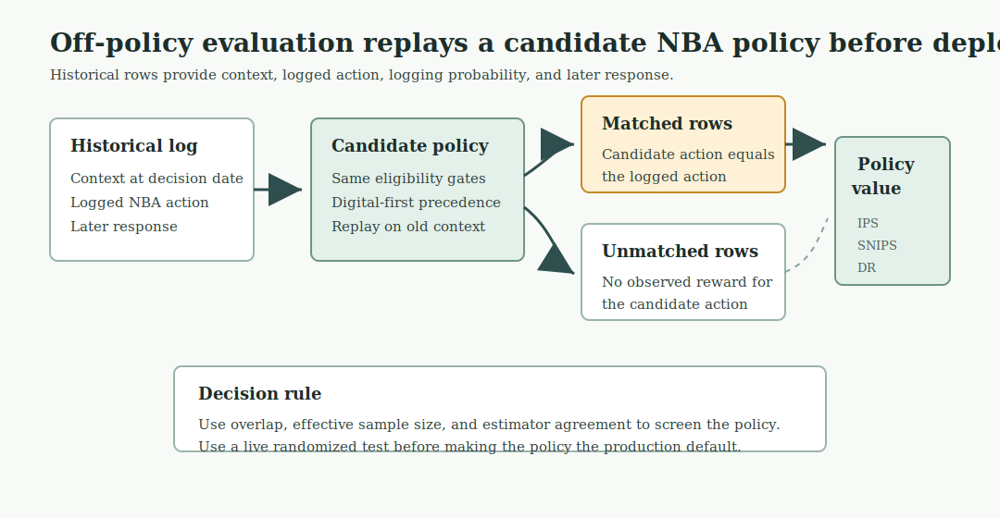

# Chapter 9: Next Best Action

The omnichannel channel plan released one cycle action per HCP-account row after permission, access, pressure, and capacity checks. The next decision is the single dated action for each row. On February 28, 2025, HCP0280 at account ACC089 could be called, emailed, invited to a peer or speaker program, routed to access follow-up, or left alone. Three teams could act on that row in the same week, or a compliant action could go unmade.

Next best action commits to exactly one action per HCP-account row on a date, records the reason, records the alternatives it rejected, sets an expiration, and stays auditable. We build that engine from the channel-plan state. The engine generates a candidate menu, applies eligibility as a hard gate, resolves the choice by policy precedence, ranks inside the gates with predicted response and incremental uplift, and attaches a recommendation contract. It then adds governed learning: a contextual bandit that explores where the policy is least certain, an off-policy estimate of an alternative policy before any live test, and the experiment that would settle the question. Open [`ch09_walkthrough.ipynb`](ch09_walkthrough.ipynb), or run the blocks below from the repository root.

> **Note:** All products, HCPs, accounts, and events are fictional and synthetic. The state, scores, and rewards are read from the omnichannel outputs, whose response rates are compressed high for teaching visibility. The decision architecture is what transfers, not the rate level.

## 9.1 The Candidate Set

The engine reads the omnichannel channel-plan state, the snapshot scores, and the event ledger, then builds a candidate menu for every HCP-account row.

`run_analysis()` in `next_best_action.py` loads the omnichannel channel-plan state, calls `generate_candidates()`, `select_recommendations()`, `reward_candidates()`, `candidate_audit()`, `thompson_exploration()`, `off_policy_evaluation()`, and `precedence_experiment_design()` from the same module, and returns the complete `results` dictionary that every later listing reads. Listing 9.1 calls it here.

**Listing 9.1**: Load the engine package

```python
from pathlib import Path
import sys
import pandas as pd

ROOT = Path.cwd().resolve()
sys.path.insert(0, str(ROOT))

from ch09_nba.scripts.next_best_action import run_analysis

results = run_analysis(ROOT)
print(f"Recommendations: {len(results['recommendations'])}")
print(f"Candidates: {len(results['action_candidates'])}")
```

```text
Recommendations: 158
Candidates: 1106
```

Each of the 158 HCP-account rows generates a 7-action menu, so the candidate table holds 1,106 rows. The menu always includes no action. Inaction is a legitimate recommendation, and it is the only compliant one when permission or policy suppresses contact.

A selected action alone cannot show whether another action was considered, found ineligible, or simply ranked lower. Candidate generation makes the whole decision set inspectable. HCP0280 shows the menu.

`generate_candidates()` in `next_best_action.py` builds the full 7-action menu for every HCP-account row and produces `results["action_candidates"]`; Listing 9.2 reads it here.

**Listing 9.2**: Inspect one HCP-account row's candidate menu

```python
candidates = results["action_candidates"]
trace = candidates.loc[candidates.npi.eq("9000000280")]
print(trace[[
    "candidate_action", "eligible", "policy_precedence", "reason_code"
]].to_string(index=False))
```

```text
           candidate_action  eligible  policy_precedence                                                  reason_code
                  No action      True                 90                  No higher-precedence eligible action passed
           Access follow-up     False                 10                   Account evidence points to access friction
         Field conversation     False                 20       Priority HCP-account row with permitted field capacity
         Program invitation     False                 25   Prior live-program attendance supports a repeat invitation
             Approved email      True                 30  Available email frequency with a priority or digital signal
Continue responsive content      True                 40 Meaningful digital response without a higher-priority action
                    Monitor      True                 80    Eligible HCP-account row without a stronger action signal
```

Four of HCP0280's seven candidates are eligible. The account is in a monitor state, not a priority account, so field conversation and program invitation fail their gates. The row has no recent access friction, so access follow-up fails. Approved email, responsive content, monitor, and no action remain.


*Figure 9.1. HCP0280 starts with 7 candidates; the gate removes access, field, and program actions, then precedence selects approved email and records the rejected alternatives. Synthetic data.*

## 9.2 Eligibility as a Hard Gate

Let $\mathcal{A}_i$ be the candidate actions for HCP-account row $i$. The eligible set keeps only actions that pass every required gate:

$$
\mathcal{A}^{E}_i = \{a \in \mathcal{A}_i : g_k(i,a)=1 \text{ for every gate } k\}.
$$

Permission, access routing, recent pressure, and account priority define the gates. The gate is a hard constraint. An ineligible action never returns through a high score, which is the most common failure mode in systems built around one unified score.

| Failure | Result |
| --- | --- |
| Contact not permitted, or account on hold | Only no action remains |
| Account routed to access work | Remove promotional candidates, keep access follow-up |
| 5 or more events in the prior 30 days | Remove promotional candidates |
| Account not a priority | Remove field conversation |
| No prior live-program attendance | Remove program invitation |
| Email frequency at the cap, no digital or priority signal | Remove approved email |

The gates produce the eligibility flags in Listing 9.2. They run before any model score, and the policy applies the same gates in Section 9.3.

```python
reasons = [
    "Suppressed", "Access route first", "Not priority",
    "No live-program signal", "Passed",
]
gate_summary = results["gate_summary"].set_index("ineligibility_reason")
print(gate_summary.loc[reasons].reset_index().to_string(index=False))
```

```text
  ineligibility_reason  blocked_candidates
            Suppressed                 276
    Access route first                 175
          Not priority                  69
No live-program signal                  36
                Passed                 397
```

Suppression blocks the largest number of candidate actions because an HCP-account row without permission or under an account hold can only release no action. Access routing blocks promotional candidates until the access issue is handled. Three hundred ninety-seven candidates pass their action-specific gates and move to precedence.

## 9.3 Policy Precedence

Among the eligible actions, the engine selects the one with the lowest precedence number. Suppression selects no action first. Access follow-up precedes promotion, because an unresolved barrier should be cleared before a promotional touch. Field conversation precedes program invitation and email for a priority account. Monitoring precedes an unsupported contact. The selected action is

$$
a_i^* = \arg\min_{a \in \mathcal{A}^{E}_i} \pi(a),
$$

where $\pi(a)$ is the declared precedence. A model may rank rows inside a tier, but it never changes $\pi$.

`select_recommendations()` in `next_best_action.py` applies precedence rules to the eligible candidate set and produces `results["recommendations"]`; `recommendation_summary()` in the same module counts actions and produces `results["recommendation_summary"]`. Listing 9.3 reads it here.

**Listing 9.3**: Count recommendations by action

```python
summary = results["recommendation_summary"].copy()
summary["mean_predicted_response"] = summary.mean_predicted_response.round(3)
print(summary.to_string(index=False))
```

```text
         recommended_action  recommendations  review_required  mean_predicted_response
                  No action               46                0                    0.510
           Access follow-up               35               35                    0.665
         Program invitation               35                0                    0.670
                    Monitor               20                0                    0.506
             Approved email               13                0                    0.634
Continue responsive content                6                0                    0.695
         Field conversation                3                3                    0.615
```

The distribution reflects the gates and the synthetic state, not an optimization target. Permission and policy suppress 46 HCP-account rows into no action. Access friction routes 35 to access follow-up, each flagged for review. Prior live-program attendance releases 35 program invitations. Only 3 priority accounts with permitted field capacity reach field conversation. HCP0280 takes the lowest-precedence eligible action on its menu, approved email at precedence 30.

## 9.4 Reward Design: Response and Uplift

The channel analysis built the response and uplift scores. The recommendation engine treats them as inputs, not as permission to act. Eligibility and precedence run first. Scores only rank eligible actions inside a tier.

A response model answers, "Which HCP-account row is most likely to show a meaningful response in the next window?" An uplift model answers, "Which HCP-account row is most likely to change because we take this action?" The difference matters most when the action is scarce.

| Relationship | Probability of response with no invitation | Probability of response with invitation | Expected uplift | Reward if the goal is response | Reward if the goal is incremental change |
| --- | ---: | ---: | ---: | ---: | ---: |
| Sure thing | 82% | 86% | 4 points | 86% | 4 points |
| Persuadable | 43% | 58% | 15 points | 58% | 15 points |

For HCP-account row \(i\) and candidate action \(a\), the two planning rewards are:

$$
R^{\text{response}}_{i,a} = \hat{p}_{i,a},
\qquad
R^{\text{uplift}}_{i,a} =
\hat{p}_{i,a} - \hat{p}_{i,0}.
$$

Here \(\hat{p}_{i,a}\) is the estimated response probability if action \(a\) is taken, and \(\hat{p}_{i,0}\) is the estimated response probability under the control or routine-follow-up state. The engine uses response to rank routine, low-cost follow-up inside a precedence tier. It uses uplift to review scarce promotional slots such as program invitations and field-heavy actions. A high reward never overrides permission, access routing, pressure, or capacity.

`reward_overlap()` in `next_best_action.py` checks whether the response and uplift rewards point to the same promotional-eligible HCP-account rows and produces `results["reward_overlap"]`; Listing 9.4 reads it here.

**Listing 9.4**: Compare the response ranking with the uplift ranking

```python
overlap = results["reward_overlap"].copy()
print(overlap.to_string(index=False))
```

```text
                               metric  value
Promotional-eligible HCP-account rows  51.00
          Spearman response vs uplift  -0.78
       Top-20 shared by both rankings   1.00
      Top-20 only in response ranking  19.00
```

Across the 51 HCP-account rows eligible for a promotional action, the response score and the uplift score have a Spearman correlation of -0.78. The rankings are strongly inverted: the rows most likely to respond are usually the rows an action moves least. Rank the rows by predicted response and by uplift, and the two top-20 lists share 1 HCP. Nineteen of the highest responders sit outside the 20 highest-uplift rows.

`reward_candidates()` in `next_best_action.py` attaches predicted response and estimated uplift scores to every promotional-eligible candidate and produces `results["reward_candidates"]`; Listing 9.5 reads it here.

**Listing 9.5**: Trace where the rankings disagree

```python
reward = results["reward_candidates"].copy()
print(reward[[
    "npi", "candidate_action", "predicted_response",
    "estimated_uplift", "rank_by_response", "rank_by_uplift"
]].head(6).round(3).to_string(index=False))
```

```text
       npi   candidate_action  predicted_response  estimated_uplift  rank_by_response  rank_by_uplift
9000000128 Program invitation               0.844             0.039                 1              45
9000000239 Program invitation               0.839             0.041                 2              43
9000000204 Program invitation               0.831             0.024                 3              50
9000000232 Program invitation               0.828             0.036                 4              48
9000000650     Approved email               0.803             0.052                 5              37
9000000406 Program invitation               0.802             0.056                 6              36
```

The six highest responders all sit deep in the uplift ranking, between 36th and 50th. HCP0204 ranks third by response but 50th by uplift. A response ranking would spend scarce program slots on these rows first. An uplift ranking sends the scarce slots to rows with more expected incremental movement.


*Figure 9.3. Promotional-eligible rows split into high-response sure things and higher-uplift persuadable rows; HCP0204 shows why response alone can waste a scarce program slot. Synthetic data.*

The engine keeps precedence as the primary order and uses these scores only inside a tier. The response score is the within-tier capacity rank. The uplift score is the signal a field manager should consult before spending a scarce program slot on an HCP-account row likely to respond anyway.

## 9.5 The Recommendation Contract

A selected action becomes a recommendation when it carries the context that lets a field team trust it, a compliance team audit it, and a data science team test it later. The contract attaches that context to every row.

`select_recommendations()` in `next_best_action.py` attaches reason codes, expected results, measurement hooks, and expiration dates to every selected action, producing `results["recommendations"]`; Listing 9.6 reads it here.

**Listing 9.6**: Read the recommendation contract for one HCP-account row

```python
recommendations = results["recommendations"]
row = recommendations.loc[recommendations.npi.eq("9000000280")].iloc[0]
for field in [
    "recommendation_id", "account_id", "recommended_action",
    "recommended_channel", "reason_code", "expected_result",
    "measurement_hook", "recommendation_date", "expires_on",
    "review_required",
]:
    print(f"{field}: {row[field]}")
```

```text
recommendation_id: NBA00131
account_id: ACC089
recommended_action: Approved email
recommended_channel: Email
reason_code: Available email frequency with a priority or digital signal
expected_result: Deliver approved content and earn a click
measurement_hook: Delivery and click
recommendation_date: 2025-02-28 00:00:00
expires_on: 2025-03-14 00:00:00
review_required: False
```

The reason code names the rule that selected the action, not a clinical intent or a sales claim. The expected result is operational: deliver approved content and earn a click. The measurement hook names what execution must record. The expiration freezes the evidence to a 14-day window. This recommendation row is the reusable artifact.


*Figure 9.2. The engine reduces 1,106 candidates to 397 eligible candidates and 158 selected actions, with most released rows going to no action, access follow-up, and program invitation. Synthetic data.*

## 9.6 Rejected-Alternative Audit

When a field manager asks why HCP0280 received an email rather than a field call, the audit answers. It labels every candidate as selected, ineligible, or eligible but lower precedence.

`candidate_audit()` in `next_best_action.py` labels every candidate as selected, ineligible, or eligible-but-lower-precedence and produces `results["candidate_audit"]`; `audit_summary()` in the same module counts by status and produces `results["audit_summary"]`. Listings 9.7 and 9.8 read both.

**Listing 9.7**: Summarize the candidate audit

```python
print(results["audit_summary"].to_string(index=False))
```

```text
             candidate_status  candidates
                   Ineligible         709
Eligible but lower precedence         239
                     Selected         158
```

**Listing 9.8**: Audit one HCP-account row's rejected alternatives

```python
audit = results["candidate_audit"]
trace = audit.loc[audit.npi.eq("9000000280")]
print(trace[[
    "candidate_action", "candidate_status", "policy_precedence"
]].to_string(index=False))
```

```text
           candidate_action              candidate_status  policy_precedence
                  No action Eligible but lower precedence                 90
           Access follow-up                    Ineligible                 10
         Field conversation                    Ineligible                 20
         Program invitation                    Ineligible                 25
             Approved email                      Selected                 30
Continue responsive content Eligible but lower precedence                 40
                    Monitor Eligible but lower precedence                 80
```

HCP0280 received email because field conversation and program invitation were ineligible at the gate, and email was the highest-precedence action that passed. Responsive content and monitor were eligible but ranked lower. The audit makes that chain explicit for every HCP-account row.


*Figure 9.4. Each candidate action is split into selected, eligible but lower precedence, or ineligible status, making rejected alternatives visible by action type. Synthetic data.*

## 9.7 Lifecycle and Expiration

A recommendation is a dated decision. New contact, consent, access, or treatment evidence can change eligibility, so a recommendation that sits unexecuted for too long can act on stale evidence. The 14-day expiration should follow from how fast the evidence actually refreshes, not from convention.

`expiration_analysis()` in `next_best_action.py` measures inter-event gaps in the omnichannel event ledger and produces `results["expiration_analysis"]`; Listing 9.9 reads it here.

**Listing 9.9**: Measure the evidence refresh rate

```python
print(results["expiration_analysis"].to_string(index=False))
```

```text
                      metric  value
  Median days between events 12.000
    Mean days between events 17.300
Share of gaps within 14 days  0.573
Share of gaps within 30 days  0.828
```

The median gap between consecutive events for the same HCP-account row is 12 days, inside the 14-day window. Fifty-seven percent of gaps fall within 14 days, so most recommendations will face new evidence at the next contact and should be recomputed by then. A 30-day window would let about 17% of rows accumulate a new event before the recommendation refreshed. The engine recomputes after the window and preserves the prior record.


*Figure 9.5. The cumulative refresh curve shows that 57% of HCP-account event gaps close within 14 days and 83% close within 30 days. Synthetic data.*

## 9.8 Exploration with a Contextual Bandit

The precedence engine exploits current evidence. It always selects the highest-precedence eligible action. That is the right default for a settled policy where field consistency and compliance matter. Learning the policy requires some governed exploration, because a fixed policy rarely tries an action outside its current preference.

For HCP0280, the context bucket is `Digital-responsive`: the row has a recent qualified digital action and remains eligible for email. A contextual bandit estimates action value inside a context like that one. The engine chooses an action, observes the later outcome, and updates its belief about how well each action works for similar HCP-account rows. The exploration question is how often to try a less-favored eligible action to learn.

The intuition is a row of slot machines whose payout rates are unknown. Pulling the arm that has paid best so far exploits what you know. Pulling an uncertain arm explores. Thompson sampling resolves the tradeoff with a simple rule. Represent each action's success rate as a Beta distribution, wide when evidence is thin and narrow when evidence is thick. To choose, draw one random number from each action's distribution and take the highest draw. An action with a high estimated rate is usually chosen. An action whose distribution is wide still wins some draws, so exploration concentrates exactly where uncertainty is greatest.

The Beta distribution updates by counting. After $s$ successes and $f$ failures, the action's distribution is $\text{Beta}(s+1, f+1)$, with mean $(s+1)/(s+f+2)$. More data tightens it around the true rate.

`thompson_exploration()` in `next_best_action.py` seeds Beta posteriors from the logged action history and simulates Thompson sampling draws for a given context bucket, producing `results["thompson_exploration"]` and `results["thompson_cold_start"]`; Listings 9.10 and 9.11 read those results.

**Listing 9.10**: Seed the digital-responsive arms from full history

```python
exploration = results["thompson_exploration"].copy()
print(exploration[[
    "context_bucket", "logged_action", "snapshots", "posterior_mean",
    "posterior_sd", "explore_share"
]].to_string(index=False))
```

```text
    context_bucket      logged_action  snapshots  posterior_mean  posterior_sd  explore_share
Digital-responsive Field conversation         96           0.633         0.048          0.736
Digital-responsive     Approved email        141           0.594         0.041          0.264
Digital-responsive          No action         79           0.383         0.054          0.000
```

The `explore_share` is the fraction of 2,000 Thompson draws in which each action would be chosen. With the full history seeding the digital-responsive arms, field conversation wins 74% of draws. Approved email still wins 26% because its posterior overlaps with field. No action has a lower posterior mean and rarely wins.

Exploration only appears when the evidence is thin. Seeding the same arms from the first 2 months changes the picture.

**Listing 9.11**: Seed the digital-responsive arms from a cold start

```python
cold = results["thompson_cold_start"].copy()
print(cold[[
    "context_bucket", "logged_action", "snapshots", "posterior_mean",
    "posterior_sd", "explore_share"
]].to_string(index=False))
```

```text
    context_bucket      logged_action  snapshots  posterior_mean  posterior_sd  explore_share
Digital-responsive     Approved email         35           0.568         0.080          0.372
Digital-responsive Field conversation         20           0.545         0.104          0.307
Digital-responsive          No action         20           0.545         0.104          0.320
```

With only 2 months of evidence, the digital-responsive arms have wide, overlapping distributions. Approved email wins 37% of draws, no action wins 32%, and field conversation wins 31%. As evidence accumulates, field conversation separates from no action, while email remains a plausible arm. The context matters: a program-history row would have a different arm set and a different posterior.


*Figure 9.6. For digital-responsive rows, cold-start action posteriors overlap and Thompson sampling explores; with full history, field conversation separates from no action while email remains plausible. Synthetic data.*

A production system that adds a bandit treats the exploration arm as a governed randomized experiment, with prespecified outcome windows, suppression of ineligible actions, and human review of the explored population. The bandit ranks inside fixed gates.

## 9.9 Off-Policy Evaluation of an Alternative Policy

Suppose leadership proposes a digital-first variant. The current NBA policy uses the gates and precedence already built in this chapter: suppression first, access follow-up before promotion, field conversation ahead of approved email for priority rows, then lower-precedence actions such as responsive content, monitor, and no action. The proposed digital-first policy keeps the same gates, but changes one precedence choice. For a priority HCP-account row with a high response score, approved email moves ahead of field conversation.

A policy is a decision rule. Given one HCP-account row on a decision date, it chooses one released action for the next recommendation window. The logged policy is the rule that produced the historical recommendation in the log. The candidate policy is the proposed rule we want to screen before a live test.

Each historical row has 3 parts:

| Part of the row | Meaning |
| --- | --- |
| Context | What the engine knew on the decision date: account state, permission, pressure, response score, uplift score, and candidate eligibility |
| Logged action | The action the old policy released for that row on that date |
| Later response | Whether a meaningful response appeared during the following recommendation window |

The logged action is historical. It is the action the old policy took. The response is later than that action. Off-policy evaluation replays the candidate policy on the same historical context and asks what action the candidate would have chosen for the same row.

When the candidate chooses the same action as the log, the later response is usable evidence. Example: the log released approved email, the candidate also releases approved email, and the following window shows a meaningful response. When the candidate chooses a different action, the log has no observed reward for the candidate action. Example: the log released field conversation, the candidate would have released approved email, and the following response belongs to the field path that actually happened.

Off-policy evaluation estimates the expected response for the full candidate strategy without deploying it. The unit is the policy across all HCP-account decision rows, not one HCP. The estimate screens the policy before a live test, because a live policy change affects customers, field workload, compliance review, and measurement.



*Figure 9.7. Off-policy evaluation replays a candidate policy on historical NBA decisions and estimates the expected response for the full strategy before deployment. Synthetic data.*

The logged history records, for each past snapshot, the action the base policy took, the logging probability, and whether a meaningful response followed. `off_policy_evaluation()` in `next_best_action.py` applies IPS, self-normalized IPS, and doubly-robust estimators to that history and produces `results["off_policy_evaluation"]`; Listing 9.12 reads it here.

The estimators answer the same policy-value question in different ways. Inverse-propensity scoring, or IPS, keeps the matched rows and weights each observed reward by how likely that logged action was under the old policy. Self-normalized IPS, or SNIPS, divides by the empirical sum of the weights, which usually makes the estimate less jumpy when overlap is imperfect. The direct method fits a reward model from logged data and scores the action the candidate would take for each row. Doubly robust estimation starts with that reward-model prediction, then adds a weighted correction from matched logged rewards. It is useful because the reward model and action weights check each other.

**Listing 9.12**: Evaluate the digital-first variant four ways

```python
policy = results["off_policy_evaluation"].copy()
policy["estimated_response_rate"] = policy.estimated_response_rate.map(
    lambda x: f"{x:.1%}"
)
policy["effective_sample_size"] = policy.effective_sample_size.round(1)
print(policy.to_string(index=False))
```

```text
       policy      estimator estimated_response_rate  matched_snapshots  effective_sample_size
logged_policy on_policy_mean                   57.3%               1422                 1422.0
digital_first            ips                   54.7%               1263                 1262.1
digital_first          snips                   56.7%               1263                 1262.1
digital_first  doubly_robust                   57.4%               1263                 1262.1
```

The digital-first variant differs from the logged policy on 159 of 1,422 snapshots, so overlap is high. The effective sample size stays close to the 1,263 matched snapshots because the logging propensities are stable. IPS, self-normalized IPS, and the doubly-robust estimator all place the variant near the logged policy, from 54.7% to 57.4% against the logged 57.3%. That spread is too small to justify a policy switch. The off-policy result screens the variant as plausible, then sends the question to a live randomized test.

## 9.10 The Experiment That Would Settle It

Off-policy evaluation narrows the field. A randomized test settles it. The cleanest design assigns each eligible HCP-account row to the current precedence or the digital-first variant, holds every eligibility gate identical across arms, and measures meaningful response within the recommendation window.

`precedence_experiment_design()` in `next_best_action.py` computes the required sample size and cycle count for a two-arm precedence test and produces `results["experiment_design"]`; Listing 9.13 reads it here.

**Listing 9.13**: Size the precedence experiment

```python
print(results["experiment_design"].to_string(index=False))
```

```text
                           parameter    value
              Baseline response rate    0.598
           Minimum detectable effect    0.050
                               Power    0.800
                     Two-sided alpha    0.050
   Required HCP-account rows per arm 1474.000
Eligible HCP-account rows this cycle  112.000
           Cycles to reach both arms   27.000
```

Detecting a 5-point absolute change from a 60% baseline, at 80% power and a two-sided 5% level, needs about 1,474 HCP-account rows per arm. This cycle has 112 eligible rows. The eligible population is far smaller than a well-powered test requires, so a recommendation-level experiment must pool across roughly 27 planning cycles or across geographies. That sample-size reality is the binding constraint on recommendation-level testing in commercial settings. The recommendation log built here becomes the randomization register for that test.

## 9.11 Frontier Methods

The engine spans the practical spectrum. A deterministic rule engine with hard gates, precedence, reason codes, and an audit trail gives compliance and field teams a stable operating base. Response and uplift scores rank inside the gates, a contextual bandit explores where the policy is least certain, and off-policy evaluation screens a new policy before deployment.

The same architecture extends in two directions. When actions chain over time, so that today's email changes the value of next month's field call, offline reinforcement learning, such as fitted Q-evaluation, estimates the value of a multi-step policy from logged trajectories. When many specialized models propose actions, an agentic orchestration layer arbitrates among them. The governance rule stays the same for the single-step case: the optimizer proposes inside the gates, and permission, access, pressure, capacity, and approved-content rules run first. Start with the rule engine and bandit. Graduate to constrained reinforcement learning when the actions genuinely chain and the governance around exploration is in place.

## 9.12 From State to Governed Recommendation

The channel plan leaves the single action undecided. The engine resolved it. It generated a 7-action menu for each of 158 HCP-account rows, removed ineligible actions at the gate, and selected one action per row by precedence: 46 to no action, 35 to access follow-up, 35 to a program invitation, and a small set to field and email. It ranked scarce promotional slots by uplift rather than response. It attached a reason, an expected result, a measurement hook, and a 14-day expiration justified by a 12-day median refresh, and it recorded every rejected alternative. For HCP0280 the governed recommendation is approved email, with the field and program actions shown ineligible and the reason on the row.

## 9.13 Summary

Next best action turns a dated state into one auditable action per HCP-account row.

- Generate the full candidate menu, including no action, before selecting.
- Treat eligibility as a hard gate that no score can override.
- Resolve the choice by declared precedence, and rank only inside a tier.
- Rank scarce actions by uplift, not predicted response, to avoid spending on sure things.
- Attach a reason code, expected result, measurement hook, expiration, and review flag to every row.
- Record every rejected alternative as selected, ineligible, or lower precedence.
- Justify the expiration window from the measured evidence refresh rate.
- Explore with a bandit only where the action posteriors overlap, and keep exploration inside the gates.
- Screen an alternative policy off-policy before a live test, and compare IPS, self-normalized IPS, doubly-robust estimates, overlap, and effective sample size.
- Size the confirmatory experiment, and expect to pool cycles to reach power.

> **What you have learned from this chapter:** You can now commit to exactly one dated action per HCP-account row by generating the full candidate menu, applying eligibility as a hard gate, resolving the choice by policy precedence, and ranking inside a tier with response and uplift. You know to record the action, reason, expected result, measurement hook, expiration, and rejected alternatives on the same row, to let a contextual bandit explore only where the policy is least certain, and to keep every learning component proposing inside fixed gates that permission, access, pressure, and capacity define.

## 9.14 Exercises

1. **Reverse field and email precedence.** Swap the precedence of field conversation and approved email, rebuild the recommendations, and report how many HCP-account rows change action. State which team the original ordering represents and what the swap would cost. (Section 9.3.)
2. **Rank a tier by uplift.** Within the field-eligible rows, select the field slots by estimated uplift rather than predicted response, and compare the two selected sets. Name one row that the response ranking would call and the uplift ranking would not, and say why. (Section 9.4.)
3. **Design the precedence test.** You have run the digital-first variant off-policy and the doubly-robust estimate is close to the logged policy. Specify the randomized test you would register to decide it: the randomization unit, the control arm, the primary outcome, the measurement window, and the number of cycles you would expect to need. End with the one real-world evidence source you would require before trusting the off-policy estimate. (Sections 9.9 and 9.10.)

Worked solutions are in [`ch09_exercise_solutions.ipynb`](ch09_exercise_solutions.ipynb). Each solution ends with the judgment an analyst should record for real data.

The experiments chapter takes the recommendation log built here as its randomization register and measures incremental effect.
