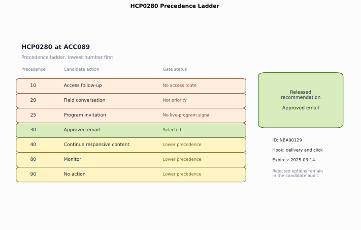
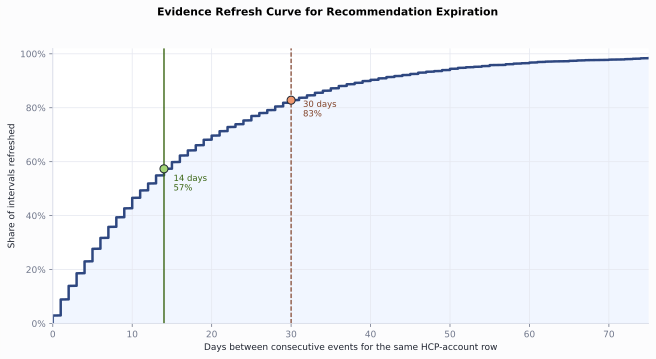
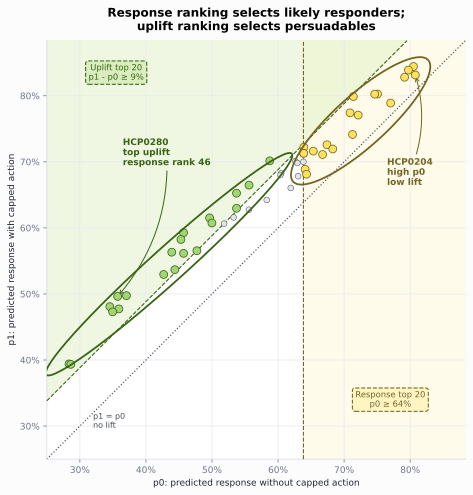
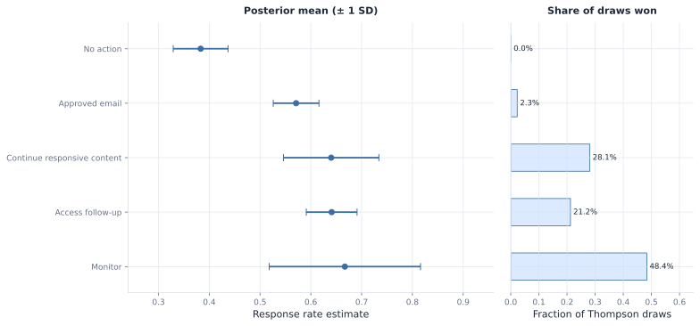

# Chapter 9: Next Best Action

The omnichannel channel plan gives the current HCP-account state: permission, recent pressure, access friction, digital response, program history, and field capacity. The next decision is narrower and more operational. On February 28, 2025, HCP0280 at account ACC089 needs one dated action for the next recommendation window.

Next best action, or NBA, answers this question: given what we know today, what single action should we take for this HCP-account? The action may be a field conversation, approved email, program invitation, access follow-up, responsive content, monitor, or no action. Monitor and no action look similar but are not: monitor means the row passes all gates but lacks a strong enough signal for a promotional action, so the engine keeps it in the tracking pool and re-evaluates it next cycle. No action means the row cannot be touched at all, contact is not permitted or the account is on hold, so it is skipped entirely.

We start from the channel-plan state and release one single recommendation. For each HCP-account row, the engine lists the plausible actions, removes the ones not allowed, chooses the remaining highest-priority action, and writes the reason, measurement hook, and expiration. After that base policy is in place, we handle the decisions that make NBA hard in practice: ranking constrained actions, exploring safely when the policy is uncertain, and screening a policy change before live execution. Open [`ch09_walkthrough.ipynb`](ch09_walkthrough.ipynb), or run the blocks below from the repository root.

> **Note:** All products, HCPs, accounts, and events are fictional and synthetic. The state, scores, and rewards are read from the omnichannel outputs, whose response rates are compressed high for teaching visibility.

## 9.1 Build the NBA Recommendation Engine

HCP0280 has a digital signal and available email frequency. It sits outside the priority-account group, has no current access route, and lacks a live-program signal. NBA engine releases "approved email" action, explains why no action, access, field, program actions failed their gates, and records continue responsive content and monitor as lower-precedence alternatives.

Figure 9.1 shows the finished NBA result for HCP0280. The engine workflow creates the candidate menu, applies gates, selects approved email, sets the expiration, and writes the recommendation contract.



*Figure 9.1. HCP0280 starts with 7 candidate actions; the gate removes access, field, and program actions, then precedence selects approved email and records the rejected alternatives. Synthetic data.*

### 9.1.1 Load the State

`run_analysis()` in `next_best_action.py` is the wrapper for the whole analysis. It reruns the omnichannel analysis, builds the recommendation state, calls the NBA functions in order, and returns the `results` dictionary.

The recommendation path inside `run_analysis()` runs in this order:

| Step | Function | Output |
| --- | --- | --- |
| Build the action menu and gates | `generate_candidates()` | `results["action_candidates"]` |
| Count gate outcomes | `gate_summary()` | `results["gate_summary"]` |
| Select the released action and write contract fields | `select_recommendations()` | `results["recommendations"]` |
| Count released actions | `recommendation_summary()` | `results["recommendation_summary"]` |
| Measure refresh timing | `expiration_analysis()` | `results["expiration_analysis"]` |

**Listing 9.1**: Load the engine package

```python
from pathlib import Path
import sys
import pandas as pd

ROOT = Path.cwd().resolve()
sys.path.insert(0, str(ROOT))

from ch09_nba.scripts.next_best_action import run_analysis

results = run_analysis(ROOT)
print(f"Recommendations: {len(results['recommendations'])}")
print(f"Candidates: {len(results['action_candidates'])}")
```

```text
Recommendations: 158
Candidates: 1106
```

Each of the 158 HCP-account rows generates a 7-action menu, so candidates holds 1,106 rows: one per HCP-account-action pair.

### 9.1.2 Apply the Gates

Permission, access routing, recent pressure, and account priority define the gates. These are hard rules. If an action fails a gate, the engine drops it. No model score can bring it back.

| Gate | Triggers when | Effect on menu |
| --- | --- | --- |
| Suppressed | Contact not permitted or account on hold | Only no action eligible |
| Access route | Account in access review or competitive access situation | Remove promotion, keep access follow-up |
| High pressure | 5 or more events in the prior 30 days | Remove promotion |
| Not priority | Account not flagged for increased priority | Remove field conversation |
| No program signal | No prior live-program attendance | Remove program invitation |
| Email at cap | Email frequency at cap with no digital or priority signal | Remove approved email |

The gate thresholds are hardcoded business policy, not outputs of a model. The pressure cap of 5 events in 30 days, the email frequency cap, and every other threshold here reflect a specific commercial strategy and therapeutic area. A different brand, a different market, or a different stage of launch would need different values.

The gates are applied inside `generate_candidates()`. `gate_summary()` in `next_best_action.py` counts the main outcomes across all candidates and produces `results["gate_summary"]`; Listing 9.2 reads it here.

**Listing 9.2**: Count the main gate outcomes

```python
reasons = [
    "Suppressed", "Access route first", "Not priority",
    "No live-program signal", "Passed",
]
gate_summary = results["gate_summary"].set_index("ineligibility_reason")
print(gate_summary.loc[reasons].reset_index().to_string(index=False))
```

```text
  ineligibility_reason  blocked_candidates
            Suppressed                 276
    Access route first                 175
          Not priority                  69
No live-program signal                  36
                Passed                 285
```

Suppression blocks the largest number of actions because a row without permission, or with an account hold, can only release no action. The 276 suppressed candidates come from 46 rows, each with 6 actions blocked (276 = 46 × 6); those same 46 rows will each produce a no action recommendation in the next step. Access routing blocks promotional actions until the access issue is handled. In total, 285 candidates pass their action-specific gates and move to the next step.

### 9.1.3 Build the Candidate Menu

`generate_candidates()` in `next_best_action.py` tests a fixed 7-action menu against the gate flags for each HCP-account row. A row is promotion-eligible when none of the first three flags (suppressed, access route, high pressure) are set. Precedence is the rank the engine uses to select among eligible actions; the lowest number wins.

| Precedence | Action | Eligible when |
| --- | --- | --- |
| 1 | No action | Suppressed |
| 10 | Access follow-up | Not suppressed AND access route |
| 20 | Field conversation | Promotion-eligible AND priority AND field capacity available |
| 25 | Program invitation | Promotion-eligible AND prior live-program attendance |
| 30 | Approved email | Promotion-eligible AND (priority OR digital signal) AND under email cap |
| 40 | Continue responsive content | Not suppressed, not access route AND digital signal AND not priority |
| 80 | Monitor | Not suppressed AND not access route |

The gap between precedence 40 and 80 reserves space for future action types without renumbering. Every row in the menu goes into `results["action_candidates"]` regardless of eligibility, so the audit trail records what was blocked and why.

The precedence order is also hardcoded business policy. The decision to put field conversation above program invitation, approved email above responsive content, and monitoring last reflects a specific commercial strategy and must be adjusted for each therapeutic area and market.

**Listing 9.3**: Inspect one HCP-account row's candidate menu

```python
candidates = results["action_candidates"]
trace = candidates.loc[candidates.npi.eq("9000000280")].sort_values(
    "policy_precedence"
)
print(trace[[
    "candidate_action", "eligible", "policy_precedence", "reason_code"
]].to_string(index=False))
```

```text
           candidate_action  eligible  policy_precedence                                                  reason_code
                  No action     False                  1                      Permission or policy suppresses contact
           Access follow-up     False                 10                   Account evidence points to access friction
         Field conversation     False                 20       Priority HCP-account row with permitted field capacity
         Program invitation     False                 25   Prior live-program attendance supports a repeat invitation
             Approved email      True                 30  Available email frequency with a priority or digital signal
Continue responsive content      True                 40 Meaningful digital response without a higher-priority action
                    Monitor      True                 80    Eligible HCP-account row without a stronger action signal
```

The table is sorted by `policy_precedence`. The lowest number is checked first and wins if that action is eligible.

Three of HCP0280's seven candidates are eligible. No action is ineligible because the row is reachable. Access, field, and program actions each fail their specific gate. Approved email, responsive content, and monitor remain; approved email wins at precedence 30.

### 9.1.4 Select One Action

Among the actions that remain, the engine selects the one with the lowest precedence number. Suppression puts no action first. Access follow-up comes before promotion. Field conversation comes before program invitation and email for a priority account. Monitoring sits below supported engagement actions.

`select_recommendations()` in `next_best_action.py` applies precedence rules to the eligible candidate set and produces `results["recommendations"]`; `recommendation_summary()` in the same module counts actions and produces `results["recommendation_summary"]`. Listing 9.4 reads it here.

**Listing 9.4**: Count recommendations by action

```python
summary = results["recommendation_summary"].copy()
summary["mean_predicted_response"] = summary.mean_predicted_response.round(3)
print(summary.to_string(index=False))
```

```text
         recommended_action  recommendations  review_required  mean_predicted_response
                  No action               46                0                    0.510
           Access follow-up               35               35                    0.665
         Program invitation               35                0                    0.670
                    Monitor               20                0                    0.506
             Approved email               13                0                    0.634
Continue responsive content                6                0                    0.695
         Field conversation                3                3                    0.615
```

This distribution reflects the current state and the current rules. Permission and policy suppress 46 HCP-account rows into no action. Access friction routes 35 to access follow-up. Prior live-program attendance releases 35 program invitations. Only 3 priority accounts with permitted field capacity reach field conversation. HCP0280 receives approved email at precedence 30.

### 9.1.5 Set the Expiration

A recommendation is a dated decision. New engagement, consent, access, or treatment evidence can change the right action. If the row sits too long, the recommendation gets stale. The 14-day expiration should come from the refresh pattern in the data.

`expiration_analysis()` in `next_best_action.py` measures inter-event gaps in the omnichannel event ledger and produces `results["expiration_analysis"]`; Listing 9.5 reads it here.

**Listing 9.5**: Measure the evidence refresh rate

```python
print(results["expiration_analysis"].to_string(index=False))
```

```text
                      metric  value
  Median days between events 12.000
    Mean days between events 17.300
Share of gaps within 14 days  0.573
Share of gaps within 30 days  0.828
```

The median gap between consecutive events for the same HCP-account row is 12 days, inside the 14-day window. Fifty-seven percent of gaps close within 14 days. Many rows see new evidence quickly. A 30-day window would leave more stale recommendations in circulation. The engine recomputes after the window and keeps the prior record for audit.



*Figure 9.2. The cumulative refresh curve shows that 57% of HCP-account event gaps close within 14 days and 83% close within 30 days. Synthetic data.*

### 9.1.6 Write the Recommendation Contract

A selected action becomes a recommendation only when it carries the details needed to use it, review it, and test it later. The contract writes those details onto the row.

Listing 9.6 reads the HCP0280 row from `results["recommendations"]`, which `select_recommendations()` already produced in the selection step.

**Listing 9.6**: Read the recommendation contract for one HCP-account row

```python
recommendations = results["recommendations"]
row = recommendations.loc[recommendations.npi.eq("9000000280")].iloc[0]
for field in [
    "recommendation_id", "account_id", "recommended_action",
    "recommended_channel", "reason_code", "expected_result",
    "measurement_hook", "recommendation_date", "expires_on",
    "review_required",
]:
    print(f"{field}: {row[field]}")
```

```text
recommendation_id: NBA00131
account_id: ACC089
recommended_action: Approved email
recommended_channel: Email
reason_code: Available email frequency with a priority or digital signal
expected_result: Deliver approved content and earn a click
measurement_hook: Delivery and click
recommendation_date: 2025-02-28 00:00:00
expires_on: 2025-03-14 00:00:00
review_required: False
```

The reason code names the rule that selected the action. The expected result stays operational: deliver approved content and earn a click. The measurement hook states what execution must record. The expiration fixes how long the recommendation stays valid. This row is the reusable artifact.

## 9.2 Improve the Baseline Engine

The release engine has selected one action per HCP-account row. The governed baseline answers what the policy would release when the current gates and precedence order run as written.

Two updates make that baseline more useful without weakening governance. The first ranks rows when an action tier has a real resource limit. The second controls learning when the best action inside an eligible context is still uncertain.

### 9.2.1 Rank Resource-Constrained Actions

Resource limits add a second question before deployment. The limit may be capacity, cost, or operational burden. If the field team has fewer slots than field-eligible rows, or a program team has fewer seats than program-eligible rows, the engine must choose which eligible rows receive those capped actions. Response and uplift answer that ranking question inside an eligible action tier.

The response score ranks rows by likely response. The uplift score ranks rows by expected incremental change from the action.
| Row type | Probability of response with no invitation | Probability of response with invitation | Expected uplift |
| --- | ---: | ---: | ---: |
| Sure thing | 82% | 86% | 4 points |
| Persuadable | 43% | 58% | 15 points |

HCP0280 still gets approved email because it is the first eligible action in the policy order. Email is the broad, low-cost engagement action in this menu. Program invitations and field conversations consume scarcer resources: seats, field time, follow-up effort, and compliance review. Among promotional-eligible rows, uplift should allocate scarce program and field actions. Response still describes baseline likelihood for broad email-style engagement.

`reward_overlap()` in `next_best_action.py` checks whether the response and uplift rewards point to the same promotional-eligible HCP-account rows and produces `results["reward_overlap"]`; Listing 9.7 reads it here.

**Listing 9.7**: Compare the response ranking with the uplift ranking

```python
overlap = results["reward_overlap"].copy()
print(overlap.to_string(index=False))
```

```text
                               metric  value
Promotional-eligible HCP-account rows  51.00
          Spearman response vs uplift  -0.78
       Top-20 shared by both rankings   1.00
      Top-20 only in response ranking  19.00
```

Across the 51 HCP-account rows eligible for a promotional action, the response score and the uplift score move in opposite directions. The rows most likely to respond are often the rows the action changes least. Rank the rows by response and by uplift, and the two top-20 lists share only 1 HCP.

`reward_candidates()` in `next_best_action.py` attaches predicted response and estimated uplift scores to every promotional-eligible candidate and produces `results["reward_candidates"]`; Listing 9.8 reads it here.

**Listing 9.8**: Trace where the rankings disagree

```python
reward = results["reward_candidates"].copy()
print(reward[[
    "npi", "candidate_action", "predicted_response",
    "estimated_uplift", "rank_by_response", "rank_by_uplift"
]].head(6).round(3).to_string(index=False))
```

```text
       npi   candidate_action  predicted_response  estimated_uplift  rank_by_response  rank_by_uplift
9000000128 Program invitation               0.844             0.039                 1              45
9000000239 Program invitation               0.839             0.041                 2              43
9000000204 Program invitation               0.831             0.024                 3              50
9000000232 Program invitation               0.828             0.036                 4              48
9000000650     Approved email               0.803             0.052                 5              37
9000000406 Program invitation               0.802             0.056                 6              36
```

The six highest responders all sit deep in the uplift ranking, between 36th and 50th. HCP0204 ranks third by response but 50th by uplift. A response ranking would spend capped program slots on these rows first. An uplift ranking sends the capped slots to rows with more expected incremental movement.



*Figure 9.3. The gold band marks the top 20 rows by p0, the green region marks the top 20 rows by uplift, and no HCP-account row sits in both groups. Synthetic data.*

The base engine still follows policy order first. When a constrained tier needs a cap, the engine applies this ranking before release and keeps the same gates, reason codes, and recommendation contract.

### 9.2.2 Explore Safely

The base NBA engine first removes actions that fail a gate, then chooses the remaining action with the lowest precedence number. That is the highest-priority eligible action. For HCP0280, access follow-up, field conversation, and program invitation fail their gates. Approved email is the first eligible action in the ordered menu. This fixed rule is the right default when consistency and compliance matter.

The fixed rule keeps choosing the same action whenever the same context appears. If another eligible action could work better for that context, the engine may never collect enough evidence to learn it. Exploration is the controlled exception: inside the same gates, the engine can sometimes try another eligible action and measure the result.

For HCP0280, the context bucket is `Digital-responsive`: the row has a recent qualified digital action and remains eligible for email. A bandit is a simple decision learner. It chooses one action, observes the later outcome, and updates what it believes about that action. A contextual bandit first groups similar HCP-account rows by context, then learns which eligible action works best within that group.

The practical question is how often the NBA engine should try a less-favored action. Choosing the best-known action uses current evidence. Trying an uncertain action creates new evidence. Thompson sampling handles that tradeoff: keep a probability curve for each action's unknown response rate, draw once from each curve, and choose the action with the highest draw.

The Beta distribution is useful here because it updates from 2 counts. Let \(s\) be historical successes: logged rows where the action was taken and the later response was 1. Let \(f\) be historical failures: logged rows where the action was taken and the later response was 0. After \(s\) successes and \(f\) failures, the action's curve is:

$$
\text{Beta}(s+1, f+1),
$$

The `+1` terms are a light starting prior. With no history, the curve is \(\text{Beta}(1,1)\), which is flat from 0 to 1. It says the engine does not know the response rate yet. After history arrives, the posterior mean is \((s+1)/(s+f+2)\). More history narrows the curve. Less history leaves the curve wide, even when the mean looks promising.

For field conversation with full history, the digital-responsive rows have \(s=61\) successes and \(f=35\) failures. The posterior curve is \(\text{Beta}(62,36)\), with mean \(62/(62+36)=63\%\). For the cold-start version, field conversation has only \(s=6\) and \(f=4\), producing \(\text{Beta}(7,5)\), with mean \(7/(7+5)=58\%\) and much wider uncertainty.

A cold start means the policy has little history. The curves are wide. Thompson sampling sometimes chooses a less certain arm because a draw from its wide curve can win. Cold start creates more exploration because the curves overlap more.

The 1,000,000 draws in the listings are a simulation of that rule. In each draw, the engine samples one possible response rate from the field curve, one from the email curve, and one from the no-action curve. The action with the largest sampled response rate wins that draw. After 1,000,000 repeats, `draw_win` reports how often each action won. A live system would usually make one draw when it needs one action; the repeated draws here make small win rates visible.

`thompson_exploration()` in `next_best_action.py` seeds Beta posteriors from the logged action history and simulates Thompson sampling draws for a given context bucket, producing `results["thompson_exploration"]` and `results["thompson_cold_start"]`; Listings 9.9 and 9.10 read those results.

**Listing 9.9**: Seed the digital-responsive arms from a cold start

```python
cold = results["thompson_cold_start"].copy()
view = cold.rename(columns={
    "logged_action": "action",
    "successes": "s",
    "failures": "f",
    "posterior_mean": "mean",
    "posterior_sd": "sd",
    "explore_share": "draw_win",
})

def pct(value):
    return f"{value:.4%}" if 0 < value < 0.001 else f"{value:.1%}"

for column in ["mean", "sd"]:
    view[column] = view[column].map(lambda value: f"{value:.1%}")
view["draw_win"] = view.draw_win.map(pct)
print(f"Context: {cold.context_bucket.iloc[0]}")
print(view[["action", "s", "f", "mean", "sd", "draw_win"]].to_string(index=False))
```

```text
Context: Digital-responsive
            action  s  f  mean    sd draw_win
    Approved email 12  8 59.1% 10.3%    36.0%
Field conversation  6  4 58.3% 13.7%    37.2%
         No action  5  4 54.5% 14.4%    26.8%
```

With only 1 month of evidence, the action curves are wide and overlapped. Field conversation wins 37% of draws, approved email wins 36%, and no action wins 27%. The policy explores all 3 arms because the curves still leave real uncertainty about which action is best.

More history changes the picture.

**Listing 9.10**: Seed the digital-responsive arms from full history

```python
exploration = results["thompson_exploration"].copy()
view = exploration.rename(columns={
    "logged_action": "action",
    "successes": "s",
    "failures": "f",
    "posterior_mean": "mean",
    "posterior_sd": "sd",
    "explore_share": "draw_win",
})

def pct(value):
    return f"{value:.4%}" if 0 < value < 0.001 else f"{value:.1%}"

for column in ["mean", "sd"]:
    view[column] = view[column].map(lambda value: f"{value:.1%}")
view["draw_win"] = view.draw_win.map(pct)
print(f"Context: {exploration.context_bucket.iloc[0]}")
print(view[["action", "s", "f", "mean", "sd", "draw_win"]].to_string(index=False))
```

```text
Context: Digital-responsive
            action  s  f  mean   sd draw_win
Field conversation 61 35 63.3% 4.8%    72.7%
    Approved email 84 57 59.4% 4.1%    27.3%
         No action 30 49 38.3% 5.4%  0.0051%
```

With the full history, field conversation wins 73% of draws. Approved email still wins 27% because the field and email curves overlap. No action remains an arm, but its curve sits far enough left that it wins only 0.0051% of 1,000,000 simultaneous draws.



*Figure 9.4. For digital-responsive rows, cold-start curves are flatter and draw wins spread across actions; full-history curves separate and field conversation wins most draws. Synthetic data.*

## 9.3 Evaluate a New Policy Offline

Leadership proposes a digital-first variant. The current NBA policy puts field conversation ahead of approved email for priority rows. The proposed variant changes one choice: for a high-response priority row, approved email moves ahead of field conversation.

A policy is the rule that chooses the released action across all rows. The logged policy produced the historical recommendations. The candidate policy is the proposed replacement rule, replayed across the same historical rows. In this example, the candidate policy is the digital-first rule. Figure 9.5 shows five example rows under that rule.

Each historical row has 4 parts:

| Part of the row | Meaning |
| --- | --- |
| Context | What the engine knew on the decision date: account state, permission, pressure, response score, uplift score, and candidate eligibility |
| Logged action | The action the old policy released for that row on that date |
| Propensity | The probability the logged policy would choose the logged action in that context |
| Later response | Whether a meaningful response appeared during the following recommendation window |

Off-policy evaluation replays the candidate policy on the same historical context and asks what action it would have chosen for that row.

When the candidate chooses the same action as the log, the later response is usable evidence. A row with a propensity of 0.90 contributes its observed response divided by 0.90. When the candidate chooses another action, the log has no observed reward for the candidate action. IPS gives that row no direct reward contribution, while the direct and doubly robust estimators use the reward model for that gap.

Off-policy evaluation estimates the expected response for the full candidate strategy before deployment. The unit is the policy across all HCP-account decision rows. Uplift values an action for one row. Off-policy evaluation values a rule across rows.


*Figure 9.5. The digital-first candidate policy replayed across five historical rows. The single unmatched row has no observed outcome for the candidate action and relies on a reward model to fill the gap. Matched rows contribute observed outcomes weighted by inverse propensity. The right panel shows the doubly-robust full-policy estimate. Synthetic data.*

Figure 9.5 shows five example rows from one replay, grouped by whether the candidate and logged policies agree. The Segment column abbreviates the full context (account state, permission flags, response score, uplift score, and candidate eligibility) into a short label for readability. The Contribution column shows the IPS weight for each row. For matched rows, the numerator is the observed binary outcome recorded in the historical log (1 if the HCP responded within the window, 0 if not), not modeled lift. For the unmatched row, no observed outcome exists for the candidate action. The reward model predicts one, and the doubly-robust estimator uses that prediction as a fill. The unmatched row at the top is the rule change: for the high-response priority segment, the digital-first candidate switches field conversation to approved email. The four matched rows below are unaffected by the rule because the digital-first policy leaves their action unchanged.

The logged history records, for each past snapshot, the action the logged policy took, the propensity, and whether a meaningful response followed. The propensity matters because a matched row from a rarely chosen action carries more information than a matched row from an action the logged policy almost always chose. In IPS, the matched row's contribution is `response / propensity`; in self-normalized IPS (SNIPS), the same contributions are rescaled by the total matched weight. In the implementation, matched rows get weight `1 / logged_probability`, unmatched rows get weight `0` for IPS and self-normalized IPS, and doubly robust fills the unmatched case with the model term. `off_policy_evaluation()` in `next_best_action.py` applies IPS, self-normalized IPS, and doubly-robust estimators to that history and produces `results["off_policy_evaluation"]`; Listing 9.11 reads it here.

These estimators answer the same policy question with separate evidence rules. IPS uses only rows where the candidate policy chooses the same action as the logged policy, then weights each observed response by the inverse of its propensity. Self-normalized IPS uses the same weights but rescales them to limit the influence of a few large weights. The direct method fits a reward model and predicts the response for the candidate action on every row. Doubly robust starts with that model prediction, then corrects it with the weighted observed rewards on matched rows. The later measurement chapter goes deeper into these estimators; here they serve as a screen before a live policy test.

**Listing 9.11**: Evaluate the digital-first variant four ways

```python
policy = results["off_policy_evaluation"].copy()
policy["estimated_response_rate"] = policy.estimated_response_rate.map(
    lambda x: f"{x:.1%}"
)
print(policy[["policy", "estimator", "estimated_response_rate"]].to_string(index=False))
```

```text
       policy      estimator estimated_response_rate
logged_policy on_policy_mean                   57.3%
digital_first            ips                   54.7%
digital_first          snips                   56.7%
digital_first  doubly_robust                   57.4%
```

The digital-first variant differs from the logged policy on 159 of 1,422 snapshots. The replay has high overlap. The 3 off-policy estimates for the variant range from 54.7% to 57.4%, while the logged policy is 57.3%. The best estimate is only 0.1 percentage points above the logged policy, and one estimate is 2.6 points below it. The offline result says the idea is plausible, but not proven.

Off-policy evaluation narrows the field but cannot make the final decision. A randomized test settles the question. The cleanest design assigns each eligible HCP-account row to either the current policy or the digital-first variant, keeps the same gates in both arms, and measures meaningful response inside the recommendation window.

**Sample size.** The required per-arm sample size for a two-proportion test follows the standard formula:

$$
n = \frac{2(z_{\alpha/2} + z_\beta)^2 \,\bar{p}(1-\bar{p})}{\delta^2}
$$

where \(\bar{p}\) is the average of the baseline and alternative response rates, \(\delta\) is the minimum detectable effect (MDE), \(z_{\alpha/2}\) is the critical value for the chosen significance level, and \(z_\beta\) is the critical value for the chosen power. With a baseline response rate of 0.598, an MDE of 5 percentage points (\(\delta = 0.05\)), 80% power (\(1 - \beta = 0.80\)), and a two-sided significance level of 0.05, this yields roughly 1,474 HCP-account rows per arm. This cycle has only 112 eligible rows. One cycle is nowhere near enough. A recommendation-level experiment must pool across roughly 27 planning cycles or across geographies. That sample-size limit is the real constraint here.

The randomized-experiment chapter takes the recommendation log built here as its randomization register and covers the full test design: randomization unit, blocking, sequential monitoring, and interpretation under competing policies.

## 9.4 More Advanced NBA Decisions

The practical stack starts with a rule engine that has hard gates, policy order, reason codes, and an audit trail. Response and uplift rank rows inside the gates. A bandit explores only where the policy is uncertain. Off-policy evaluation screens a new policy before deployment.

The same architecture can support more advanced decision methods after the recommendation log is trustworthy. The first extension is offline reinforcement learning. A standard NBA row chooses one action for the next window. Offline reinforcement learning studies action sequences from historical logs. It can ask whether approved email today raises the value of a field conversation next month, whether a program invitation should wait until access friction improves, or whether repeated low-pressure digital actions build enough engagement to justify a costlier touch later.

That extra reach comes with stricter requirements. Offline reinforcement learning needs a logged state, action, outcome, timing, and policy probability at each decision point. It also needs guardrails that keep the learned policy inside approved actions and compliance rules. In pharma commercialization, the method should start as a policy-screening tool. It can propose sequence rules for review. A randomized test should confirm the policy before broad deployment.

The second extension is specialized model arbitration. Separate teams may build models for separate parts of the decision: an access model flags unresolved coverage friction, a content model predicts which message family fits the HCP-account row, a field model estimates conversation value, a medical or compliance classifier blocks unsupported topics, and an uplift model estimates incremental movement. The release layer translates those outputs into candidate actions, gates, reason codes, and measurement hooks.

The arbitration rule stays concrete: models can propose, but the governed engine releases. Permission, access, pressure, capacity, approved-content rules, and audit requirements run first. If several eligible actions remain, the engine uses declared precedence, resource-aware uplift ranking, controlled exploration, or an approved policy test to resolve the choice.

The same boundary applies across these advanced choices. The channel plan describes the state. The NBA layer turns that state into one released action, records the rejected alternatives, and keeps the measurement hook on the row. For HCP0280, the governed recommendation is approved email. More advanced methods may change ranking, exploration, or policy screening, but the release layer still decides what is eligible, explainable, measurable, and allowed.

## 9.5 Summary

The opening decision was one dated action for HCP0280 at account ACC089. The engine read the channel-plan state, generated a 7-action menu for each of 158 HCP-account rows, removed ineligible actions, and selected one action per row by policy order. It attached a reason, expected result, measurement hook, expiration date, review flag, and rejected alternatives. For HCP0280, the governed recommendation is approved email.

The later sections handled the choices that make NBA operationally useful. Uplift ranked capped promotional slots where response would spend scarce resources on rows already likely to respond. Thompson sampling explored only inside eligible action sets. Off-policy evaluation screened a digital-first policy variant before a live test and showed that a randomized experiment would need pooled cycles or geographies. More advanced NBA methods can extend this stack only after the recommendation log, policy probabilities, and governance fields are reliable.

Key takeaways:

- Generate the full candidate menu, including no action, before selecting.
- Treat eligibility as a hard gate that no score can override.
- Resolve the choice by declared precedence. Response and uplift do not override policy order.
- Rank resource-constrained actions by uplift after the action type is eligible.
- Attach a reason code, expected result, measurement hook, expiration, and review flag to every row.
- Justify the expiration window from the measured evidence refresh rate.
- Explore with a bandit only where the action posteriors overlap, and keep exploration inside the gates.
- Screen an alternative policy off-policy before a live test, and compare IPS, self-normalized IPS, doubly-robust estimates, overlap, and effective sample size.
- Size the confirmatory experiment, and expect to pool cycles to reach power.

You can now turn one HCP-account state into one dated action by generating the full candidate menu, applying hard gates, resolving the choice by policy order, and using response or uplift only after the action type is eligible. You know how to write the action, reason, expected result, measurement hook, expiration, and rejected alternatives on the same row, and how to keep exploration and policy learning inside fixed governance rules.

## 9.6 Exercises

1. **Reverse field and email precedence.** Swap the precedence of field conversation and approved email, rebuild the recommendations, and report how many HCP-account rows change action. State which team the original ordering represents and what the swap would cost. (Section 9.1.)
2. **Rank a resource-constrained tier by uplift.** Within the field-eligible rows, select the field slots by estimated uplift, then compare that set with the response-ranked set. Name one row that the response ranking would call and the uplift ranking would leave out, and say why. (Section 9.2.)
3. **Design the precedence test.** You have run the digital-first variant off-policy and the doubly-robust estimate is close to the logged policy. Specify the randomized test you would register to decide it: the randomization unit, the control arm, the primary outcome, the measurement window, and the number of cycles you would expect to need. End with the one real-world evidence source you would require before trusting the off-policy estimate. (Section 9.3.)

Worked solutions are in [`ch09_exercise_solutions.ipynb`](ch09_exercise_solutions.ipynb). Each solution ends with the judgment an analyst should record for real data.

The experiments chapter takes the recommendation log built here as its randomization register and measures incremental effect.
