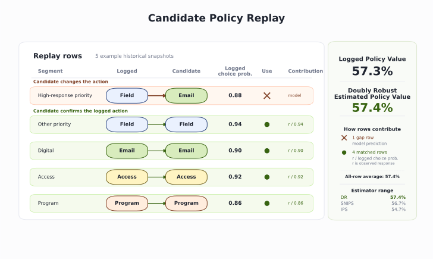

# Next Best Action

Start from the channel-plan state and turn it into one released action. For each HCP-account row, the engine lists the plausible actions, removes the ones that are not allowed, chooses the highest-priority action that remains, and writes the reason, measurement hook, and expiration on the row. Then the chapter asks 3 harder questions: how to rank capacity-constrained actions, how to explore safely when the policy is uncertain, and how to test a new policy before changing live execution. The carried case is HCP0280 at account ACC089.


```python
from pathlib import Path
import sys
import pandas as pd

ROOT = Path.cwd().resolve()
if not (ROOT / "pyproject.toml").exists():
    ROOT = ROOT.parent
sys.path.insert(0, str(ROOT))

from ch09_nba.scripts.next_best_action import run_analysis  # noqa: E402

pd.set_option("display.width", 200)
pd.set_option("display.max_columns", None)
results = run_analysis(ROOT)
print(f"Recommendations: {len(results['recommendations'])}")
print(f"Candidates: {len(results['action_candidates'])}")

```

    Recommendations: 158
    Candidates: 1106


## Build the recommendation


`run_analysis()` is the wrapper for the whole analysis. It reruns the omnichannel analysis, builds the recommendation state, calls the NBA functions in order, and returns the `results` dictionary used below.

Recommendation path:

| Step | Function | Output |
| --- | --- | --- |
| Load the HCP-account state | `load_state()` | `results["state"]` |
| Build the action menu and gates | `generate_candidates()` | `results["action_candidates"]` |
| Count gate outcomes | `gate_summary()` | `results["gate_summary"]` |
| Select the released action and write contract fields | `select_recommendations()` | `results["recommendations"]` |
| Count released actions | `recommendation_summary()` | `results["recommendation_summary"]` |
| Measure refresh timing | `expiration_analysis()` | `results["expiration_analysis"]` |


*Figure 9.1. HCP0280 starts with 7 candidate actions; the gate removes access, field, and program actions, then precedence selects approved email and records the rejected alternatives. Synthetic data.*


## Build the candidate menu and gates


`generate_candidates()` builds the 7-action menu and applies the gates. The omnichannel analysis supplies the current state for each HCP-account row. The NBA engine applies the same fixed menu to every row and checks which actions are eligible under the rules.


```python
candidates = results["action_candidates"]
trace = candidates.loc[candidates.npi.eq("9000000280")].sort_values(
    "policy_precedence"
)
print(trace[[
    "candidate_action", "eligible", "policy_precedence", "reason_code"
]].to_string(index=False))

```

               candidate_action  eligible  policy_precedence                                                  reason_code
               Access follow-up     False                 10                   Account evidence points to access friction
             Field conversation     False                 20       Priority HCP-account row with permitted field capacity
             Program invitation     False                 25   Prior live-program attendance supports a repeat invitation
                 Approved email      True                 30  Available email frequency with a priority or digital signal
    Continue responsive content      True                 40 Meaningful digital response without a higher-priority action
                        Monitor      True                 80    Eligible HCP-account row without a stronger action signal
                      No action      True                 90                  No higher-precedence eligible action passed


## Summarize the gates


The gates are applied inside `generate_candidates()`. `gate_summary()` counts the main outcomes across all candidates.


```python
reasons = [
    "Suppressed", "Access route first", "Not priority",
    "No live-program signal", "Passed",
]
gate_summary = results["gate_summary"].set_index("ineligibility_reason")
print(gate_summary.loc[reasons].reset_index().to_string(index=False))

```

      ineligibility_reason  blocked_candidates
                Suppressed                 276
        Access route first                 175
              Not priority                  69
    No live-program signal                  36
                    Passed                 397


## Select one action


```python
summary = results["recommendation_summary"].copy()
summary["mean_predicted_response"] = summary.mean_predicted_response.round(3)
print(summary.to_string(index=False))

```

             recommended_action  recommendations  review_required  mean_predicted_response
                      No action               46                0                    0.510
               Access follow-up               35               35                    0.665
             Program invitation               35                0                    0.670
                        Monitor               20                0                    0.506
                 Approved email               13                0                    0.634
    Continue responsive content                6                0                    0.695
             Field conversation                3                3                    0.615


## Set the expiration


```python
print(results["expiration_analysis"].to_string(index=False))

```

                          metric  value
      Median days between events 12.000
        Mean days between events 17.300
    Share of gaps within 14 days  0.573
    Share of gaps within 30 days  0.828


*Figure 9.2. The cumulative refresh curve shows that 57% of HCP-account event gaps close within 14 days and 83% close within 30 days. Synthetic data.*


## The recommendation contract


The contract row below is read from `results["recommendations"]`, which `select_recommendations()` already produced in the selection step.


```python
recommendations = results["recommendations"]
row = recommendations.loc[recommendations.npi.eq("9000000280")].iloc[0]
for field in [
    "recommendation_id", "account_id", "recommended_action",
    "recommended_channel", "reason_code", "expected_result",
    "measurement_hook", "recommendation_date", "expires_on",
    "review_required",
]:
    print(f"{field}: {row[field]}")

```

    recommendation_id: NBA00131
    account_id: ACC089
    recommended_action: Approved email
    recommended_channel: Email
    reason_code: Available email frequency with a priority or digital signal
    expected_result: Deliver approved content and earn a click
    measurement_hook: Delivery and click
    recommendation_date: 2025-02-28 00:00:00
    expires_on: 2025-03-14 00:00:00
    review_required: False


## Reward design: response and uplift

The release engine has already selected one action per HCP-account row. HCP0280 gets approved email because it is the first eligible action in the policy order. Email is the broad, low-cost engagement action in this menu. Program invitations and field conversations consume scarcer resources: seats, field time, follow-up effort, and compliance review.

Resource limits add a second question before deployment. The limit may be capacity, cost, or operational burden. If the field team has fewer slots than field-eligible rows, or a program team has fewer seats than program-eligible rows, uplift ranks rows inside that eligible tier. Response still describes baseline likelihood for broad email-style engagement. A production engine that must cap a costly program or field tier would apply the uplift ranking before release, then rerun the same gates and recommendation contract.


```python
print(results["reward_overlap"].to_string(index=False))

```

                                   metric  value
    Promotional-eligible HCP-account rows  51.00
              Spearman response vs uplift  -0.78
           Top-20 shared by both rankings   1.00
          Top-20 only in response ranking  19.00


```python
reward = results["reward_candidates"].copy()
print(reward[[
    "npi", "candidate_action", "predicted_response",
    "estimated_uplift", "rank_by_response", "rank_by_uplift"
]].head(6).round(3).to_string(index=False))

```

           npi   candidate_action  predicted_response  estimated_uplift  rank_by_response  rank_by_uplift
    9000000128 Program invitation               0.844             0.039                 1              45
    9000000239 Program invitation               0.839             0.041                 2              43
    9000000204 Program invitation               0.831             0.024                 3              50
    9000000232 Program invitation               0.828             0.036                 4              48
    9000000650     Approved email               0.803             0.052                 5              37
    9000000406 Program invitation               0.802             0.056                 6              36


*Figure 9.3. The gold band marks the top 20 rows by p0, the green region marks the top 20 rows by uplift, and no HCP-account row sits in both groups. Synthetic data.*


## Exploration with a contextual bandit


Each action curve starts from 2 counts. `successes` is the number of logged rows where the action was taken and the later response was 1. `failures` is the number where the action was taken and the later response was 0. Thompson sampling uses `Beta(successes + 1, failures + 1)`, draws once from each action curve, and gives the row to the action with the highest draw.

Cold start is the data condition: little history leaves wide curves. Exploration is the behavior: an uncertain action can still win a draw.


```python
exploration = results["thompson_exploration"].copy()
print(exploration[[
    "context_bucket", "logged_action", "successes", "failures",
    "posterior_mean", "posterior_sd", "explore_share"
]].to_string(index=False))

```

        context_bucket      logged_action  successes  failures  posterior_mean  posterior_sd  explore_share
    Digital-responsive Field conversation         61        35           0.633         0.048          0.736
    Digital-responsive     Approved email         84        57           0.594         0.041          0.264
    Digital-responsive          No action         30        49           0.383         0.054          0.000


```python
cold = results["thompson_cold_start"].copy()
print(cold[[
    "context_bucket", "logged_action", "successes", "failures",
    "posterior_mean", "posterior_sd", "explore_share"
]].to_string(index=False))

```

        context_bucket      logged_action  successes  failures  posterior_mean  posterior_sd  explore_share
    Digital-responsive     Approved email         20        15           0.568         0.080          0.372
    Digital-responsive Field conversation         11         9           0.545         0.104          0.307
    Digital-responsive          No action         11         9           0.545         0.104          0.320


*Figure 9.4. For digital-responsive rows, cold-start curves overlap and draw wins spread across actions; full-history curves separate and field conversation wins most draws. Synthetic data.*


## Off-policy evaluation


The current NBA policy puts field conversation ahead of approved email for priority rows. The digital-first variant keeps the same gates but changes that one choice.

Off-policy evaluation replays the candidate policy on historical rows. When the candidate chooses the same action as the log, the later response is usable evidence. When it chooses a different action, the log cannot directly tell us what would have happened under that new action.




*Figure 9.5. Uplift estimates action effect for a row, while off-policy evaluation replays a candidate decision rule on historical rows and estimates policy value before deployment. Synthetic data.*


IPS reweights matched historical rewards. SNIPS uses a normalized version of those same weights. The direct method scores candidate actions with a reward model. Doubly robust starts with the model prediction, then corrects it with matched historical rewards.


```python
policy = results["off_policy_evaluation"].copy()
policy["estimated_response_rate"] = policy.estimated_response_rate.map(
    lambda x: f"{x:.1%}"
)
policy["effective_sample_size"] = policy.effective_sample_size.round(1)
print(policy.to_string(index=False))

```

           policy      estimator estimated_response_rate  matched_snapshots  effective_sample_size
    logged_policy on_policy_mean                   57.3%               1422                 1422.0
    digital_first            ips                   54.7%               1263                 1262.1
    digital_first          snips                   56.7%               1263                 1262.1
    digital_first  doubly_robust                   57.4%               1263                 1262.1


## The experiment that would settle it


```python
print(results["experiment_design"].to_string(index=False))

```

                               parameter    value
                  Baseline response rate    0.598
               Minimum detectable effect    0.050
                                   Power    0.800
                         Two-sided alpha    0.050
       Required HCP-account rows per arm 1474.000
    Eligible HCP-account rows this cycle  112.000
               Cycles to reach both arms   27.000


## Conclusion

The engine turns a dated state into one auditable action per HCP-account row. It builds the candidate menu, removes ineligible actions, applies policy order, and writes the recommendation contract onto the row. Then it shows how to rank capacity-constrained actions, explore safely, and screen a new policy before a live test. For HCP0280 the governed recommendation is approved email.

