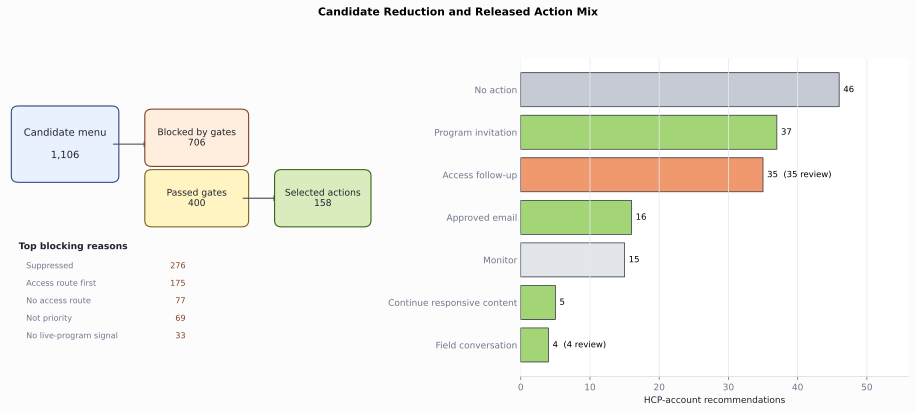
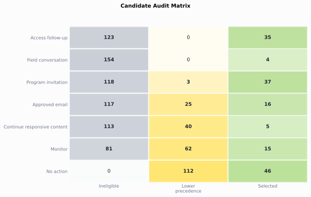
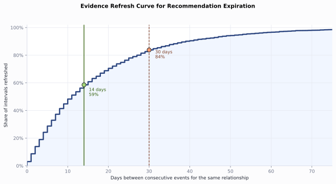
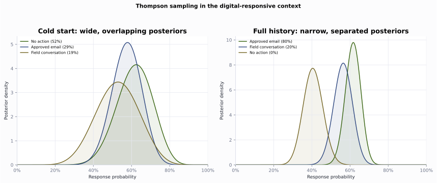

# Next Best Action

Turn the omnichannel channel-plan state into one governed recommendation per HCP-account relationship. Generate a candidate menu, gate it, resolve by precedence, rank inside the gates with response and uplift, attach a recommendation contract, then add a bandit, an off-policy check, and the experiment that would settle the policy question. The carried case is HCP0280 at account ACC089.


```python
from pathlib import Path
import sys
import pandas as pd

ROOT = Path.cwd().resolve()
if not (ROOT / "pyproject.toml").exists():
    ROOT = ROOT.parent
sys.path.insert(0, str(ROOT))

from ch09_nba.scripts.next_best_action import run_analysis  # noqa: E402

pd.set_option("display.width", 200)
pd.set_option("display.max_columns", None)
results = run_analysis(ROOT)
print(f"Recommendations: {len(results['recommendations'])}")
print(f"Candidates: {len(results['action_candidates'])}")

```

    Recommendations: 158
    Candidates: 1106


## Candidate set


```python
candidates = results["action_candidates"]
trace = candidates.loc[candidates.npi.eq("9000000280")]
print(trace[[
    "candidate_action", "eligible", "policy_precedence", "reason_code"
]].to_string(index=False))

```

               candidate_action  eligible  policy_precedence                                                  reason_code
                      No action      True                 90                  No higher-precedence eligible action passed
               Access follow-up     False                 10                   Account evidence points to access friction
             Field conversation     False                 20          Priority relationship with permitted field capacity
             Program invitation     False                 25   Prior live-program attendance supports a repeat invitation
                 Approved email      True                 30  Available email frequency with a priority or digital signal
    Continue responsive content      True                 40 Meaningful digital response without a higher-priority action
                        Monitor      True                 80       Eligible relationship without a stronger action signal


*Figure 9.1. HCP0280 starts with 7 candidates; the gate removes access, field, and program actions, then precedence selects approved email and records the rejected alternatives. Synthetic data.*


## Eligibility gates


```python
reasons = [
    "Suppressed", "Access route first", "Not priority",
    "No live-program signal", "Passed",
]
gate_summary = results["gate_summary"].set_index("ineligibility_reason")
print(gate_summary.loc[reasons].reset_index().to_string(index=False))

```

      ineligibility_reason  blocked_candidates
                Suppressed                 276
        Access route first                 175
              Not priority                  69
    No live-program signal                  33
                    Passed                 400


## Policy precedence


```python
summary = results["recommendation_summary"].copy()
summary["mean_predicted_response"] = summary.mean_predicted_response.round(3)
print(summary.to_string(index=False))

```

             recommended_action  recommendations  review_required  mean_predicted_response
                      No action               46                0                    0.505
             Program invitation               37                0                    0.675
               Access follow-up               35               35                    0.678
                 Approved email               16                0                    0.532
                        Monitor               15                0                    0.444
    Continue responsive content                5                0                    0.656
             Field conversation                4                4                    0.645




*Figure 9.2. The engine reduces 1,106 candidates to 400 eligible candidates and 158 selected actions, with most released rows going to no action, program invitation, and access follow-up. Synthetic data.*


## Reward design: response and uplift

The response and uplift models are fixed inputs from the channel analysis. The NBA engine uses them for a different decision: which reward should rank scarce eligible actions after gates and precedence. Response ranks likely engagement. Uplift ranks expected incremental change.


```python
print(results["reward_overlap"].to_string(index=False))

```

                                metric  value
    Promotional-eligible relationships  57.00
           Spearman response vs uplift  -0.64
        Top-20 shared by both rankings   0.00
       Top-20 only in response ranking  20.00


```python
reward = results["reward_candidates"].copy()
print(reward[[
    "npi", "candidate_action", "predicted_response",
    "estimated_uplift", "rank_by_response", "rank_by_uplift"
]].head(6).round(3).to_string(index=False))

```

           npi   candidate_action  predicted_response  estimated_uplift  rank_by_response  rank_by_uplift
    9000000026 Program invitation               0.909             0.050                 1              27
    9000000239 Program invitation               0.905             0.005                 2              46
    9000000505 Program invitation               0.873            -0.031                 3              56
    9000000157 Program invitation               0.871             0.018                 4              39
    9000000033 Program invitation               0.856             0.062                 5              25
    9000000648     Approved email               0.847             0.019                 6              38


*Figure 9.3. Promotional-eligible relationships split into high-response sure things and higher-uplift persuadable rows; HCP0505 shows why response alone can waste a scarce program slot. Synthetic data.*


## The recommendation contract


```python
recommendations = results["recommendations"]
row = recommendations.loc[recommendations.npi.eq("9000000280")].iloc[0]
for field in [
    "recommendation_id", "account_id", "recommended_action",
    "recommended_channel", "reason_code", "expected_result",
    "measurement_hook", "recommendation_date", "expires_on",
    "review_required",
]:
    print(f"{field}: {row[field]}")

```

    recommendation_id: NBA00129
    account_id: ACC089
    recommended_action: Approved email
    recommended_channel: Email
    reason_code: Available email frequency with a priority or digital signal
    expected_result: Deliver approved content and earn a click
    measurement_hook: Delivery and click
    recommendation_date: 2025-02-28 00:00:00
    expires_on: 2025-03-14 00:00:00
    review_required: False


## Rejected-alternative audit


```python
print(results["audit_summary"].to_string(index=False))

```

                 candidate_status  candidates
                       Ineligible         706
    Eligible but lower precedence         242
                         Selected         158


```python
audit = results["candidate_audit"]
trace = audit.loc[audit.npi.eq("9000000280")]
print(trace[[
    "candidate_action", "candidate_status", "policy_precedence"
]].to_string(index=False))

```

               candidate_action              candidate_status  policy_precedence
                      No action Eligible but lower precedence                 90
               Access follow-up                    Ineligible                 10
             Field conversation                    Ineligible                 20
             Program invitation                    Ineligible                 25
                 Approved email                      Selected                 30
    Continue responsive content Eligible but lower precedence                 40
                        Monitor Eligible but lower precedence                 80




*Figure 9.4. Each candidate action is split into selected, eligible but lower precedence, or ineligible status, making rejected alternatives visible by action type. Synthetic data.*


## Lifecycle and expiration


```python
print(results["expiration_analysis"].to_string(index=False))

```

                          metric  value
      Median days between events 11.000
        Mean days between events 17.100
    Share of gaps within 14 days  0.586
    Share of gaps within 30 days  0.838




*Figure 9.5. The cumulative refresh curve shows that 59% of relationship event gaps close within 14 days and 84% close within 30 days. Synthetic data.*


## Exploration with a contextual bandit


```python
exploration = results["thompson_exploration"].copy()
print(exploration[[
    "context_bucket", "logged_action", "snapshots", "posterior_mean",
    "posterior_sd", "explore_share"
]].to_string(index=False))

```

        context_bucket      logged_action  snapshots  posterior_mean  posterior_sd  explore_share
    Digital-responsive     Approved email        141           0.615         0.041          0.804
    Digital-responsive Field conversation        101           0.563         0.049          0.196
    Digital-responsive          No action         89           0.407         0.051          0.000


```python
cold = results["thompson_cold_start"].copy()
print(cold[[
    "context_bucket", "logged_action", "snapshots", "posterior_mean",
    "posterior_sd", "explore_share"
]].to_string(index=False))

```

        context_bucket      logged_action  snapshots  posterior_mean  posterior_sd  explore_share
    Digital-responsive          No action         24           0.615         0.094          0.520
    Digital-responsive     Approved email         38           0.575         0.077          0.289
    Digital-responsive Field conversation         17           0.526         0.112          0.192




*Figure 9.6. For digital-responsive relationships, cold-start action posteriors overlap and Thompson sampling explores; with full history, approved email separates from the other arms. Synthetic data.*


## Off-policy evaluation of an alternative policy


```python
policy = results["off_policy_evaluation"].copy()
policy["estimated_response_rate"] = policy.estimated_response_rate.map(
    lambda x: f"{x:.1%}"
)
policy["effective_sample_size"] = policy.effective_sample_size.round(1)
print(policy.to_string(index=False))

```

           policy      estimator estimated_response_rate  matched_snapshots  effective_sample_size
    logged_policy on_policy_mean                   56.9%               1422                 1422.0
    digital_first            ips                   54.8%               1288                 1287.1
    digital_first          snips                   55.6%               1288                 1287.1
    digital_first  doubly_robust                   57.1%               1288                 1287.1


## The experiment that would settle it


```python
print(results["experiment_design"].to_string(index=False))

```

                            parameter    value
               Baseline response rate    0.588
            Minimum detectable effect    0.050
                                Power    0.800
                      Two-sided alpha    0.050
       Required relationships per arm 1488.000
    Eligible relationships this cycle  112.000
            Cycles to reach both arms   27.000


## Conclusion

The engine turns a dated state into one auditable action per relationship: a candidate menu, hard eligibility gates, precedence, response and uplift ranking inside the gates, and a recommendation contract with every rejected alternative recorded. The bandit explores only where the posteriors overlap, off-policy evaluation screens a new policy before a live test, and the experiment design shows the eligible population must be pooled across cycles to reach power. For HCP0280 the governed recommendation is approved email.

