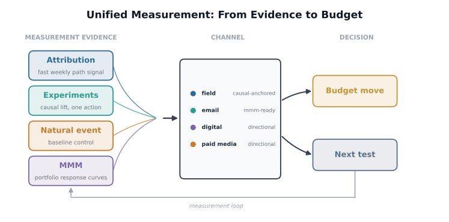
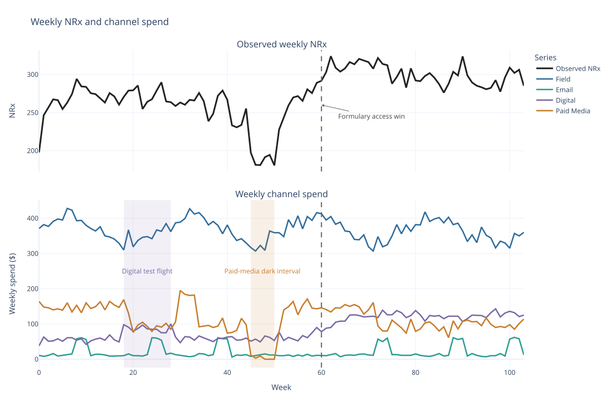
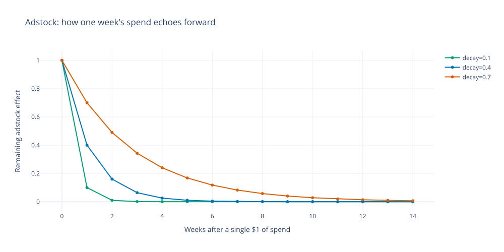
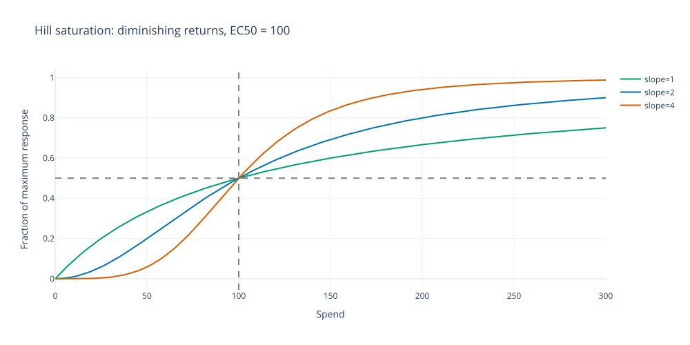
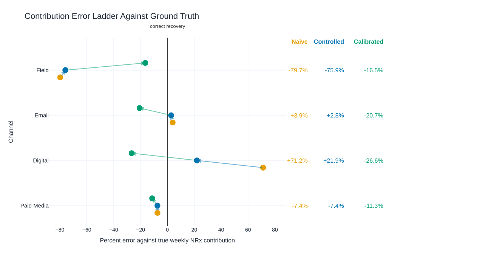
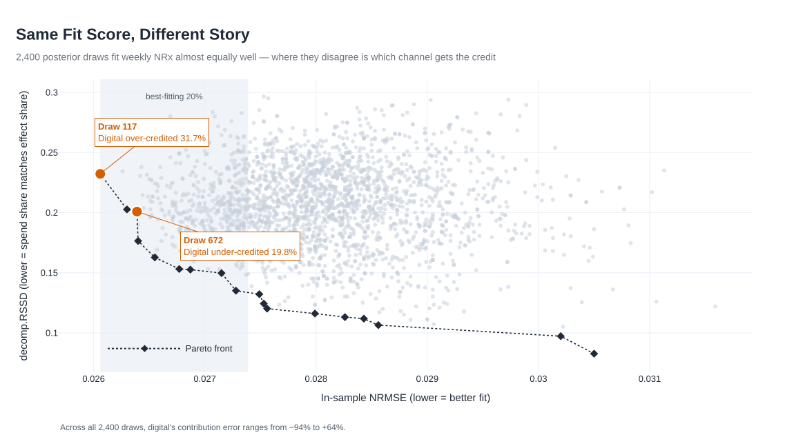
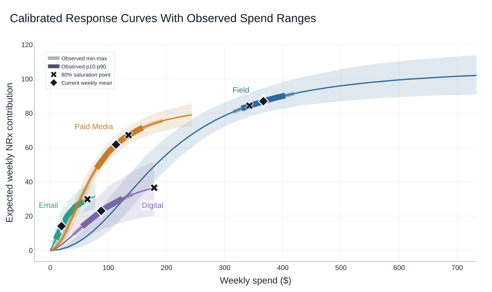
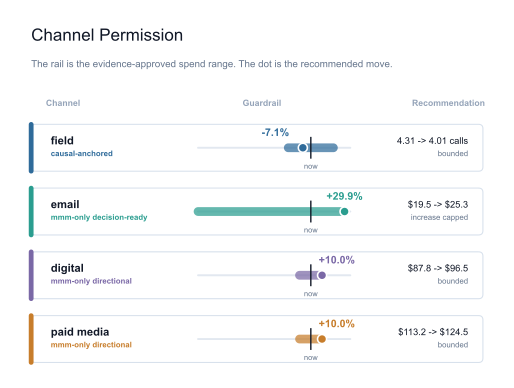
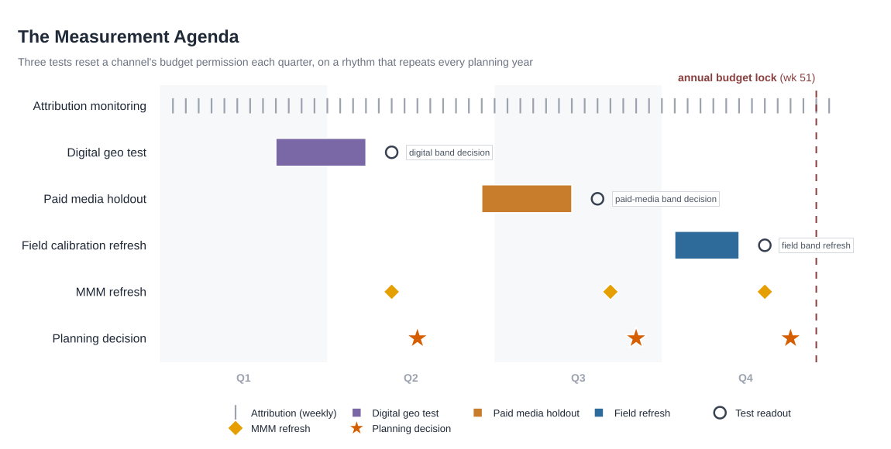

# Chapter 13 Walkthrough: Marketing Mix Modeling and Unified Measurement

This notebook follows the chapter's decision path. It assigns each measurement method to a job, builds the MMM model, checks which channel estimates can move budget, places the MMM output beside attribution and experiment evidence, and turns the evidence record into optimizer guardrails and a unified budget recommendation.


```python
from __future__ import annotations

import sys
from pathlib import Path

import numpy as np
import pandas as pd


def find_repo_root(start: Path) -> Path:
    for candidate in [start, *start.parents]:
        if (candidate / "ch13_mmm").exists():
            return candidate
    raise FileNotFoundError("Run inside the repository.")


REPO_ROOT = find_repo_root(Path.cwd().resolve())
CHAPTER_DIR = REPO_ROOT / "ch13_mmm"
SCRIPT_DIR = CHAPTER_DIR / "scripts"
OUTPUT_DIR = CHAPTER_DIR / "assets" / "generated_outputs"
sys.path.insert(0, str(SCRIPT_DIR))
pd.set_option("display.width", 160)

```

## 13.1 Matching Method to Decision


```python
from run_analysis import build_measurement_method_map

method_map = build_measurement_method_map()
print(method_map[["method", "best_business_decision", "should_not_decide_alone"]].to_string(index=False))

```

                                          method                                              best_business_decision                                                    should_not_decide_alone
                                     Attribution                 fast, granular channel-mix or creative optimization                 portfolio budget moves; whether a channel is causal at all
                      Uplift / response modeling                     targeting and next-best-action within a channel                                         cross-channel portfolio allocation
                           Randomized experiment               whether one specific action causes lift, and how much                           channels or populations outside the tested scope
                Geo-holdout / causal-impact read           calibrating one channel's response curve at a spend level                                      channels never included in a geo test
    Natural experiment / quasi-experimental read           estimating the effect of an event neither team controlled                 routine channel budget decisions absent a comparable event
                       Marketing mix model (MMM)       portfolio-level budget allocation across all channels at once moving an unconstrained channel that has not cleared the model-health gate
             Unified measurement decision record how much budget movement each channel's evidence currently supports                nothing: it is the record, not a fifth independent estimate




*Figure 13.1. Unified measurement flow from evidence to budget: attribution, experiments, natural events, and MMM feed a comparability check, then a decision record, guardrails, the budget recommendation, and the next-test agenda.*


## 13.2 Build The MMM Model


### 13.2.1 Weekly NRx and Channel Activity


```python
from data import generate_mmm_data, true_channel_share

weekly = generate_mmm_data()
print("Weekly series sample:")
print(weekly[["week_index", "nrx", "calls_field", "spend_field", "spend_digital"]].head().to_string(index=False))

truth = true_channel_share(weekly).copy()
truth["component"] = truth["channel"].replace({"baseline (trend + seasonality + access event)": "baseline"})
truth["share_of_total_pct"] = (truth["true_contribution_share"] * 100).round(1)
print("\nTrue modeled contribution:")
print(truth[["component", "true_mean_weekly_contribution", "share_of_total_pct"]].to_string(index=False))

```

    Weekly series sample:
     week_index   nrx  calls_field  spend_field  spend_digital
              0 197.7         4.37        371.0           38.0
              1 246.6         4.50        382.0           63.0
              2 256.8         4.44        377.0           51.0
              3 267.4         4.61        391.0           52.0
              4 266.4         4.69        398.0           58.0
    
    True modeled contribution:
     component  true_mean_weekly_contribution  share_of_total_pct
         field                         104.74                38.1
         email                          13.26                 4.8
       digital                          28.99                10.5
    paid_media                          66.08                24.0
      baseline                          62.10                22.6


```python
spend_columns = [c for c in weekly.columns if c.startswith("spend_")]
weekly_long = weekly.melt(id_vars=["week_index"], value_vars=spend_columns, var_name="channel", value_name="weekly_spend")
weekly_long["channel"] = weekly_long["channel"].str.removeprefix("spend_")
print(weekly_long.head().to_string(index=False))

```

     week_index channel  weekly_spend
              0   field         371.0
              1   field         382.0
              2   field         377.0
              3   field         391.0
              4   field         398.0




*Figure 13.2. Observed weekly NRx above weekly channel spend, with the formulary access event marked at week 60. Synthetic data.*


### 13.2.2 Carryover: Adstock


```python
from model import _adstock

field_calls = weekly["calls_field"].to_numpy(dtype=float)
for decay in (0.1, 0.4, 0.7):
    ads = _adstock(field_calls, decay)
    print(f"decay={decay:.1f}  week0={ads[0]:.1f}  week10={ads[10]:.1f}  week50={ads[50]:.1f}")

```

    decay=0.1  week0=4.4  week10=5.0  week50=4.7
    decay=0.4  week0=4.4  week10=7.6  week50=6.9
    decay=0.7  week0=4.4  week10=15.2  week50=13.4




*Figure 13.3. A single week's spend, traced forward through the adstock recursion at three decay rates.*


### 13.2.3 Diminishing Returns: Hill Saturation


```python
from model import _hill

for spend in (50, 100, 200):
    print(f"spend={spend:4d}  hill={_hill(np.array([float(spend)]), 100.0, 2.0)[0]:.2f}")

```

    spend=  50  hill=0.20
    spend= 100  hill=0.50
    spend= 200  hill=0.80




*Figure 13.4. Hill saturation curves at EC50 = 100 for three slope values, all crossing 50% response at EC50.*


### 13.2.4 Fit the First MMM


```python
from model import fit_bayesian_mmm, posterior_summary

naive_draws = fit_bayesian_mmm(weekly, use_controls=False)
naive_summary = posterior_summary(naive_draws)
coef = naive_summary[naive_summary.parameter.str.endswith("_coef")].copy()
coef["channel"] = coef["parameter"].str.replace("_coef", "", regex=False)
coef["mean"] = coef["posterior_mean"].round(1)
coef["ci90"] = "[" + coef["p5"].round(1).astype(str) + ", " + coef["p95"].round(1).astype(str) + "]"
coef["ess"] = coef["ess"].round(0).astype(int)
print(coef[["channel", "mean", "ci90", "rhat", "ess"]].to_string(index=False))

```

       channel  mean          ci90  rhat  ess
         field  54.6  [17.6, 93.0] 1.040  658
         email  41.4  [27.8, 60.7] 1.034  696
       digital 111.4 [90.6, 136.6] 1.007  674
    paid_media 107.9 [89.8, 141.5] 1.110  667


The channel coefficient, decay, EC50, and Hill-slope priors set the starting assumptions. The data can override them when channel movement is strong enough; weak channels lean on them until outside evidence arrives.


### 13.2.5 Digital Absorbs the Access-Event Lift


```python
from run_analysis import _channel_contributions

naive_contrib = _channel_contributions(weekly, naive_draws)
truth_by_channel = truth.set_index("channel")["true_mean_weekly_contribution"]
for ch in ("field", "email", "digital", "paid_media"):
    err = (naive_contrib[ch] - truth_by_channel[ch]) / truth_by_channel[ch] * 100
    print(f"{ch:12s}  true={truth_by_channel[ch]:6.2f}  naive={naive_contrib[ch]:6.2f}  error={err:+.1f}%")

```

    field         true=104.74  naive= 21.23  error=-79.7%
    email         true= 13.26  naive= 13.78  error=+3.9%
    digital       true= 28.99  naive= 49.62  error=+71.2%
    paid_media    true= 66.08  naive= 61.21  error=-7.4%


## 13.3 Test Whether the Fit Can Be Trusted


### 13.3.1 Channel Variation and Confounding


```python
from run_analysis import channel_identifiability_diagnostics

controlled_draws = fit_bayesian_mmm(weekly, use_controls=True)
diagnostics = channel_identifiability_diagnostics(weekly, controlled_draws)
diag = diagnostics.rename(columns={
    "weeks_near_zero": "near0",
    "spend_cv": "cv",
    "corr_with_event": "event_corr",
    "seasonality_corr": "seasonality_corr",
    "posterior_interval_width_pct": "ci90_width",
})
print(f"{'channel':12s} {'near0':>6s} {'cv':>7s} {'event_corr':>10s} {'seasonality_corr':>17s} {'ci90_width':>10s}")
for row in diag.itertuples(index=False):
    print(f"{row.channel:12s} {row.near0:6.0f} {row.cv:7.3f} {row.event_corr:10.3f} {row.seasonality_corr:17.3f} {row.ci90_width:10.1f}")

```

    channel       near0      cv event_corr  seasonality_corr ci90_width
    field             0   0.082     -0.125             0.016      115.5
    email             0   0.919      0.069             0.075       92.9
    digital           0   0.357      0.902             0.333      101.3
    paid_media        5   0.362     -0.085             0.502       35.2


### 13.3.2 Add Known Baseline Controls


```python
controlled_contrib = _channel_contributions(weekly, controlled_draws)
for ch in ("field", "email", "digital", "paid_media"):
    err = (controlled_contrib[ch] - truth_by_channel[ch]) / truth_by_channel[ch] * 100
    print(f"{ch:12s}  true={truth_by_channel[ch]:6.2f}  controlled={controlled_contrib[ch]:6.2f}  error={err:+.1f}%")

```

    field         true=104.74  controlled= 25.20  error=-75.9%
    email         true= 13.26  controlled= 13.63  error=+2.8%
    digital       true= 28.99  controlled= 35.33  error=+21.9%
    paid_media    true= 66.08  controlled= 61.17  error=-7.4%


### 13.3.3 Calibrate Field with a Geo-Holdout


```python
from data import generate_field_geo_holdout

geo_holdout = generate_field_geo_holdout()
print(f"input level={geo_holdout['input_level']:.1f} calls  delta={geo_holdout['delta_input']:.1f} calls  n_geos={geo_holdout['n_geos']}")
print(f"geo-holdout read: mean incremental NRx={geo_holdout['mean_incremental_nrx']:.2f}  sd={geo_holdout['sd_incremental_nrx']:.2f}")

calibrated_draws = fit_bayesian_mmm(weekly, use_controls=True, geo_prior=geo_holdout)
calibrated_contrib = _channel_contributions(weekly, calibrated_draws)
for ch in ("field", "email", "digital", "paid_media"):
    err = (calibrated_contrib[ch] - truth_by_channel[ch]) / truth_by_channel[ch] * 100
    print(f"{ch:12s}  true={truth_by_channel[ch]:6.2f}  calibrated={calibrated_contrib[ch]:6.2f}  error={err:+.1f}%")

```

    input level=2.0 calls  delta=2.5 calls  n_geos=18
    geo-holdout read: mean incremental NRx=69.28  sd=3.99


    field         true=104.74  calibrated= 87.43  error=-16.5%
    email         true= 13.26  calibrated= 10.51  error=-20.7%
    digital       true= 28.99  calibrated= 21.29  error=-26.6%
    paid_media    true= 66.08  calibrated= 58.60  error=-11.3%


Note the fallback path is still available, not the main one: `implied_field_experiment_prior()` translates the ch10 account-cycle experiment's relative lift onto an average-weekly-contribution scale instead of a response segment. `geo_holdout_calibration.csv`'s `fallback_itt_*` columns record what that alternative prior would have been; it is not what produced `calibrated_draws` above.




*Figure 13.5. Contribution error ladder across naive, controlled, and calibrated fits. Synthetic data.*


### 13.3.4 Setting Each Channel's Decision Status


```python
from run_analysis import build_scorecard, measurement_decision_record

scorecard = build_scorecard(weekly, truth, {"naive": naive_draws, "controlled": controlled_draws, "calibrated": calibrated_draws})
decision_record = measurement_decision_record(diagnostics, scorecard, calibrated_draws)
print(decision_record[["channel", "decision_status", "calibration_dependent"]].to_string(index=False))
print()
for row in decision_record.itertuples(index=False):
    print(f"{row.channel}:")
    for reason in row.reasons.split("; "):
        print(f"  - {reason}")

```

       channel decision_status  calibration_dependent
         field     directional                   True
         email  decision-ready                  False
       digital     directional                  False
    paid_media     directional                  False
    
    field:
      - own-series coefficient of variation 0.08 (directional: 0.05-0.15)
    email:
      - clears R-hat, correlation, and variation thresholds
    digital:
      - worst channel R-hat 1.201 (directional: 1.20-1.50)
      - correlation with a baseline control 0.90 (directional: 0.60-0.95)
    paid_media:
      - worst channel R-hat 1.237 (directional: 1.20-1.50)


### 13.3.5 Similar Fit, Different Decomposition


```python
from run_analysis import build_pareto_front

pareto = build_pareto_front(weekly, truth, calibrated_draws)
top8 = pareto.sort_values("nrmse").head(8).rename(columns={
    "decomp_rssd": "rssd", "digital_contribution": "digital_contrib",
    "digital_pct_error": "digital_err_pct", "pareto_efficient": "pareto_eff",
})
top8["nrmse"] = top8["nrmse"].round(4)
top8["rssd"] = top8["rssd"].round(3)
print(top8.to_string(index=False))
print(f"draws: {len(pareto)}  nrmse range: {pareto['nrmse'].min():.4f}-{pareto['nrmse'].max():.4f}  "
      f"pareto-efficient: {int(pareto['pareto_efficient'].sum())}")

```

     draw  nrmse  rssd  digital_contrib  digital_err_pct  pareto_eff
      117 0.0261 0.232            38.17             31.7        True
     2388 0.0261 0.232            38.17             31.7       False
     1252 0.0263 0.234            35.71             23.2       False
     1087 0.0263 0.203            28.19             -2.8        True
      672 0.0264 0.201            23.26            -19.8        True
     2315 0.0264 0.176            27.55             -5.0        True
      146 0.0264 0.190            29.21              0.8       False
      685 0.0264 0.231            33.84             16.7       False
    draws: 2400  nrmse range: 0.0261-0.0316  pareto-efficient: 18


Across 2,400 calibrated-fit posterior draws, in-sample NRMSE stays in a narrow band while decomp_rssd and digital's contribution error still vary widely -- field's own share barely moves across these draws because the geo-holdout penalty anchors it, so digital carries the remaining disagreement instead. Fit score alone cannot clear a channel for budget movement.



*Figure 13.6. In-sample NRMSE against decomp.RSSD for 2,400 calibrated-fit posterior draws. Two draws with essentially the same fit score disagree by more than 50 points on digital's true contribution. Synthetic data.*

**Where did the tuning step go?** In this Bayesian fit, decay, EC50, and slope are sampled parameters, estimated jointly in the posterior. The prior width does the regularization work. Predictive fit is checked against identifiability, known controls, experiment calibration, and the fit-decomposition Pareto front.


### 13.3.6 Production MMM Choice

The MMM built above uses hand-written Python code as the teaching layer. A pharmaceutical commercial analytics team may either build proprietary in-house MMM or choose a production open-source stack: Robyn, Meridian, and PyMC-Marketing are all useful for larger data sets, stronger MCMC samplers, and production diagnostics.

| Stack | Framework | Best-fit data structure | Inference method | Calibration mechanism | When to reach for it |
| --- | --- | --- | --- | --- | --- |
| Hand-built (used above) | NumPy, custom Metropolis-Hastings | National weekly time series | Custom MCMC, 4 chains | Geo-holdout prior injected directly into the log-posterior | Teaching, auditing every assumption, or a small team without a geo/DMA panel |
| Meridian (Google) | TensorFlow Probability | Geo- or DMA-level panel | Hamiltonian Monte Carlo | Built-in ROI priors, calibrated from experiment history | A brand with a real geo panel and existing experiment or geo-test history |
| Robyn (Meta) | R, Prophet + ridge regression | National or regional time series | Ridge regression scored across a Pareto front (Nevergrad evolutionary search) | Calibration inputs feed the Pareto-front selection, not the fit itself | A team with an existing R-based MMM workflow already built around Pareto-front selection |
| PyMC-Marketing | PyMC (Python) | National or regional time series | Bayesian MCMC (NUTS) | Custom priors sized to the team's own NRx and spend scale | A Python-native team that wants Bayesian flexibility without hand-writing the sampler |

Meridian is usually the better fit once a brand has a real geo or DMA panel. Robyn is useful when an R-based MMM workflow and Pareto-front selection already exist. PyMC-Marketing is closest in spirit to the hand-built model above.


## 13.4 Build The Unified Measurement Evidence


The MMM gate has now classified each channel estimate. The evidence record places those estimates beside attribution, experiment, geo-holdout, and natural-experiment reads at the channel level. The record keeps each method's metric, population, window, intervention, and allowed use visible before any result changes a budget guardrail.


```python
from run_analysis import (
    build_channel_evidence_record,
    build_measurement_guardrails,
    build_method_comparability_checks,
    build_next_measurement_agenda,
    build_reconciliation_table,
    load_cross_chapter_measurements,
)

measurements = load_cross_chapter_measurements()
comparability = build_method_comparability_checks(measurements, geo_holdout)
rows = comparability[comparability["channel"].isin(["field", "digital", "portfolio_baseline"])]
for r in rows[["channel", "method_family", "comparable_to_mmm", "allowed_use"]].itertuples(index=False):
    print(f"{r.channel:18s} {r.method_family:24s} comparable={r.comparable_to_mmm:7s} use={r.allowed_use}")

```

    field              Attribution              comparable=partial use=sanity check only
    digital            Attribution              comparable=partial use=proxy sanity check only
    field              Randomized experiment    comparable=partial use=fallback calibration or scope check
    field              Geo-holdout              comparable=yes     use=calibrate prior
    portfolio_baseline Natural experiment       comparable=no      use=baseline control only
    field              MMM                      comparable=yes     use=portfolio allocation
    digital            MMM                      comparable=yes     use=portfolio allocation


The omnichannel attribution read tracks 10 recorded touchpoint types because path attribution needs to preserve the customer journey. The MMM workflow models four budget levers: field, email, digital, and paid media. The evidence record maps the detailed path signals into those four planning channels when the mapping is direct, and labels the read as partial when the path signal is only a proxy. Digital is the clearest case: authenticated web paths are useful as a digital scope check. The full digital spend lever used by MMM also includes other digital activity.


### 13.4.1 One Channel, Four Measurements


```python
calibrated_share = calibrated_contrib["field"] / sum(calibrated_contrib.values())
print(build_reconciliation_table(measurements, calibrated_share).to_string(index=False))

```

                            measurement_family                                                      source                                field_estimate                                                                                                               what_it_answers
      Path attribution (Markov removal effect)      ch08_omnichannel: markov_attribution() in sequences.py                    17.3% of conversion credit                                      Share of recorded converting paths that pass through field, relative to all ten channels
     Randomized experiment (account-cycle ITT)         ch10_experiments: adjusted_itt.csv from analysis.py +27.2% incremental patient starts vs. control                            Causal lift from one incremental coordinated field/digital action on the accounts that received it
    Marketing mix model (calibrated posterior) ch13_mmm: fit_bayesian_mmm() in model.py, geo_prior applied                49.2% of decomposed weekly NRx Average share of weekly NRx decomposed to field across the full 104-week series, net of trend/seasonality/the formulary event


Field-call measures answer different planning questions. The attribution read says whether field appears on recorded converting paths. The experiment and geo-holdout measure defined field-related interventions. The MMM number estimates field's average contribution inside the portfolio response curve.


### 13.4.2 The Full Channel Measurement Evidence


```python
evidence_record = build_channel_evidence_record(measurements, geo_holdout, decision_record, scorecard, comparability)
current_spends = np.array([weekly[f"spend_{ch}"].mean() for ch in ["field", "email", "digital", "paid_media"]])
guardrails = build_measurement_guardrails(evidence_record, decision_record, current_spends)
agenda = build_next_measurement_agenda(evidence_record, decision_record, current_spends, guardrails)
view = evidence_record[["channel", "evidence_tier", "mmm_decision_status"]].merge(
    guardrails[["channel", "move_permission", "max_move_pct", "new_anchor_required", "refresh_required"]],
    on="channel",
)
for r in view.itertuples(index=False):
    print(f"{r.channel:12s} tier={r.evidence_tier:23s} mmm={r.mmm_decision_status:14s} "
          f"move={r.move_permission:15s} max={r.max_move_pct:.0%} "
          f"new_anchor={r.new_anchor_required} refresh={r.refresh_required}")

```

    field        tier=causal-anchored         mmm=directional    move=bounded         max=20% new_anchor=False refresh=True
    email        tier=mmm-only decision-ready mmm=decision-ready move=increase-capped max=30% new_anchor=True refresh=False
    digital      tier=mmm-only directional    mmm=directional    move=bounded         max=10% new_anchor=True refresh=False
    paid_media   tier=mmm-only directional    mmm=directional    move=bounded         max=10% new_anchor=True refresh=False


The full evidence record carries the decision consequence and the next test together. Digital ranks first for the next anchor, paid media second, email third, and field fourth because field already has a causal anchor in place.


## 13.5 Set the Budget Recommendation


Roventra now has to decide how far each channel can move in the next budget cycle. The evidence record does not produce one unconstrained answer. It separates the channels the brand can scale with more confidence from the channels that still need a tighter range or another test. This section turns that evidence into response curves, budget limits, and one recommendation the brand can defend in front of finance, commercial leadership, and the next measurement plan.


### 13.5.1 Response Curves, Marginal ROI, and Saturation


```python
from response_curves import build_response_curves, compute_marginal_roi, find_saturation_points

response_curves = build_response_curves(weekly, calibrated_draws)
mroi = compute_marginal_roi(weekly, calibrated_draws)
sat = find_saturation_points(weekly, calibrated_draws)
combined = mroi[["channel", "marginal_roi_mean", "marginal_roi_p10", "marginal_roi_p90"]].merge(
    sat[["channel", "saturation_spend_median", "current_weekly_spend", "at_or_above_saturation"]],
    on="channel", how="left",
).rename(columns={
    "marginal_roi_mean": "mroi", "marginal_roi_p10": "p10", "marginal_roi_p90": "p90",
    "saturation_spend_median": "sat_spend", "current_weekly_spend": "current_spend",
    "at_or_above_saturation": "at_or_above_sat",
})
combined[["mroi", "p10", "p90"]] = combined[["mroi", "p10", "p90"]].round(2)
print(combined.to_string(index=False))

```

       channel  mroi  p10  p90  sat_spend  current_spend  at_or_above_sat
         email  0.70 0.57 0.84       64.1           19.5            False
    paid_media  0.30 0.25 0.37      134.8          113.2            False
       digital  0.24 0.12 0.35      193.6           87.8            False
         field  0.10 0.07 0.13      342.6          366.7             True




*Figure 13.7. Calibrated response curves by channel, with 10th-90th percentile posterior bands and observed weekly spend ranges. Synthetic data.*


### 13.5.2 Budget Optimization and the Unified Recommendation


A channel only earns an unconstrained move if it clears both tests at once: a causal anchor exists and the MMM's own diagnostics are decision-ready. None of Roventra's four channels currently clear both. Digital and paid media get the tightest band, +/-10%, because they clear neither test. Field gets +/-20% because a causal anchor exists even though its own MMM diagnostics remain directional. Email gets the widest band on the upside, +30% with no floor, because its MMM fit is decision-ready on its own but has no outside causal check: cutting spend on an overstated number costs little, scaling up on it spends real money, so the guardrail is priced to match that asymmetry.


```python
from optimization import (
    build_mmm_budget_recommendation,
    build_unified_budget_recommendation,
    evaluate_reallocation,
    optimal_allocation_at_budget,
    optimal_allocation_by_draw,
)

channels = ["field", "email", "digital", "paid_media"]
decision_status = dict(zip(decision_record["channel"], decision_record["decision_status"]))
current_budget = float(current_spends.sum())
allocation_summary, allocation_draws = optimal_allocation_by_draw(
    current_spends, current_budget, calibrated_draws, channels, decision_status=decision_status, guardrails=guardrails,
)
opt_spends = allocation_summary.set_index("channel").loc[channels, "optimized_weekly_spend_median"].to_numpy(dtype=float)

for ch, cur, opt in zip(channels, current_spends, opt_spends):
    print(f"{ch:12s}  current=${cur:6.1f}  optimized=${opt:6.1f}  change={(opt - cur) / cur:+.1%}  status={decision_status[ch]}")

decision = evaluate_reallocation(current_spends, opt_spends, calibrated_draws, channels)
print(decision)
print(allocation_summary.to_string(index=False))

```

    field         current=$ 366.6  optimized=$ 340.7  change=-7.1%  status=directional
    email         current=$  19.5  optimized=$  25.3  change=+29.9%  status=decision-ready
    digital       current=$  87.8  optimized=$  96.5  change=+10.0%  status=directional
    paid_media    current=$ 113.2  optimized=$ 124.5  change=+10.0%  status=directional


    {'mean_nrx_current': 263.79, 'mean_nrx_candidate': 269.75, 'mean_nrx_gain': 5.96, 'p10_nrx_gain': 4.38, 'p90_nrx_gain': 7.61, 'win_rate': 1.0}
       channel  optimized_weekly_spend_mean  optimized_weekly_spend_median  optimized_weekly_spend_p10  optimized_weekly_spend_p90
         field                        341.9                          340.7                       340.7                       344.9
         email                         25.3                           25.3                        25.3                        25.3
       digital                         95.3                           96.5                        92.3                        96.5
    paid_media                        124.5                          124.5                       124.5                       124.5


```python
mroi = compute_marginal_roi(weekly, calibrated_draws)
posterior_mean_opt_spends = optimal_allocation_at_budget(
    current_spends, current_budget, calibrated_draws, channels, decision_status, guardrails,
)
mmm_recommendation = build_mmm_budget_recommendation(current_spends, posterior_mean_opt_spends, allocation_summary, mroi, decision_status, guardrails)
unified_recommendation = build_unified_budget_recommendation(mmm_recommendation, evidence_record, guardrails)
print(unified_recommendation[[
    "channel", "optimized_weekly_spend_at_current_budget", "evidence_tier", "allowed_budget_move",
    "new_anchor_required", "refresh_required",
]].to_string(index=False))

```

       channel  optimized_weekly_spend_at_current_budget           evidence_tier                                                              allowed_budget_move  new_anchor_required  refresh_required
         field                                     340.7         causal-anchored bounded to +/-20%; causal anchor exists but MMM diagnostics still limit movement                False              True
         email                                      25.3 mmm-only decision-ready         increase capped at +30%; causal anchor required before sustained scaling                 True             False
       digital                                      96.5    mmm-only directional                  bounded to +/-10%; no causal anchor and MMM remains directional                 True             False
    paid_media                                     124.5    mmm-only directional                  bounded to +/-10%; no causal anchor and MMM remains directional                 True             False


`unified_budget_recommendation.csv` is now the downstream handoff. It carries the spend recommendation the optimizer was allowed to make, plus the evidence tier, allowed move, and whether the channel needs a new anchor or a refresh. Field is the only row that needs a refresh rather than a new anchor, because it already has a causal anchor and that anchor ages out over time.


Figure 13.8 turns the table into the actual budget permission each channel carries into planning: the rail is each channel's guardrail band, and the dot is where the optimizer landed inside it.



*Figure 13.8. Channel Permission: each rail is the evidence-approved guardrail band, the vertical tick marks current spend, and the dot marks the optimizer's recommended move.*


## 13.6 Operate The Measurement Loop

Table 13.10 said 3 channels still need better evidence: digital, paid media, and field, in that priority order. Digital goes first because its 0.90 correlation with the formulary access event is the strongest residual confound in the evidence record. Paid media's main problem is a weaker $\hat{R}$ rather than a confound. Field goes last, not because it is behind, but because its existing causal anchor ages and needs a scheduled refresh rather than a first test.




*Figure 13.9. Planned tests, readouts, MMM refreshes, and budget locks across a planning year.*


Follow the digital row: test window, readout, MMM refresh, planning decision, in that order, every time. The same 4-step chain repeats for paid media and field later in the year. Attribution, the thin ticks across the top row, reads every single week but was never enough to move budget on its own; it sits on this calendar as a constant background check, not a 4th test. The dashed line is the budget lock, the point after which next year's spend is fixed: every chain has to finish, test, readout, refit, decision, before that line, or its evidence arrives too late to count.

| Measurement readout | Budget permission it can change |
| --- | --- |
| Digital geo test | A clean incremental read anchors digital and widens its band from +/-10% to +/-20%; a null read leaves it at +/-10% |
| Paid-media holdout | Anchors paid media the same way, from +/-10% to +/-20%; a null read leaves it at +/-10% |
| Field calibration refresh | Keeps field's causal anchor current at +/-20%; skip it and the anchor goes stale, tightening the band |


### Write one channel's decision package

A budget review does not want the full evidence record. It wants, per channel, a short package: the recommended move, the evidence that backs it, the band the move has to stay inside, the next test that could widen the band, and the risk if leadership overrides the guardrail. The cell below assembles that package for digital straight from the artifacts already in memory.


```python
ch = "digital"
rec = unified_recommendation.set_index("channel").loc[ch]
ag = agenda.set_index("channel").loc[ch]

print(f"Decision package: {ch}")
print(f"  recommended weekly spend : ${rec['current_weekly_spend']:.0f} -> ${rec['optimized_weekly_spend_at_current_budget']:.0f} ({rec['pct_change']:+.1f}%)")
print(f"  evidence tier            : {rec['evidence_tier']}")
print(f"  allowed move             : {rec['allowed_budget_move']}")
print(f"  next test                : {ag['recommended_next_test']} (agenda rank {int(ag['priority_rank'])})")
print(f"  risk if overridden       : scaling past the band spends real money on a read a confound could still be inflating; a null geo test leaves the band where it is")

```

    Decision package: digital
      recommended weekly spend : $88 -> $96 (+10.0%)
      evidence tier            : mmm-only directional
      allowed move             : bounded to +/-10%; no causal anchor and MMM remains directional
      next test                : run a targeted holdout or geo experiment to sharpen decomposition before requesting a wider bound (agenda rank 1)
      risk if overridden       : scaling past the band spends real money on a read a confound could still be inflating; a null geo test leaves the band where it is


**Your turn.** Rerun the cell with `ch = "email"`. Email is the mirror image of digital: its MMM read is decision-ready, but it has no causal anchor, so its increase is capped rather than bounded. Write the two-sentence brief a review would need, and state the one test that would let email scale past its cap.


## 13.7 Summary

If you remember one thing: a marketing mix model's output is a hypothesis about what caused NRx to move, not proof of it. How far a channel's budget is allowed to move should scale with how much outside evidence backs that number, not with how good the model's fit looks. Model health is necessary but not sufficient; evidence tiers, not model output, should set the guardrail; the loop does not close, an evidence record is a starting point for the next test, not a permanent verdict; and method selection, knowing which read a decision actually needs, matters more than any single method's sophistication.

> **What you have learned from this chapter:** You can now build a Bayesian MMM, test whether each channel estimate is safe to use, calibrate a weak channel with a geo-holdout, compare MMM with attribution and experiment evidence, and turn the combined record into budget guardrails and a next-measurement agenda.


## Write the Decision Package

`run_analysis()` in `run_analysis.py` reruns every step above (naive, controlled, and calibrated fits, holdout validation, response curves, reconciliation, and budget optimization) and returns one results dictionary. `write_table_outputs()` writes the CSVs. `write_figures_from_outputs()` can rebuild the figures later from those saved CSVs without refitting the models.


```python
from run_analysis import run_analysis, write_figures_from_outputs, write_table_outputs

results = run_analysis()
write_table_outputs(results, OUTPUT_DIR)
write_figures_from_outputs(OUTPUT_DIR)
print(f"Wrote the decision package to {OUTPUT_DIR}")

```

    Wrote the decision package to /Users/qiu/Projects/hands-on-pharma-decision-science/ch13_mmm/assets/generated_outputs

