# Chapter 14: Forecasting from Launch to Loss of Exclusivity

This notebook executes the Chapter 14 forecasting chain: launch business case, in-market scorecard, loss of exclusivity, hierarchy reconciliation, and consensus scenarios.


```python
# ruff: noqa: E402
from pathlib import Path
import sys

import pandas as pd

ROOT = Path.cwd().resolve()
if not (ROOT / "pyproject.toml").exists():
    ROOT = ROOT.parent
CHAPTER_DIR = ROOT / "ch14_forecasting"
SCRIPT_DIR = CHAPTER_DIR / "scripts"
sys.path.insert(0, str(SCRIPT_DIR))

from run_analysis import run_analysis  # noqa: E402

from forecasting import (
    conformal_interval,
    empirical_coverage,
    ensemble_consensus,
    fit_bass,
    fit_erosion,
    patient_based_forecast,
    persistence_to_trx,
    reconcile,
)  # noqa: E402

results = run_analysis()
national = results["national_series"]
observed = results["observed_series"]
region_series = results["region_series"]
territory_series = results["territory_series"]
scorecard = results["in_market_scorecard"]
holdout_forecasts = results["holdout_forecasts"]
print(f"Observed weeks: {len(observed)}")
print(f"Full lifecycle weeks: {len(national)}")

```

    20:24:33 - cmdstanpy - INFO - Chain [1] start processing


    20:24:33 - cmdstanpy - INFO - Chain [1] done processing


    Seed set to 1


    GPU available: False, used: False


    TPU available: False, using: 0 TPU cores


    
      | Name                    | Type                     | Params | Mode 
    -----------------------------------------------------------------------------
    0 | loss                    | MAE                      | 0      | train
    1 | padder_train            | ConstantPad1d            | 0      | train
    2 | scaler                  | TemporalNorm             | 0      | train
    3 | embedding               | TFTEmbedding             | 128    | train
    4 | temporal_encoder        | TemporalCovariateEncoder | 39.6 K | train
    5 | temporal_fusion_decoder | TemporalFusionDecoder    | 18.0 K | train
    6 | output_adapter          | Linear                   | 33     | train
    -----------------------------------------------------------------------------
    57.8 K    Trainable params
    0         Non-trainable params
    57.8 K    Total params
    0.231     Total estimated model params size (MB)
    88        Modules in train mode
    0         Modules in eval mode


    `Trainer.fit` stopped: `max_steps=300` reached.


    GPU available: False, used: False


    TPU available: False, using: 0 TPU cores


    Warning: You are sending unauthenticated requests to the HF Hub. Please set a HF_TOKEN to enable higher rate limits and faster downloads.


    Loading weights:   0%|          | 0/131 [00:00<?, ?it/s]


    Observed weeks: 52
    Full lifecycle weeks: 418


## 14.1 Forecasting Decisions


```python
print(observed[["week_start", "nbrx", "trx"]].tail().round(1))

```

       week_start   nbrx    trx
    47 2025-01-27  125.0  346.0
    48 2025-02-03  101.1  380.0
    49 2025-02-10   98.8  365.1
    50 2025-02-17  112.9  413.1
    51 2025-02-24  102.7  456.2


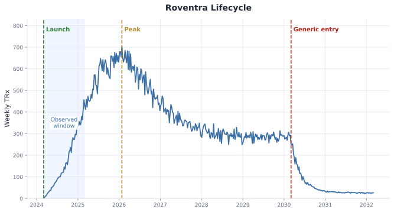

*Figure 14.1. Roventra lifecycle series with launch, observed window, peak, and generic entry marked. Synthetic data.*


This figure supports the history check action: see at a glance which part of the lifecycle is observed, which part is still forecasted, and where cold-start limits apply.


## 14.2 Sizing the Launch


```python
business_case = patient_based_forecast()
print(pd.Series(business_case).to_string())

```

    addressable_patients    20000.00
    access_adjustment           0.78
    brand_share                 0.30
    ceiling                  4680.00


```python
reconstructed = persistence_to_trx(observed["nbrx"].to_numpy())
reconstructed["cumulative_nbrx"] = reconstructed["nbrx"].cumsum()
reconstructed = reconstructed[["nbrx", "cumulative_nbrx", "on_therapy_stock"]]
print(reconstructed.tail().round(1))

```

         nbrx  cumulative_nbrx  on_therapy_stock
    47  125.0           2683.8            1541.1
    48  101.1           2784.9            1576.4
    49   98.8           2883.7            1607.1
    50  112.9           2996.6            1650.1
    51  102.7           3099.3            1680.9


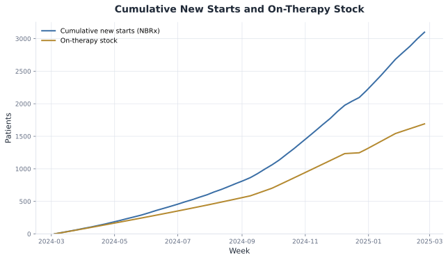

*Figure 14.2. Cumulative new starts and on-therapy stock over the observed window.*


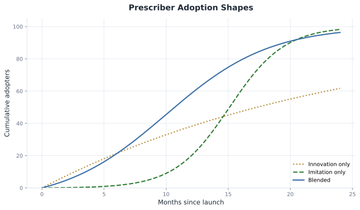

*Figure 14.3. Prescriber innovation, imitation, and blended adoption shapes.*


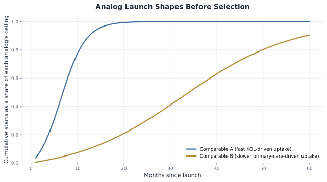

*Figure 14.4. Comparable A and Comparable B normalized adoption shapes over 60 months, before selection.*


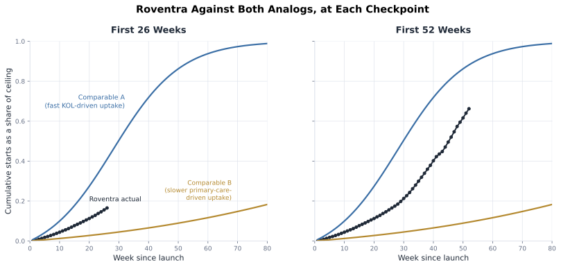

*Figure 14.5. Roventra's first 12 months of normalized uptake overlaid against both analog curves.*


```python
weeks_since_launch = (observed["week_start"] - national["week_start"].iloc[0]).dt.days / 7.0
months_since_launch = (weeks_since_launch * 12.0 / 52.0).to_numpy()
cumulative_starts = observed["nbrx"].cumsum().to_numpy()
bass_fit = fit_bass(months_since_launch, cumulative_starts)
print(pd.Series(bass_fit).round(3).to_string())

```

    p                             0.008
    q                             0.244
    m                          8470.418
    time_to_peak_months          13.557
    peak_monthly_new_starts     550.468


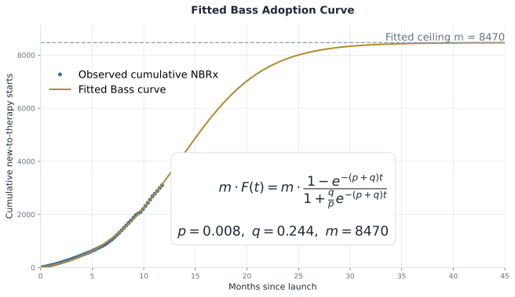

*Figure 14.6. Fitted Bass adoption curve against Roventra's observed cumulative NBRx, projected to month 20.*


## 14.3 In-Market Demand


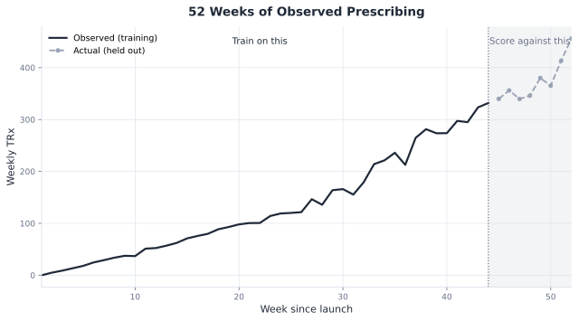

*Figure 14.7. Four backtest folds, each training on the blue span and testing on the orange span that immediately follows it.*


```python
print(scorecard.round({"mae": 1, "wmape": 3, "mape": 3, "mase": 2}))

```

               method    mae  wmape   mape  mase
    0             ets   17.4  0.064  0.070  0.36
    1         chronos   18.3  0.049  0.047  0.37
    2         timesfm   19.8  0.053  0.052  0.40
    3          sarima   27.1  0.100  0.104  0.55
    4         prophet   29.0  0.078  0.074  0.59
    5           naive   48.9  0.180  0.186  1.00
    6  seasonal_naive   48.9  0.180  0.186  1.00
    7             tft   73.0  0.195  0.194  1.49
    8             gbt  100.4  0.268  0.261  2.05


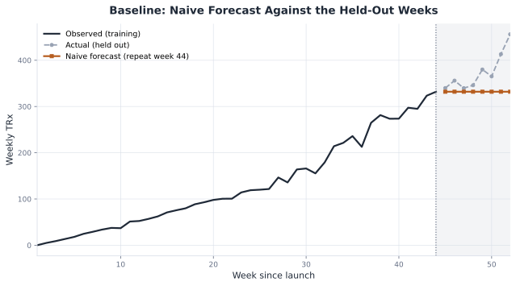

*Figure 14.8. Chronos, TimesFM, the TFT, and ETS against the actual holdout on the short-history window.*


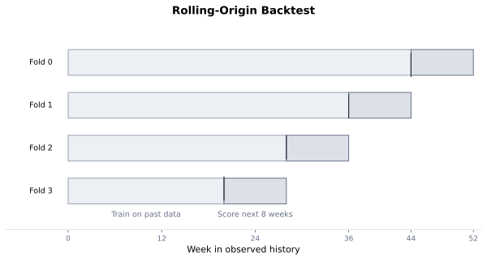

*Figure 14.9. Every method's MASE, colored by whether it beats the naive baseline.*


```python
classical_backtest = results["in_market_backtest"]
actual_holdout = results["holdout_actual"]["actual"].to_numpy()
calibration_backtest = classical_backtest.loc[classical_backtest["method"] == "naive"]
interval = conformal_interval(calibration_backtest, holdout_forecasts["ets"], alpha=0.20)
coverage = empirical_coverage(interval, actual_holdout)
print(coverage)

```

    1.0


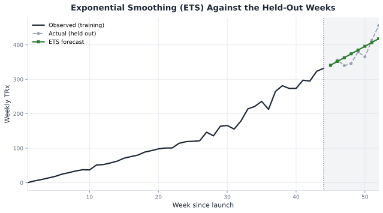

*Figure 14.10. The calibrated 80% interval around the ETS point forecast, with the actual holdout overlaid.*


## 14.4 Demand-Supply Planning


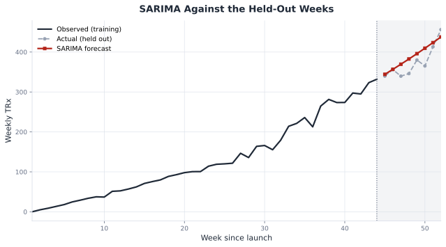

*Figure 14.11. Reconciliation forces the national forecast to equal the summed regional forecast, before and after OLS reconciliation.*


```python
hierarchy_base_forecast = results["hierarchy_base_forecast"]
print(hierarchy_base_forecast.iloc[0].round(1).to_string())

```

    National     456.2
    Midwest      120.1
    Northeast    134.0
    South        131.1
    West          76.5


```python
hierarchy_base = {
    column: hierarchy_base_forecast[column].to_numpy()
    for column in hierarchy_base_forecast.columns
}
region_order = [column for column in hierarchy_base if column != "National"]
bottom_up = reconcile(hierarchy_base, region_order, method="bottom_up")
ols = reconcile(hierarchy_base, region_order, method="ols")
print(f'{bottom_up.loc["National", "h1"]:.2f} {bottom_up.loc[region_order, "h1"].sum():.2f}')
print(f'{ols.loc["National", "h1"]:.2f} {ols.loc[region_order, "h1"].sum():.2f}')

```

    461.79 461.79
    457.31 457.31


```python
demand_to_supply = results["demand_to_supply"]
print(demand_to_supply.iloc[0].round(1).to_string())

```

    reconciled_demand     457.3
    safety_stock           38.7
    order_signal         1868.0


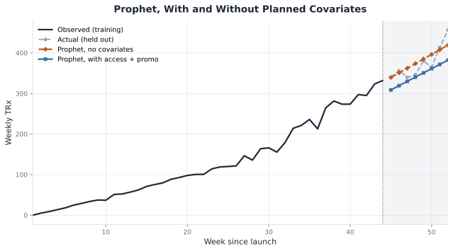

*Figure 14.12. Weekly demand becomes an order signal: lead time multiplies it, safety stock adds a buffer on top.*


## 14.5 Loss of Exclusivity


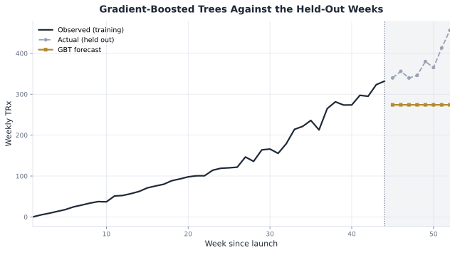

*Figure 14.13. A schematic post-generic decline, with the fast substitution phase separated from the slower residual tail.*


```python
analog_erosion = results["analog_erosion_comparison"]
comparison = analog_erosion.loc[analog_erosion["weeks_since_entry"].isin([12.0, 52.0])].copy()
comparison["weeks_since_entry"] = comparison["weeks_since_entry"].astype(int)
print(comparison.round(1).to_string(index=False))

```

     weeks_since_entry  Comparable erosion A (fast generic substitution)  Comparable erosion B (slower substitution, branded loyalty)
                    12                                              77.7                                                        169.4
                    52                                              20.6                                                         71.2


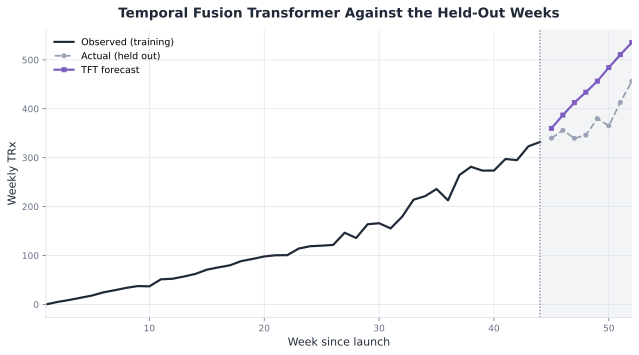

*Figure 14.14. Comparable erosion A and Comparable erosion B projected from the same pre-entry level.*


```python
erosion_tail = results["erosion_tail"]
weeks_since_entry = erosion_tail["weeks_since_entry"].to_numpy()
trx_tail = erosion_tail["trx"].to_numpy()
early_fit = fit_erosion(weeks_since_entry[:20], trx_tail[:20])
mature_fit = fit_erosion(weeks_since_entry[:78], trx_tail[:78])
print(round(early_fit["residual_fraction"], 4), round(early_fit["half_life_weeks"], 1))
print(round(mature_fit["residual_fraction"], 4), round(mature_fit["half_life_weeks"], 1))

```

    0.001 10.7
    0.1028 9.0


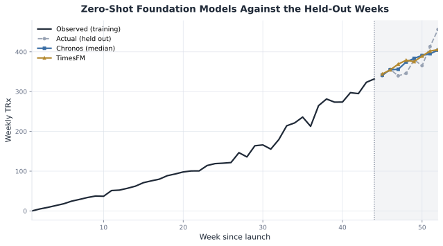

*Figure 14.15. Actual post-entry TRx, the analog erosion band, and the Chronos zero-shot cross-check, with the right panel zooming the tail.*


## 14.6 Consensus and Scenario Forecast


```python
consensus_base = {
    "patient_based": [results["patient_based_forecast"].iloc[0]["ceiling"] / 12.0] * 8,
    "ets": holdout_forecasts["ets"].to_numpy(),
    "chronos": holdout_forecasts["chronos"].to_numpy(),
}
consensus = ensemble_consensus(consensus_base, scorecard)
consensus_table = pd.DataFrame({"horizon_step": range(1, 9), "consensus": consensus})
print(consensus_table.round({"consensus": 1}).to_string(index=False))

```

     horizon_step  consensus
                1      348.7
                2      359.1
                3      364.2
                4      376.6
                5      385.1
                6      392.9
                7      399.4
                8      408.0


```python
consensus_waterfall = results["consensus_waterfall"]
print(consensus_waterfall.round({"running_total": 1}))

```

                                 step  adjustment_pct  running_total
    0             Analytics consensus            0.00         3034.0
    1     Access assumption tightened           -0.08         2791.3
    2  Launch-support level confirmed            0.05         2930.8
    3           Competitor entry risk           -0.03         2842.9


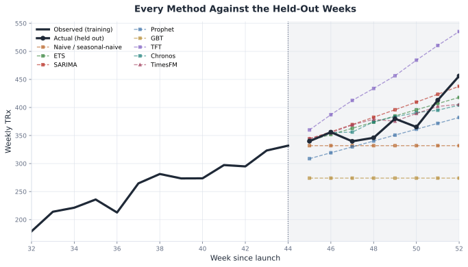

*Figure 14.16. The consensus reconciliation waterfall from the analytics number to the committed number, with each adjustment labeled as a delta or final total.*


```python
fva = results["forecast_value_added"].iloc[0]
fva["baseline_mae"] = round(fva["baseline_mae"], 2)
fva["adjusted_mae"] = round(fva["adjusted_mae"], 2)
print(fva.to_string())

```

    baseline_mae         17.38
    adjusted_mae         20.24
    adjustment_helped    False


```python
print(results["scenario_forecast"])

```

      scenario  addressable_patients  access_adjustment  brand_share  ceiling
    0      Low                 16000               0.65          0.2   2080.0
    1     Base                 20000               0.78          0.3   4680.0
    2     High                 24000               0.85          0.4   8160.0


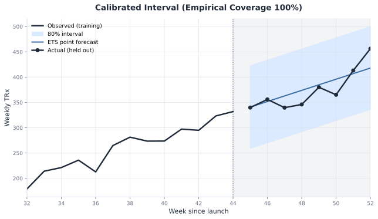

*Figure 14.17. Low, Base, and High launch scenarios form a fan from explicit driver assumptions.*


## 14.7 What to Bring From Your Project

- target series and unit, such as NBRx, TRx, units, or dollars
- forecast horizon and cadence
- known future events and covariates
- hierarchy levels that must reconcile
- enough backtest folds to score honestly
- explicit business adjustments and their historical value added

| Situation | Start with | Use if | Avoid if |
| --- | --- | --- | --- |
| Less than 1 year of weekly history | ETS and Chronos | trend dominates and seasonality is not mature | the business needs driver attribution |
| Planned access or promotion changes | Prophet | future covariates are known from the plan | future covariates are guessed from actuals |
| Many related short territory series | TFT | the panel is broad and stable | there are only a few noisy series |
| Rich lagged history and many rows | GBT | nonlinear lag and calendar effects matter | the training set is tiny |
| Hierarchical supply planning | OLS reconciliation | national and regional forecasts both carry signal | one level is clearly trusted more |

Interval recap:
- Monte Carlo assumption band for pre-launch
- Conformal residual interval for in-market demand
- Analog and Chronos interval for LOE
- Safety-stock buffer for supply planning
- Driver-based scenarios for consensus


## 14.8 Correcting the Forecast

Running commercialization on a number pulled from memory is flying VFR, visual flight rules, navigating by looking out the window at the horizon and the ground. It works in clear weather. The moment the weather turns cloudy, the horizon disappears, and a pilot with no other reference is now flying blind, a leading cause of fatal loss-of-control accidents in light aircraft. IFR, instrument flight rules, is what a pilot switches to once visibility drops: fly the instrument panel, altitude, heading, attitude, not the eye. A dated, calibrated forecast is the instrument panel for a launch. It does not clear the weather; the market stays just as uncertain. What it does is keep the business oriented inside that uncertainty. And flying IFR is not a set-it-and-forget-it maneuver: a pilot on instruments still corrects course continuously against what the panel shows, exactly what this section's re-fitting, backtesting, and reconciliation do to a forecast as real data arrives.


*Figure 14.18. Flying blind leaves the launch team in haze; instruments turn the same flight into a guided, measurable path.*


This figure supports the course-correction action: replace an unguided read of the launch with a dated forecast, then keep adjusting it as real data arrives.

Real prescribing data kept overturning Roventra's numbers throughout this chapter. The Bass diffusion fit against 6 months of actual uptake corrected the pre-launch funnel's 4,680-patient ceiling to 8,470, an 81% miss the business case had no way to see in advance. The rolling-origin backtest catches the same kind of miss earlier and cheaper: scoring each method across many folds catches a method that is quietly wrong every week, before that error reaches a committed number. Forecast value added applies the same test to human judgment: `forecast_value_added()` checks whether a management adjustment on top of the statistical forecast actually reduced error against the same actuals, and an override that fails the check gets dropped before it repeats next quarter. Reconciliation catches a quieter version of the same problem: the national and regional forecasts each measured the same underlying demand and still landed 1.2% apart, because 2 independently fit models of one reality will not agree by default. Forcing them back into a single coherent number applies the same discipline across levels of a hierarchy instead of across time.

This is the same discipline pharma demand-forecasting functions run on a fixed cadence, usually monthly or quarterly, inside the S&OP (sales and operations planning) cycle that brings commercial, finance, and supply planning to the same table. Forecast accuracy and bias are tracked as a standing KPI, and a miss that crosses an agreed materiality threshold triggers a formal re-baseline. The Bass re-fit, the backtest scorecard, and forecast value added are that cycle's mechanics, run once here on Roventra and run every month on a live brand.

