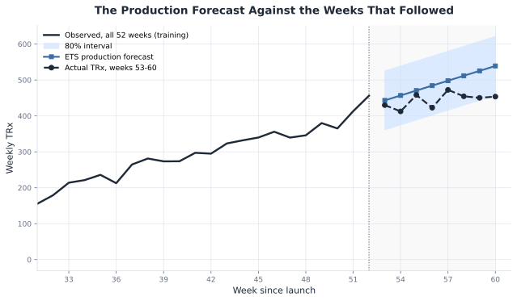
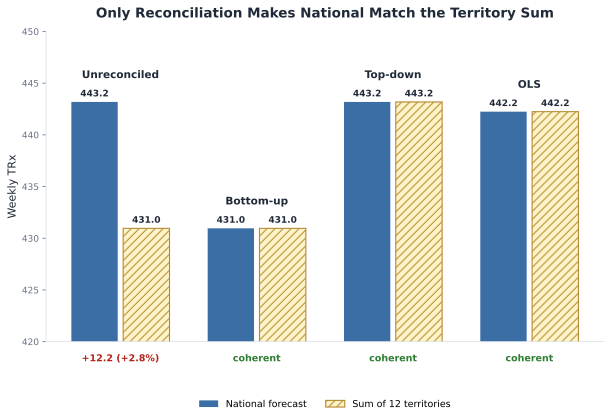
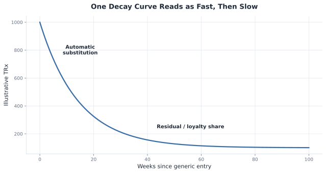
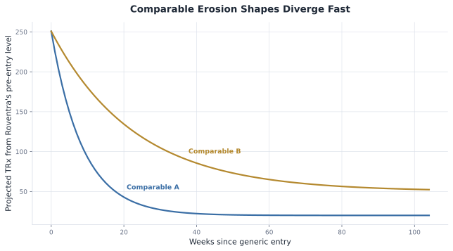
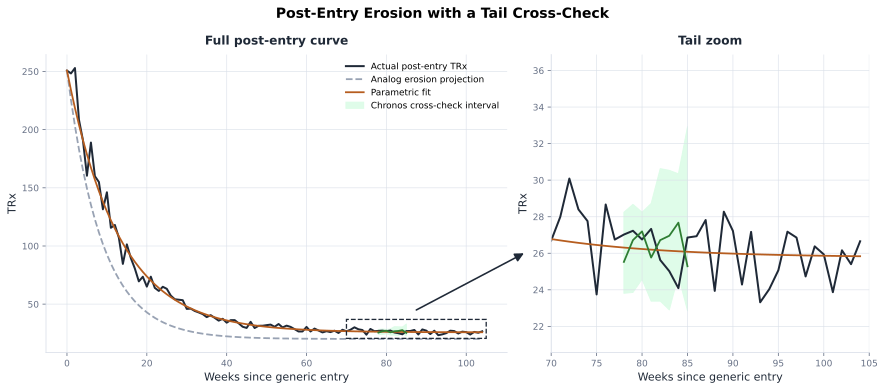
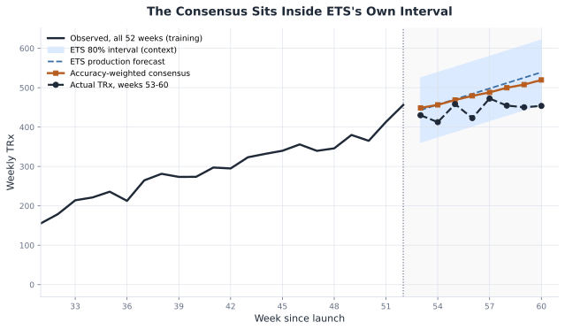
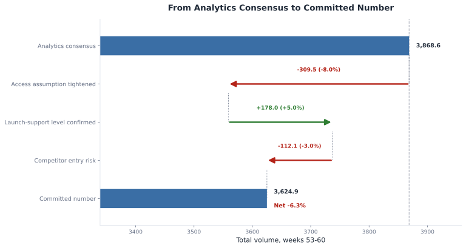
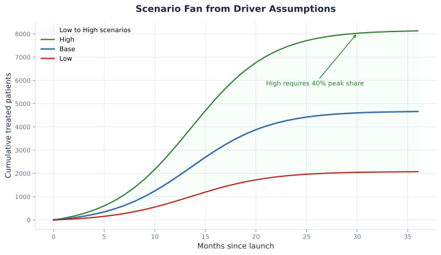

# Chapter 14: Forecasting from Launch to Loss of Exclusivity

This notebook executes the Chapter 14 forecasting chain: pre-launch business case, in-market scorecard, demand-supply reconciliation, loss of exclusivity, and consensus scenarios.


## 14.1 Forecasting Decisions


**Listing**: Load the lifecycle series


```python
from pathlib import Path
import sys

import pandas as pd

ROOT = Path.cwd()
if not (ROOT / "ch14_forecasting").exists():
    ROOT = ROOT.parent
SCRIPT_DIR = ROOT / "ch14_forecasting" / "scripts"
sys.path.insert(0, str(SCRIPT_DIR))

from run_analysis import run_analysis

results = run_analysis()

national = results["national_series"]
observed = results["observed_series"]
print(observed[["week_start", "nbrx", "trx"]].tail().round(1))

```

    12:29:38 - cmdstanpy - INFO - Chain [1] start processing


    12:29:38 - cmdstanpy - INFO - Chain [1] done processing


    12:29:38 - cmdstanpy - INFO - Chain [1] start processing


    12:29:38 - cmdstanpy - INFO - Chain [1] done processing


    Seed set to 1


    GPU available: False, used: False


    TPU available: False, using: 0 TPU cores


    
      | Name                    | Type                     | Params | Mode 
    -----------------------------------------------------------------------------
    0 | loss                    | MAE                      | 0      | train
    1 | padder_train            | ConstantPad1d            | 0      | train
    2 | scaler                  | TemporalNorm             | 0      | train
    3 | embedding               | TFTEmbedding             | 128    | train
    4 | temporal_encoder        | TemporalCovariateEncoder | 39.6 K | train
    5 | temporal_fusion_decoder | TemporalFusionDecoder    | 18.0 K | train
    6 | output_adapter          | Linear                   | 33     | train
    -----------------------------------------------------------------------------
    57.8 K    Trainable params
    0         Non-trainable params
    57.8 K    Total params
    0.231     Total estimated model params size (MB)
    88        Modules in train mode
    0         Modules in eval mode


    `Trainer.fit` stopped: `max_steps=300` reached.


    GPU available: False, used: False


    TPU available: False, using: 0 TPU cores


    Warning: You are sending unauthenticated requests to the HF Hub. Please set a HF_TOKEN to enable higher rate limits and faster downloads.


       week_start   nbrx    trx
    47 2025-01-27  125.0  346.0
    48 2025-02-03  101.1  380.0
    49 2025-02-10   98.8  365.1
    50 2025-02-17  112.9  413.1
    51 2025-02-24  102.7  456.2


*Figure 14.1. Roventra lifecycle series with launch, observed window, peak, and generic entry marked. Synthetic data.*


## 14.2 Sizing the Launch


**Listing**: The pre-launch funnel ceiling


```python
from forecasting import patient_based_forecast

business_case = patient_based_forecast()
print(pd.Series(business_case).to_string())

```

    addressable_patients    20000.00
    access_adjustment           0.78
    brand_share                 0.30
    ceiling                  4680.00


**Listing**: Reconstructing on-therapy stock from observed NBRx


```python
from forecasting import persistence_to_trx

reconstructed = persistence_to_trx(observed["nbrx"].to_numpy())
reconstructed["cumulative_nbrx"] = reconstructed["nbrx"].cumsum()
reconstructed = reconstructed[["nbrx", "cumulative_nbrx", "on_therapy_stock"]]
print(reconstructed.tail().round(1))

```

         nbrx  cumulative_nbrx  on_therapy_stock
    47  125.0           2683.8            1541.1
    48  101.1           2784.9            1576.4
    49   98.8           2883.7            1607.1
    50  112.9           2996.6            1650.1
    51  102.7           3099.3            1680.9


*Figure 14.2. Cumulative new starts and on-therapy stock over the observed window.*


*Figure 14.3. Prescriber innovation, imitation, and blended adoption shapes.*


*Figure 14.4. Comparable A and Comparable B normalized adoption shapes over 60 months, before selection.*


*Figure 14.5. Roventra's normalized uptake overlaid against both analog curves at 26 weeks (left) and 52 weeks (right).*


**Listing**: Fitting Bass diffusion to the observed launch data


```python
from forecasting import fit_bass

weeks_since_launch = (observed["week_start"] - national["week_start"].iloc[0]).dt.days / 7.0
months_since_launch = (weeks_since_launch * 12.0 / 52.0).to_numpy()
cumulative_starts = observed["nbrx"].cumsum().to_numpy()
bass_fit = fit_bass(months_since_launch, cumulative_starts)
print(pd.Series(bass_fit).round(3).to_string())

```

    p                             0.008
    q                             0.244
    m                          8470.418
    time_to_peak_months          13.557
    peak_monthly_new_starts     550.468


*Figure 14.6. Fitted Bass adoption curve against Roventra's observed cumulative NBRx, projected to month 20.*


## 14.3 In-Market Demand


*Figure 14.7. 52 weeks of observed prescribing: 44 weeks to train on, the last 8, shaded, held out and scored against.*


*Figure 14.8. The naive forecast against the held-out weeks: a flat line against a still-climbing launch.*


*Figure 14.9. Four backtest folds, each training on the gray span and testing on the darker span that immediately follows it.*


*Figure 14.10. The ETS forecast tracks the held-out weeks closely, level and trend alone.*


*Figure 14.11. SARIMA against the held-out weeks: a reasonable track that drifts slightly high late in the window.*


**Listing**: Prophet with and without the access and promotion covariates


```python
holdout = 8
ds_y = observed.rename(columns={"week_start": "ds", "trx": "y"})
covariate_columns = ["access_multiplier", "promo_multiplier"]
train = ds_y.iloc[:-holdout].reset_index(drop=True)
future_covariates = ds_y.iloc[-holdout:][covariate_columns].reset_index(drop=True)

from forecasting import fit_prophet

without_covariates = fit_prophet(train, horizon=holdout)
with_covariates = fit_prophet(
    train, horizon=holdout, covariate_columns=covariate_columns, future_covariates=future_covariates
)
print(without_covariates[:3].round(1))
print(with_covariates[:3].round(1))

```

    INFO:prophet:Disabling yearly seasonality. Run prophet with yearly_seasonality=True to override this.


    DEBUG:cmdstanpy:input tempfile: /var/folders/zw/cjrh8l_12zxfdkryd1brvm9m0000gn/T/tmpsoahb0gb/2brgqikk.json


    DEBUG:cmdstanpy:input tempfile: /var/folders/zw/cjrh8l_12zxfdkryd1brvm9m0000gn/T/tmpsoahb0gb/c1s68hkn.json


    DEBUG:cmdstanpy:idx 0


    DEBUG:cmdstanpy:running CmdStan, num_threads: None


    DEBUG:cmdstanpy:CmdStan args: ['/Users/qiu/Projects/hands-on-pharma-decision-science/.venv/lib/python3.12/site-packages/prophet/stan_model/prophet_model.bin', 'random', 'seed=44960', 'data', 'file=/var/folders/zw/cjrh8l_12zxfdkryd1brvm9m0000gn/T/tmpsoahb0gb/2brgqikk.json', 'init=/var/folders/zw/cjrh8l_12zxfdkryd1brvm9m0000gn/T/tmpsoahb0gb/c1s68hkn.json', 'output', 'file=/var/folders/zw/cjrh8l_12zxfdkryd1brvm9m0000gn/T/tmpsoahb0gb/prophet_modelftllqmas/prophet_model-20260707123020.csv', 'method=optimize', 'algorithm=newton', 'iter=10000']


    12:30:20 - cmdstanpy - INFO - Chain [1] start processing


    INFO:cmdstanpy:Chain [1] start processing


    12:30:20 - cmdstanpy - INFO - Chain [1] done processing


    INFO:cmdstanpy:Chain [1] done processing


    INFO:prophet:Disabling yearly seasonality. Run prophet with yearly_seasonality=True to override this.


    DEBUG:cmdstanpy:input tempfile: /var/folders/zw/cjrh8l_12zxfdkryd1brvm9m0000gn/T/tmpsoahb0gb/hgwdeiun.json


    DEBUG:cmdstanpy:input tempfile: /var/folders/zw/cjrh8l_12zxfdkryd1brvm9m0000gn/T/tmpsoahb0gb/il9ayube.json


    DEBUG:cmdstanpy:idx 0


    DEBUG:cmdstanpy:running CmdStan, num_threads: None


    DEBUG:cmdstanpy:CmdStan args: ['/Users/qiu/Projects/hands-on-pharma-decision-science/.venv/lib/python3.12/site-packages/prophet/stan_model/prophet_model.bin', 'random', 'seed=46392', 'data', 'file=/var/folders/zw/cjrh8l_12zxfdkryd1brvm9m0000gn/T/tmpsoahb0gb/hgwdeiun.json', 'init=/var/folders/zw/cjrh8l_12zxfdkryd1brvm9m0000gn/T/tmpsoahb0gb/il9ayube.json', 'output', 'file=/var/folders/zw/cjrh8l_12zxfdkryd1brvm9m0000gn/T/tmpsoahb0gb/prophet_modelfp_3uyim/prophet_model-20260707123020.csv', 'method=optimize', 'algorithm=newton', 'iter=10000']


    12:30:20 - cmdstanpy - INFO - Chain [1] start processing


    INFO:cmdstanpy:Chain [1] start processing


    12:30:20 - cmdstanpy - INFO - Chain [1] done processing


    INFO:cmdstanpy:Chain [1] done processing


    [339.4 350.8 362.1]
    [308.7 319.2 329.7]


*Figure 14.12. Prophet with and without the planned access and promotion covariates, against the held-out weeks.*


*Figure 14.13. Gradient-boosted trees against the held-out weeks: a nearly flat line against a still-climbing launch.*


**Listing**: Training the TFT across the territory panel


```python
holdout = 8
tft_forecast = results["holdout_forecasts"]["tft"].to_numpy()
print(tft_forecast.round(1))

```

    [359.9 387.1 412.5 433.9 456.5 484.3 510.5 535.4]


*Figure 14.14. The Temporal Fusion Transformer overshoots the held-out weeks and keeps climbing.*


**Listing**: Zero-shot forecasts from Chronos and TimesFM


```python
chronos_result = results["chronos_forecast"]
timesfm_result = results["holdout_forecasts"]["timesfm"].to_numpy()
print(chronos_result["median"].round(1).to_numpy())
print(timesfm_result.round(1))

```

    [341.6 355.1 356.1 374.4 383.5 390.7 395.1 404.2]
    [344.3 354.7 368.9 378.9 375.4 389.2 401.8 405.6]


*Figure 14.15. Chronos and TimesFM against the held-out weeks, with no training on Roventra data at all.*


**Listing**: The full accuracy scorecard


```python
scorecard = results["in_market_scorecard"]
print(scorecard.round({"mae": 1, "wmape": 3, "mape": 3, "mase": 2}))

```

               method    mae  wmape   mape  mase
    0             ets   17.4  0.064  0.070  0.36
    1         chronos   18.3  0.049  0.047  0.37
    2         timesfm   19.8  0.053  0.052  0.40
    3          sarima   27.1  0.100  0.104  0.55
    4         prophet   29.0  0.078  0.074  0.59
    5           naive   48.9  0.180  0.186  1.00
    6  seasonal_naive   48.9  0.180  0.186  1.00
    7             tft   73.0  0.195  0.194  1.49
    8             gbt  100.4  0.268  0.261  2.05


*Figure 14.16. Every method against the held-out weeks, on one chart, colored to match its earlier dedicated figure.*


**Listing**: A calibrated interval around the ETS forecast


```python
from forecasting import conformal_interval, empirical_coverage

classical_backtest = results["in_market_backtest"]
holdout_forecasts = results["holdout_forecasts"]
actual_holdout = results["holdout_actual"]["actual"].to_numpy()
calibration_backtest = classical_backtest.loc[classical_backtest["method"] == "naive"]
interval = conformal_interval(calibration_backtest, holdout_forecasts["ets"], alpha=0.20)
coverage = empirical_coverage(interval, actual_holdout)
print(interval.round(1))
print(f"empirical coverage: {coverage:.0%}")

```

                  point_forecast  lower  upper  half_width
    horizon_step                                          
    1                      340.8  259.5  422.2        81.4
    2                      351.8  270.5  433.2        81.4
    3                      362.8  281.5  444.2        81.4
    4                      373.9  292.5  455.2        81.4
    5                      384.9  303.5  466.2        81.4
    6                      395.9  314.5  477.3        81.4
    7                      406.9  325.6  488.3        81.4
    8                      417.9  336.6  499.3        81.4
    empirical coverage: 100%


*Figure 14.17. The calibrated 80% interval around the ETS point forecast, with the actual holdout overlaid.*




*Figure 14.18. The ETS production forecast against the weeks that actually followed: a straight-line extrapolation against a launch approaching its peak.*


## 14.4 Demand-Supply Planning


**Listing**: Independent base forecasts by level


```python
hierarchy_base_forecast = results["hierarchy_base_forecast"]
print(hierarchy_base_forecast.iloc[0].round(1).to_string())

```

    National    443.2
    MI-T1        93.9
    MI-T2         2.7
    MI-T3        10.0
    NO-T1        46.5
    NO-T2        67.2
    NO-T3         3.7
    SO-T1        37.6
    SO-T2        34.3
    SO-T3        62.4
    WE-T1         7.2
    WE-T2        58.0
    WE-T3         7.3


**Listing**: All 3 reconciliation methods against the unreconciled base forecasts


```python
from forecasting import reconcile

hierarchy_base = {
    column: hierarchy_base_forecast[column].to_numpy()
    for column in hierarchy_base_forecast.columns
}
territory_order = [column for column in hierarchy_base if column != "National"]
territory_shares = results["territory_historical_shares"]
bottom_up = reconcile(hierarchy_base, territory_order, method="bottom_up")
top_down = reconcile(hierarchy_base, territory_order, method="top_down", historical_shares=territory_shares)
ols = reconcile(hierarchy_base, territory_order, method="ols")

comparison = pd.DataFrame({
    "Unreconciled": [hierarchy_base_forecast["National"].iloc[0], sum(hierarchy_base[r][0] for r in territory_order)],
    "Bottom-up": [bottom_up.loc["National", "h1"], bottom_up.loc[territory_order, "h1"].sum()],
    "Top-down": [top_down.loc["National", "h1"], top_down.loc[territory_order, "h1"].sum()],
    "OLS": [ols.loc["National", "h1"], ols.loc[territory_order, "h1"].sum()],
}, index=["National", "Territory sum"])
print(comparison.round(1))

```

                   Unreconciled  Bottom-up  Top-down    OLS
    National              443.2      431.0     443.2  442.2
    Territory sum         431.0      431.0     443.2  442.2




*Figure 14.19. Only reconciliation makes the national forecast match the sum of 12 territories; unreconciled leaves a visible gap, every reconciled method closes it, and each closes it at a different shared total.*


**Listing**: Safety stock and the order signal, national level


```python
demand_to_supply = results["demand_to_supply"]
print(demand_to_supply.iloc[0].round(1).to_string())

```

    reconciled_demand     442.2
    safety_stock           38.7
    order_signal         1807.7


**Listing**: Safety stock and the order signal, by territory


```python
demand_to_supply_by_territory = results["demand_to_supply_by_territory"]
print(demand_to_supply_by_territory.round(1))

```

               reconciled_demand  safety_stock  order_signal
    territory                                               
    MI-T1                   94.8          17.8         397.1
    MI-T2                    3.7           0.5          15.2
    MI-T3                   11.0           1.6          45.5
    NO-T1                   47.4           8.9         198.6
    NO-T2                   68.2          12.1         284.8
    NO-T3                    4.6           0.8          19.3
    SO-T1                   38.6           8.9         163.2
    SO-T2                   35.3           8.1         149.2
    SO-T3                   63.3          12.8         266.2
    WE-T1                    8.2           1.3          33.9
    WE-T2                   58.9          10.8         246.5
    WE-T3                    8.2           1.2          34.0


## 14.5 Loss of Exclusivity




*Figure 14.20. A single half-life decay curve, reading fast in the early weeks and slow near its residual floor, with no break in the curve itself.*


**Listing**: Compare 2 analog erosion shapes from the same pre-entry level


```python
analog_erosion = results["analog_erosion_comparison"]
comparison = analog_erosion.loc[analog_erosion["weeks_since_entry"].isin([12.0, 52.0])].copy()
comparison["weeks_since_entry"] = comparison["weeks_since_entry"].astype(int)
comparison = comparison.rename(columns={
    "Comparable erosion A (fast generic substitution)": "Comparable A",
    "Comparable erosion B (slower substitution, branded loyalty)": "Comparable B",
})
print(comparison.round(1).to_string(index=False))

```

     weeks_since_entry  Comparable A  Comparable B
                    12          77.7         169.4
                    52          20.6          71.2




*Figure 14.21. Comparable erosion A and Comparable erosion B projected from the same pre-entry level.*


**Listing**: Fitting the decline on 20 weeks of post-entry data, then on 78


```python
from forecasting import fit_erosion

erosion_tail = results["erosion_tail"]
weeks_since_entry = erosion_tail["weeks_since_entry"].to_numpy()
trx_tail = erosion_tail["trx"].to_numpy()
early_fit = fit_erosion(weeks_since_entry[:20], trx_tail[:20])
mature_fit = fit_erosion(weeks_since_entry[:78], trx_tail[:78])
fit_comparison = pd.DataFrame(
    {
        "residual_fraction": [early_fit["residual_fraction"], mature_fit["residual_fraction"]],
        "half_life_weeks": [early_fit["half_life_weeks"], mature_fit["half_life_weeks"]],
    },
    index=["fit on 20 weeks", "fit on 78 weeks"],
).round({"residual_fraction": 4, "half_life_weeks": 1})
print(fit_comparison.to_string())

```

                     residual_fraction  half_life_weeks
    fit on 20 weeks             0.0010             10.7
    fit on 78 weeks             0.1028              9.0




*Figure 14.22. Actual post-entry TRx, the analog erosion band, and the Chronos zero-shot cross-check, with the right panel zooming the tail.*


## 14.6 Consensus and Scenario Forecast


**Listing**: An accuracy-weighted consensus


```python
from forecasting import ensemble_consensus

consensus_base = {
    "patient_based": [results["patient_based_forecast"].iloc[0]["ceiling"] / 12.0] * 8,
    "ets": results["production_forecast"]["forecast"].to_numpy(),
    "chronos": results["chronos_production_forecast"]["forecast"].to_numpy(),
}
consensus = ensemble_consensus(consensus_base, scorecard)
consensus_table = pd.DataFrame({"horizon_step": range(1, 9), "consensus": consensus})
print(consensus_table.round({"consensus": 1}).to_string(index=False))

```

     horizon_step  consensus
                1      448.7
                2      456.4
                3      468.8
                4      479.3
                5      488.0
                6      499.8
                7      507.8
                8      519.6




*Figure 14.23. The consensus, blended from patient-based, ETS, and Chronos, sits inside ETS's own 80% interval and tracks the actual continuation more closely than ETS alone.*


**Listing**: The reconciliation waterfall


```python
consensus_waterfall = results["consensus_waterfall"].round({"running_total": 1})
print(consensus_waterfall.to_string(formatters={"adjustment_pct": "{:.3f}".format}))

```

                                 step adjustment_pct  running_total
    0             Analytics consensus          0.000         3868.6
    1     Access assumption tightened         -0.080         3559.1
    2  Launch-support level confirmed          0.050         3737.0
    3           Competitor entry risk         -0.030         3624.9




*Figure 14.24. From the analytics consensus to the committed number: each adjustment shown as both a volume delta and the percentage that produced it, against a reference line at the starting total.*


**Listing**: Low, Base, and High scenarios


```python
from forecasting import scenario_forecast

print(scenario_forecast())

```

      scenario  addressable_patients  access_adjustment  brand_share  ceiling
    0      Low                 16000               0.65          0.2   2080.0
    1     Base                 20000               0.78          0.3   4680.0
    2     High                 24000               0.85          0.4   8160.0




*Figure 14.25. Low, Base, and High launch scenarios form a fan from explicit driver assumptions.*


## 14.7 A Forecasting Method Selection Field Guide

Gather these inputs before reusing any method in this chapter on a live brand:

- target series and unit, such as NBRx, TRx, units, or dollars
- forecast horizon and cadence
- known future events and covariates
- hierarchy levels that must reconcile
- enough backtest folds to score without leakage
- quantified business adjustments, traceable back to a specific driver

Table 14.2 (methods used in this chapter) and Table 14.3 (common pharma-forecasting methods this chapter did not need) in the manuscript turn this into a practical selection rule.

Interval recap:
- pre-launch business case: a Monte Carlo band over the funnel's own assumption ranges
- in-market demand: a conformal interval calibrated from real backtest residuals
- loss of exclusivity: an analog band, then a Chronos cross-check
- supply planning: a safety-stock buffer sized to each territory's own volatility
- consensus: driver-based low, base, and high scenarios, not a statistical band


## 14.8 Revising the Forecast

A forecast earns its keep by being corrected as real data arrives, not by being right the first time: re-fit as prescribing accumulates, backtest on a fixed schedule so a materially better challenger method replaces the incumbent, reconcile a hierarchy every cycle rather than once, and keep every business adjustment on the consensus named and traceable. Real pharma demand-forecasting functions run this whole loop, monthly or quarterly, inside the S&OP (sales and operations planning) cycle that brings commercial, finance, and supply planning to the same table. See the manuscript's 14.8 for the full stage-by-stage discussion.


## 14.9 Summary

This chapter built a forecast for every stage of the Roventra lifecycle, from a pre-launch business case with no data at all to a post-generic decline years in the future. The transferable lesson is the thinking, not any specific number this fictional brand produced: trust an assumption only until data exists to check it, let a method earn its place through an honest backtest, don't trust a decline curve before its tail shows itself, reconcile a hierarchy because independent good models won't agree by default, and keep every business adjustment named and traceable.

