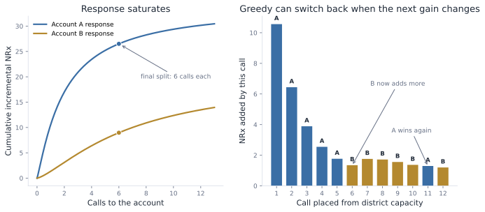
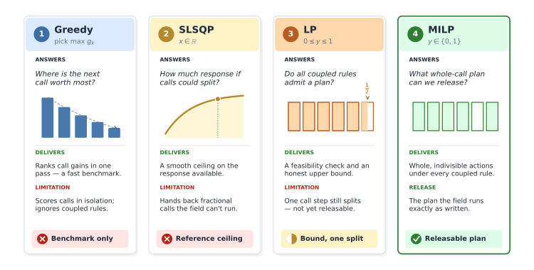
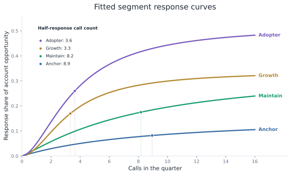
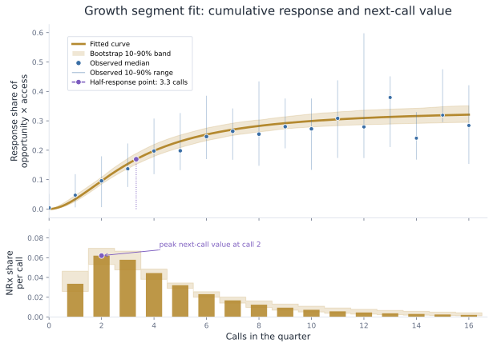
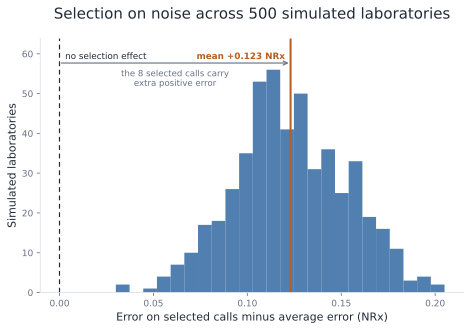
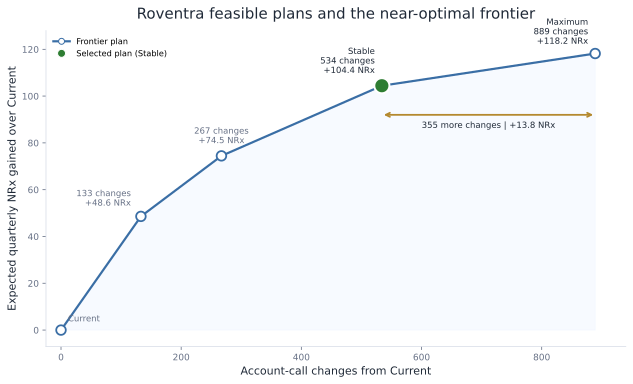
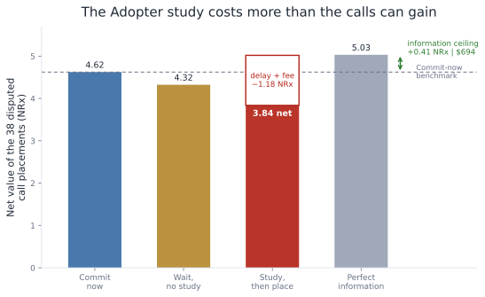

# Chapter 15: Resource Optimization Under Uncertainty

Roventra's Q3 commercial plan has one job: produce more incremental NRx from resources approved for the year. The team must assign the next 13 weeks of channel spend and account calls. It may also request added representative for the quarter, hold some call capacity until an October response update, or fund a study that could change the later plan.

The finished resource allocation plan must answer four questions:

1. **How much?** Set the Q3 budget and field capacity inside the approved annual plan.
2. **Where?** Allocate dollars across channels and call capacity across territories and eligible accounts.
3. **When?** Decide which resources to commit now and whether any capacity should wait for a later read.
4. **What should we learn?** Fund a study only when its result can change the later allocation by more than the study costs.

You will calculate the value of one more dollar or call, add the rules that make the plan executable, estimate response uncertainty from observed field history, and compare feasible plans under expected and weaker response.

## 15.1 The Q3 Resource Decision

Moving budget from field to email stays inside approved spend. Adding a field representative increases the resource and requires a separate funding. Holding calls reduces the Q3 capacity and keeps that available for the October update. Each resource has a different planning decision:

| Resource | Already fixed | Can change in the Q3 plan | Commercial value |
| --- | --- | --- | --- |
| Channel budget | Total weekly spend | Dollars assigned to paid media, digital, email, and field | Move money from a saturated channel to one with stronger incremental response |
| Field calls | Current representatives and territory capacity | Calls assigned to eligible accounts within each territory | Use scarce calls where the next call adds more incremental NRx |
| Headcount capacity | Current representatives | One added representative in a territory | Add capacity only where its incremental contribution clears its cost |
| Flexible reserve | Total call capacity | Calls released now and calls held until October | Keep calls movable only when a later response read can improve their placement |
| Measurement | Study budget, target accounts, and response window | Run or defer one focused study | Buy information only when the expected allocation improvement exceeds the study cost |

*Table 15.1. What is fixed and what can move in the Q3 plan.*

channel, field call, representative are the illustrative resource examples used in this chapters. Speaker programs, samples, conferences, patient-support spending, and territory alignment can follow the same methodology.

> **Note:** Roventra, its accounts, territories, field history, and response truth are synthetic. Costs and the value per incremental NRx are planning assumptions for this case.

`run_analysis()` in `run_analysis.py` builds the channel, field, headcount, reserve, and measurement decisions, then audits the frozen call plans. Run every block in order from the repository root.

**Listing 15.1**: Load the Q3 resource case.

```python
import sys
import pandas as pd

pd.set_option("display.width", 100)
sys.path.insert(0, "ch15_optimization/scripts")
from run_analysis import run_analysis

results = run_analysis()
planning = results["planning"]
territories = results["territories"]
channel = results["channel_budget_move"]
print(f"channel budget: ${channel.current_weekly_spend.sum():.1f} per week for 13 weeks")
print(f"field team: {territories.n_reps.sum()} representatives in {len(territories)} territories")
print(f"current field plan: {planning.current_calls.sum()} calls across {len(planning)} accounts")
print(f"eligible accounts: {planning.eligible_flag.sum()}")
print(f"protected or Closed accounts: {(~planning.eligible_flag).sum()}")
print("incremental NRx value: $1,300 to $2,100; base $1,700")
```

```text
channel budget: $587.1 per week for 13 weeks
field team: 39 representatives in 12 territories
current field plan: 2670 calls across 300 accounts
eligible accounts: 254
protected or Closed accounts: 46
incremental NRx value: $1,300 to $2,100; base $1,700
```

The approved channel budget is $587.10 per week. The current field plan contains 2,670 calls for 300 accounts. Of those accounts, 254 can receive promotional calls this quarter.

## 15.2 Marginal Value

### 15.2.1 Field Calls

Roventra's field team can make a fixed number of calls in Q3. The allocation decision compares what the next available call would add at each eligible account. Total account response includes the effect of calls already assigned. A marginal call gain is the extra NRx expected from 1 more call at the account's current frequency.

Suppose one district has 12 calls for 2 accounts. Account A responds quickly, but its later calls add less as the account approaches saturation. Account B responds more slowly and still has useful capacity later in the sequence. We assign the first call to the account with the larger first-call gain, update its call count, and compare the next available gains again. The same comparison continues until all 12 calls are placed.

The same Hill saturation function used for channel spend also works for calls. For account $i$, call count $c$, half-response point $m_i$, and slope $s_i$, the saturation fraction is

$$
Hill(c; m_i, s_i)=\frac{1}{1+\left(\frac{c}{m_i}\right)^{-s_i}}.
$$

The half-response point is the call count where the account reaches half of its fitted ceiling. If $A_i$ is the account's response ceiling, the fitted response is

$$
R_i(c)=A_i \times Hill(c; m_i, s_i).
$$

The gain from call step $k$ is the increase in fitted response after that call:

$$
g_{ik}=R_i(k)-R_i(k-1).
$$

Account A uses $A_A=34$, $m_A=2$, and $s_A=1.15$. Its first call adds 10.56 NRx. Later calls contribute less as the response curve flattens. Account B begins at 1.35 NRx per call and overtakes A after A has received 5 calls.



*Figure 15.1. The first 5 calls go to Account A. Calls 6 through 10 go to Account B. Call 11 switches back to A after B's next gain falls below A's.*

A greedy algorithm makes the best available local choice, commits that choice, and repeats with the capacity that remains. Here, the local choice is the account with the largest next-call gain after the calls already assigned. Listing 15.2 shows the loop: calculate the next gain for each account, assign 1 call to the larger gain, update that account's call count, and repeat until the 12 calls are gone.

**Listing 15.2**: Allocate 12 calls by largest next gain.

```python
def hill(c, midpoint, slope):
    if c == 0:
        return 0.0
    return 1 / (1 + (c / midpoint) ** (-slope))

params = {"A": (34, 2.0, 1.15), "B": (20, 7.0, 1.35)}
calls = {"A": 0, "B": 0}
print("step  A_gain  B_gain  choose  split")
for step in range(1, 13):
    gains = {
        acct: ceiling * (
            hill(calls[acct] + 1, midpoint, slope) - hill(calls[acct], midpoint, slope)
        )
        for acct, (ceiling, midpoint, slope) in params.items()
    }
    chosen = max(gains, key=gains.get)
    calls[chosen] += 1
    print(
        f"{step:>4}  {gains['A']:>6.2f}  {gains['B']:>6.2f}  "
        f"{chosen:^6}  A={calls['A']}, B={calls['B']}"
    )
print(f"final split: A={calls['A']}, B={calls['B']}")
```

```text
step  A_gain  B_gain  choose  split
   1   10.56    1.35    A     A=1, B=0
   2    6.44    1.35    A     A=2, B=0
   3    3.89    1.35    A     A=3, B=0
   4    2.55    1.35    A     A=4, B=0
   5    1.77    1.35    A     A=5, B=0
   6    1.30    1.35    B     A=5, B=1
   7    1.30    1.76    B     A=5, B=2
   8    1.30    1.72    B     A=5, B=3
   9    1.30    1.56    B     A=5, B=4
  10    1.30    1.37    B     A=5, B=5
  11    1.30    1.20    A     A=6, B=5
  12    0.98    1.20    B     A=6, B=6
final split: A=6, B=6
```

The final split gives 6 calls to each account and produces 35.47 incremental NRx. At call 6, A's next gain has fallen to 1.30 NRx while B offers 1.35. By call 11, B's next gain has fallen to 1.20 while A still offers 1.30, so the next call switches back to A. Greedy allocation keeps asking the same question after every placement.

This one-unit-at-a-time procedure is greedy allocation. It gives the exact answer when every call uses one unit of capacity, incremental gains decline.

### 15.2.2 Channel Spending

Channel money uses the same comparison. The fitted marketing-mix curves estimate the incremental NRx from adding $1 at the current spend in email, field, digital, or paid media. Money moves toward the strongest next-dollar return until a channel reaches its approved movement bound or another channel catches up. `channel_response_summary()` and `channel_budget_move()` in `allocation.py` calculate those returns and apply the measurement permissions.

| Channel | Weekly spend change | Q3 incremental NRx change |
| --- | ---: | ---: |
| paid_media | +$11.30 | +40.8 |
| digital | +$8.70 | +25.9 |
| email | +$5.80 | +48.6 |
| field | -$25.80 | -36.6 |

*Table 15.2. The bounded channel move keeps the weekly budget at $587.10.*

The Q3 move takes $25.80 per week from field and splits it across paid media, digital, and email. The 13-week effect is 78.7 incremental NRx. Email has the highest next-dollar return, but the measurement record caps its increase at 30%. The weekly total remains $587.10.

## 15.3 Executable Plan

### 15.3.1 Field Calls

Roventra's 300 accounts are divided among 12 territory account lists. A call assigned in MI-T1 uses MI-T1 capacity and cannot fill unused time in another territory. Protected and Closed-access accounts receive zero promotional calls. Every other eligible account receives at least 1 call. The business rule also limits total account-call changes to 20% of the 2,670 calls in the current plan.

These rules turn a ranked list of call incremental NRx gains into a connected allocation problem. Adding a call to one account can require removing a call elsewhere in the same territory. Meeting minimum coverage consumes capacity. If the plan transfers a call from account A to account B, the national limit counts two account-call changes: one removal and one addition.

The next few pages define the four optimization solver methods in detail. For now, use the toy case to build some intuition. The methods separate two questions: whether the response curve is read as a smooth curve or as a stack of call steps, and how many business rules the solver must respect at the same time. Greedy makes whole-call local choices. SLSQP uses the smooth curve and allows fractional calls. LP uses the step model and keeps the connected rules, but allows a fractional package at the boundary. MILP uses the same step model and rules as LP, then requires every released choice to be whole.

A small toy example shows why the methods can disagree. The district has capacity for 2 calls. Account A can receive 1 stand-alone call worth 10 NRx. Account C can receive 1 stand-alone call worth 8 NRx. Account B has a minimum effective frequency rule: the plan can either release the full 2-call B package or release nothing to B. The B package is worth 19 NRx and consumes both calls.

| Choice | Incremental gain | Capacity used | Release rule |
| --- | ---: | ---: | --- |
| A1 | 10.0 | 1 call | Can stand alone |
| B package | 19.0 | 2 calls | Must be taken as a full package |
| C1 | 8.0 | 1 call | Can stand alone |

Greedy takes the best stand-alone step first, A1, then uses the remaining capacity on C1 for 18 NRx. MILP evaluates the B package as a whole and chooses it for 19 NRx. LP relaxation keeps the package capacity but allows fractional package decisions, so it chooses A1 plus half of the B package for 19.5 NRx. The LP answer is a diagnostic boundary, not a field plan.

Here is the same toy case through the 4 method lenses:

| Method | Toy case question | Toy answer |
| --- | --- | --- |
| Greedy | Which available whole call step has the largest next gain? | Pick A1 and C1 for 18 NRx |
| SLSQP | If calls were divisible, where would the smooth curves put 2 calls? | Use a continuous reference, not the release rule |
| Call-step linearization | How do we turn smooth curves and rules into solver-ready choices? | Build A1, B package, and C1 with gains and capacity use |
| LP relaxation | What if the package rule is kept, but package decisions can be fractional? | Pick A1 and 0.5x B package for 19.5 NRx |
| MILP | What whole-call plan satisfies the package rule? | Pick the B package for 19 NRx |

Listing 15.3 compares greedy, LP relaxation, and MILP on the toy choices. SLSQP appears in the next subsection because it needs a smooth response curve, not only step gains. The B package row consumes 2 calls when selected.

**Listing 15.3**: Compare greedy, LP relaxation, and MILP on call steps.

```python
import numpy as np
from scipy.optimize import Bounds, LinearConstraint, milp

gains = np.array([10.0, 19.0, 8.0])
capacity_use = np.array([1.0, 2.0, 1.0])
labels = np.array(["A1", "Bpkg", "C1"])

def solve(capacity, integer):
    constraints = [
        LinearConstraint(capacity_use.reshape(1, -1), -np.inf, [capacity]),
    ]
    integrality = np.ones(3) if integer else np.zeros(3)
    res = milp(c=-gains, integrality=integrality, bounds=Bounds(0, 1),
               constraints=constraints)
    return np.where(np.abs(res.x) < 1e-9, 0, res.x)

plans = {
    "Greedy": np.array([1, 0, 1], dtype=float),
    "LP relaxation": solve(2, integer=False),
    "MILP": solve(2, integer=True),
}

print("method          chosen steps              value")
for method, y in plans.items():
    chosen = ", ".join(
        label if value == 1 else f"{value:.1f}x {label}"
        for label, value in zip(labels, y) if value > 1e-6
    )
    print(f"{method:<15} {chosen:<24} {gains @ y:>5.1f}")
```

```text
method          chosen steps              value
Greedy          A1, C1                    18.0
LP relaxation   A1, 0.5x Bpkg             19.5
MILP            Bpkg                      19.0
```



*Figure 15.2. Choose the earliest method that represents every binding business rule. Greedy is enough for independent declining gains; MILP is required when the released actions are indivisible and coupled.*

The notation stays fixed across the four methods:

$$
\begin{aligned}
i &\in \mathcal I_t
&& \text{account assigned to territory }t,\\
k &= 1,\ldots,u_i
&& \text{possible resource step for account }i,\\
y_{ik}
&&& \text{decision to choose call step }k\text{ for account }i,\\
c_i^0
&&& \text{current calls for account }i,\\
d_i
&&& \text{absolute number of calls changed for account }i,\\
l_i,\;u_i
&&& \text{minimum and maximum calls for account }i,\\
R_i(c)
&&& \text{fitted incremental response at }c\text{ calls},\\
C_t
&&& \text{quarterly call capacity in territory }t,\\
M &= 534
&& \text{national limit on account-call changes}.
\end{aligned}
$$

#### SLSQP: Smooth Response Reference

First allow account calls to be continuous. For each territory, solve

$$
\begin{aligned}
\max_x \quad & \sum_{i\in I_t} R_i(x_i) \\
\text{subject to}\quad
& \sum_{i\in I_t} x_i \le C_t,\\
& l_i \le x_i \le u_i \qquad \forall i\in I_t,\\
& x_i\in\mathbb{R}.
\end{aligned}
$$

Sequential least squares programming (SLSQP) uses the response gradients to build and solve a sequence of local quadratic approximations. It works directly with the smooth Hill curves and handles capacity plus lower and upper bounds. The solution estimates the response available within each territory when calls are divisible and the national plan-change rule is absent. Hill curves can be S-shaped, so this result is a smooth local reference.

#### Call-Step Linearization

Call-step linearization turns a smooth response curve into a stack of whole-call choices. It creates the $g_{ik}$ coefficients that the LP relaxation and MILP can optimize.

For each account, replace the smooth curve with step gains $g_{ik}=R_i(k)-R_i(k-1)$. Variable $y_{ik}$ records whether call step $k$ is assigned to account $i$, and the account call count is

$$
c_i=\sum_{k=1}^{u_i}y_{ik}.
$$

The objective becomes linear:

$$
\max_y \sum_i\sum_{k=1}^{u_i} g_{ik}y_{ik}.
$$

The trade is practical. SLSQP can use the curve directly, but it works with continuous call counts such as 4.6 calls. LP and MILP use a linear objective built from call steps, which makes it easier to add ordering, minimum coverage, protected-account exclusions, territory capacity, and the national plan-change rule in one model.

Call ordering requires

$$
y_{i,k}\le y_{i,k-1}\qquad k=2,\ldots,u_i.
$$

The model can choose call 3 only after calls 1 and 2. Minimum coverage fixes $y_{ik}=1$ for $k\le l_i$. A protected or Closed-access account has $u_i=0$. Territory capacity is

$$
\sum_{i\in I_t}\sum_{k=1}^{u_i}y_{ik}\le C_t.
$$

For movement, $d_i$ represents the absolute change from the current plan:

$$
\begin{aligned}
d_i &\ge c_i-c_i^0,\\
d_i &\ge c_i^0-c_i,\\
\sum_i d_i &\le M.
\end{aligned}
$$

These inequalities make $d_i\ge |c_i-c_i^0|$. The objective has no reason to inflate $d_i$, and the national sum limits total call additions and removals.

#### LP: Fractional Diagnostic

$y_{ik}$ is the decision for one call step. In the release plan, $y_{ik}=1$ means choose the step and $y_{ik}=0$ means skip it. The LP diagnostic allows any value between 0 and 1:

$$
0\le y_{ik}\le1.
$$

$d_i$ is the change counter for account $i$. It records how many calls the new plan adds to or removes from that account compared with the current plan. The LP diagnostic allows it to be any nonnegative number:

$$
d_i\ge0.
$$

Every objective term and constraint is linear. LP keeps the connected release rules from the MILP: call ordering, minimum coverage, protected-account exclusions, territory capacity, and account-call changes. It relaxes the final yes-or-no requirement on each call step.

That relaxation creates a useful diagnostic. If one step has $y_{ik}=0.5$, the LP is saying that the business rules want half of that last call step at the boundary. Field cannot release half a planned call, but the fractional step shows exactly where the integer model must round. LPs solve quickly and provide an upper bound on the corresponding integer model when both use the same limits. The diagnostic below uses $M=534.5$ to make that boundary visible: 1 call step returns fractional.

#### MILP: Whole-Call Release

The mixed-integer linear program (MILP) changes the step domain to

$$
y_{ik}\in\{0,1\}.
$$

The objective, ordering, capacity, coverage, access, and movement equations stay the same. The solver uses branch-and-bound and cutting planes to compare feasible combinations of whole call steps. MILP fits account calls, representative counts, minimum frequencies, and all-or-nothing tactics because those decisions are indivisible. The released model uses $M=534$ and reports a global optimality gap for the binary formulation.

`greedy_call_plan()`, `slsqp_call_plan()`, `lp_relaxation_call_plan()`, and `milp_call_plan()` in `allocation.py` produce the 4 Q3 checkpoints in Table 15.3.

| Method | Mathematical model | Business rules represented | Q3 result | Use |
| --- | --- | --- | ---: | --- |
| Greedy | Repeatedly choose the largest available $g_{ik}$ | Whole units, account bounds, and territory capacity; choices remain independent | 1,164.9 NRx | Fast marginal benchmark |
| SLSQP | $\max \sum_i R_i(x_i)$, $x_i\in\mathbb{R}$ | Smooth response, account bounds, and territory capacity | 1,165.0 NRx | Continuous response reference |
| LP relaxation | $\max \sum_{i,k}g_{ik}y_{ik}$, $0\le y_{ik}\le1$ | Ordering, coverage, access, capacity, and plan change | 1,151.8 NRx | Feasibility diagnostic with one fractional step |
| MILP | $\max \sum_{i,k}g_{ik}y_{ik}$, $y_{ik}\in\{0,1\}$ | The same coupled rules with whole released units | 1,151.8 NRx | Point-estimate release candidate |

*Table 15.3. The solver progression for the Q3 allocation problem.*

Greedy and SLSQP reach about 1,165 modeled NRx, but both exceed the plan-change limit. The LP uses the 534.5-change teaching limit and splits its last unit, leaving 1 fractional step. The Q3 rule allows 534 whole account-call changes. The MILP returns an integer plan at 1,151.8 modeled NRx and passes every release rule. The values are close because the Q3 case has many accounts, smooth response curves, and only a small number of binding integer decisions. That is common in large allocation problems.

### 15.3.2 Headcount

A representative is a whole, fixed-cost resource, so the headcount case reuses the point-estimate MILP. The baseline solve produces value $V(\mathbf C)$ under territory capacities $\mathbf C=(C_1,\ldots,C_T)$. One representative-quarter adds $\Delta C=91$ calls to a single territory, based on the median 7 calls per representative per week across 13 weeks.

For territory $t$, solve the complete MILP again and calculate

$$
\Delta V_t
=V(C_1,\ldots,C_t+\Delta C,\ldots,C_T)-V(\mathbf C).
$$

The quarterly business case is

$$
\text{Net value}_t
=\$1{,}700\times\Delta V_t-\$45{,}000.
$$

The $1,700 figure is the planning contribution per incremental NRx. It represents net contribution from the new prescription plus expected downstream refills in this synthetic case. The $45,000 figure is the loaded cost of one representative per quarter. At those assumptions, an added representative needs 26.47 incremental NRx to break even.

Every re-solve keeps the response estimates, account rules, and other territory capacities fixed. The base account-call change allowance stays in place, and the added representative's 91 calls are added on top. `headcount_business_case()` in `allocation.py` runs this MILP re-solve for all 12 territories.

| Territory | Incremental NRx | Value at $1,700/NRx | Net value | Recommendation |
| --- | ---: | ---: | ---: | --- |
| NO-T1 | +15.68 | $26,664 | -$18,336 | Hold |
| WE-T1 | +12.37 | $21,037 | -$23,963 | Hold |
| NO-T3 | +10.64 | $18,082 | -$26,918 | Hold |
| MI-T2 | +9.00 | $15,297 | -$29,703 | Hold |
| SO-T3 | +6.71 | $11,415 | -$33,585 | Hold |
| WE-T2 | +6.21 | $10,550 | -$34,450 | Hold |

*Table 15.4. The best 6 territory headcount re-solves still fail the cost test.*

NO-T1 is the best place for added capacity. It produces 15.68 more NRx, worth $26,664 under the base value assumption. That leaves an $18,336 loss after the representative cost. Every territory returns Hold. The Q3 value comes from changing call placement with the current field team.

The recommendation changes if the product's value per incremental NRx is higher. The cost is fixed, so the breakeven line moves only through the value assumption:

| Value per incremental NRx | Territories clearing breakeven | Best NO-T1 net value |
| ---: | --- | ---: |
| $1,700 | None | -$18,336 |
| $3,000 | NO-T1 | +$2,040 |
| $3,700 | NO-T1, WE-T1 | +$13,016 |
| $4,300 | NO-T1, WE-T1, NO-T3 | +$22,424 |

*Headcount sensitivity to the value-per-NRx planning assumption.*

## 15.4 Response Uncertainty and Plan Selection

The call plan depends on estimated incremental NRx gains. The next call goes where the fitted curve is steepest at the current call count. The planning input needs both an NRx gain estimate and a credible range for every possible call.

### 15.4.1 Observed Account-Period Rows

The synthetic data contains 6 quarterly history rows for each account. Each row mixes measured history with planning estimates. `calls` and `observed_nrx` are measured. `segment`, `baseline_nrx`, `opportunity_nrx`, and `access_state` are planning fields prepared before the response fit. In a real brand plan, those fields would come from targeting rules, account-potential models, payer access records, pre-period baselines, or a forecast.

The response fit uses `segment`, `calls`, `observed_nrx`, `baseline_nrx`, `opportunity_nrx`, and `access_state` in each account-period row.

The segment assignment is part of the synthetic planning table. Accounts are ranked by opportunity NRx with random jitter. Higher-opportunity accounts skew toward the slower Anchor and Maintain segments. Lower-opportunity accounts skew toward the faster Growth and Adopter segments. In a real setting, this field might come from targeting rules, an account-priority model, an adoption-stage model, or account clustering.

Opportunity NRx is drawn for each account from a opportunity distribution.

After the account receives a segment label, the generator draws one baseline share from that segment's range and multiplies it by the account's opportunity to get its baseline NRx. For A0001, the account is in Growth, so its baseline share is drawn from the Growth range of 25% to 45%, applied to its 23.519 NRx opportunity to get its exact baseline 6.619 NRx. In a real setting, baseline NRx would usually come from a pre-period average, a forecast, or a baseline model.

`run_generation()` in `generate_allocation_data.py` produces `observed_field_history`. Listing 15.4 prints three rows with the fields used by the response fit, then the fields kept for data inspection.

**Listing 15.4**: Inspect observed account-period rows.

```python
from pathlib import Path
import sys

sys.path.insert(0, str(Path("ch15_optimization/scripts").resolve()))

from generate_allocation_data import run_generation

generated = run_generation()
history = generated["observed_history"]

fit_cols = [
    "account_id", "segment", "access_state", "calls",
    "baseline_nrx", "observed_nrx", "opportunity_nrx"
]
inspect_cols = [
    "account_id", "period_id", "channel_exposure",
    "measurement_source", "measurement_window",
]

print("Fields used by the response fit")
print(history.loc[:2, fit_cols].to_string(index=False))
print()
print("Fields kept for source inspection")
print(history.loc[:2, inspect_cols].to_string(index=False))
```

```text
Fields used by the response fit
account_id  segment access_state  calls  baseline_nrx  observed_nrx  opportunity_nrx
     A0001   Growth   Restricted      8         6.619         8.681           23.519
     A0002 Maintain       Closed      1        14.795        14.912           21.173
     A0003  Adopter   Restricted     14         2.569         5.802           15.234

Fields kept for source inspection
account_id  period_id  channel_exposure measurement_source measurement_window
     A0001          1                 5 prescription_panel             2024Q1
     A0002          1                 4 prescription_panel             2024Q1
     A0003          1                 7 prescription_panel             2024Q1
```

### 15.4.2 Segment Response Fit

A response curve has 3 fitted parameters, and 6 noisy rows cannot identify a reliable curve for one account. The fit combines accounts within 4 response segments, while each account keeps its own opportunity and access multiplier. Each segment still contains observations from 0 through 16 calls.

The fitted curve uses the same Hill saturation form used earlier. For account $i$ in segment $s$, call count $c$, opportunity $O_i$, access multiplier $a_i$, segment scale $\alpha_s$, half-response point $m_s$, and slope $h_s$, the fitted incremental response is

$$
\widehat R_i(c)=O_i a_i \alpha_s
\frac{1}{1+\left(\frac{c}{m_s}\right)^{-h_s}}.
$$

The 3 fitted parameters are $\alpha_s$, $m_s$, and $h_s$. Scale $\alpha_s$ is the share of opportunity the account can convert when calls saturate. Half-response point $m_s$ is the call count where the segment reaches half of that fitted ceiling. Slope $h_s$ controls how sharply response rises around the half-response point.

The fitting target is observed incremental NRx:

$$
\max(\text{observed NRx}_{it}-\text{baseline NRx}_i,0).
$$

`fit_segment_response()` in `response_uncertainty.py` fits the 4 segment curves with bounded nonlinear least squares. The function normalizes each row by $O_i a_i$, fits the Hill curve in log-parameter space, and weights rows by the square root of $O_i a_i$ so large accounts matter without taking over the curve. `_observed_history_summary()` in `run_analysis.py` reports the call variation and sample size used by each fit.

| Segment | Accounts | Account-period rows | Call range | Mean observed NRx |
| --- | ---: | ---: | ---: | ---: |
| Adopter | 67 | 402 | 0 to 16 | 5.40 |
| Anchor | 95 | 570 | 0 to 16 | 37.66 |
| Growth | 62 | 372 | 0 to 16 | 10.42 |
| Maintain | 76 | 456 | 0 to 16 | 17.50 |

*Table 15.5. Each segment fit has observed call variation across the full 0 to 16 range.*

| Segment | Scale | Half-response point | Slope | RMSE | $R^2$ |
| --- | ---: | ---: | ---: | ---: | ---: |
| Anchor | 0.1637 | 8.945 | 1.016 | 1.085 | 0.696 |
| Maintain | 0.3500 | 8.173 | 1.153 | 1.299 | 0.716 |
| Growth | 0.3388 | 3.322 | 1.838 | 1.620 | 0.657 |
| Adopter | 0.5198 | 3.633 | 1.730 | 1.483 | 0.680 |

*Table 15.6. Segment-level Hill curves fitted from observed field history.*



*Figure 15.3. Growth and Adopter climb earlier, while Anchor responds more slowly and reaches a lower response share.*

### 15.4.3 Draw Plausible Curves

The point fit supplies one gain for each possible call. Q3 planning also needs to know how those gains would change if the observed territory mix had been different. The 12 territories provide natural resampling groups because accounts in one territory share local field conditions.

`block_bootstrap_response_draws()` in `response_uncertainty.py` resamples whole territories, refits all 4 segments, and repeats the process 200 times. Each repeat produces one complete set of segment curves. `response_draws_to_step_gains()` then converts that set into one value for every possible account call. The 200 gain matrices preserve which parameters and segments moved together in each refit.

| Segment | Scale p10 | Scale p90 | Half-response p10 | Half-response p90 | Slope p10 | Slope p90 |
| --- | ---: | ---: | ---: | ---: | ---: | ---: |
| Anchor | 0.1345 | 0.2505 | 6.52 | 22.00 | 0.842 | 1.164 |
| Maintain | 0.2944 | 0.4834 | 5.32 | 16.58 | 0.954 | 1.400 |
| Growth | 0.3081 | 0.3975 | 2.92 | 4.31 | 1.455 | 2.200 |
| Adopter | 0.4614 | 0.6056 | 3.21 | 4.68 | 1.360 | 2.163 |

*Table 15.7. Territory-bootstrap draws preserve joint movement in the segment curves.*



*Figure 15.4. Response uncertainty built from observed account-period data.*

### 15.4.4 Expected Value Across Curves

The Q3 plan is selected under response-curve uncertainty. In territory NO-T1, 2 Adopter accounts compete for scarce call capacity. A0095 currently has 4 calls. A0099 currently has 2 calls. The question is which next call has the better expected payoff across the response curves supported by the observed history.

There are two ways to calculate the next-call value. (1) The quick shortcut averages the 3 fitted curve parameters first, then calculates one Hill-curve gain from those average parameters. (2) The bootstrap method keeps the 200 fitted curves, scores the next call under each curve, and averages the 200 NRx gains. That NRx gain average becomes the coefficient the optimizer uses for the call decision.

The shortcut is cheaper because it works with one average curve. The bootstrap method costs more because the response curves have to be refit or sampled first. The extra work catches ranking errors from the nonlinear Hill curve. For A0095 and A0099, the shortcut prefers A0095 by 0.036 NRx. Averaging the 200 bootstrap outcomes prefers A0099 by 0.007 NRx. The gap is small for this pair, but the release plan compares thousands of possible calls near the capacity boundary.

This is sample-average approximation (SAA). The uncertain expected-value problem is replaced with a finite sample of plausible response curves. Here the sample has 200 bootstrap draws. For each possible account call, the code calculates the gain under all 200 curves and uses the average gain as the value coefficient in the field-call MILP. The solver still chooses whole planned calls under territory capacity, eligibility, frequency, and the plan-change rule. SAA is practical when simulation draws represent the uncertainty well.

**Listing 15.5**: Build sample-average next-call coefficients.

```python
gain_draws = results["_gain_draws"]
mean_step_gains = gain_draws.mean(axis=0)
print(f"gain draws: {gain_draws.shape[0]} draws, {gain_draws.shape[1]} accounts, "
      f"{gain_draws.shape[2]} possible calls per account")
for account in ["A0095", "A0099"]:
    idx = int(planning.index[planning.account_id.eq(account)][0])
    next_step = int(planning.loc[idx, "current_calls"])
    print(f"{account} next-call coefficient: {mean_step_gains[idx, next_step]:.3f} NRx")
```

```text
gain draws: 200 draws, 300 accounts, 16 possible calls per account
A0095 next-call coefficient: 0.627 NRx
A0099 next-call coefficient: 0.634 NRx
```

| Account | Territory | Segment | Current calls | Next gain from mean parameters | Mean next gain across outcomes |
| --- | --- | --- | ---: | ---: | ---: |
| A0095 | NO-T1 | Adopter | 4 | 0.663 | 0.627 |
| A0099 | NO-T1 | Adopter | 2 | 0.627 | 0.634 |

*Table 15.10. Averaging outcomes reverses the next-call ranking.*


### 15.4.5 Weak-Quarter Value

The Q3 package needs one number for the expected quarter and one number for a weak quarter. The expected-value plan earns 1,147.2 incremental NRx on average across the fitted curves. Finance also needs a downside number: how much value remains if the quarter lands in the weaker part of the fitted response distribution.

CVaR turns that downside question into a release rule. It is a risk-management instrument from finance, often called expected shortfall. It adds a second test beside expected return: how the plan performs inside the bad tail. A higher CVaR plan is designed to hold up better when response curves disappoint. The cost is usually lower expected NRx, less aggressive movement toward high-upside accounts, or a tighter plan that leaves fewer bets on uncertain response.

The calculation uses the same frozen call plan for every fitted curve. Score that plan 200 times, once under each response draw. Then sort the 200 scores from weakest to strongest and read the lower tail.

Suppose one frozen plan scores 96, 101, 103, 110, and 130 NRx across 5 fitted curves. The average is 108 NRx. A weak-case rule that reads the weakest 20% reports 96 NRx. With 200 draws and a weakest 10% rule, the weak-quarter score averages the lowest 20 scores. That lower-tail average is conditional value at risk, or CVaR.

For each response draw, score only the planned calls in the frozen plan and add their NRx gains. Repeating that calculation across all 200 draws gives 200 plan scores. The CVaR score averages the weakest scores for the same fixed plan.

The CVaR MILP uses that weak-quarter score during optimization. The committee sets a minimum lower-tail value, and the optimizer can choose only plans that clear it. Raising the floor makes the plan more conservative: it shifts capacity toward calls that perform more consistently across fitted curves, even when another plan has a slightly higher average.

Table 15.11 uses three plan labels. Point-estimate MILP fits one curve from the full observed history and optimizes against that curve. It differs from the average-parameter shortcut above, where the bootstrap curve parameters are averaged first and one curve is built from those averages; it is a diagnostic, not a release plan. Expected-value MILP keeps all bootstrap curves, averages the gain for each possible call across curves, and optimizes those average gains.

**Listing 15.6**: Score a fixed plan across response draws and calculate CVaR.

```python
from allocation import cvar_of_values, scenario_plan_values, series_to_plan

expected_series = results["expected_value_milp_plan"].set_index("account_id")["expected_calls"]
expected_calls = series_to_plan(planning, expected_series)
draw_values = scenario_plan_values(gain_draws, expected_calls)
tail_count = int(np.ceil(0.10 * len(draw_values)))
print(f"draw scores: {len(draw_values)}, tail count: {tail_count}")
print(f"expected={draw_values.mean():.1f}, p10={np.quantile(draw_values, 0.10):.1f}, "
      f"cvar={cvar_of_values(draw_values):.1f}")
```

```text
draw scores: 200, tail count: 20
expected=1147.2, p10=1075.5, cvar=1049.7
```

| Plan | Expected NRx | P10 NRx | CVaR NRx | Account-call changes | Accounts changed |
| --- | ---: | ---: | ---: | ---: | ---: |
| Point-estimate MILP | 1,147.1 | 1,075.9 | 1,049.9 | 534 | 147 |
| Expected-value MILP | 1,147.2 | 1,075.5 | 1,049.7 | 534 | 149 |
| CVaR MILP | 1,146.9 | 1,076.0 | 1,050.0 | 534 | 144 |

*Table 15.11. The downside-protected plan trades a small amount of expected NRx for a slightly stronger weak-response tail.*

The expected-value plan produces 1,147.2 NRx on average and 1,049.7 in the weak-response tail. The CVaR plan moves 5 fewer accounts, gives up 0.3 expected NRx, and raises the tail result by 0.3. The trade-off is small here because much of the uncertainty moves an entire segment together. The optimizer has limited room to diversify away that shared segment risk inside the 20% movement limit.

An aggressive committee choice would approve more account-call changes or a lower tail floor. A conservative choice would require a higher tail floor and accept some loss in expected NRx. SLSQP, LP, and MILP do not have an aggressive switch. The risk and plan-change rules create that choice.

### 15.4.6 Promise Calibration

The release package reports expected value and weak-quarter value. Calibration asks whether the promised incremental NRx is believable. In the synthetic case, the hidden response truth scores each frozen plan. In a real brand plan, the same audit requires a measurement read: a randomized holdout, matched control, geo holdout, causal post-period analysis, or repeated forecast-versus-actual tracking with controls for market shocks.

The Roventra audit uses the 300 accounts in the planning table. The plan is selected with fitted curves. Then the hidden response truth scores delivery. Table 15.12 reports two incremental NRx columns. Promise gap is promised incremental NRx minus hidden-truth delivered incremental NRx. A negative value means delivered NRx was higher than promised NRx. Delivered versus current is the plan's hidden-truth delivered NRx minus the incumbent plan's hidden-truth delivered NRx.

| Plan | Promise gap | Delivered versus current |
| --- | ---: | ---: |
| Current plan (incumbent) | -12.1 | 0.0 |
| Point-estimate MILP | -29.4 | 121.7 |
| Expected-value MILP | -31.1 | 123.4 |
| CVaR MILP | -28.7 | 120.7 |
| Selected Stable reference | -30.7 | 123.0 |
| Committed before reserve read | -29.9 | 117.7 |

*Table 15.12. Frozen-plan audit against the hidden response truth.*

The expected-value plan has a -31.1 NRx promise gap. It promised 31.1 fewer incremental NRx than the hidden response truth delivered. That is a calibration result for one generated dataset. It says the fitted curves were conservative in this realization.

### 15.4.7 Selection on Noise

The optimizer searches across thousands of possible calls and selects the largest estimated gains. Some winners are truly high-value calls. Others only look high-value because random estimation error pushed their estimated gains above their true gains.

Use a toy capacity rule with 40 possible calls and unbiased estimates. The average error across all 40 estimates is near zero. Capacity allows only 8 calls, and the optimizer chooses the 8 largest estimates. Those 8 selected calls tend to carry positive error because noisy high estimates are more likely to win.

`repeated_lab_selection_bias()` in `allocation.py` repeats that top-8-of-40 toy choice across 500 simulated laboratories. Listing 15.7 shows the selection block inside each simulated laboratory.

**Listing 15.7**: Select the highest noisy estimates in the toy laboratory.

```python
rng = np.random.default_rng(700)
latent_gain = rng.lognormal(mean=np.log(0.35), sigma=0.25, size=40)
observed = latent_gain[:, None] + rng.normal(0.0, 0.24, size=(40, 4))
estimated_gain = observed.mean(axis=1)
selected = np.argsort(estimated_gain)[-8:]

all_error = estimated_gain - latent_gain
selected_error = all_error[selected]
selection_effect = selected_error.mean() - all_error.mean()
```



*Figure 15.5. The repeated laboratory isolates selection on noise from broad model calibration.*

Across the 500 simulated laboratories, the average estimation error across all 40 possible calls is 0.000 NRx. The 8 selected calls carry +0.123 NRx of average error. The selection effect is the difference between those two error averages. That gap is the optimizer's curse described by [Smith and Winkler](https://pubsonline.informs.org/doi/10.1287/mnsc.1050.0451).

The synthetic Roventra case can run the same comparison after the expected-value MILP plan is frozen. This audit uses hidden truth that the optimizer never sees. Table 15.13 compares the fitted gain error across all feasible calls with the fitted gain error on the calls selected by the plan.

| Call set | Calls | Mean error | Promised NRx | Hidden-truth NRx |
| --- | ---: | ---: | ---: | ---: |
| All feasible calls | 4,064 | -0.016 | 1,224.4 | 1,289.1 |
| Selected planned calls | 3,192 | -0.010 | 1,147.2 | 1,178.3 |

*Table 15.13. Roventra selection-on-noise audit after the expected-value MILP plan is frozen.*

The Roventra estimates are conservative overall: both mean errors are negative. The selected planned calls are less conservative than the full feasible pool by +0.006 NRx per call. That is the Roventra selection-on-noise effect in this synthetic run.

## 15.5 Constraint Prices

The planning committee now has to decide which constraint deserves an exception. A district can ask for one more representative-quarter. Field leadership can ask to move more calls than the 20% limit allows. The channel team can ask for wider budget bounds when the MMM evidence says a channel still has room. Each request needs three numbers: expected NRx gained, dollar value gained, and extra implementation burden.

`continuous_constraint_prices()` and `discrete_constraint_tradeoffs()` in `allocation.py` calculate the local and rule-change prices. `channel_movement_cap_tradeoff()` re-solves the channel mix with each evidence bound widened by 5 percentage points.

Table 15.14 gives the local prices. These come from the smooth SLSQP solve. They answer small "one more unit" questions near the current optimum, such as one more call of capacity or a small budget increase in the best local channel.

| Local constraint | Marginal value in NRx | Marginal dollar value |
| --- | ---: | ---: |
| One call of quarterly capacity | 0.118 | $200 |
| One $1K/week budget increase in email | 9.074 | $15,426 |

*Table 15.14. Continuous prices read the local value of a small capacity or budget increase.*

Email is the best local channel in the fitted MMM curve. Adding $1K per week to email for 13 weeks is priced at 9.074 incremental NRx, worth $15,426 at $1,700 per NRx. This is a marginal price around the fitted optimum. It is a short local calculation, not a claim that every extra $1K/week in email will keep producing the same return.


Table 15.15 gives the rule-change prices. These are larger changes. One representative-quarter, a wider plan-change cap, or a removed coverage rule can alter many account call counts. The calculation changes one rule, runs the optimizer again, and subtracts Stable's expected NRx and account-call changes from the new result.

| Rule or resource | Current rule | Tested change | Expected NRx | Weak-quarter NRx | Extra account-call changes |
| --- | --- | --- | ---: | ---: | ---: |
| Territory capacity | Approved representative capacity by territory | +1 representative-quarter in NO-T1 | +7.9 | +7.8 | 0 calls |
| Account-call change cap | 20% of current national calls | +5 percentage points | +8.0 | +7.5 | +133 changes |
| Minimum coverage | 1 call per eligible account | Remove one-call floor | +0.0 | +0.0 | 0 calls |
| Channel movement cap | Channel-specific evidence bounds | Add 5 percentage points | +19.8 | Not estimated | Not applicable |
| Flexible reserve | Commit all flexible calls now | Hold 39 calls and learn | -0.8 | Not estimated | Not applicable |

*Table 15.15. Rule-change prices from re-running the optimizer after one constraint changes.*


The territory row prices a discrete staffing request. Under the $1,700 per incremental NRx assumption, the added representative per quarter in NO-T1 produces about $13,430 of expected value. The added capacity does not cover the staffing cost, $45,000 for one representative per quarter.

The plan-change row prices implementation stability. Moving from 20% to 25% lets the optimizer make 133 more account-call changes and recover 8.0 expected NRx. The committee can now decide whether those extra changes are worth about $13,600.

The minimum-coverage row protects service coverage for eligible accounts. Removing the one-call floor adds no modeled value in this run, which means the service rule is cheap to keep.

The channel movement row prices the evidence bounds around the MMM recommendation. Widening those bounds by 5 percentage points recovers 19.8 expected NRx. That is the largest modeled value in the table.

The reserve row prices flexibility. Holding 39 calls and running the proposed study loses 0.82 expected NRx after study cost and delayed calls are counted. The Q3 package commits those calls.

Use Table 15.14 for small local prices. Use Table 15.15 for larger business-rule changes that can move the plan to a new set of accounts or a new channel mix.

## 15.6 Near-Optimal Frontier

The Q3 call plan can use more of the approved field capacity. Every changed account needs a new call target, manager review, and execution by a representative. The highest-value plan may demand a large operating change for a small final gain. The near-optimal frontier shows the feasible plans worth discussing and the modeled value attached to each additional block of change.

### 15.6.1 Measure Plan Change

Let $c_i^0$ be the current Q3 calls for account $i$ and $y_i$ be the proposed calls. Increasing an account from 2 calls to 4 adds 2 calls. Reducing another account from 3 calls to 2 removes 1 call. Both changes require a new account target.

The number of calls added is

$$
A(y)=\sum_i\max(y_i-c_i^0,0),
$$

and the number removed is

$$
C(y)=\sum_i\max(c_i^0-y_i,0).
$$

Total account-call changes are

$$
M(y)=A(y)+C(y)=\sum_i|y_i-c_i^0|.
$$

When the national total stays fixed, one reassignment creates one removal and one addition. The number reassigned is $\min(A(y),C(y))$. Net added calls are $A(y)-C(y)$.

Roventra's current plan contains 2,670 calls. Stable uses 3,192 calls and fills capacity that was already available in the approved field plan. `plan_change_summary()` in `allocation.py` separates that growth from account-to-account reassignment.

| Plan-change component | Stable result | Interpretation |
| --- | ---: | --- |
| Calls added | 528 | Higher call counts on selected accounts |
| Calls removed | 6 | Lower call counts on selected accounts |
| Calls reassigned | 6 | Removal and addition paired across accounts |
| Net calls added | 522 | Previously unused capacity released into the plan |
| Total account-call changes | 534 | All additions and removals requiring execution |
| Accounts changed | 149 | Account targets updated in the Q3 release |

*Table 15.16. Stable mainly fills available capacity; only 6 calls are reassigned.*

### 15.6.2 Remove Inferior Plans

Consider eight feasible district plans. Each one respects capacity, access, coverage, and whole-call rules. Expected NRx rewards average performance. Weak-quarter NRx uses the CVaR calculation developed earlier. Account-call changes measure the work required to release the plan.

`filter_nondominated_plans()` in `allocation.py` compares the three outcomes. Listing 15.8 applies it to the toy plans.

**Listing 15.8**: Remove a plan that is worse on value, downside, and change.

```python
from allocation import filter_nondominated_plans

toy = pd.DataFrame(
    [
        ("Current", 100, 90, 0), ("A", 112, 100, 10),
        ("B", 116, 103, 20), ("C", 115, 101, 25),
        ("D", 119, 100, 30), ("E", 118, 108, 30),
        ("F", 120, 106, 40), ("G", 117, 102, 35),
    ],
    columns=["plan_id", "expected_nrx", "cvar_nrx", "plan_change_calls"],
)
toy = filter_nondominated_plans(toy)
toy["decision"] = toy["nondominated"].map({True: "Keep", False: "Remove"})
toy[["plan_id", "expected_nrx", "cvar_nrx", "plan_change_calls", "decision"]]
```

| Plan | Expected NRx | Weak-quarter NRx | Account-call changes | Decision |
| --- | ---: | ---: | ---: | --- |
| Current | 100 | 90 | 0 | Keep |
| A | 112 | 100 | 10 | Keep |
| B | 116 | 103 | 20 | Keep |
| C | 115 | 101 | 25 | Remove |
| D | 119 | 100 | 30 | Keep |
| E | 118 | 108 | 30 | Keep |
| F | 120 | 106 | 40 | Keep |
| G | 117 | 102 | 35 | Remove |

*Table 15.17. Plans C and G have stronger alternatives on every outcome.*

Plan B dominates Plan C. It has higher expected NRx, higher weak-quarter NRx, and 5 fewer changes. Plan E similarly dominates Plan G. Plans D and E both remain. D has higher expected NRx, while E has the stronger weak-quarter result at the same level of change.

For two feasible plans $a$ and $b$, plan $a$ dominates plan $b$ when

$$
\mathbb{E}[V(a)]\ge\mathbb{E}[V(b)],\qquad
\operatorname{CVaR}_{0.90}(V(a))\ge\operatorname{CVaR}_{0.90}(V(b)),\qquad
M(a)\le M(b),
$$

and at least one comparison is strict. The plans that survive this test form the frontier.

### 15.6.3 Generate the Roventra Frontier

The toy table starts with completed plans. Roventra needs the optimizer to create them. Set a maximum number of account-call changes, set a minimum weak-quarter result, and solve the MILP. Repeating the solve across approved limits produces the candidate set.

For change limit $m$ and weak-quarter floor $r$, each solve uses

$$
\max_y\;\mathbb{E}[V(y)]
$$

subject to

$$
M(y)\le m
\qquad\text{and}\qquad
\operatorname{CVaR}_{0.90}(V(y))\ge r.
$$

Territory capacity, access, minimum coverage, and whole-call rules remain in every solve. The two changing limits are called epsilon constraints. `epsilon_frontier()` in `allocation.py` crosses four account-call change limits with three weak-quarter settings: the expected-value solve, at least 1,000 NRx, and at least 1,050 NRx.

**Listing 15.9**: Generate feasible plans under shared change and risk limits.

```python
from allocation import epsilon_frontier, filter_nondominated_plans

candidates, plans = epsilon_frontier(
    planning,
    results["_gain_draws"],
    territories,
    plan_change_caps=[0.05, 0.10, 0.20, 0.35],
    cvar_floor_nrx=[1_000, 1_050],
)
candidates = filter_nondominated_plans(candidates)
frontier = candidates.loc[candidates.nondominated].sort_values("plan_change_calls")
```

| Plan | Expected gain over Current | Weak-quarter gain over Current | Calls added / removed | Total changes | Accounts changed |
| --- | ---: | ---: | ---: | ---: | ---: |
| Current | 0.0 NRx | 0.0 NRx | 0 / 0 | 0 | 0 |
| 5% change limit | 48.6 NRx | 45.5 NRx | 133 / 0 | 133 | 61 |
| 10% change limit | 74.5 NRx | 72.1 NRx | 267 / 0 | 267 | 101 |
| Stable | 104.4 NRx | 103.2 NRx | 528 / 6 | 534 | 149 |
| Maximum value | 118.2 NRx | 117.3 NRx | 799 / 90 | 889 | 196 |

*Table 15.18. Expected and weak-quarter value rise together across the five Roventra plans.*

The 12 constraint combinations produce nine feasible results and three infeasible results. Several feasible combinations return the same call plan. The nine feasible results collapse to four optimized plans; Current supplies the fifth point in Table 15.18. The 1,000 NRx weak-quarter floor requires at least the 10% change limit. The 1,050 NRx floor requires the 20% limit.

Expected value and weak-quarter value give the same ordering in this case. The risk threshold screens out plans with too little change capacity. The release decision comes from the value gained and the operating change required.

### 15.6.4 Read the Curve

The first 133 account-call changes add 48.6 expected NRx. That is 0.37 NRx, or about $621 of modeled value, per change. Moving from 534 to 889 changes adds 13.8 NRx. That final block averages 0.039 NRx, or about $66, per change.



*Figure 15.6. Stable stays close to the maximum expected value with 355 fewer account-call changes.*

The curve becomes flatter as the optimizer reaches weaker additions and begins removing calls from some current accounts. The final block changes 47 more accounts for $23,393 of expected quarterly value.

### 15.6.5 Select Stable

The frontier gives the committee a concrete trade. Maximum value requires 355 more account-call changes than Stable and changes 47 more accounts. Field operations uses a planning assumption of $70 for the review, replanning, and release work attached to each additional account-call change. The estimated implementation burden is

$$
355\times\$70=\$24{,}850.
$$

Finance rounds that estimate to $25,000. A simpler plan qualifies when its modeled value loss stays within that amount. At $1,700 per incremental NRx, the value-loss limit is

$$
\Delta_{\mathrm{NRx}}=\frac{\$25{,}000}{\$1{,}700}=14.71\text{ NRx}.
$$

The highest expected-value plan supplies the value benchmark $V^*$. It shows the opportunity cost of choosing a simpler plan. The account-call change count is the quantity minimized after the value and weak-quarter requirements are met. The eligible near-optimal set is

$$
\mathcal{N}_{\text{\$25K}}=\{y:V^*-V(y)\le14.71\}.
$$

`near_optimal_plan_set()` and `select_stable_plan()` in `allocation.py` require full territory coverage, at least 1,045 weak-quarter NRx, and the approved value-loss limit. The qualifying plan with the fewest account-call changes becomes Stable.

When field leadership sets a hard maximum number of changes, the optimizer maximizes value inside that cap. When the implementation burden has a dollar value, the near-optimal rule finds the simplest plan inside the acceptable value range.

| Modeled value-loss limit | NRx allowance | Lowest-change plan inside value limit | Account-call changes | Clears 1,045 NRx risk floor |
| --- | ---: | --- | ---: | --- |
| $10,000 | 5.9 | Maximum value | 889 | Yes |
| $25,000 | 14.7 | Stable | 534 | Yes |
| $75,000 | 44.1 | 10% change limit | 267 | No |

*Table 15.19. The value limit creates the near-optimal set; the weak-quarter floor still governs release.*

The $75,000 limit admits the 10% change plan on expected value, but its weak-quarter result is 1,018.6 NRx. Stable gives up 13.8 expected NRx, worth $23,393 under the base value assumption. It captures 88.4% of the optimization gain available over Current, clears the 1,045 NRx weak-quarter floor at 1,049.7 NRx, and preserves full eligible-account coverage. The maximum-value plan changes 355 more account-call assignments and 47 more accounts.

## 15.7 Commit, Reserve, Learn

Stable uses all 3,192 Q3 calls. A second feasible placement sends more calls to Adopter accounts when their fitted response is strong. Both plans keep the same territory totals and comply with the access, coverage, account-cap, and 20% account-call change rules. They disagree on the placement of 38 calls. Q3 must either release Stable now or keep those 38 calls movable while an Adopter response study is run.

Compare the two complete plans account by account. Their shared placements contain 3,154 calls. Those calls receive the same account assignment under either response view and can be committed. The remaining 38 calls go to different accounts across the two plans.

Here, reserve describes placement flexibility. Each complete plan still places all 3,192 calls.

| Planning quantity | Q3 result |
| --- | ---: |
| Total calls in either complete plan | 3,192 |
| Calls with the same account placement | 3,154 |
| Calls with a disputed placement | 38 |
| Accounts receiving the 38 calls under Stable | 35 |
| Accounts receiving the 38 calls under the Adopter-favorable plan | 34 |

*Table 15.20. A study can change the placement of 38 calls; the other 3,154 calls are already settled.*

Stable's current placement of the 38 disputed calls produces 4.624 expected NRx. If the team knew which fitted response curve would describe Q3, it could choose the better of the Stable and Adopter-favorable placements for each curve. That perfect-information policy produces 5.032 NRx.

Let $V_S(s)$ be the value of the Stable placement under fitted response draw $s$, and let $V_A(s)$ be the value of the Adopter-favorable placement. The expected value of perfect information is

$$
\operatorname{EVPI}
=\mathbb{E}_s\!\left[\max\{V_S(s),V_A(s)\}\right]
-\max\left\{\mathbb{E}_s[V_S(s)],\mathbb{E}_s[V_A(s)]\right\}.
$$

For Roventra,

$$
\operatorname{EVPI}=5.032-4.624=0.408\text{ NRx}.
$$

At $1,700 per incremental NRx, perfect information is worth about $694. This is the highest benefit any Adopter study could deliver on these 38 calls. The proposed study costs $1,500, equal to 0.882 NRx, and waiting for the result gives up another 0.300 NRx. The study fee alone exceeds the perfect-information ceiling.

`two_stage_reserve_policy()` in `allocation.py` evaluates the noisy study across 600 trials. `value_of_sample_information()` converts the result into the Q3 Run study or Commit now decision. Each trial uses the same simulated Q3 response draw for every policy. This common-random-number design keeps simulation noise out of the policy comparison.

In each trial, the study observes a noisy signal of the difference between the two call placements. The signal reweights the 200 fitted response draws. A positive posterior difference selects the Adopter-favorable placement; the Stable placement is used otherwise. The 38 calls are then scored under the simulated Q3 response, with 0.300 NRx deducted for delay and 0.882 NRx for the study fee.

Let $Z$ be the study signal, $a(Z)$ the placement selected after observing it, $a_0$ the best placement available now, and $V(a,s)$ the value of placement $a$ under response draw $s$. Net value of sample information is

$$
\operatorname{Net\ VOSI}
=\mathbb{E}_{s,Z}[V(a(Z),s)]
-\mathbb{E}_s[V(a_0,s)]
-C_{\text{study}}-C_{\text{delay}}.
$$

`two_stage_reserve_policy()` also records the realized Stable payoff, realized Adopter-favorable payoff, and selected placement for every trial. Listing 15.10 calculates the four policy values from those trial records. The calculation starts from the fixed placement with the higher average payoff. A 0.300 NRx delay produces Wait. Study follows the signal-selected placement and pays the delay and fee. The rowwise maximum across the two realized payoffs gives Perfect information.

**Listing 15.10**: Calculate the four policies from the simulated trials.

```python
trials = results["study_result_distribution"]
design = results["study_design_assumptions"].iloc[0]
target = trials["realized_target_nrx"].to_numpy()
stable = trials["realized_stable_nrx"].to_numpy()
use_target = trials["selected_recourse"].str.startswith(design.target_segment)
chosen = np.where(use_target, target, stable)
best_now = target if target.mean() >= stable.mean() else stable

delay = design.foregone_nrx
fee = design.study_cost_dollars / 1_700
policy_values = pd.DataFrame({
    "policy": ["Commit now", "Wait, no study", "Study, then place", "Perfect information"],
    "expected_nrx": [best_now.mean(), best_now.mean() - delay,
                     chosen.mean() - delay, np.maximum(target, stable).mean()],
    "study_cost_nrx": [0, 0, fee, 0],
})
policy_values["net_nrx"] = policy_values.expected_nrx - policy_values.study_cost_nrx
policy_values = policy_values.round(3)
print(policy_values.to_string(index=False))
```

```text
             policy  expected_nrx  study_cost_nrx  net_nrx
         Commit now         4.624           0.000    4.624
     Wait, no study         4.324           0.000    4.324
  Study, then place         4.719           0.882    3.837
Perfect information         5.032           0.000    5.032
```

The `expected_nrx` column contains the delay-adjusted payoff. The $1,500 fee equals 0.882 `study_cost_nrx`; subtracting it produces `net_nrx`.

Listing 15.11 compares each net result with Commit now.

**Listing 15.11**: Put the four policy values on the Commit-now scale.

```python
commit_nrx = policy_values.loc[0, "net_nrx"]
policy_values["vs_commit_nrx"] = policy_values["net_nrx"] - commit_nrx

columns = ["policy", "net_nrx", "vs_commit_nrx"]
print(policy_values[columns].round(3).to_string(index=False))
```

```text
             policy  net_nrx  vs_commit_nrx
         Commit now    4.624          0.000
     Wait, no study    4.324         -0.300
  Study, then place    3.837         -0.787
Perfect information    5.032          0.408
```

| Question | Calculation from Listings 15.10 and 15.11 | Result (NRx) | Business reading |
| --- | --- | ---: | --- |
| What does waiting cost? | $4.324-4.624$ | -0.300 | Waiting without new information loses the delay value. |
| What remains after the study fee? | $4.719-0.882$ | 3.837 | The noisy signal improves placement, then the fee is deducted. |
| Does the study beat Commit now? | $3.837-4.624$ | -0.787 | The study loses $1,338 relative to immediate commitment. |
| What is the information ceiling? | $5.032-4.624$ | +0.408 | Even perfect information can add only about $694. |

*Table 15.21. Each comparison uses values printed in Listings 15.10 and 15.11.*

The simulated signal selects the Adopter-favorable placement in 28.8% of trials and Stable in 71.2%. Its call choice produces 5.019 NRx before the delay and fee, a 0.395 NRx gain over Commit now. Delay reduces that gain to 0.095 NRx. The 0.882 NRx study fee produces the final -0.787 NRx result, equal to -$1,338.



*Figure 15.7. The study must beat the Commit-now benchmark, but its delay and fee exceed even the perfect-information ceiling.*

Q3 commits all 38 disputed calls using Stable's placement and releases zero reserve calls. The 300-row account file sets both recourse columns equal to the committed count. Routine engagement outcomes continue through the October 1 refresh, when the fitted response can be updated without delaying the current call plan.

## 15.8 Summary

Q3 planning ends with two release files: a 4-row decision package and one committed call count for each of the 300 accounts. `quarterly_resource_package()` and `account_release_package()` in `allocation.py` build them.

| Decision | Recommended action | Commitment | Reserve | Value | Release status |
| --- | --- | --- | --- | ---: | --- |
| Channel budget | Increase paid_media, digital, email; trim field | $587 per week | $0 | $133,790 | Release bounded move |
| Field call plan | Release Stable: 149 account changes | 3,192 calls | 0 calls | $177,543 | Release full call plan |
| Headcount | Hold in NO-T1 | 39 representatives | 0 representative-quarters | $0 | Hold headcount |
| Learning action | Defer Adopter study | No study | 0 calls | -$1,338 | Defer study |

*Table 15.22. The Q3 resource package records one release decision for each resource.*

Keep the four dollar values separate. The channel and field estimates can reflect overlapping commercial activity. The headcount and study rows price decisions around the same released plan. Adding the rows would double count value.

| Account release check | Result |
| --- | ---: |
| Account rows | 300 |
| Committed calls | 3,192 |
| Accounts with a changed call count | 149 |
| Released reserve calls | 0 |
| Minimum eligible-account coverage by territory | 100% |
| Protected and Closed-access calls | 0 |
| Measurement field | `engagement_outcome_log` |
| Refresh date | 2026-10-01 |

*Table 15.23. The account file is ready for territory release with no pending call branch.*

The two files are ready for Q3 release. Every account has one committed call count, an outcome field, and an October 1 refresh date. The resource package carries the modeled value, downside measure, constraint cost, and release status. All call capacity is committed, and the Adopter study is deferred at a decision value of -$1,338.

The workflow now supports the full allocation decision: calculate the gain from the next resource unit, enforce the operating rules, average outcomes across fitted response curves, protect weak-quarter value, price implementation change, and fund measurement only when its result can improve a later allocation by more than its cost.

## 15.9 Exercises

The walkthrough notebook `ch15_walkthrough.ipynb` runs the full workflow. The exercise notebook `ch15_exercise_solutions.ipynb` contains worked solutions.

**Exercise 1.** Raise the account-call change limit from 20% to 35%. Report expected NRx recovered, account changes, calls added, and calls removed. State the implementation burden created by the wider limit.

**Exercise 2.** Tighten the modeled value-loss limit from $25,000 to $10,000. Report the selected plan and the added account-call changes required by the tighter condition.

**Exercise 3.** Reduce the candidate study cost to $50 and recompute net value of sample information. Report whether the release decision changes and identify the study-cost threshold implied by the original comparison.

## Appendix: Optimization Method Guide

The resource unit determines the optimization model. Dollars support a smooth continuous solve. Calls and representatives require whole-number decisions. Response uncertainty adds expected-value, weak-quarter, frontier, and learning calculations.

| Method | Use it when | Depth here | Main boundary |
| --- | --- | --- | --- |
| Marginal analysis | Resource gains can be calculated one unit at a time | Full | Requires incremental response estimates |
| Greedy | Gains decline and capacity is the only connected rule | Full | Threshold and pairing rules can break the ranking |
| SLSQP | Response is smooth and the resource is divisible | Full | Can stop locally and return fractional units |
| LP | Step gains are linear and fractional units are acceptable for diagnosis | Full | A fractional call is not executable |
| MILP | Calls, representatives, or program choices must be whole | Full | Discrete rule prices require a new solve |
| SAA | One plan must perform across many fitted response draws | Full | Results still depend on the fitted draw sample |
| CVaR | The release needs an approved weak-quarter floor | Full | The tail probability and floor require business approval |
| Epsilon constraint | Leaders need a menu across value, risk, and implementation change | Full | Limits must use decision units such as NRx and call changes |
| Two-stage model | Some capacity can move after a study result | Full | The study must update a real later choice |
| Minimax regret | The largest scenario-specific decision loss is the approved risk measure | Extension | Can favor an overly cautious plan |
| Robust optimization | Every value inside an approved uncertainty set needs protection | Extension | The uncertainty-set width controls conservatism |
| Genetic or local search | Territory geometry adds contiguity and routing rules | Exercise | Does not provide a global optimality certificate |
| Reinforcement learning | Outcomes repeatedly update the next action | Outside scope | Requires online policy evaluation |

*Table 15.24. Match the method to the resource unit, business rules, and timing of information.*
